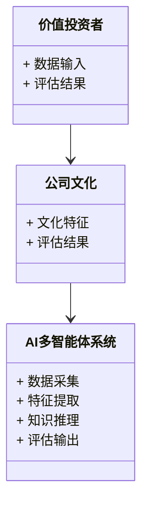
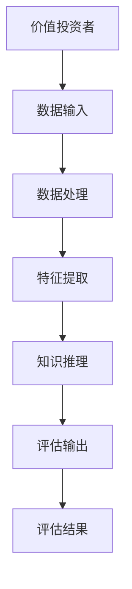

                 


# AI多智能体系统在价值投资中的公司文化评估

**关键词**：AI多智能体系统，价值投资，公司文化评估，知识图谱，动态评估，协作机制

**摘要**：  
本文探讨了如何利用AI多智能体系统在价值投资中评估公司文化。通过分析多智能体系统的核心原理、算法流程、系统架构，以及实际案例，展示了AI技术如何提升公司文化评估的效率和准确性，为投资者提供更可靠的决策依据。

---

# 第一部分: AI多智能体系统与价值投资的背景介绍

## 第1章: 背景介绍

### 1.1 问题背景与问题描述

#### 1.1.1 传统公司文化评估的局限性
传统的公司文化评估主要依赖于问卷调查、访谈和定性分析，这种方法耗时长、主观性强，难以量化。投资者难以从大量非结构化数据中提取有用信息，导致评估结果不够客观。

#### 1.1.2 价值投资中的文化评估需求
价值投资越来越依赖对公司文化的深入理解。文化决定了公司的战略稳定性、员工凝聚力和创新力，直接影响公司的长期价值。然而，传统方法难以满足高效、精准的需求。

#### 1.1.3 多智能体系统在文化评估中的优势
AI多智能体系统能够从多源数据中提取信息，通过协作推理和动态评估，提供更全面、精准的文化评估结果。系统能够处理结构化和非结构化数据，快速生成评估报告，帮助投资者做出决策。

### 1.2 问题解决与边界

#### 1.2.1 多智能体系统如何解决文化评估问题
通过分布式协作，多智能体系统能够从不同数据源提取文化相关特征，如员工满意度、管理层决策风格、企业社会责任等。系统利用知识表示和推理技术，生成动态评估结果。

#### 1.2.2 系统的边界与外延
系统专注于公司文化评估，边界包括数据收集、特征提取、知识推理和评估输出。外延部分涉及数据源的选择和评估结果的应用场景。

#### 1.2.3 核心要素与组成结构
核心要素包括多智能体协作、知识表示、动态评估模型。系统由数据采集模块、特征提取模块、推理引擎和评估输出模块组成。

## 第2章: 核心概念与联系

### 2.1 AI多智能体系统的定义与原理

#### 2.1.1 多智能体系统的定义
多智能体系统是由多个智能体组成的分布式系统，每个智能体具有自主性、反应性和协作性。智能体之间通过通信和协作完成任务。

#### 2.1.2 AI在多智能体系统中的作用
AI技术为多智能体系统提供感知、推理和决策能力。通过机器学习和自然语言处理，系统能够处理复杂数据并生成评估结果。

#### 2.1.3 系统的核心要素与关系
系统核心要素包括智能体、协作机制、知识库和通信协议。各要素相互作用，共同完成文化评估任务。

### 2.2 核心概念对比与ER实体关系图

#### 2.2.1 核心概念属性特征对比表
| 概念       | 属性       | 特征描述               |
|------------|------------|------------------------|
| 智能体     | 自主性     | 能够独立执行任务       |
| 知识库     | 结构化     | 数据以结构化形式存储   |
| 协作机制   | 分布式     | 智能体之间分布式协作   |

#### 2.2.2 ER实体关系图
```mermaid
er
actor: 价值投资者
goal: 公司文化评估
system: AI多智能体系统
actor --> goal
goal --> system
```

---

# 第二部分: 算法原理与数学模型

## 第3章: 算法原理与数学模型

### 3.1 算法原理

#### 3.1.1 多智能体协作机制
智能体通过通信模块共享数据和推理结果，协作完成文化评估任务。通信模块负责数据的收发和解析。

#### 3.1.2 知识表示与推理
知识表示采用概念图模型，推理过程基于规则和概率推理。推理引擎根据知识库中的规则，生成评估结果。

#### 3.1.3 动态评估模型
动态评估模型通过时间序列分析，捕捉公司文化的变化趋势。模型结合历史数据和实时数据，生成动态评估结果。

### 3.2 数学模型与公式

#### 3.2.1 知识表示模型
$$ f(x) = \sum_{i=1}^{n} w_i x_i $$
其中，$w_i$ 是权重，$x_i$ 是特征值。

#### 3.2.2 动态评估公式
$$
\text{评估结果} = \frac{1}{N} \sum_{i=1}^{N} f(x_i)
$$
其中，$N$ 是特征数量，$f(x_i)$ 是每个特征的评估值。

---

# 第三部分: 系统分析与架构设计方案

## 第4章: 系统分析与架构设计

### 4.1 问题场景介绍

#### 4.1.1 项目背景
本项目旨在开发一个AI多智能体系统，用于价值投资中的公司文化评估。系统通过分析企业数据，生成动态评估报告，帮助投资者做出决策。

### 4.2 系统功能设计

#### 4.2.1 领域模型


#### 4.2.2 系统架构设计


#### 4.2.3 系统接口设计
系统接口包括数据输入接口、评估结果输出接口和智能体协作接口。接口设计采用RESTful API，支持JSON格式的数据交换。

### 4.3 系统交互设计

#### 4.3.1 系统交互流程
```mermaid
sequenceDiagram
actor 价值投资者
participant 系统: AI多智能体系统
actor --> 系统: 提交数据
系统 --> 系统: 数据处理
系统 --> 系统: 特征提取
系统 --> 系统: 知识推理
系统 --> 价值投资者: 返回评估结果
```

---

# 第四部分: 项目实战

## 第5章: 项目实战

### 5.1 环境安装与配置

#### 5.1.1 安装Python环境
使用Anaconda安装Python 3.8及以上版本。安装依赖包：
```
pip install numpy pandas sklearn
```

### 5.2 系统核心实现

#### 5.2.1 数据采集模块
```python
import requests

def fetch_data(company_id):
    url = f"https://api.example.com/company/{company_id}/culture"
    response = requests.get(url)
    return response.json()
```

#### 5.2.2 特征提取模块
```python
def extract_features(data):
    features = []
    for item in data:
        features.append([item['employee_satisfaction'], item['management_style']])
    return features
```

#### 5.2.3 知识推理模块
```python
from sklearn.ensemble import RandomForestClassifier

def knowledge_inference(features, labels):
    model = RandomForestClassifier()
    model.fit(features, labels)
    return model
```

#### 5.2.4 动态评估模块
```python
def dynamic_assessment(model, new_features):
    predictions = model.predict(new_features)
    return predictions
```

### 5.3 项目小结

#### 5.3.1 成果总结
系统能够从多源数据中提取文化特征，生成动态评估结果，为价值投资者提供决策支持。

#### 5.3.2 经验总结
系统设计需要考虑数据源的多样性和算法的可解释性。在实际应用中，需要不断优化模型以提高评估精度。

---

# 第五部分: 总结与展望

## 第6章: 总结与展望

### 6.1 最佳实践 tips
- 确保数据质量和多样性。
- 定期更新模型以适应市场变化。
- 采用可视化工具帮助用户理解评估结果。

### 6.2 小结
本文详细介绍了AI多智能体系统在价值投资中的公司文化评估的应用。通过理论分析和实践案例，展示了系统的优势和潜力。

### 6.3 注意事项
- 数据隐私和安全问题需要重视。
- 系统的可扩展性和鲁棒性需要进一步优化。
- 算法的解释性对用户信任至关重要。

### 6.4 拓展阅读
推荐阅读相关领域的书籍和论文，深入理解多智能体系统和知识图谱的应用。

---

通过以上目录结构，您可以按照每个章节的逻辑逐步展开内容，确保文章结构清晰、内容详实。希望这能为您提供有价值的参考！

