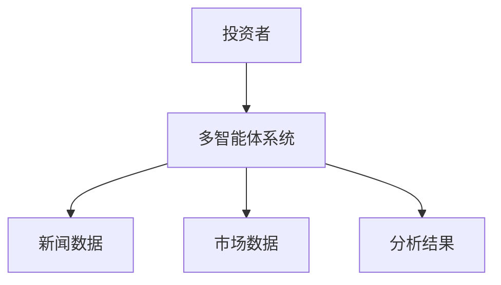
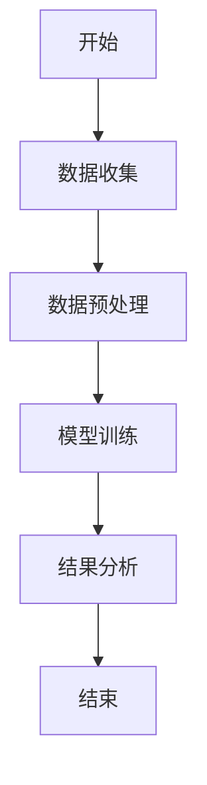
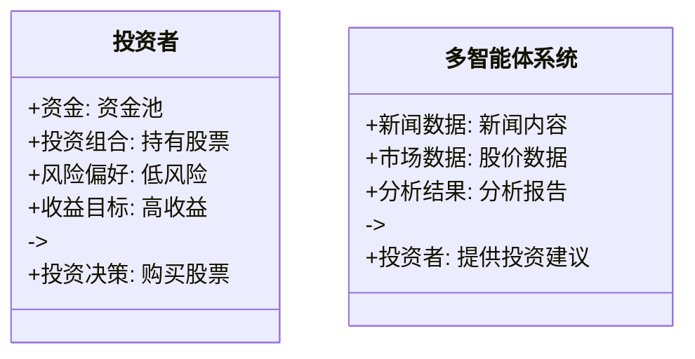
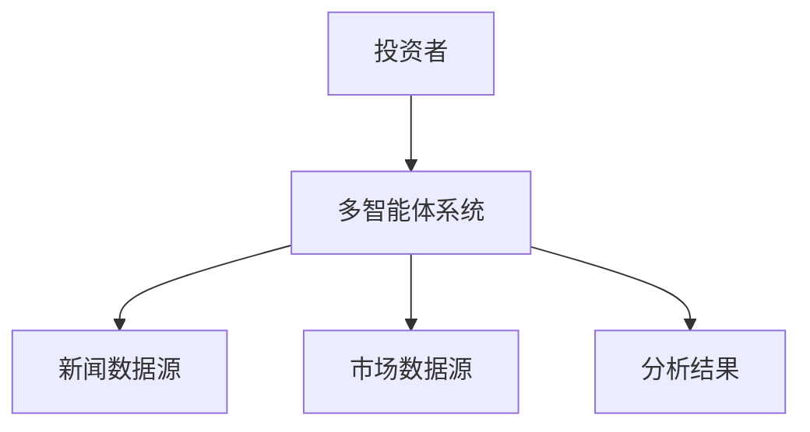
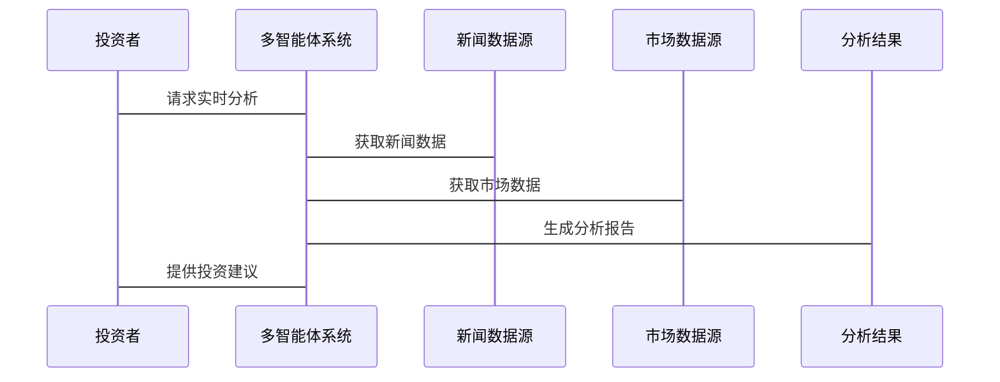

                 


# AI多智能体系统在价值投资中的实时新闻分析应用

## 关键词：AI多智能体系统，价值投资，实时新闻分析，金融数据挖掘，自然语言处理，强化学习，分布式计算

## 摘要：本文探讨AI多智能体系统在价值投资中的实时新闻分析应用，通过分析新闻数据，优化投资决策。文章详细讲解了多智能体系统的原理、算法、系统架构，并通过案例展示其在金融领域的实际应用，揭示其对价值投资的深远影响。

---

## 第1章：背景与概念

### 1.1 问题背景

#### 1.1.1 价值投资的核心要素
- **长期视角**：关注企业的基本面，而非短期市场波动。
- **安全边际**：确保投资价格低于内在价值。
- **竞争优势**：投资具有持续竞争优势的企业。

#### 1.1.2 传统金融分析的局限性
- **数据处理能力有限**：难以处理海量实时新闻。
- **情绪影响忽视**：市场情绪波动未被有效捕捉。
- **决策滞后**：依赖人工分析，导致决策延迟。

#### 1.1.3 AI技术在金融领域的潜力
- **高效数据处理**：AI能够快速分析大量新闻数据。
- **实时反馈机制**：提供及时的市场动态反馈。
- **智能决策支持**：辅助投资者做出更优决策。

### 1.2 问题描述

#### 1.2.1 实时新闻分析的需求
- **及时性**：快速响应市场变化。
- **准确性**：确保分析结果的可靠性。
- **全面性**：覆盖多来源的新闻数据。

#### 1.2.2 多智能体系统的优势
- **分布式计算**：提高处理效率。
- **协作决策**：多个智能体协同工作，优化投资策略。
- **自适应性**：系统能够根据市场变化自我调整。

#### 1.2.3 当前技术的挑战
- **数据质量问题**：新闻数据的噪声和偏差。
- **算法复杂性**：多智能体系统的协调与优化困难。
- **计算资源限制**：实时处理需要强大的计算能力。

### 1.3 问题解决

#### 1.3.1 AI多智能体系统的解决方案
- **分布式计算**：利用多智能体分别处理不同数据源。
- **协作机制**：通过通信协议共享信息，优化决策。
- **动态调整**：根据市场反馈实时调整分析策略。

#### 1.3.2 实时分析的具体实现
- **数据流处理**：采用流处理技术实时分析新闻数据。
- **事件驱动**：根据重要事件触发分析任务。
- **反馈循环**：结合市场反馈不断优化分析模型。

#### 1.3.3 价值投资的优化路径
- **精准识别**：利用AI识别优质企业。
- **风险控制**：通过实时分析降低投资风险。
- **动态调整**：根据市场变化优化投资组合。

### 1.4 边界与外延

#### 1.4.1 系统的边界条件
- **数据范围**：限定于新闻数据，不包括其他金融数据。
- **分析范围**：仅限于价值投资，不涉及其他投资策略。
- **时间限制**：实时分析，不考虑历史数据。

#### 1.4.2 相关领域的外延
- **自然语言处理**：扩展到其他文本数据的分析。
- **机器学习**：应用于其他金融预测任务。
- **分布式系统**：扩展到其他需要实时协作的领域。

#### 1.4.3 应用场景的限制
- **数据质量**：依赖高质量的新闻数据。
- **计算能力**：需要强大的计算资源支持。
- **模型准确性**：依赖于模型的准确性和泛化能力。

### 1.5 核心概念

#### 1.5.1 多智能体系统的基本概念
- **智能体**：能够感知环境并采取行动的实体。
- **协作**：多个智能体协同工作以实现共同目标。
- **通信**：智能体之间通过某种协议共享信息。

#### 1.5.2 价值投资的关键要素
- **内在价值**：企业的实际价值，而非市场定价。
- **竞争优势**：企业在市场中的独特优势。
- **安全边际**：投资价格低于内在价值的部分。

#### 1.5.3 实时新闻分析的技术要点
- **数据获取**：实时抓取新闻数据。
- **文本处理**：对新闻内容进行清洗和结构化。
- **情感分析**：识别新闻中的情感倾向。

---

## 第2章：核心概念与联系

### 2.1 多智能体系统原理

#### 2.1.1 多智能体系统的基本原理
- **感知环境**：智能体通过传感器或数据源获取信息。
- **决策制定**：基于感知信息做出决策。
- **行动执行**：根据决策采取相应行动。

#### 2.1.2 智能体的结构与功能
- **感知层**：负责数据的获取和初步处理。
- **决策层**：进行分析和决策。
- **执行层**：将决策转化为具体行动。

#### 2.1.3 多智能体系统的协作机制
- **通信协议**：定义智能体之间信息交换的方式。
- **协调算法**：实现多个智能体的协同工作。
- **冲突解决**：处理协作过程中可能出现的冲突。

### 2.2 核心概念对比

#### 2.2.1 AI多智能体与传统AI的对比
| 对比维度 | AI多智能体系统 | 传统AI系统 |
|----------|----------------|------------|
| 结构     | 分布式         | 集中式     |
| 协作     | 强调协作        | 单一决策    |
| 可扩展性 | 高             | 中等        |

#### 2.2.2 实时分析与历史分析的差异
| 对比维度 | 实时分析 | 历史分析 |
|----------|----------|----------|
| 数据来源 | 实时数据 | 历史数据 |
| 处理时间 | 立即处理 | 事后处理 |
| 反应速度 | 快速反馈 | 较慢反馈 |

#### 2.2.3 价值投资与其他投资策略的对比
| 对比维度 | 价值投资 | 技术投资 | 市场中性投资 |
|----------|----------|----------|--------------|
| 核心理念 | 低估值   | 高技术   | 市场中性      |
| 投资期限 | 长期     | 短期      | 短期或长期    |

### 2.3 实体关系图



---

## 第3章：算法原理

### 3.1 算法选择

#### 3.1.1 强化学习算法
- **Q-learning**：通过奖励机制优化决策策略。
- **DQN（深度强化学习）**：结合深度神经网络和强化学习。

#### 3.1.2 分布式计算方法
- **MapReduce**：适用于大规模数据处理。
- **Spark Streaming**：实时流数据处理框架。

#### 3.1.3 自然语言处理技术
- **词嵌入（Word2Vec）**：将词语转化为向量表示。
- **情感分析**：识别文本中的情感倾向。

### 3.2 算法流程



### 3.3 Python代码实现

#### 3.3.1 强化学习算法实现

```python
# 示例代码：Q-learning算法实现
import numpy as np

class Agent:
    def __init__(self, state_space, action_space):
        self.state_space = state_space
        self.action_space = action_space
        self.q_table = np.zeros((state_space, action_space))
    
    def act(self, state):
        # 选择动作
        return np.argmax(self.q_table[state])
    
    def learn(self, state, action, reward, next_state):
        # 更新Q表
        self.q_table[state, action] = self.q_table[state, action] + 0.1 * (reward + np.max(self.q_table[next_state]))
```

#### 3.3.2 分布式计算实现

```python
# 示例代码：使用Spark Streaming进行实时数据处理
from pyspark import SparkContext
from pyspark.streaming import StreamingContext

sc = SparkContext()
ssc = StreamingContext(sc, 5)  # 每5秒一个批次

lines = ssc.socketTextStream("localhost", 9999)
lines.foreachRDD(lambda rdd: rdd.saveTextFile("output"))

ssc.start()
ssc.awaitTermination()
```

### 3.4 数学模型与公式

#### 3.4.1 Q-learning算法

$$ Q(s, a) = Q(s, a) + \alpha \times [r + \max Q(s', a') - Q(s, a)] $$

其中：
- \( Q(s, a) \)：当前状态 \( s \) 下采取动作 \( a \) 的Q值。
- \( \alpha \)：学习率。
- \( r \)：获得的奖励。
- \( \max Q(s', a') \)：下一个状态 \( s' \) 下的最大Q值。

#### 3.4.2 分布式计算公式

$$ \text{计算结果} = \sum_{i=1}^{n} \text{节点}i \text{的计算结果} $$

其中：
- \( n \)：分布式节点的数量。

---

## 第4章：系统分析与架构设计

### 4.1 应用场景介绍

#### 4.1.1 价值投资中的实时新闻分析
- **目标**：识别影响股票价格的新闻事件。
- **场景**：投资者通过系统实时获取新闻分析结果，辅助决策。

### 4.2 系统功能设计

#### 4.2.1 领域模型



### 4.3 系统架构设计

#### 4.3.1 系统架构图



### 4.4 系统接口设计

- **输入接口**：接收新闻数据和市场数据。
- **输出接口**：提供分析结果和投资建议。
- **通信接口**：智能体之间的信息交互。

### 4.5 系统交互流程



---

## 第5章：项目实战

### 5.1 环境安装

#### 5.1.1 安装Python和相关库
- **安装Python**：确保Python 3.7以上版本。
- **安装库**：`pip install numpy pandas spark-nlp`

#### 5.1.2 安装分布式计算框架
- **Spark**：下载并安装Apache Spark。

### 5.2 系统核心实现

#### 5.2.1 数据预处理代码

```python
import pandas as pd
import numpy as np

def preprocess_news(dataframe):
    # 清洗数据
    dataframe['text'].replace(r'\n', ' ', regex=True)
    # 分词处理
    dataframe['tokens'] = dataframe['text'].apply(lambda x: x.split())
    return dataframe
```

#### 5.2.2 模型训练代码

```python
from spark_nlp import DocumentAssembler, SentenceSplitter, Tokenizer, SentimentDLModel

# 初始化Spark Session
from pyspark.sql import SparkSession
spark = SparkSession.builder.getOrCreate()

# 加载预训练的情感分析模型
sentiment_model = SentimentDLModel.pretrained('sentiment', 'en', 'cpu')
```

#### 5.2.3 分析结果解读

- **情感倾向分析**：识别新闻中的积极、消极和中性情绪。
- **关键词提取**：提取影响股价的关键信息。

### 5.3 实际案例分析

#### 5.3.1 案例背景
- **公司**：某科技公司发布新产品。
- **新闻**：媒体报道新产品发布及其市场反应。

#### 5.3.2 案例分析
- **数据处理**：清洗和结构化新闻数据。
- **模型分析**：使用情感分析模型判断市场情绪。
- **结果解读**：根据分析结果调整投资策略。

---

## 第6章：总结与展望

### 6.1 项目总结

#### 6.1.1 核心成果
- **成功实现了实时新闻分析系统**。
- **提升了投资决策的效率和准确性**。

#### 6.1.2 系统特点
- **高效性**：快速处理实时数据。
- **准确性**：提供可靠的投资建议。
- **可扩展性**：支持不同规模的投资者。

### 6.2 展望

#### 6.2.1 技术改进方向
- **优化算法**：提高模型的准确性和效率。
- **增强数据源**：引入更多数据源，如社交媒体数据。
- **提升计算能力**：采用更高效的分布式计算框架。

#### 6.2.2 应用扩展
- **国际化投资**：扩展到全球市场。
- **多元化策略**：结合其他投资策略，如技术分析。
- **智能化决策**：进一步提升系统的自主决策能力。

### 6.3 最佳实践 tips

#### 6.3.1 数据质量管理
- **确保数据来源可靠**。
- **定期更新数据清洗规则**。

#### 6.3.2 系统维护
- **定期监控系统性能**。
- **及时修复系统故障**。

#### 6.3.3 安全注意事项
- **保护投资者数据隐私**。
- **防范网络攻击**。

### 6.4 小结

通过本文的探讨，AI多智能体系统在价值投资中的实时新闻分析应用展现出巨大的潜力。随着技术的不断进步，系统的性能和功能将不断提升，为投资者提供更强大的决策支持。

---

## 第7章：拓展阅读

### 7.1 推荐书籍
- 《机器学习实战》：深入讲解机器学习算法和应用。
- 《分布式系统》：系统介绍分布式计算的理论与实践。

### 7.2 相关论文
- "Multi-Agent Systems in Financial Analysis"：探讨多智能体系统在金融分析中的应用。
- "Real-Time News Sentiment Analysis for Stock Prediction"：研究实时新闻情感分析对股价预测的影响。

### 7.3 在线资源
- [Spark官方文档](https://spark.apache.org/docs/latest/)
- [Natural Language Processing with Spark NLP](https://nlp.johnsnowlabs.com/)

---

通过以上内容，我们详细探讨了AI多智能体系统在价值投资中的实时新闻分析应用，从背景、算法、系统架构到实际案例，为读者提供了全面的技术解读和实践指导。希望本文能为相关领域的研究和实践提供有价值的参考。

