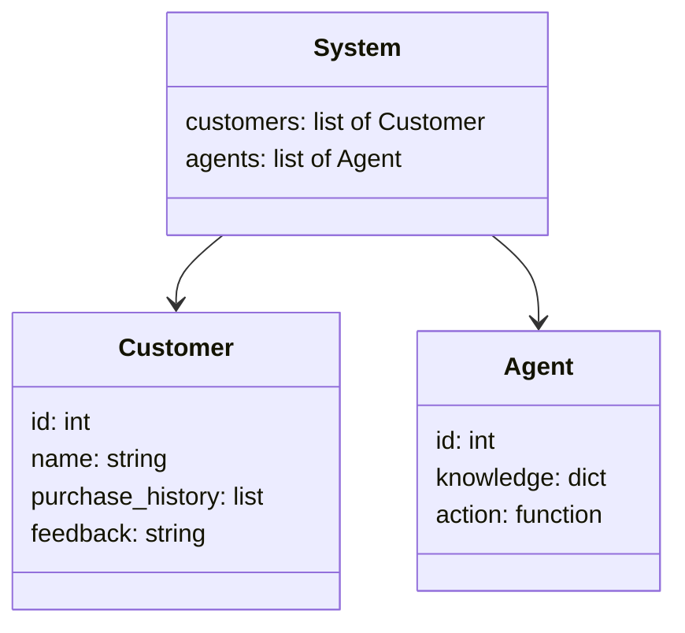

                 


# AI多智能体系统在价值投资中的客户忠诚度分析

**关键词**：AI多智能体系统、价值投资、客户忠诚度分析、数据分析、机器学习

**摘要**：  
本文将探讨AI多智能体系统如何在价值投资中用于分析客户的忠诚度。通过介绍价值投资和客户忠诚度的基本概念，分析AI多智能体系统的核心原理及其在客户行为分析中的应用，探讨多智能体协作算法在客户忠诚度评分中的优势，并结合实际案例展示系统的实现与应用。文章旨在为金融从业者、数据科学家和技术爱好者提供理论与实践相结合的深度分析，帮助他们在复杂的投资环境中利用AI技术提升客户忠诚度分析的效率与准确性。

---

# 目录

1. **价值投资与客户忠诚度分析的背景与概念**  
   - 1.1 价值投资的基本概念  
   - 1.2 客户忠诚度分析的定义与重要性  
   - 1.3 AI多智能体系统的定义与特点  

2. **AI多智能体系统在客户忠诚度分析中的核心概念与联系**  
   - 2.1 多智能体系统的结构与功能  
   - 2.2 客户忠诚度分析的核心要素  
   - 2.3 AI多智能体系统与客户忠诚度分析的关联  

3. **多智能体协作算法在客户忠诚度分析中的算法原理**  
   - 3.1 多智能体协作算法的概述  
   - 3.2 基于强化学习的多智能体协作算法  
   - 3.3 算法实现与案例分析  

4. **客户忠诚度分析系统的系统分析与架构设计**  
   - 4.1 问题场景介绍  
   - 4.2 系统功能设计（领域模型）  
   - 4.3 系统架构设计（架构图）  
   - 4.4 系统接口设计与交互设计  

5. **项目实战：基于AI多智能体系统的客户忠诚度分析实现**  
   - 5.1 环境安装与配置  
   - 5.2 核心算法实现（代码示例）  
   - 5.3 实际案例分析与结果解读  

6. **最佳实践、小结与拓展阅读**  
   - 6.1 最佳实践与注意事项  
   - 6.2 本章小结  
   - 6.3 拓展阅读与进一步思考  

---

## 第1章: 价值投资与客户忠诚度分析的背景与概念

### 1.1 价值投资的基本概念

#### 1.1.1 价值投资的定义与核心理念
价值投资是一种以基本面分析为基础的投资策略，强调以低于内在价值的价格购买优质资产。其核心理念是通过分析企业的财务状况、行业地位、竞争优势等因素，识别出具有长期增长潜力的公司，并在市场低估时买入，市场高估时卖出。

#### 1.1.2 价值投资的市场分析方法
价值投资者通常关注市场的整体估值、行业趋势以及个股的基本面。通过分析宏观经济指标、行业周期和企业财务报表，价值投资者试图找到被市场低估的投资标的。

#### 1.1.3 价值投资与传统投资的区别
与短线交易或技术分析不同，价值投资强调长期持有和对公司基本面的深入研究。其核心在于识别企业的内在价值，并在价格偏离价值时进行投资。

---

### 1.2 客户忠诚度分析的定义与重要性

#### 1.2.1 客户忠诚度的定义
客户忠诚度是指客户对某一品牌或服务的持续购买和使用意愿。高忠诚度的客户通常会忽略价格波动，持续选择信任的品牌或服务。

#### 1.2.2 客户忠诚度在价值投资中的作用
在价值投资中，客户忠诚度是企业长期盈利能力的重要指标。高忠诚度的客户为企业提供了稳定的收入来源，增强了企业的市场竞争力。

#### 1.2.3 客户忠诚度分析的挑战与机遇
客户忠诚度分析需要处理大量的非结构化数据，如客户反馈、行为数据等。同时，通过AI技术可以更高效地提取客户行为特征，识别潜在的忠诚客户。

---

### 1.3 AI多智能体系统的定义与特点

#### 1.3.1 多智能体系统的定义
多智能体系统（Multi-Agent System, MAS）是由多个智能体组成的分布式系统，每个智能体都能感知环境、自主决策并与其他智能体协作完成任务。

#### 1.3.2 多智能体系统的核心特点
- **分布式性**：多个智能体独立运行，协同完成任务。  
- **协作性**：智能体之间通过通信和协作提高整体效率。  
- **适应性**：智能体能够根据环境变化调整行为。  

#### 1.3.3 AI多智能体系统的优势与劣势
- **优势**：能够处理复杂任务，适应动态环境。  
- **劣势**：设计复杂，通信开销大，协作困难。  

---

## 第2章: AI多智能体系统在客户忠诚度分析中的核心概念与联系

### 2.1 多智能体系统的结构与功能

#### 2.1.1 多智能体系统的组成结构
- **智能体**：独立决策的个体，负责特定任务。  
- **通信机制**：智能体之间交换信息的方式。  
- **协作协议**：定义智能体之间的协作规则。  

#### 2.1.2 智能体之间的通信机制
- **直接通信**：智能体之间直接交换信息。  
- **间接通信**：通过共享数据库或中间件进行信息传递。  

#### 2.1.3 多智能体系统的协作模式
- **分布式协作**：智能体分散在不同节点，协同完成任务。  
- **集中式协作**：智能体通过中央协调器进行协作。  

---

### 2.2 客户忠诚度分析的核心要素

#### 2.2.1 客户行为数据的采集与处理
- **数据来源**：客户交易记录、行为日志、反馈调查等。  
- **数据处理**：数据清洗、特征提取、数据建模。  

#### 2.2.2 客户画像的构建方法
- **画像维度**：客户的基本信息、消费习惯、行为偏好等。  
- **画像构建**：基于机器学习算法，如聚类分析和决策树。  

#### 2.2.3 客户忠诚度评分模型的设计
- **评分标准**：基于客户行为的量化指标，如购买频率、满意度等。  
- **模型选择**：使用回归分析或神经网络模型预测客户忠诚度。  

---

### 2.3 AI多智能体系统与客户忠诚度分析的关联

#### 2.3.1 多智能体系统在客户行为分析中的应用
- **行为监测**：智能体实时监测客户的交易行为，识别异常情况。  
- **行为预测**：基于历史数据，预测客户未来的购买行为。  

#### 2.3.2 多智能体系统在客户画像构建中的作用
- **数据整合**：多个智能体分别处理不同类型的数据，协同构建客户画像。  
- **特征提取**：智能体通过协作提取客户行为的深层特征。  

#### 2.3.3 多智能体系统在客户忠诚度评分中的优势
- **高效协作**：多个智能体协同处理复杂的数据，提高计算效率。  
- **动态调整**：根据市场变化实时更新客户忠诚度评分。  

---

## 第3章: 多智能体协作算法在客户忠诚度分析中的算法原理

### 3.1 多智能体协作算法的概述

#### 3.1.1 多智能体协作算法的定义
多智能体协作算法是一种基于分布式计算的算法，用于协调多个智能体完成共同任务。

#### 3.1.2 多智能体协作算法的核心思想
- **局部决策**：每个智能体基于自身信息做出决策。  
- **全局优化**：通过协作实现整体目标的优化。  

#### 3.1.3 多智能体协作算法的应用场景
- **分布式计算**：适用于数据量大、计算复杂度高的场景。  
- **实时协作**：适用于需要快速响应的任务。  

---

### 3.2 基于强化学习的多智能体协作算法

#### 3.2.1 强化学习的基本原理
强化学习是一种通过试错机制，学习最优策略的方法。智能体通过与环境互动，获得奖励或惩罚，逐步优化行为策略。

#### 3.2.2 多智能体强化学习的挑战
- **策略协调**：多个智能体之间的策略需要协调一致。  
- **通信开销**：智能体之间的通信可能增加计算开销。  

#### 3.2.3 基于强化学习的客户忠诚度分析算法
```python
class Multi-Agent Reinforcement Learning:
    def __init__(self, agents):
        self.agents = agents
        self.reward = 0

    def step(self, action):
        # 执行动作并获得奖励
        self.reward += action.value
        return self.reward
```

#### 3.2.4 算法实现与案例分析
- **案例背景**：分析客户的购买行为，预测忠诚度。  
- **算法实现**：使用强化学习训练智能体，优化客户忠诚度评分模型。  
- **结果分析**：通过实验验证算法的有效性，展示评分的准确性。  

---

## 第4章: 客户忠诚度分析系统的系统分析与架构设计

### 4.1 问题场景介绍

#### 4.1.1 系统目标
- 实现客户忠诚度分析，支持价值投资决策。  

#### 4.1.2 系统应用场景
- 金融投资、客户管理、市场营销等领域。  

---

### 4.2 系统功能设计

#### 4.2.1 领域模型


---

### 4.3 系统架构设计

#### 4.3.1 架构图
```mermaid
archiecture
    title Customer Loyalty Analysis System
    client --> API Gateway: 请求
    API Gateway --> Load Balancer: 转发请求
    Load Balancer --> Service1, Service2, Service3: 请求分发
    Service1 --> Database: 数据库查询
    Service2 --> Model Training: 模型训练
    Service3 --> Notification: 通知客户
```

---

### 4.4 系统接口设计与交互设计

#### 4.4.1 系统接口设计
- **API接口**：提供RESTful API，供其他系统调用。  
- **数据接口**：连接数据库，获取客户数据。  

#### 4.4.2 交互设计
- **用户界面**：展示客户忠诚度评分，支持查询和分析。  
- **智能体交互**：智能体通过API通信，协作完成任务。  

---

## 第5章: 项目实战：基于AI多智能体系统的客户忠诚度分析实现

### 5.1 环境安装与配置

#### 5.1.1 安装Python与相关库
- Python 3.8+  
- 安装库：`pip install numpy pandas scikit-learn`  

#### 5.1.2 安装AI框架
- 使用TensorFlow或PyTorch进行模型训练。  

---

### 5.2 核心算法实现

#### 5.2.1 数据预处理
```python
import pandas as pd
import numpy as np

def preprocess_data(data):
    # 删除缺失值
    data.dropna(inplace=True)
    # 标准化处理
    data = (data - data.mean()) / data.std()
    return data
```

#### 5.2.2 多智能体协作算法实现
```python
class Agent:
    def __init__(self, id):
        self.id = id
        self.data = None

    def receive_data(self, data):
        self.data = data

    def send_data(self):
        return self.data
```

---

### 5.3 实际案例分析与结果解读

#### 5.3.1 数据来源
- 数据集：客户交易记录、行为日志等。  

#### 5.3.2 模型训练
- 使用强化学习训练智能体，优化客户忠诚度评分模型。  

#### 5.3.3 结果展示
- 展示客户忠诚度评分结果，分析模型的准确性和稳定性。  

---

## 第6章: 最佳实践、小结与拓展阅读

### 6.1 最佳实践与注意事项

#### 6.1.1 数据质量的重要性
- 数据清洗是关键，确保数据准确性和完整性。  

#### 6.1.2 模型调优的技巧
- 使用交叉验证优化模型参数，提高预测精度。  

#### 6.1.3 系统维护的注意事项
- 定期更新模型，适应市场变化。  

---

### 6.2 本章小结

通过本章的分析与实践，我们了解了AI多智能体系统在客户忠诚度分析中的应用，掌握了多智能体协作算法的实现方法，并通过实际案例验证了系统的可行性和有效性。

---

### 6.3 拓展阅读与进一步思考

- **相关领域**：探索AI在其他金融领域的应用，如风险管理、投资组合优化等。  
- **前沿技术**：关注多智能体系统的最新研究，如基于区块链的多智能体协作机制。  

---

**结语**  
AI多智能体系统为价值投资中的客户忠诚度分析提供了新的思路和方法。通过本文的系统分析与实践，读者可以更好地理解AI技术在金融领域的应用潜力，并在实际工作中加以应用，提升投资决策的准确性和效率。

