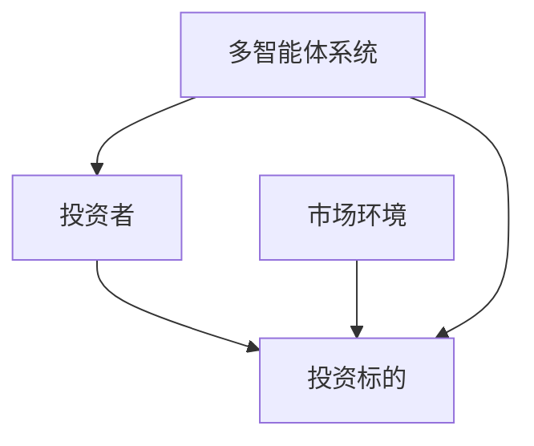
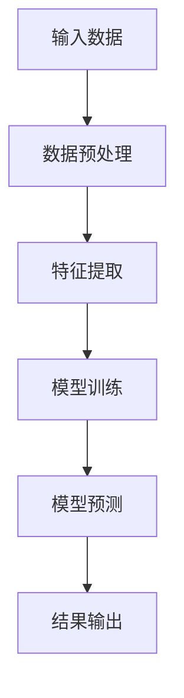

                 


# AI多智能体系统在价值投资中的研发效率评估

**关键词**：AI多智能体系统、价值投资、研发效率、算法实现、系统架构

**摘要**：本文探讨了AI多智能体系统在价值投资中的应用，重点分析了其研发效率的评估方法。通过介绍多智能体系统的原理、价值投资的核心理念，以及两者的结合方式，本文详细讲解了如何利用多智能体系统提升投资决策的效率和准确性。文章从系统架构设计到算法实现，再到实际案例分析，全面阐述了AI多智能体系统在价值投资中的潜力和应用前景。

---

## 第一部分: AI多智能体系统与价值投资概述

### 第1章: AI多智能体系统概述

#### 1.1 多智能体系统的基本概念

##### 1.1.1 多智能体系统的定义
多智能体系统（Multi-Agent System, MAS）是由多个独立或协作的智能体组成的系统，这些智能体能够通过交互和协作完成复杂任务。与单智能体系统相比，MAS具有更强的分布式计算能力和更高的灵活性。

##### 1.1.2 多智能体系统的特征
- **分布性**：智能体分布在不同的节点上，具有局部决策能力。
- **协作性**：智能体之间通过协作完成共同目标。
- **动态性**：系统能够适应环境的变化，实时调整策略。

##### 1.1.3 多智能体系统与单智能体系统的区别
| 特性 | 多智能体系统 | 单智能体系统 |
|------|--------------|--------------|
| 决策 | 分布式决策 | 中央决策 |
| 灵活性 | 高 | 低 |
| 并行性 | 高 | 低 |

#### 1.2 价值投资的基本概念

##### 1.2.1 价值投资的定义
价值投资是一种投资策略，旨在通过分析企业的内在价值，寻找被市场低估的投资标的。其核心在于发现市场的非效率性，利用价格与价值的偏差获利。

##### 1.2.2 价值投资的核心理念
- **安全边际**：以低于内在价值的价格买入资产。
- **长期视角**：关注企业的长期盈利能力，而非短期价格波动。
- **基本面分析**：通过对企业财务状况、行业地位等因素的分析，评估其内在价值。

##### 1.2.3 价值投资在金融领域的应用
价值投资广泛应用于股票、债券等金融资产的投资中。通过分析企业的财务报表、管理层能力、行业前景等因素，投资者可以发现具有投资价值的标的。

### 第2章: AI多智能体系统在价值投资中的应用

#### 2.1 多智能体系统在金融领域的应用背景

##### 2.1.1 金融领域的复杂性
金融市场具有高度的不确定性和复杂性，传统的单智能体系统难以应对市场的快速变化和复杂决策。

##### 2.1.2 多智能体系统在金融中的优势
- **分布式计算**：能够同时处理大量数据，提高计算效率。
- **协作与竞争**：通过智能体之间的协作与竞争，优化投资决策。
- **实时适应**：能够实时调整策略，适应市场变化。

#### 2.2 AI多智能体系统在价值投资中的核心作用

##### 2.2.1 多智能体系统如何提升投资效率
- **并行处理**：多个智能体可以同时分析不同的投资标的，提高分析效率。
- **协作优化**：通过智能体之间的协作，优化投资组合，降低风险。

##### 2.2.2 多智能体系统在风险控制中的应用
- **实时监控**：智能体实时监控市场动态，及时发现潜在风险。
- **风险分散**：通过多智能体的协作，分散投资风险，降低整体波动性。

##### 2.2.3 多智能体系统在投资决策中的应用
- **数据挖掘**：智能体通过分析大量数据，发现投资机会。
- **决策优化**：通过协作和竞争，优化投资决策，提高收益。

---

## 第二部分: AI多智能体系统的原理与核心概念

### 第3章: 多智能体系统的原理

#### 3.1 多智能体系统的架构

##### 3.1.1 分布式架构
分布式架构中，每个智能体都是独立的，能够自主决策。这种架构适用于需要高度自治的系统。

##### 3.1.2 集中式架构
集中式架构中，有一个中央控制节点，负责协调和管理所有智能体的行动。这种架构适用于需要统一协调的系统。

##### 3.1.3 混合式架构
混合式架构结合了分布式和集中式架构的优势，适用于复杂任务的处理。

#### 3.2 多智能体系统的核心算法

##### 3.2.1 协作与竞争算法
协作与竞争算法通过智能体之间的协作与竞争，优化系统性能。例如，使用博弈论中的纳什均衡理论，确定最优策略。

##### 3.2.2 聚合与分散算法
聚合与分散算法通过智能体之间的信息交换，实现系统的动态调整。例如，使用分布式计算中的信息聚合算法，优化决策过程。

##### 3.2.3 自适应算法
自适应算法能够根据环境的变化，动态调整系统的参数和策略。例如，使用强化学习中的Q-learning算法，实现自适应决策。

### 第4章: 价值投资中的多智能体系统模型

#### 4.1 价值投资模型的构建

##### 4.1.1 数据采集与处理
- **数据来源**：从股票市场、公司财务报表、行业报告等渠道获取数据。
- **数据预处理**：清洗数据，去除噪声，提取有用特征。

##### 4.1.2 模型训练与优化
- **特征提取**：通过机器学习算法，提取影响股票价值的关键特征。
- **模型训练**：使用监督学习算法，训练价值评估模型。
- **模型优化**：通过交叉验证和网格搜索，优化模型参数。

##### 4.1.3 模型评估与验证
- **评估指标**：使用准确率、召回率、F1分数等指标评估模型性能。
- **验证方法**：通过回测和实证分析，验证模型的有效性。

#### 4.2 多智能体系统在价值投资中的实体关系图



#### 4.3 多智能体系统在价值投资中的算法流程图



---

## 第三部分: 多智能体系统在价值投资中的算法实现

### 第5章: 多智能体系统的算法原理

#### 5.1 协作式多智能体系统

##### 5.1.1 协作式多智能体系统的定义
协作式多智能体系统通过智能体之间的协作，完成共同目标。例如，多个智能体分别负责分析不同行业的股票，然后汇总结果，形成投资建议。

##### 5.1.2 协作式多智能体系统的实现
- **通信机制**：智能体之间通过消息传递机制进行通信。
- **协作协议**：制定协作规则，确保智能体之间的高效协作。

##### 5.1.3 协作式多智能体系统的应用
- **投资组合优化**：通过协作，优化投资组合，提高收益。
- **风险分散**：通过协作，分散投资风险，降低整体波动性。

#### 5.2 竞争式多智能体系统

##### 5.2.1 竞争式多智能体系统的定义
竞争式多智能体系统通过智能体之间的竞争，优化系统性能。例如，智能体之间通过竞争，发现最优的投资策略。

##### 5.2.2 竞争式多智能体系统的实现
- **竞争机制**：智能体之间通过竞争，确定最优策略。
- **平衡机制**：通过平衡机制，防止竞争过度，确保系统稳定。

##### 5.2.3 竞争式多智能体系统的应用
- **市场预测**：通过竞争，提高市场预测的准确性。
- **策略优化**：通过竞争，优化投资策略，提高收益。

---

### 第6章: 价值投资中的多智能体系统模型实现

#### 6.1 系统架构设计

##### 6.1.1 系统功能设计
- **数据采集模块**：负责采集股票市场数据。
- **特征提取模块**：负责提取影响股票价值的特征。
- **模型训练模块**：负责训练价值评估模型。
- **投资决策模块**：负责根据模型输出，生成投资建议。

##### 6.1.2 系统架构图


#### 6.2 系统实现细节

##### 6.2.1 数据采集模块
- **数据源**：股票市场数据，包括股价、成交量、财务报表等。
- **数据预处理**：清洗数据，去除噪声，提取有用特征。

##### 6.2.2 特征提取模块
- **特征选择**：通过机器学习算法，选择影响股票价值的关键特征。
- **特征工程**：对特征进行处理，提高模型的性能。

##### 6.2.3 模型训练模块
- **模型选择**：选择适合的机器学习模型，如随机森林、支持向量机等。
- **模型训练**：通过训练数据，训练价值评估模型。
- **模型优化**：通过交叉验证和网格搜索，优化模型参数。

##### 6.2.4 投资决策模块
- **策略制定**：根据模型输出，制定投资策略。
- **策略执行**：通过智能体，执行投资决策。

---

### 第7章: 项目实战

#### 7.1 环境安装

##### 7.1.1 安装Python
```bash
python --version
```

##### 7.1.2 安装TensorFlow
```bash
pip install tensorflow
```

##### 7.1.3 安装Pandas
```bash
pip install pandas
```

#### 7.2 系统核心实现源代码

##### 7.2.1 数据预处理代码
```python
import pandas as pd

# 读取数据
data = pd.read_csv('stock_data.csv')

# 数据清洗
data = data.dropna()

# 数据标准化
from sklearn.preprocessing import StandardScaler
scaler = StandardScaler()
data_scaled = scaler.fit_transform(data)
```

##### 7.2.2 特征提取代码
```python
from sklearn.feature_selection import SelectKBest
from sklearn.feature_selection import chi2

# 特征选择
selector = SelectKBest(score_func=chi2, k=5)
selected_features = selector.fit_transform(data_scaled, target)
```

##### 7.2.3 模型训练代码
```python
from sklearn.ensemble import RandomForestClassifier
from sklearn.metrics import accuracy_score

# 训练模型
model = RandomForestClassifier(n_estimators=100)
model.fit(selected_features, target)

# 模型预测
y_pred = model.predict(selected_features_test)
print('Accuracy:', accuracy_score(target_test, y_pred))
```

#### 7.3 案例分析

##### 7.3.1 案例背景
假设我们有一个包含多只股票的股票组合，我们需要通过多智能体系统，分析这些股票的价值，制定投资策略。

##### 7.3.2 数据分析与建模
通过数据预处理和特征提取，我们选择了影响股票价值的关键特征，并使用随机森林模型进行训练。

##### 7.3.3 投资决策
根据模型输出的投资建议，我们制定了投资组合，并通过智能体系统的协作，优化了投资组合的收益和风险。

---

## 第四部分: 系统分析与架构设计方案

### 第8章: 系统分析与架构设计

#### 8.1 系统功能设计

##### 8.1.1 系统功能模块
- **数据采集模块**：负责采集股票市场数据。
- **特征提取模块**：负责提取影响股票价值的特征。
- **模型训练模块**：负责训练价值评估模型。
- **投资决策模块**：负责根据模型输出，生成投资建议。

##### 8.1.2 系统功能流程图


#### 8.2 系统架构设计

##### 8.2.1 系统架构图


#### 8.3 系统接口设计

##### 8.3.1 系统接口
- **数据接口**：负责与数据源的交互。
- **模型接口**：负责与模型的交互。
- **决策接口**：负责与投资决策模块的交互。

##### 8.3.2 接口交互流程图


---

## 第五部分: 最佳实践与总结

### 第9章: 最佳实践

#### 9.1 系统优化建议

##### 9.1.1 模型优化
- **特征工程**：通过特征工程，提高模型的性能。
- **模型调优**：通过网格搜索，优化模型参数。

##### 9.1.2 系统扩展
- **分布式计算**：通过分布式计算，提高系统的计算能力。
- **多智能体协作**：通过协作机制，优化系统的性能。

#### 9.2 实际应用中的注意事项

##### 9.2.1 数据质量
- 数据质量直接影响模型的性能，必须确保数据的准确性和完整性。

##### 9.2.2 系统安全性
- 系统安全性是系统稳定运行的基础，必须采取有效的安全措施。

##### 9.2.3 系统维护
- 系统维护是系统长期运行的重要保障，必须定期进行系统维护和更新。

### 第10章: 总结

#### 10.1 全文总结
本文详细探讨了AI多智能体系统在价值投资中的研发效率评估。通过系统的分析和实践，我们展示了如何利用多智能体系统提升投资决策的效率和准确性。

#### 10.2 未来展望
未来，随着人工智能技术的不断发展，多智能体系统在价值投资中的应用前景将更加广阔。我们期待更多的研究和实践，进一步推动多智能体系统在金融领域的应用。

---

通过以上结构和内容，我们可以系统地分析和评估AI多智能体系统在价值投资中的研发效率，为投资者和研究者提供有价值的参考和指导。

