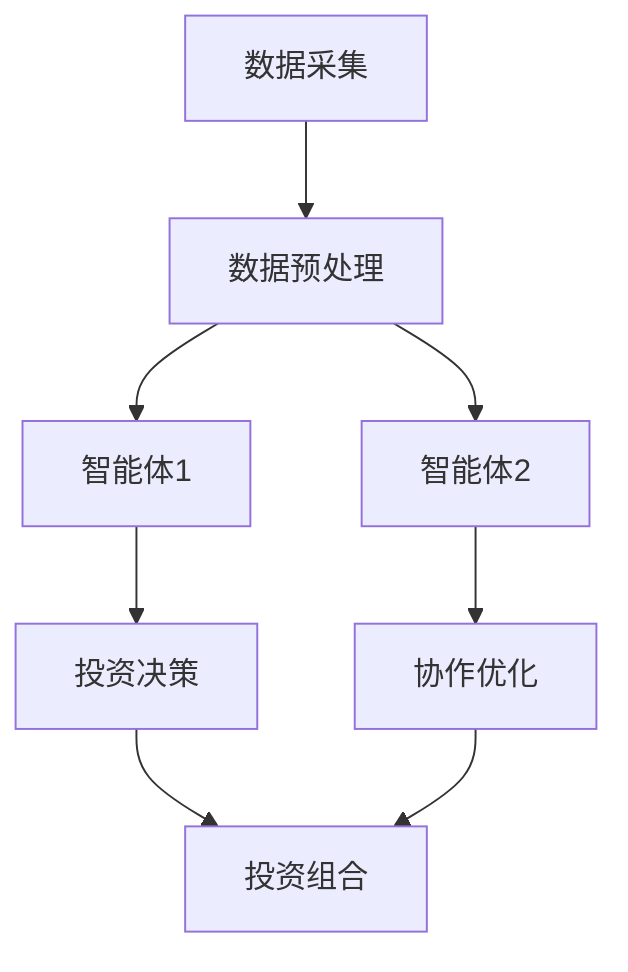

                 


# AI多智能体系统在价值投资中的税收优化应用

## 关键词：AI多智能体系统、价值投资、税收优化、投资组合、算法优化

## 摘要：本文探讨AI多智能体系统在价值投资中的应用，特别是如何利用多智能体的协作与优化能力，提升投资组合的税收效率。通过分析多智能体系统的构成、算法原理和系统架构，本文提出了一种创新的税收优化方法，并通过实际案例验证其有效性。

---

## 第一部分: 背景与概念

### 第1章: 价值投资与税收优化的背景

#### 1.1 价值投资的定义与核心理念
- 1.1.1 价值投资的基本概念
  - 价值投资是一种长期投资策略，侧重于分析公司的基本面，寻找市场价格低于其内在价值的股票。
  - 核心理念是购买被市场低估的资产，长期持有，等待其价值回归。

#### 1.2 税收优化在投资中的重要性
- 1.2.1 税收对投资收益的影响
  - 税收是投资收益的重要组成部分，特别是在资本利得税、股息税等方面，直接影响投资回报。
- 1.2.2 税收优化的目标
  - 最小化税务负担，最大化投资收益。
- 1.2.3 税收政策对投资决策的影响
  - 不同的税收政策会影响投资策略的选择，例如资本利得税的税率、分红税等。

#### 1.3 多智能体系统在投资中的应用潜力
- 1.3.1 多智能体系统的定义
  - 多智能体系统（Multi-Agent System, MAS）由多个智能体组成，每个智能体能够感知环境、自主决策并协作完成复杂任务。
- 1.3.2 多智能体系统在投资中的优势
  - 分散决策：每个智能体负责不同的投资领域或策略。
  - 协作优化：通过协作实现整体收益的最大化。
  - 自适应性：能够根据市场变化动态调整投资策略。

---

### 第2章: 多智能体系统与价值投资的结合

#### 2.1 价值投资中的问题与挑战
- 2.1.1 市场波动性
  - 股票价格受多种因素影响，难以预测。
- 2.1.2 税收政策的复杂性
  - 不同资产类型、交易频率和持有时间的税务处理不同。
- 2.1.3 投资组合优化的复杂性
  - 需要考虑资产配置、风险分散、税务影响等多因素。

#### 2.2 多智能体系统的优势
- 2.2.1 分布式决策能力
  - 每个智能体可以专注于不同的投资领域，如股票、债券、基金等。
- 2.2.2 协作优化
  - 智能体之间可以共享信息，协同优化投资组合。
- 2.2.3 动态适应性
  - 系统能够实时调整策略，应对市场变化。

---

## 第二部分: 多智能体系统的算法与架构

### 第3章: 多智能体系统的算法原理

#### 3.1 强化学习在多智能体系统中的应用
- 3.1.1 强化学习的基本概念
  - 强化学习（Reinforcement Learning, RL）是一种通过试错学习策略的方法，智能体通过与环境交互，学习最优行为。
- 3.1.2 多智能体强化学习的挑战
  - 智能体之间的协作与竞争问题。
  - 状态和动作空间的复杂性。

#### 3.2 博弈论与多智能体协作
- 3.2.1 博弈论的基本概念
  - 博弈论研究理性决策者在策略互动中的行为。
- 3.2.2 多智能体协作中的博弈模型
  - Nash均衡：多个智能体在协作中达到的一种稳定状态。
  - 公共利益博弈：协作带来整体收益，但需要个体贡献。

#### 3.3 基于强化学习的税收优化算法
- 3.3.1 算法框架
  - 每个智能体负责优化特定资产的税收。
  - 智能体通过强化学习不断调整策略，减少税负。
- 3.3.2 数学模型
  - 定义状态空间：资产类型、持有时间、交易频率等。
  - 定义动作空间：买入、卖出、持有等。
  - 定义奖励函数：最大化投资收益，同时最小化税负。

---

### 第4章: 系统架构设计

#### 4.1 系统整体架构
- 4.1.1 系统模块划分
  - 数据采集模块：收集市场数据、税务政策。
  - 多智能体决策模块：各智能体独立决策并协作。
  - 税收优化模块：计算最优投资组合，最小化税负。

#### 4.2 系统功能设计
- 4.2.1 数据采集与预处理
  - 收集股票价格、财务数据、税务政策等。
- 4.2.2 智能体决策
  - 每个智能体根据市场数据和历史表现，选择最优投资策略。
- 4.2.3 协作优化
  - 智能体之间共享信息，调整策略，优化整体投资组合。

#### 4.3 系统架构图


---

## 第三部分: 项目实战与优化

### 第5章: 项目实战

#### 5.1 环境搭建
- 5.1.1 系统环境
  - 操作系统：Linux/Windows/MacOS
  - 开发工具：Python、TensorFlow、Keras
  - 数据来源：股票市场数据API（如Yahoo Finance、Alpha Vantage）

#### 5.2 核心代码实现
- 5.2.1 智能体类的定义
```python
class Agent:
    def __init__(self, id, strategy):
        self.id = id
        self.strategy = strategy
```
- 5.2.2 强化学习算法实现
```python
def reinforce_learning(agent, environment):
    for episode in range(episodes):
        state = environment.get_state()
        action = agent.choose_action(state)
        reward = environment.get_reward(action)
        agent.update_policy(state, action, reward)
```

#### 5.3 实际案例分析
- 5.3.1 案例背景
  - 投资组合包括多只股票，不同股票有不同的税务政策。
- 5.3.2 案例分析
  - 通过多智能体协作，优化投资组合，减少税负，提高收益。

---

### 第6章: 系统优化与未来展望

#### 6.1 系统优化方向
- 6.1.1 提高算法效率
  - 优化强化学习算法，减少计算时间。
- 6.1.2 改善智能体协作
  - 提升智能体之间的通信效率，增强协作能力。

#### 6.2 未来研究方向
- 6.2.1 更复杂的税收政策
  - 考虑更多税务因素，如遗产税、赠与税等。
- 6.2.2 多智能体系统的可扩展性
  - 研究如何在更大规模的系统中应用多智能体协作。

---

## 第四部分: 结论与展望

### 第7章: 结论

#### 7.1 核心结论
- 多智能体系统在价值投资中的税收优化应用具有显著优势。
- 强化学习和协作优化是实现税收优化的关键技术。

#### 7.2 展望
- 随着AI技术的发展，多智能体系统在投资中的应用将更加广泛。
- 税收优化算法将更加复杂和高效，为投资者创造更大的价值。

---

## 附录

### 附录A: 相关术语解释
- 多智能体系统：由多个智能体组成的协作系统。
- 强化学习：一种通过试错学习策略的算法。

### 附录B: 代码示例
```python
class Agent:
    def __init__(self, id, strategy):
        self.id = id
        self.strategy = strategy

def reinforce_learning(agent, environment):
    for episode in range(episodes):
        state = environment.get_state()
        action = agent.choose_action(state)
        reward = environment.get_reward(action)
        agent.update_policy(state, action, reward)
```

---

通过以上结构，我们可以清晰地看到AI多智能体系统在价值投资中的应用潜力，以及如何通过技术创新实现税收优化的目标。

