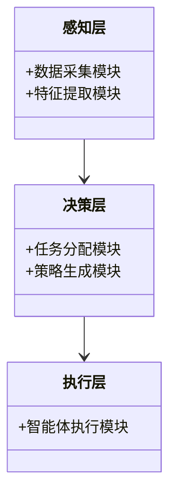
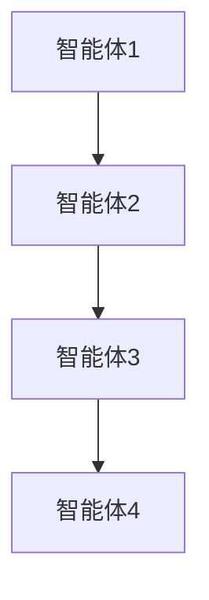
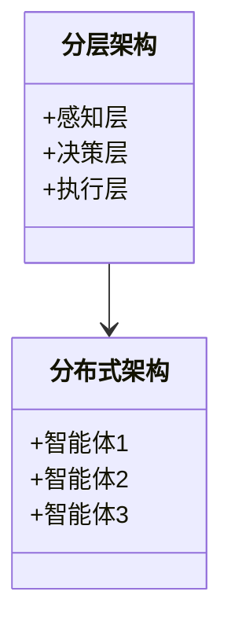
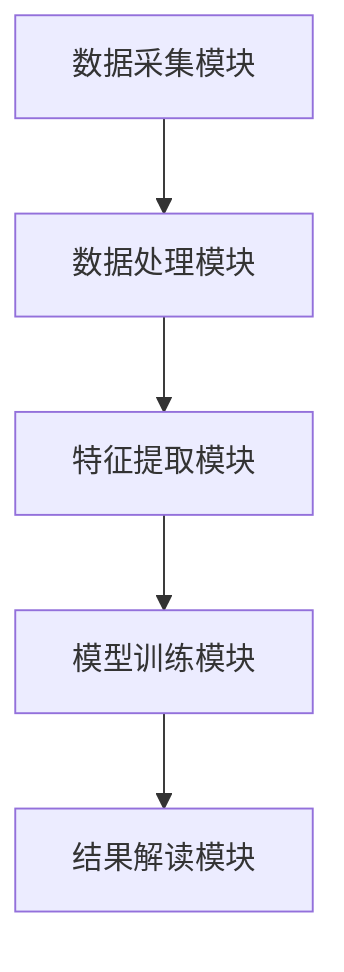
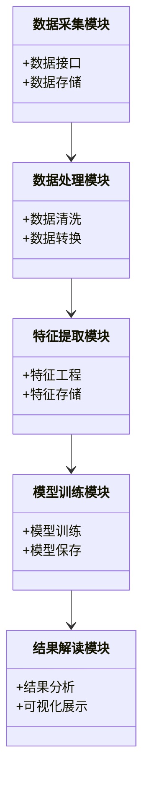

                 


```markdown
# AI多智能体系统在价值投资中的竞争对手分析

> 关键词：AI多智能体系统、价值投资、竞争对手分析、金融智能、分布式计算

> 摘要：本文详细探讨了AI多智能体系统在价值投资中的应用，特别是其在竞争对手分析中的创新方法。通过分析多智能体系统的协作机制、算法原理、系统架构，结合实际案例，展示了如何利用AI技术优化价值投资策略。文章从理论到实践，全面解析了AI多智能体系统如何赋能金融投资领域的竞争对手分析。

---

## 第1章 AI多智能体系统的基本概念

### 1.1 多智能体系统的定义与特点

#### 1.1.1 多智能体系统的定义
多智能体系统（Multi-Agent System, MAS）是由多个独立但协作的智能体组成的系统，这些智能体通过通信和协调完成复杂的任务。每个智能体都有自己的目标和决策机制，能够感知环境并采取行动。

#### 1.1.2 多智能体系统的核心特点
| 特点 | 描述 |
|------|------|
| 分布式 | 每个智能体独立运行，通过通信协作完成任务。 |
| 协作性 | 智能体之间通过共享信息和任务分配实现协作。 |
| 反应式 | 能够实时感知环境变化并做出响应。 |
| 自适应性 | 系统能够动态调整以应对环境变化。 |

#### 1.1.3 多智能体系统与传统单智能体系统的区别
- **独立性**：多智能体系统的智能体是独立的，而单智能体系统只有一个中心控制单元。
- **协作性**：多智能体系统通过协作完成任务，而单智能体系统依赖中心决策。
- **容错性**：多智能体系统更具容错性，单点故障的风险较低。

### 1.2 价值投资的基本理论

#### 1.2.1 价值投资的定义与核心原则
价值投资是一种投资策略，通过分析企业的内在价值，寻找被市场低估的投资标的。其核心原则包括：
1. 长期投资：关注企业的长期价值，而非短期波动。
2. 安全边际：买入价格低于内在价值，以降低风险。
3. 质量优先：选择财务健康、管理优秀的企业。

#### 1.2.2 价值投资与AI技术的结合
AI技术的引入，为价值投资提供了更高效的数据处理和分析能力。通过AI算法，投资者可以更精准地评估企业的内在价值，发现潜在的投资机会。

#### 1.2.3 竞争对手分析在价值投资中的重要性
竞争对手分析是价值投资的重要环节，通过对竞争对手的分析，投资者可以更好地理解行业格局，评估目标企业的竞争优势和劣势。

### 1.3 AI多智能体系统在金融领域的应用前景

#### 1.3.1 金融领域的AI应用现状
当前，AI技术在金融领域的应用主要集中在量化交易、风险控制和客户画像等方面。多智能体系统作为一种新兴的技术，正在逐步渗透到金融投资领域。

#### 1.3.2 多智能体系统在金融中的优势
1. **分布式计算**：多智能体系统能够高效处理海量数据，提升计算效率。
2. **协作能力**：多个智能体可以协同工作，覆盖不同的分析维度。
3. **动态适应**：系统能够实时响应市场变化，提供及时的决策支持。

#### 1.3.3 竞争对手分析的AI驱动新范式
通过AI多智能体系统，竞争对手分析可以实现自动化和智能化，从数据采集、特征提取到结果解读，整个过程都可以由智能体协作完成。

---

## 第2章 AI多智能体系统的原理与架构

### 2.1 多智能体系统的协作机制

#### 2.1.1 分布式协作原理
多智能体系统通过分布式协作，实现任务的分解和分配。每个智能体负责特定的任务模块，通过通信完成协作。

#### 2.1.2 智能体之间的通信与协调
智能体之间的通信可以通过消息队列或中间件实现。协作机制包括任务分配、状态同步和结果汇总。

#### 2.1.3 多智能体系统的动态适应性
系统能够根据环境变化动态调整智能体的角色和任务分配，确保系统的高效运行。

### 2.2 多智能体系统的架构设计

#### 2.2.1 分层架构
分层架构将系统分为感知层、决策层和执行层，每层负责不同的功能模块。



#### 2.2.2 分布式架构
分布式架构将智能体部署在不同的节点上，通过网络通信实现协作。



#### 2.2.3 混合架构
混合架构结合了分层和分布式架构的优势，适用于复杂的金融场景。



### 2.3 多智能体系统的实现技术

#### 2.3.1 分布式计算技术
分布式计算技术是多智能体系统的基础，通过将任务分解到多个节点上，实现并行计算。

#### 2.3.2 通信协议与消息队列
智能体之间的通信需要可靠的通信协议和消息队列。常用的消息队列包括Kafka、RabbitMQ等。

#### 2.3.3 并行计算与资源管理
通过并行计算提升系统的处理效率，资源管理模块负责分配和调度计算资源。

---

## 第3章 价值投资中的竞争对手分析方法

### 3.1 价值投资中的竞争对手分析框架

#### 3.1.1 竞争对手分析的核心要素
竞争对手分析需要考虑以下核心要素：
- **行业地位**：企业在行业中的市场份额和竞争地位。
- **财务状况**：企业的财务健康状况，包括盈利能力、资产负债情况等。
- **竞争优势**：企业的核心竞争力，包括技术、品牌、资源等。
- **管理团队**：企业管理层的素质和战略决策能力。

#### 3.1.2 竞争对手分析的步骤与流程
竞争对手分析的步骤包括：
1. **数据采集**：收集竞争对手的公开信息，包括财务报告、市场数据等。
2. **数据处理**：对采集的数据进行清洗和预处理。
3. **特征提取**：提取关键特征，如财务指标、市场表现等。
4. **模型训练**：基于特征数据，训练竞争对手分析模型。
5. **结果解读**：根据模型输出结果，进行分析和解读。

#### 3.1.3 竞争对手分析的指标体系
竞争对手分析的指标体系包括：
- **财务指标**：如净利润率、资产负债率等。
- **市场指标**：如市场份额、品牌影响力等。
- **管理指标**：如管理团队的稳定性、战略决策能力等。

### 3.2 竞争对手分析的AI驱动方法

#### 3.2.1 数据
竞争对手分析的AI驱动方法需要大量的数据支持，包括：
- **财务数据**：如收入、利润、资产负债表等。
- **市场数据**：如股价、成交量、市场趋势等。
- **文本数据**：如公司公告、新闻报道等。

#### 3.2.2 算法
常用的算法包括：
1. **聚类分析**：用于识别市场中的竞争对手。
2. **回归分析**：用于预测竞争对手的财务表现。
3. **自然语言处理**：用于分析公司公告和新闻中的情感倾向。

#### 3.2.3 系统设计


---

## 第4章 AI多智能体系统在竞争对手分析中的应用

### 4.1 数据处理与特征提取

#### 4.1.1 数据采集
通过爬虫、API接口等方式采集竞争对手的公开数据。

#### 4.1.2 数据预处理
对采集的数据进行清洗、去重和格式转换。

#### 4.1.3 特征提取
从数据中提取关键特征，如财务指标、市场指标等。

### 4.2 模型训练与结果解读

#### 4.2.1 模型训练
基于提取的特征，训练竞争对手分析模型。

#### 4.2.2 结果解读
根据模型输出的结果，进行竞争对手的分析和解读。

---

## 第5章 系统架构设计与实现

### 5.1 系统架构设计

#### 5.1.1 系统功能设计
系统功能包括：
- 数据采集模块
- 数据处理模块
- 特征提取模块
- 模型训练模块
- 结果解读模块



### 5.2 系统实现

#### 5.2.1 环境搭建
安装必要的库和工具，如Python、Pandas、Scikit-learn等。

#### 5.2.2 核心代码实现
```python
import pandas as pd
from sklearn.cluster import KMeans

# 数据采集模块
data = pd.read_csv('competitor_data.csv')

# 数据处理模块
data_cleaned = data.dropna()

# 特征提取模块
features = data_cleaned[['revenue', 'net_profit', 'market_share']]

# 模型训练模块
kmeans = KMeans(n_clusters=3)
clusters = kmeans.fit_predict(features)

# 结果解读模块
print(clusters)
```

### 5.3 系统测试与优化

#### 5.3.1 系统测试
对系统进行功能测试和性能测试，确保系统稳定运行。

#### 5.3.2 系统优化
根据测试结果，优化系统的性能和用户体验。

---

## 第6章 项目实战：基于AI多智能体系统的竞争对手分析

### 6.1 项目背景

#### 6.1.1 项目目标
通过AI多智能体系统，实现竞争对手的自动分析和评估。

#### 6.1.2 项目需求
- 数据采集与处理
- 特征提取与模型训练
- 结果解读与可视化

### 6.2 项目实现

#### 6.2.1 环境搭建
安装必要的库和工具，如Python、Pandas、Scikit-learn等。

#### 6.2.2 核心代码实现
```python
import pandas as pd
from sklearn.cluster import KMeans
import matplotlib.pyplot as plt

# 数据采集模块
data = pd.read_csv('competitor_data.csv')

# 数据处理模块
data_cleaned = data.dropna()

# 特征提取模块
features = data_cleaned[['revenue', 'net_profit', 'market_share']]

# 模型训练模块
kmeans = KMeans(n_clusters=3)
clusters = kmeans.fit_predict(features)

# 结果解读模块
plt.scatter(data_cleaned['revenue'], data_cleaned['net_profit'], c=clusters)
plt.xlabel('Revenue')
plt.ylabel('Net Profit')
plt.show()
```

#### 6.2.3 项目测试与优化
对系统进行功能测试和性能测试，确保系统稳定运行。

### 6.3 项目总结

#### 6.3.1 项目成果
通过AI多智能体系统，实现了竞争对手的自动分析和评估。

#### 6.3.2 项目经验
在项目实施过程中，需要注意数据质量和模型的可解释性。

---

## 第7章 总结与展望

### 7.1 本章总结
本文详细探讨了AI多智能体系统在价值投资中的应用，特别是其在竞争对手分析中的创新方法。通过分析多智能体系统的协作机制、算法原理、系统架构，结合实际案例，展示了如何利用AI技术优化价值投资策略。

### 7.2 未来展望
随着AI技术的不断发展，AI多智能体系统在金融领域的应用前景广阔。未来，可以通过引入更复杂的算法和更大的数据集，进一步提升系统的分析能力和预测精度。

### 7.3 最佳实践 Tips
- 数据质量是分析结果的关键，确保数据的准确性和完整性。
- 在实际应用中，需要结合行业特点，选择合适的分析方法。
- 系统的可解释性是用户信任的重要因素，需要注重模型的透明性。

---

通过本文的探讨，读者可以深入了解AI多智能体系统在价值投资中的应用，掌握竞争对手分析的核心方法和技术实现。希望本文能够为金融领域的从业者提供有价值的参考和启发。
```

