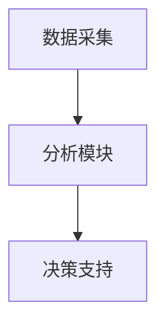

                 


# AI多智能体系统在价值投资中的舆情监测应用

## 关键词：AI多智能体系统，价值投资，舆情监测，自然语言处理，协同学习，投资决策

## 摘要：本文探讨了如何利用AI多智能体系统进行舆情监测，以辅助价值投资决策。通过分析舆情信息，多智能体系统协同工作，提供实时市场动态，帮助投资者做出更明智的投资选择。文章详细介绍了系统架构、算法原理、项目实现及实际应用案例，展示了AI技术在金融领域的潜力。

---

# 第1章：AI多智能体系统概述

## 1.1 问题背景

### 1.1.1 多智能体系统的定义
多智能体系统（Multi-Agent System, MAS）是由多个相互作用的智能体组成的系统，这些智能体能够自主决策并协作完成复杂任务。

### 1.1.2 价值投资中的舆情监测
在价值投资中，舆情监测是分析市场情绪的重要手段。通过监测社交媒体、新闻和论坛中的信息，投资者可以识别市场趋势和潜在风险。

### 1.1.3 系统目标与外延
目标是利用AI多智能体系统实时分析舆情，提供投资建议。外延包括数据采集、分析和决策支持模块。

---

# 第2章：多智能体系统与价值投资的结合

## 2.1 多智能体系统的原理

### 2.1.1 分布式智能
多智能体系统通过分布式计算实现协同，每个智能体负责特定任务，如数据采集或情感分析。

### 2.1.2 协同机制
智能体通过通信模块交换信息，协同完成任务，如舆情分析和预测。

## 2.2 价值投资中的信息处理

### 2.2.1 信息分类
将舆情信息分为正面、负面和中性，帮助投资者识别市场情绪。

### 2.2.2 信息处理流程
数据采集、清洗、分析和反馈，确保信息准确性和及时性。

## 2.3 结合方式

### 2.3.1 信息采集协同
多个智能体协同采集数据，提高数据覆盖范围和准确性。

### 2.3.2 决策支持
通过分析舆情数据，智能体提供投资建议，辅助决策。

---

# 第3章：算法原理

## 3.1 多智能体协同学习

### 3.1.1 算法流程
数据采集 → 特征提取 → 模型训练 → 结果分析。

### 3.1.2 实现步骤
- 数据预处理：清洗和标注数据。
- 模型训练：使用深度学习模型进行情感分析。
- 结果分析：评估模型性能并优化。

## 3.2 情感分析算法

### 3.2.1 情感分类
基于深度学习的情感分析模型，准确识别文本情感倾向。

### 3.2.2 应用案例
分析一条负面新闻，展示模型如何识别并影响投资决策。

---

# 第4章：系统设计与实现

## 4.1 系统架构设计

### 4.1.1 模块划分
- 数据采集模块：实时获取舆情数据。
- 分析模块：处理数据并生成报告。
- 决策支持模块：提供投资建议。

### 4.1.2 架构图


## 4.2 接口设计

### 4.2.1 API交互
通过API接口实现模块间通信，确保数据高效传输。

### 4.2.2 数据格式
统一数据格式，便于模块协作和处理。

---

# 第5章：项目实战

## 5.1 环境安装

### 5.1.1 工具安装
安装Python、TensorFlow和自然语言处理库。

## 5.2 核心代码实现

### 5.2.1 数据采集代码
```python
import requests

def fetch_data(url):
    response = requests.get(url)
    return response.text
```

### 5.2.2 情感分析代码
```python
from tensorflow.keras import layers

model = Sequential([
    layers.Embedding(10000, 16),
    layers.Dropout(0.5),
    layers.Dense(1, activation='sigmoid')
])
```

## 5.3 案例分析

### 5.3.1 实际案例
分析某公司新闻，展示系统如何识别负面舆情并建议卖出。

## 5.4 项目小结
总结项目实现过程，强调AI多智能体系统的优势和实际应用效果。

---

# 第6章：最佳实践

## 6.1 小结
AI多智能体系统在舆情监测中的应用显著提升了投资决策的效率和准确性。

## 6.2 注意事项
- 数据质量：确保数据准确可靠。
- 模型优化：定期更新模型以适应市场变化。
- 风险管理：结合其他指标进行综合判断。

## 6.3 拓展阅读
推荐相关书籍和论文，鼓励读者深入研究。

---

# 附录

## 附录A：术语表
- 多智能体系统：由多个智能体组成的协作系统。
- 情感分析：识别文本情感倾向的技术。

## 附录B：工具安装指南
详细说明如何安装和配置开发环境。

## 附录C：参考文献
列出文章中引用的书籍和论文，供读者查阅。

---

通过以上结构，文章系统地介绍了AI多智能体系统在价值投资中的舆情监测应用，从理论到实践，全面展示了系统的实现和应用。

