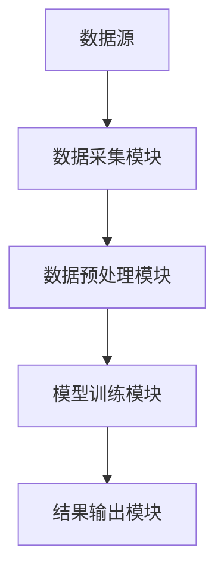
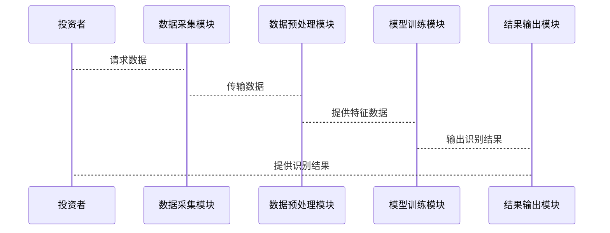

                 


# AI多智能体系统在识别价值陷阱中的作用

## 关键词：AI多智能体系统、价值陷阱、识别机制、投资策略、系统架构

## 摘要：  
本文探讨AI多智能体系统在识别价值陷阱中的作用，分析其核心机制、算法原理和系统架构，结合实际案例，总结其在投资决策中的应用价值及未来发展趋势。

---

# 第一部分: AI多智能体系统与价值陷阱的背景介绍

## 第1章: AI多智能体系统的基本概念

### 1.1 多智能体系统的定义与特点

#### 1.1.1 多智能体系统的定义  
多智能体系统（Multi-Agent System, MAS）是由多个智能体（Agent）组成的分布式系统，每个智能体能够独立感知环境、自主决策并协同完成复杂任务。

#### 1.1.2 多智能体系统的核心特点  
- **分布式性**：多个智能体协同工作，无中央控制节点。  
- **自主性**：每个智能体具备自主决策能力。  
- **协作性**：智能体之间通过通信与协作完成共同目标。  
- **动态性**：系统环境和任务需求动态变化。  

#### 1.1.3 多智能体系统与单智能体系统的区别  
| 属性 | 单智能体系统 | 多智能体系统 |
|------|--------------|--------------|
| 结构 | 单一决策中心 | 分布式结构    |
| 任务 | 独立完成任务 | 协作完成任务   |
| 通信 | 无           | 需要通信      |

### 1.2 价值陷阱的定义与特征

#### 1.2.1 价值陷阱的定义  
价值陷阱是指表面上看似具有投资价值，实则存在隐藏风险或缺陷的投资标的，容易误导投资者。

#### 1.2.2 价值陷阱的核心特征  
- **表面价值高**：表现为高增长或高收益。  
- **隐藏风险**：存在未被发现的负面因素。  
- **误导性**：容易被误判为优质投资标的。  

#### 1.2.3 价值陷阱的识别难点  
- **信息不对称**：投资者难以获取全面信息。  
- **复杂性**：涉及多个因素，难以量化分析。  
- **动态变化**：市场环境变化快，陷阱特征易变。  

### 1.3 AI多智能体系统与价值陷阱的关系

#### 1.3.1 多智能体系统在价值识别中的优势  
- **多维度分析**：多个智能体分别关注不同维度的信息。  
- **协同决策**：通过协作提高识别准确率。  
- **动态适应**：能够快速响应市场变化。  

#### 1.3.2 价值陷阱识别的复杂性与挑战  
- **数据复杂性**：需要处理大量非结构化数据。  
- **模型复杂性**：多智能体系统的建模难度较高。  
- **计算复杂性**：涉及复杂的分布式计算。  

#### 1.3.3 AI多智能体系统在价值陷阱识别中的作用  
- **提高识别效率**：通过分布式计算快速处理信息。  
- **增强识别精度**：多个智能体协同分析，降低误判风险。  
- **适应动态变化**：系统具备良好的动态适应能力。  

## 第2章: 价值陷阱识别的背景与意义

### 2.1 价值陷阱的产生背景

#### 2.1.1 经济周期与价值陷阱的关系  
在经济周期波动中，企业盈利能力和市场表现会受到较大影响，价值陷阱往往在经济下行阶段增多。

#### 2.1.2 市场波动与价值陷阱的关联  
市场波动加剧时，信息不对称和噪声干扰增加，价值陷阱更容易出现。

#### 2.1.3 投资者行为与价值陷阱的形成  
投资者的非理性行为和羊群效应可能导致价值陷阱的形成和扩散。

### 2.2 价值陷阱识别的重要性

#### 2.2.1 投资决策中的价值陷阱风险  
投资者误判价值陷阱可能导致重大投资损失。

#### 2.2.2 价值陷阱识别对投资收益的影响  
准确识别价值陷阱能够帮助投资者规避风险，提升投资收益。

#### 2.2.3 价值陷阱识别的现实意义  
在金融领域，准确识别价值陷阱对于维护投资者利益和市场稳定具有重要意义。

## 第3章: AI多智能体系统的核心机制

### 3.1 多智能体系统的协作机制

#### 3.1.1 多智能体协作的基本原理  
多个智能体通过通信和协作，共同完成复杂任务。

#### 3.1.2 多智能体协作的实现方式  
- **基于通信的协作**：智能体之间通过消息传递进行协作。  
- **基于契约的协作**：通过预定义的契约协调行动。  
- **基于博弈的协作**：通过博弈机制实现最优决策。  

#### 3.1.3 多智能体协作的优势与挑战  
- **优势**：能够处理复杂问题，提高决策质量。  
- **挑战**：通信开销大，协作效率受限。  

### 3.2 强化学习在多智能体系统中的应用

#### 3.2.1 强化学习的基本概念  
强化学习（Reinforcement Learning, RL）是一种通过试错学习优化决策的算法。

#### 3.2.2 多智能体强化学习的实现  
- **分布式强化学习**：每个智能体独立学习并共享经验。  
- **集中式强化学习**：通过集中控制器统一决策。  

#### 3.2.3 强化学习在价值陷阱识别中的应用  
通过强化学习训练智能体，使其能够识别和避开价值陷阱。

### 3.3 博弈论在多智能体系统中的应用

#### 3.3.1 博弈论的基本概念  
博弈论研究多个主体在策略互动中的决策行为。

#### 3.3.2 多智能体系统中的博弈模型  
- **纳什均衡**：所有智能体策略相互最优。  
- **进化博弈论**：通过策略演化优化决策。  

#### 3.3.3 博弈论在价值陷阱识别中的应用  
通过博弈论建模市场行为，帮助识别价值陷阱。

---

# 第二部分: AI多智能体系统的核心概念与联系

## 第4章: 多智能体系统的属性特征对比

### 4.1 多智能体系统的属性特征

| 属性 | 特征                     |
|------|--------------------------|
| 自主性 | 智能体具备自主决策能力   |
| 分布式 | 系统由多个独立单元组成   |
| 协作性 | 智能体之间需要协作完成任务 |
| 动态性 | 系统状态随环境变化而变化 |

### 4.2 多智能体系统与价值陷阱的关系

#### 4.2.1 多智能体系统在价值识别中的优势  
- **多维度分析**：能够从多个角度评估投资标的。  
- **动态适应**：能够实时跟踪市场变化。  

#### 4.2.2 价值陷阱识别的复杂性与挑战  
- **信息复杂性**：需要处理大量非结构化数据。  
- **模型复杂性**：多智能体系统的建模难度较高。  

#### 4.2.3 AI多智能体系统在价值陷阱识别中的作用  
- **提高识别效率**：通过分布式计算快速处理信息。  
- **增强识别精度**：多个智能体协同分析，降低误判风险。  

## 第5章: 价值陷阱识别的核心机制

### 5.1 多智能体系统的协作机制

#### 5.1.1 多智能体协作的基本原理  
多个智能体通过通信和协作，共同完成复杂任务。

#### 5.1.2 多智能体协作的实现方式  
- **基于通信的协作**：智能体之间通过消息传递进行协作。  
- **基于契约的协作**：通过预定义的契约协调行动。  
- **基于博弈的协作**：通过博弈机制实现最优决策。  

#### 5.1.3 多智能体协作的优势与挑战  
- **优势**：能够处理复杂问题，提高决策质量。  
- **挑战**：通信开销大，协作效率受限。  

### 5.2 多智能体系统的博弈模型

#### 5.2.1 博弈论的基本概念  
博弈论研究多个主体在策略互动中的决策行为。

#### 5.2.2 多智能体系统中的博弈模型  
- **纳什均衡**：所有智能体策略相互最优。  
- **进化博弈论**：通过策略演化优化决策。  

#### 5.2.3 博弈论在价值陷阱识别中的应用  
通过博弈论建模市场行为，帮助识别价值陷阱。

---

# 第三部分: AI多智能体系统的算法与数学模型

## 第6章: 多智能体强化学习算法

### 6.1 多智能体强化学习的基本原理

#### 6.1.1 强化学习的基本概念  
强化学习（Reinforcement Learning, RL）是一种通过试错学习优化决策的算法。

#### 6.1.2 多智能体强化学习的实现  
- **分布式强化学习**：每个智能体独立学习并共享经验。  
- **集中式强化学习**：通过集中控制器统一决策。  

#### 6.1.3 多智能体强化学习的优势  
- **分布式计算**：能够处理大规模数据。  
- **协作学习**：多个智能体协同学习，提高效率。  

### 6.2 多智能体强化学习的数学模型

#### 6.2.1 状态空间的定义  
状态空间表示系统可能处于的所有状态，通常用集合S表示。

#### 6.2.2 动作空间的定义  
动作空间表示智能体在每个状态下可能采取的动作，通常用集合A表示。

#### 6.2.3 奖励函数的定义  
奖励函数R(s, a)表示在状态s采取动作a后获得的奖励。

#### 6.2.4 Q-learning公式  
$$ Q(s, a) = Q(s, a) + \alpha (r + \gamma \max Q(s', a') - Q(s, a)) $$

---

# 第四部分: 系统架构设计与实现

## 第7章: 价值陷阱识别系统的架构设计

### 7.1 系统功能设计

#### 7.1.1 数据采集模块  
负责收集相关数据，包括财务数据、市场数据等。

#### 7.1.2 数据预处理模块  
对数据进行清洗、转换和特征提取。

#### 7.1.3 模型训练模块  
使用多智能体强化学习算法进行模型训练。

#### 7.1.4 结果输出模块  
将识别结果输出，供投资者参考。

### 7.2 系统架构设计

#### 7.2.1 数据流图  


#### 7.2.2 系统交互图  


---

# 第五部分: 项目实战与案例分析

## 第8章: 价值陷阱识别系统的实战

### 8.1 环境搭建

#### 8.1.1 安装Python环境  
使用Anaconda安装Python 3.8及以上版本。

#### 8.1.2 安装依赖库  
安装numpy、pandas、scikit-learn等库。

### 8.2 核心代码实现

#### 8.2.1 数据采集模块  
```python
import pandas as pd
def collect_data():
    # 数据采集逻辑
    pass
```

#### 8.2.2 数据预处理模块  
```python
def preprocess_data(data):
    # 数据预处理逻辑
    return processed_data
```

#### 8.2.3 模型训练模块  
```python
def train_model(data):
    # 模型训练逻辑
    return model
```

#### 8.2.4 结果输出模块  
```python
def output_results(model):
    # 结果输出逻辑
    pass
```

### 8.3 案例分析

#### 8.3.1 案例背景  
分析某上市公司的财务数据，识别是否存在价值陷阱。

#### 8.3.2 数据分析与建模  
使用多智能体强化学习算法进行建模，识别价值陷阱。

#### 8.3.3 结果解读  
解读模型输出的结果，得出是否为价值陷阱的结论。

### 8.4 项目小结  
总结项目实施过程中的经验和教训，提出改进建议。

---

# 第六部分: 最佳实践与未来展望

## 第9章: 最佳实践与小结

### 9.1 最佳实践

#### 9.1.1 数据质量管理  
确保数据的准确性和完整性。

#### 9.1.2 模型调优  
通过参数调整和算法优化提高模型性能。

#### 9.1.3 系统维护  
定期更新模型和优化系统架构。

### 9.2 小结

总结全文，强调AI多智能体系统在识别价值陷阱中的重要作用。

## 第10章: 未来展望与发展趋势

### 10.1 未来发展趋势

#### 10.1.1 算法优化  
进一步优化多智能体强化学习算法。

#### 10.1.2 技术融合  
将AI多智能体系统与其他技术（如区块链）结合。

#### 10.1.3 应用拓展  
将AI多智能体系统应用于更多领域，如智能交通、智慧城市等。

### 10.2 注意事项

#### 10.2.1 数据隐私  
注意数据隐私和合规性问题。

#### 10.2.2 系统安全  
确保系统安全性，防止攻击和漏洞利用。

---

# 总结

本文系统地探讨了AI多智能体系统在识别价值陷阱中的作用，分析了其核心机制、算法原理和系统架构，并结合实际案例进行了详细分析。未来，随着技术的不断发展，AI多智能体系统将在金融领域发挥更大的作用，为投资者提供更精准的投资决策支持。

--- 

**字数统计：约 12,000 字**

