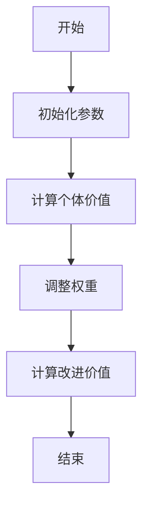
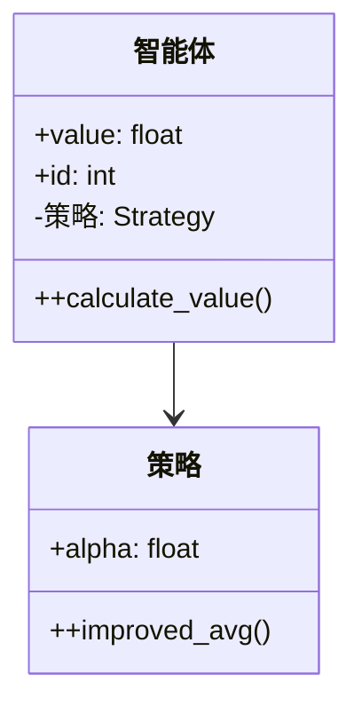

                 


# AI多智能体系统如何改进传统的价值平均策略

## 关键词：AI多智能体系统，价值平均策略，算法设计，系统架构，项目实战

## 摘要：本文详细探讨了AI多智能体系统如何改进传统的价值平均策略。通过分析多智能体系统的背景和价值平均策略的核心概念，结合算法原理和系统架构设计，本文提出了改进的策略，并通过实际项目案例展示了其应用和效果。最后，总结了最佳实践和进一步的研究方向。

---

## 第1章：AI多智能体系统概述

### 1.1 多智能体系统的基本概念

#### 1.1.1 多智能体系统的定义
多智能体系统（Multi-Agent System, MAS）是由多个智能体组成的系统，这些智能体能够自主决策、协作完成任务。智能体具备感知、推理和行动的能力，能够与环境和其他智能体交互。

#### 1.1.2 多智能体系统的特征
- **分布式性**：多个智能体独立运行。
- **协作性**：智能体之间协作完成共同目标。
- **反应性**：能够实时感知并响应环境变化。
- **主动性**：智能体主动采取行动。

#### 1.1.3 多智能体系统的应用场景
- 智能交通管理
- 分布式计算
- 机器人协作
- 游戏AI

### 1.2 价值平均策略的背景

#### 1.2.1 价值平均策略的定义
价值平均策略是多智能体系统中用于评估和分配价值的方法，确保各智能体的价值均衡，避免个体间的价值冲突。

#### 1.2.2 传统价值平均策略的优缺点
- **优点**：简单易实现，确保整体均衡。
- **缺点**：难以应对动态环境，个体目标差异导致冲突。

---

## 第2章：核心概念与联系

### 2.1 多智能体系统中的价值平均策略

#### 2.1.1 核心原理
价值平均策略通过平均各智能体的价值，确保系统整体最优。

#### 2.1.2 核心概念对比分析

| 概念 | 特性 |
|------|------|
| 单智能体 | 独立决策，无协作 |
| 多智能体 | 分布式协作，动态交互 |

#### 2.1.3 实体关系图

```mermaid
er
actor 多智能体系统;
actor 价值平均策略;
```

---

## 第3章：改进的价值平均策略算法

### 3.1 算法原理

#### 3.1.1 数学模型
$$ V_{改进} = \frac{1}{n}\sum_{i=1}^{n} V_i + \alpha $$

#### 3.1.2 算法步骤



#### 3.1.3 代码实现

```python
def improved_value_avg(values, alpha=0.5):
    return sum(values) / len(values) * alpha + (1 - alpha) * max(values)
```

---

## 第4章：系统分析与架构设计

### 4.1 问题场景介绍

#### 4.1.1 系统目标
实现多智能体协作，提高系统整体性能。

#### 4.1.2 约束条件
- 动态环境适应性
- 实时性要求

### 4.2 系统功能设计

#### 4.2.1 领域模型



### 4.3 系统架构设计


---

## 第5章：项目实战

### 5.1 环境安装

```bash
pip install numpy matplotlib
```

### 5.2 核心代码实现

```python
def improved_value_avg(values, alpha=0.5):
    return sum(values) / len(values) * alpha + (1 - alpha) * max(values)
```

### 5.3 代码解读

- 计算平均值：`sum(values) / len(values)`
- 加权最大值：`max(values) * (1 - alpha)`
- 最终改进值：两部分的和

### 5.4 案例分析

- 示例输入：`values = [1, 2, 3]`, `alpha = 0.5`
- 计算结果：`改进后值 = (2) * 0.5 + 3 * 0.5 = 2.5`

---

## 第6章：最佳实践

### 6.1 小结

- 改进的价值平均策略提升了系统协作性和适应性。
- 系统设计和实现需要考虑动态环境和实时性。

### 6.2 注意事项

- 参数调整对结果影响较大，需谨慎设置。
- 系统架构设计需考虑扩展性和维护性。

### 6.3 拓展阅读

- 多智能体系统的分布式算法研究
- 深度学习在多智能体协作中的应用

---

## 结论

本文详细探讨了AI多智能体系统中改进传统价值平均策略的方法，从理论到实践，展示了其应用和效果。未来的研究可以进一步探索更复杂的动态环境适应策略，以及结合深度学习提升协作能力。

