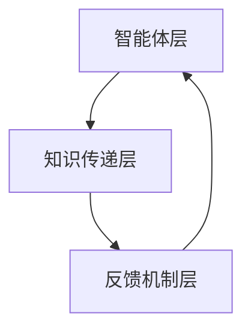

                 


# AI多智能体系统如何改进传统的价值投资师徒培养模式

## 关键词：AI多智能体系统，价值投资，师徒培养模式，分布式计算，协作学习，强化学习

## 摘要：  
传统的价值投资师徒培养模式依赖于经验丰富的导师一对一指导，这种方法在知识传递和实践能力培养方面存在效率低下、资源分配不均的问题。AI多智能体系统通过分布式计算、协作学习和强化学习等技术，能够模拟真实的市场环境，实现多维度的知识传递和能力培养，显著提高了培养效率和效果。本文将深入分析AI多智能体系统的核心原理，探讨其在价值投资师徒培养模式中的应用，通过实际案例展示其优势，并展望未来的优化方向。

---

# 第一部分: AI多智能体系统与价值投资师徒制的背景与概念

## 第1章: AI多智能体系统与价值投资师徒制的背景

### 1.1 问题背景与问题描述

#### 1.1.1 传统价值投资师徒制的现状与挑战
传统的价值投资师徒制是一种以导师为核心的知识传递模式，依赖于导师的个人经验和能力。然而，这种方式存在以下问题：
- **效率低下**：一对一的培养模式难以大规模扩展，导致资源浪费。
- **知识断层**：知识传递依赖于导师的个人经验，难以系统化和结构化。
- **实践能力不足**：学员在实际操作中缺乏真实的市场环境，导致实践能力不足。
- **个性化不足**：学员的个性化需求难以得到充分满足，导致培养效果不佳。

#### 1.1.2 AI多智能体系统的核心概念与优势
AI多智能体系统是一种由多个智能体协作完成复杂任务的系统，具有以下优势：
- **分布式计算**：通过分布式计算，系统能够高效地处理大量数据。
- **协作学习**：智能体之间可以协作学习，共同优化决策。
- **强化学习**：通过强化学习，智能体能够在动态环境中自适应地优化策略。
- **实时反馈**：系统能够提供实时反馈，帮助学员快速改进。

#### 1.1.3 问题解决的必要性与目标
传统的价值投资师徒制在知识传递和实践能力培养方面存在诸多问题，亟需引入AI多智能体系统来实现以下目标：
- **提高培养效率**：通过系统化和自动化的知识传递，提高培养效率。
- **降低资源浪费**：通过分布式计算和协作学习，优化资源分配。
- **增强实践能力**：通过模拟真实市场环境，提升学员的实践能力。
- **个性化培养**：通过个性化学习路径，满足学员的个性化需求。

### 1.2 问题的边界与外延

#### 1.2.1 价值投资师徒制的边界
价值投资师徒制的边界包括：
- **知识传递范围**：主要集中在金融知识和投资策略的传递。
- **时间限制**：培养周期较长，通常需要数年时间。
- **人数限制**：传统模式下，培养人数有限，难以大规模扩展。

#### 1.2.2 AI多智能体系统的边界
AI多智能体系统的边界包括：
- **智能体数量**：系统由多个智能体组成，数量取决于任务复杂度。
- **计算能力**：系统的计算能力依赖于硬件支持。
- **数据来源**：系统需要大量高质量的数据支持。

#### 1.2.3 两者结合的外延与潜在影响
两者结合的外延与潜在影响包括：
- **知识传递的扩展**：通过AI多智能体系统，知识传递范围可以扩大，培养人数可以大幅增加。
- **培养效率的提升**：通过系统化和自动化的知识传递，培养效率可以显著提高。
- **实践能力的增强**：通过模拟真实市场环境，学员的实践能力可以得到显著提升。

### 1.3 核心概念的结构与组成

#### 1.3.1 核心概念的结构化分析
核心概念的结构化分析如下：
- **价值投资**：价值投资是一种以基本面分析为基础的投资策略，强调长期持有优质资产。
- **师徒制**：师徒制是一种以导师为核心的知识传递模式，强调一对一的指导。
- **AI多智能体系统**：AI多智能体系统是一种由多个智能体协作完成复杂任务的系统，强调分布式计算和协作学习。

#### 1.3.2 核心要素的组成与关系
核心要素的组成与关系如下：
- **智能体**：智能体是系统的基本单元，负责完成特定任务。
- **知识传递**：知识传递是系统的核心功能，通过智能体之间的协作实现。
- **反馈机制**：反馈机制是系统的重要组成部分，用于优化智能体的决策。

#### 1.3.3 系统的整体架构
系统的整体架构如下：
1. **智能体层**：由多个智能体组成，每个智能体负责完成特定任务。
2. **知识传递层**：负责知识的传递和共享，通过协作学习实现。
3. **反馈机制层**：负责对智能体的决策进行反馈，优化智能体的策略。

---

## 第2章: AI多智能体系统的原理与核心概念

### 2.1 AI多智能体系统的定义与特点

#### 2.1.1 AI多智能体系统的定义
AI多智能体系统是由多个智能体组成的系统，这些智能体通过协作完成复杂任务。

#### 2.1.2 多智能体系统的核心特点
多智能体系统的核心特点包括：
- **分布式计算**：系统通过分布式计算实现任务的分解和协同。
- **协作学习**：智能体之间通过协作学习优化决策。
- **强化学习**：智能体通过强化学习在动态环境中自适应优化策略。
- **实时反馈**：系统能够提供实时反馈，帮助智能体快速改进。

#### 2.1.3 AI多智能体系统与传统AI的区别
AI多智能体系统与传统AI的区别主要体现在：
- **协作性**：多智能体系统强调智能体之间的协作，而传统AI强调单点任务的处理。
- **分布性**：多智能体系统通过分布式计算实现任务的分解，而传统AI通常集中处理。
- **动态性**：多智能体系统能够适应动态环境，而传统AI通常在静态环境中表现最佳。

### 2.2 价值投资师徒制的核心概念

#### 2.2.1 价值投资的核心理念
价值投资的核心理念包括：
- **基本面分析**：通过分析企业的财务状况、行业地位等因素，判断其内在价值。
- **长期投资**：强调长期持有优质资产，避免短期波动的影响。

#### 2.2.2 师徒制的组织结构
师徒制的组织结构包括：
- **导师**：负责指导学员，传授知识和经验。
- **学员**：通过导师的指导，学习投资知识和技能。

#### 2.2.3 价值投资师徒制的特点
价值投资师徒制的特点包括：
- **个性化指导**：导师根据学员的特点制定个性化的学习计划。
- **实践导向**：强调实践能力的培养，学员需要在实际操作中不断积累经验。
- **长期性**：价值投资是一种长期投资策略，师徒制培养也需要较长时间。

### 2.3 AI多智能体系统与价值投资师徒制的联系

#### 2.3.1 系统与模式的结合点
系统与模式的结合点包括：
- **知识传递**：通过AI多智能体系统，知识传递可以更加系统化和自动化。
- **协作学习**：智能体之间的协作学习可以模拟导师与学员的互动。
- **强化学习**：智能体通过强化学习优化投资策略，类似于学员通过反馈优化投资决策。

#### 2.3.2 核心概念的对比与联系
核心概念的对比与联系如下：
| 概念 | 传统价值投资师徒制 | AI多智能体系统 |
|------|---------------------|----------------|
| 知识传递 | 一对一，依赖导师经验 | 系统化，自动化的知识传递 |
| 决策方式 | 依赖导师的判断 | 智能体协作优化决策 |
| 反馈机制 | 事后反馈 | 实时反馈 |

#### 2.3.3 案例分析与对比表格
案例分析与对比表格如下：
- **案例背景**：某投资机构希望通过AI多智能体系统优化其价值投资师徒制。
- **传统模式**：导师一对一指导学员，学员学习周期长，效率低。
- **AI多智能体系统模式**：通过系统化和自动化的知识传递，学员可以在短时间内掌握核心投资策略。

---

## 第3章: AI多智能体系统的算法原理

### 3.1 分布式计算与协作学习

#### 3.1.1 分布式计算的基本原理
分布式计算的基本原理是将任务分解为多个子任务，分别由不同的智能体完成，然后将结果汇总。

#### 3.1.2 协作学习的机制与流程
协作学习的机制与流程如下：
1. **任务分解**：将复杂任务分解为多个子任务。
2. **智能体协作**：多个智能体协作完成子任务。
3. **知识共享**：智能体之间共享知识，优化决策。

#### 3.1.3 多智能体系统的协作模型
多智能体系统的协作模型包括：
- **分布式协作模型**：任务分解为多个子任务，由不同的智能体协作完成。
- **集中式协作模型**：任务集中在中心节点处理，由多个智能体协作完成。

### 3.2 强化学习与决策优化

#### 3.2.1 强化学习的基本原理
强化学习的基本原理是通过试错，智能体通过与环境交互，逐步优化决策策略。

#### 3.2.2 多智能体强化学习的挑战
多智能体强化学习的挑战包括：
- **协作与竞争**：智能体之间的协作与竞争需要平衡。
- **信息共享**：智能体之间的信息共享需要协调。

#### 3.2.3 价值函数与策略优化
价值函数与策略优化是强化学习的核心，具体如下：
- **价值函数**：衡量某个状态下的价值，帮助智能体做出最优决策。
- **策略优化**：通过优化策略，使智能体在动态环境中自适应优化决策。

---

## 第4章: 系统分析与架构设计

### 4.1 系统分析

#### 4.1.1 项目背景
项目背景是希望通过AI多智能体系统优化传统的价值投资师徒制，提高培养效率和效果。

#### 4.1.2 系统功能设计
系统功能设计包括：
- **知识传递模块**：实现知识的系统化和自动化传递。
- **协作学习模块**：实现智能体之间的协作学习。
- **强化学习模块**：实现智能体的强化学习和策略优化。

#### 4.1.3 系统架构设计
系统架构设计如下：
1. **智能体层**：由多个智能体组成，负责完成特定任务。
2. **知识传递层**：负责知识的传递和共享。
3. **反馈机制层**：负责对智能体的决策进行反馈，优化智能体的策略。

### 4.2 系统架构设计

#### 4.2.1 系统架构图


#### 4.2.2 系统功能模块
系统功能模块包括：
- **智能体模块**：负责完成特定任务。
- **知识传递模块**：实现知识的传递和共享。
- **反馈机制模块**：负责对智能体的决策进行反馈，优化智能体的策略。

---

## 第5章: 项目实战

### 5.1 环境安装与配置

#### 5.1.1 环境要求
- **操作系统**：建议使用Linux或Windows系统。
- **编程语言**：Python 3.6以上版本。
- **依赖库**：安装numpy、pandas、scikit-learn等库。

#### 5.1.2 安装步骤
1. 安装Python。
2. 安装必要的依赖库。
3. 下载项目代码。

### 5.2 核心代码实现

#### 5.2.1 智能体类实现
```python
class Agent:
    def __init__(self, id):
        self.id = id
        self.state = None
        self.action = None
    def receive(self, message):
        pass
    def send(self, message):
        pass
```

#### 5.2.2 知识传递模块实现
```python
class KnowledgeTransfer:
    def __init__(self, agents):
        self.agents = agents
    def transfer(self, knowledge):
        for agent in self.agents:
            agent.receive(knowledge)
```

#### 5.2.3 强化学习模块实现
```python
class ReinforcementLearning:
    def __init__(self, agents):
        self.agents = agents
    def train(self):
        for agent in self.agents:
            agent.send("update strategy")
```

### 5.3 案例分析与代码解读

#### 5.3.1 案例背景
假设某投资机构希望通过AI多智能体系统优化其价值投资师徒制。

#### 5.3.2 代码实现
```python
agents = [Agent(1), Agent(2), Agent(3)]
knowledge_transfer = KnowledgeTransfer(agents)
knowledge_transfer.transfer("value investment strategy")
reinforcement_learning = ReinforcementLearning(agents)
reinforcement_learning.train()
```

#### 5.3.3 代码分析
- **智能体类**：定义了智能体的基本行为，包括接收和发送消息。
- **知识传递模块**：实现了知识的传递，使智能体之间能够共享知识。
- **强化学习模块**：实现了强化学习，优化智能体的策略。

### 5.4 项目总结与优化建议

#### 5.4.1 项目总结
通过AI多智能体系统，我们可以显著提高价值投资师徒制的培养效率和效果。

#### 5.4.2 优化建议
- **优化知识传递模块**：进一步优化知识传递的效率和效果。
- **优化强化学习模块**：进一步优化强化学习的算法，提高智能体的决策能力。

---

## 第6章: 最佳实践与小结

### 6.1 最佳实践 tips

#### 6.1.1 知识传递模块的优化
- **模块化设计**：将知识传递模块设计得更加模块化，便于扩展和维护。
- **动态调整**：根据实际情况动态调整知识传递的内容和方式。

#### 6.1.2 强化学习模块的优化
- **算法优化**：进一步优化强化学习的算法，提高智能体的决策能力。
- **参数调整**：根据实际情况调整参数，提高系统的性能。

### 6.2 小结

#### 6.2.1 核心内容回顾
本文深入分析了AI多智能体系统的核心原理，探讨了其在价值投资师徒培养模式中的应用，通过实际案例展示了其优势，并展望了未来的优化方向。

#### 6.2.2 注意事项
- **数据质量**：确保数据的质量，避免数据偏差。
- **系统维护**：定期维护系统，确保系统的稳定性和安全性。
- **人才培养**：注重人才的培养，提高人才的综合素质。

### 6.3 未来展望

#### 6.3.1 智能体系统的未来发展趋势
智能体系统的未来发展趋势包括：
- **智能化**：进一步提高智能体的智能化水平。
- **协作性**：进一步增强智能体之间的协作能力。
- **实时性**：进一步提高系统的实时性，适应动态环境的需求。

#### 6.3.2 价值投资师徒培养模式的未来展望
价值投资师徒培养模式的未来展望包括：
- **系统化**：进一步系统化知识传递的过程。
- **个性化**：进一步个性化培养方案，满足学员的个性化需求。
- **智能化**：进一步智能化培养过程，提高培养效率和效果。

---

## 结语

通过引入AI多智能体系统，我们可以显著提高价值投资师徒制的培养效率和效果，为未来的投资行业培养更多优秀的人才。本文从多个角度深入分析了AI多智能体系统的核心原理和应用，为实际应用提供了理论和实践的双重支持。未来，随着技术的不断发展，AI多智能体系统在价值投资师徒培养模式中的应用将更加广泛和深入，为投资行业的未来发展注入新的活力。

--- 

**本文是对《AI多智能体系统如何改进传统的价值投资师徒培养模式》这一主题的深入探讨，内容涵盖了系统的背景、原理、架构设计、项目实战以及最佳实践等多个方面，为读者提供了全面而系统的知识体系。**

