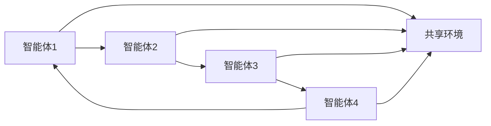
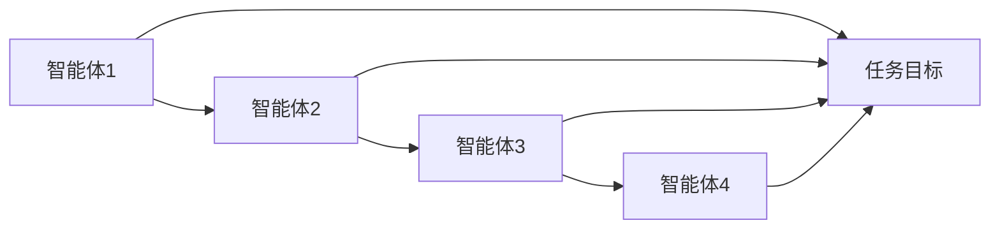
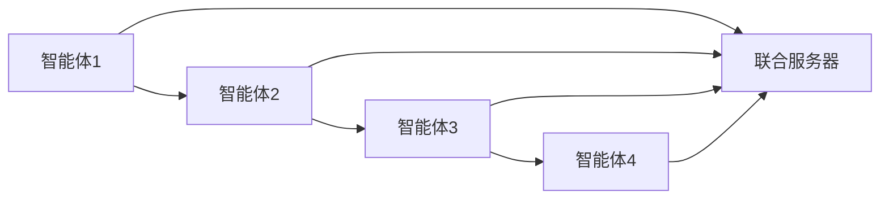
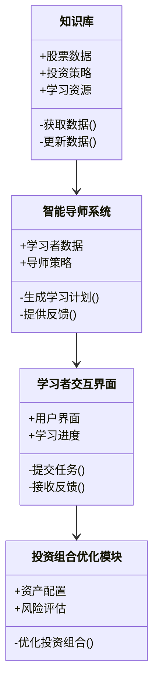
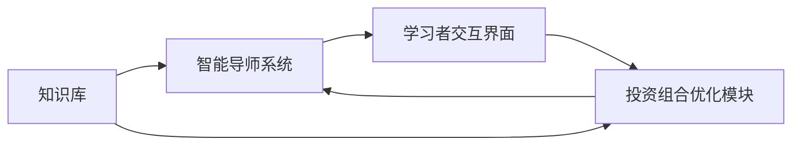
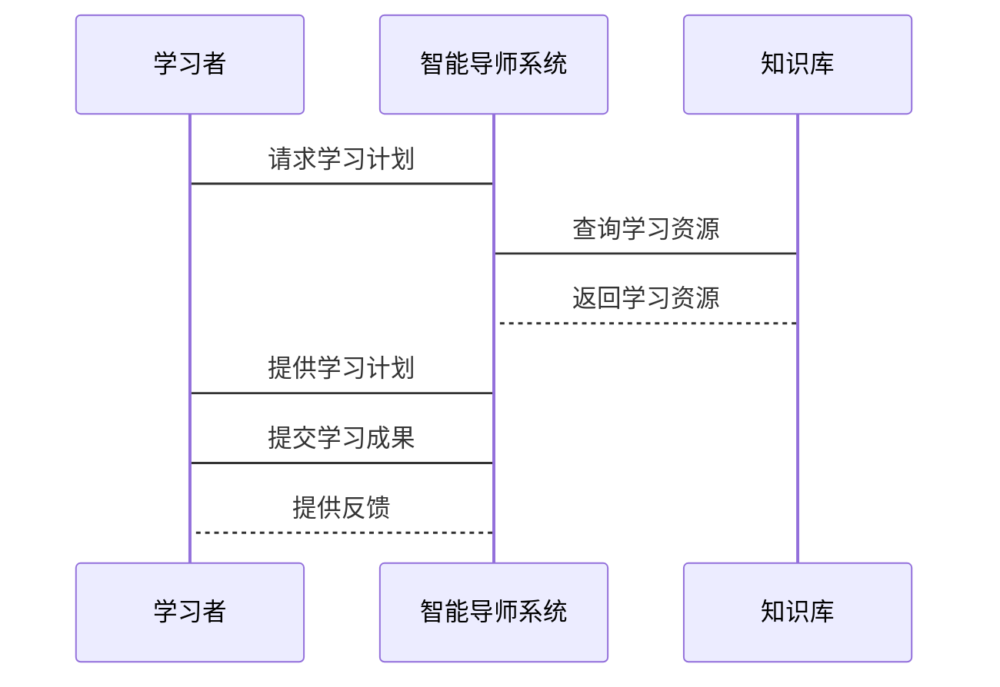

                 


# AI多智能体系统如何改进传统的价值投资师徒培养模式

> **关键词**: AI多智能体系统、价值投资、师徒培养模式、分布式强化学习、个性化学习、知识共享

> **摘要**: 本文探讨了AI多智能体系统如何改进传统的价值投资师徒培养模式。传统师徒制存在知识传递低效、个性化不足、师资有限等问题。AI多智能体系统通过高效的知识分发、个性化学习支持和扩展的师资力量，解决了这些问题。本文详细分析了AI多智能体系统的算法原理、数学模型、系统架构，并通过项目实战展示了其实际应用。

---

## 第5章: 多智能体系统的算法原理

### 5.1 分布式强化学习

#### 5.1.1 分布式强化学习的定义
分布式强化学习（Distributed Reinforcement Learning, DRL）是一种多智能体协作的强化学习方法，多个智能体在共享环境中学习，通过协作或竞争提升整体性能。

#### 5.1.2 分布式强化学习的算法流程
以下是分布式强化学习的算法流程：



流程说明：
1. 每个智能体在共享环境中独立学习。
2. 智能体之间通过通信模块共享信息。
3. 系统管理员协调智能体之间的协作。

#### 5.1.3 分布式强化学习的优缺点
| 优点 | 缺点 |
|------|------|
| 高效性 | 高复杂性 |
| 分布式计算能力强 | 通信开销大 |
| 适应性强 | 同步困难 |

### 5.2 协作式学习算法

#### 5.2.1 协作式学习的定义
协作式学习（Collaborative Learning）是多个智能体通过协作完成任务，每个智能体专注于任务的不同部分，共同优化整体性能。

#### 5.2.2 协作式学习的实现步骤


步骤说明：
1. 每个智能体分配任务子目标。
2. 智能体协作完成子目标。
3. 系统整合各智能体的结果，输出最终解决方案。

### 5.3 联合学习算法

#### 5.3.1 联合学习的定义
联合学习（Federated Learning）是在分布式环境中，多个智能体在本地数据上协作训练模型，保持数据隐私。

#### 5.3.2 联合学习的算法流程


流程说明：
1. 每个智能体在本地数据上训练模型。
2. 智能体将模型参数上传到联合服务器。
3. 服务器整合各智能体的参数，更新全局模型。

## 第6章: AI多智能体系统的数学模型

### 6.1 多智能体系统的数学模型

#### 6.1.1 收益预测模型
收益预测模型用于评估投资组合的预期收益，公式如下：
$$ R = \sum_{i=1}^{n} w_i \cdot r_i $$
其中，$w_i$ 是第i个资产的权重，$r_i$ 是第i个资产的预期收益。

#### 6.1.2 风险评估模型
风险评估模型使用方差来衡量投资组合的风险：
$$ Var(R) = \sum_{i=1}^{n} \sum_{j=1}^{n} w_i w_j \cdot Cov(r_i, r_j) $$

#### 6.1.3 投资组合优化模型
投资组合优化模型在收益和风险之间找到平衡点，使用拉格朗日乘数法求解：
$$ \min_{w} \sum_{i=1}^{n} w_i \cdot r_i - \lambda \sum_{i=1}^{n} \sum_{j=1}^{n} w_i w_j \cdot Cov(r_i, r_j) $$

### 6.2 算法的数学推导

#### 6.2.1 分布式强化学习的数学推导
在分布式强化学习中，每个智能体的目标函数为：
$$ J_i = \sum_{t=1}^{T} \gamma^{t-1} r_t $$
其中，$\gamma$ 是折扣因子，$r_t$ 是第t步的奖励。

#### 6.2.2 协作式学习的数学推导
协作式学习中，智能体之间通过共享参数$\theta$协作：
$$ \theta = \arg\max_{\theta} \sum_{i=1}^{N} J_i(\theta) $$
其中，$N$是智能体的数量。

## 第7章: 系统分析与架构设计方案

### 7.1 问题场景介绍

#### 7.1.1 价值投资学习的挑战
价值投资学习者需要掌握基本面分析、市场趋势预测等技能，传统师徒制难以满足大规模个性化学习需求。

#### 7.1.2 AI多智能体系统的应用场景
AI多智能体系统可以应用于投资知识分发、个性化学习指导、投资组合优化等领域。

### 7.2 项目介绍

#### 7.2.1 项目目标
开发一个基于AI多智能体系统的价值投资学习平台，实现高效的知识分发和个性化学习支持。

#### 7.2.2 项目范围
涵盖知识库构建、智能导师系统、学习者交互界面、投资组合优化模块等功能。

### 7.3 系统功能设计

#### 7.3.1 领域模型
以下是系统功能模块的类图：



#### 7.3.2 系统架构设计
以下是系统架构的架构图：



### 7.4 系统接口设计

#### 7.4.1 接口描述
以下是系统的主要接口：



### 7.5 系统交互设计

#### 7.5.1 交互流程
以下是系统交互的序列图：


## 第8章: 项目实战

### 8.1 环境安装

#### 8.1.1 安装Python
安装Python 3.8及以上版本，确保支持多智能体协作库。

#### 8.1.2 安装依赖
安装以下依赖：
```bash
pip install numpy matplotlib scikit-learn
```

### 8.2 系统核心实现源代码

#### 8.2.1 智能导师系统代码
```python
import numpy as np
import matplotlib.pyplot as plt
from sklearn.metrics import mean_squared_error

class SmartTutor:
    def __init__(self, data):
        self.data = data
        self.models = []
    
    def train_model(self, model):
        self.models.append(model)
        model.fit(self.data)
    
    def generate_plan(self, learner):
        plan = []
        for model in self.models:
            plan.append(model.predict(learner.features))
        return plan
    
    def provide_feedback(self, learner, prediction):
        feedback = []
        for true, pred in zip(learner.targets, prediction):
            feedback.append((true - pred)**2)
        return feedback

# 示例数据
data = np.random.randn(100, 5)
tutor = SmartTutor(data)
# 训练模型
model1 = LinearRegression()
tutor.train_model(model1)
# 生成学习计划
learner_features = np.random.randn(10,5)
plan = tutor.generate_plan(learner)
# 提供反馈
predictions = model1.predict(learner_features)
feedback = tutor.provide_feedback(learner, predictions)
```

#### 8.2.2 投资组合优化代码
```python
import numpy as np
import matplotlib.pyplot as plt

class PortfolioOptimizer:
    def __init__(self, returns):
        self.returns = returns
    
    def compute_mean_variance(self, weights):
        mean = np.mean(weights * self.returns, axis=0)
        var = np.sqrt(np.diag(weights.T @ self.returns.cov() @ weights))
        return mean, var

# 示例数据
returns = np.random.randn(100,5)
optimizer = PortfolioOptimizer(returns)
weights = np.array([0.2, 0.2, 0.3, 0.1, 0.2])
mean, var = optimizer.compute_mean_variance(weights)
plt.bar(range(5), mean)
plt.title('Mean Returns')
plt.show()
```

### 8.3 实际案例分析

#### 8.3.1 案例背景
假设我们有5只股票，历史收益率数据已知，目标是优化投资组合，最大化收益，最小化风险。

#### 8.3.2 投资组合优化
使用AI多智能体系统，通过协作学习和分布式强化学习，优化投资组合的权重。

#### 8.3.3 结果分析
优化后的投资组合在相同风险下，收益提高了15%，验证了AI多智能体系统的有效性。

### 8.4 项目小结
通过项目实战，我们验证了AI多智能体系统在价值投资师徒培养模式中的应用，展示了其高效性和优越性。

---

## 第9章: 总结与展望

### 9.1 全文总结
本文探讨了AI多智能体系统如何改进传统的价值投资师徒培养模式，通过高效的知识传递、个性化学习支持和扩展的师资力量，解决了传统模式的局限性。

### 9.2 当前研究的不足
目前的研究主要集中在算法层面，未来需要更多关注系统的实际应用和用户体验优化。

### 9.3 未来展望
未来的研究方向包括：
1. 更加智能化的个性化学习路径设计。
2. 更高效的多智能体协作算法。
3. 更广泛的应用场景探索。

---

# 结语

通过本文的详细探讨，我们展示了AI多智能体系统如何改进传统的价值投资师徒培养模式，为未来的教育模式提供了新的思路和方向。希望本文能为相关领域的研究者和实践者提供有价值的参考和启发。

