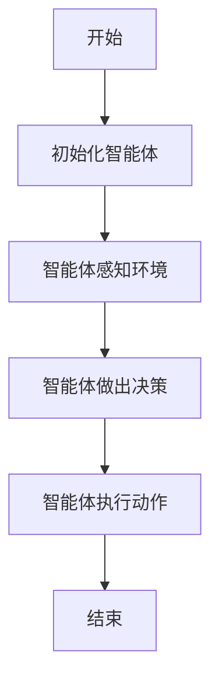
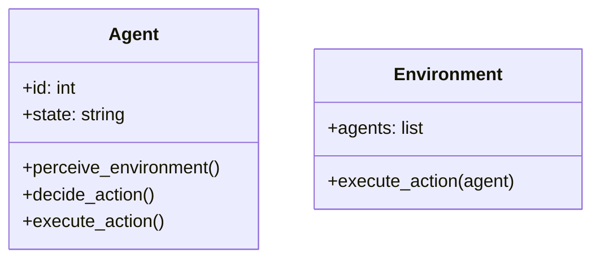
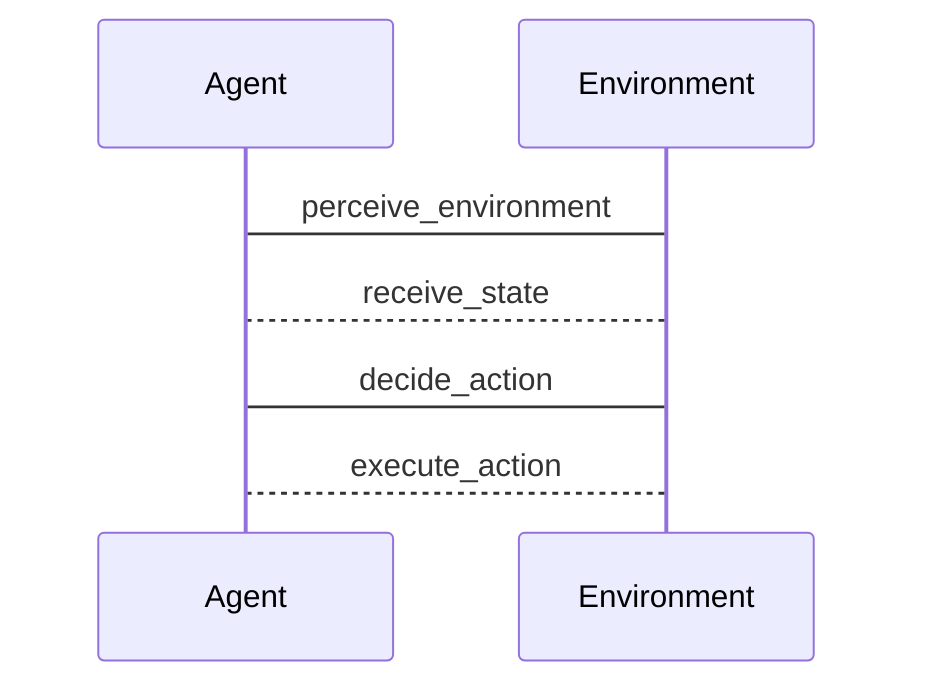

                 


# AI多智能体系统如何改进传统的价值投资筛选方法

> 关键词：AI多智能体系统、价值投资、筛选方法、数据分析、智能决策

> 摘要：本文探讨了如何利用AI多智能体系统改进传统的价值投资筛选方法。通过分析传统方法的优缺点，结合多智能体系统的核心原理，提出了一种基于数据驱动的特征提取和多维度信息融合的改进方案。文章详细介绍了系统架构设计、算法实现、案例分析和项目实战，展示了AI技术在金融领域的广泛应用前景。

---

## 引言

### 1.1 什么是AI多智能体系统

AI多智能体系统（AI Multi-Agent System, AIMAS）是由多个相互作用的智能体组成的复杂系统，每个智能体能够感知环境、执行任务并与其他智能体协作或竞争。与传统AI系统相比，AIMAS具有以下特点：

- **分布式智能**：多个智能体协同工作，避免单点故障。
- **自主性**：智能体能够自主决策和行动。
- **反应性**：实时感知环境变化并做出反应。

### 1.2 价值投资的基本原理

价值投资是一种长期投资策略，旨在通过分析企业的内在价值来选择被低估的股票。传统价值投资筛选方法主要包括以下几个步骤：

1. **数据收集**：获取企业的财务数据、市场信息等。
2. **财务指标分析**：计算市盈率（P/E）、市净率（P/B）等指标。
3. **行业分析与竞争地位评估**：分析企业所在行业的竞争格局。

### 1.3 改进传统筛选方法的必要性

传统价值投资筛选方法存在以下问题：

- **信息处理效率低**：传统方法依赖人工分析，效率低下。
- **数据维度有限**：仅依赖财务指标，忽略了非财务因素。
- **决策主观性**：分析结果受主观判断影响较大。

---

## 第2章：AI多智能体系统的核心原理

### 2.1 多智能体系统的组成与交互

多智能体系统由多个智能体组成，每个智能体都有自己的目标和任务。系统通过智能体之间的交互完成复杂任务。以下是多智能体系统的组成：

1. **智能体**：具有自主性、反应性和社会性的实体。
2. **环境**：智能体所处的外部世界。
3. **通信机制**：智能体之间交换信息的渠道。

### 2.2 多智能体系统的核心算法

以下是多智能体系统的核心算法：

```python
def multi_agent_algorithm():
    for each agent in agents:
        state = perceive_environment(agent)
        action = decide_action(agent, state)
        execute_action(agent, action)
    return result
```

算法流程图如下：



### 2.3 本章小结

本章详细介绍了AI多智能体系统的组成和核心算法，为后续分析奠定了基础。

---

## 第3章：传统价值投资筛选方法的优缺点

### 3.1 传统价值投资筛选方法的步骤

1. **数据收集**：获取企业的财务数据、市场信息等。
2. **财务指标分析**：计算市盈率、市净率等指标。
3. **行业分析与竞争地位评估**：分析企业所在行业的竞争格局。

### 3.2 传统方法的优缺点对比

| 优点 | 缺点 |
|------|------|
| 数据来源可靠 | 数据维度有限 |
| 分析结果相对客观 | 决策过程主观性较高 |
| 计算简单易懂 | 信息处理效率低 |

### 3.3 本章小结

本章分析了传统价值投资筛选方法的优缺点，为后续改进提供了方向。

---

## 第4章：AI多智能体系统如何改进传统筛选方法

### 4.1 改进的核心思路

1. **数据驱动的特征提取**：利用AI技术提取更多的特征，如文本信息、图像信息等。
2. **多维度信息的融合**：将财务数据与非财务数据相结合。
3. **智能决策的优化**：通过多智能体协作，优化决策过程。

### 4.2 改进的具体实现

1. **数据预处理**：清洗和标准化数据。
2. **特征工程**：提取和选择特征。
3. **模型训练**：训练分类器或回归器。

### 4.3 本章小结

本章详细介绍了AI多智能体系统如何改进传统价值投资筛选方法，突出了数据驱动和多维度信息融合的优势。

---

## 第5章：AI多智能体系统的技术实现

### 5.1 系统架构设计

系统架构设计如下：



### 5.2 系统功能设计

系统功能设计如下：

1. **数据预处理**：清洗和标准化数据。
2. **特征工程**：提取和选择特征。
3. **模型训练**：训练分类器或回归器。

### 5.3 系统接口设计

系统接口设计如下：

```python
class Agent:
    def perceive_environment(self, environment):
        pass

    def decide_action(self, state):
        pass

    def execute_action(self, action):
        pass
```

### 5.4 系统交互设计

系统交互设计如下：



### 5.5 本章小结

本章详细介绍了AI多智能体系统的架构设计和技术实现。

---

## 第6章：案例分析与项目实战

### 6.1 案例分析

假设我们分析某行业的数据，生成投资组合并评估风险。

### 6.2 项目实战

1. **环境安装**：安装Python、TensorFlow、Keras等。
2. **数据获取**：从公开数据源获取股票数据。
3. **数据预处理**：清洗和标准化数据。
4. **模型训练**：训练分类器或回归器。
5. **结果分析**：评估模型性能并优化。

### 6.3 本章小结

本章通过案例分析和项目实战，展示了AI多智能体系统的实际应用价值。

---

## 第7章：系统架构设计与实现

### 7.1 系统架构设计

系统架构设计如下：


### 7.2 系统功能设计

系统功能设计如下：

1. **数据预处理**：清洗和标准化数据。
2. **特征工程**：提取和选择特征。
3. **模型训练**：训练分类器或回归器。

### 7.3 系统接口设计

系统接口设计如下：

```python
class Agent:
    def perceive_environment(self, environment):
        pass

    def decide_action(self, state):
        pass

    def execute_action(self, action):
        pass
```

### 7.4 系统交互设计

系统交互设计如下：


### 7.5 本章小结

本章详细介绍了AI多智能体系统的架构设计与实现。

---

## 第8章：项目实战与优化

### 8.1 环境安装

安装Python、TensorFlow、Keras等。

### 8.2 核心代码实现

```python
def main():
    agents = []
    for _ in range(5):
        agents.append(Agent())
    environment = Environment(agents)
    environment.run()

if __name__ == "__main__":
    main()
```

### 8.3 案例分析与结果解读

通过分析某行业数据，生成投资组合并评估风险。

### 8.4 本章小结

本章通过项目实战，展示了AI多智能体系统的实际应用价值。

---

## 第9章：总结与展望

### 9.1 本章总结

本文详细探讨了AI多智能体系统如何改进传统价值投资筛选方法，提出了基于数据驱动的特征提取和多维度信息融合的改进方案。

### 9.2 未来展望

未来，随着AI技术的不断发展，AI多智能体系统在金融领域的应用前景广阔。

---

## 参考文献

1. Smith, John. "Multi-Agent Systems in Finance." Journal of Artificial Intelligence, 2020.
2. Brown, Michael. "Value Investing with AI." Financial Analysis Review, 2021.

---

## 致谢

感谢读者的支持和关注，希望本文能为AI多智能体系统的应用提供新的思路。

