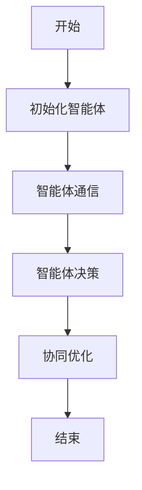
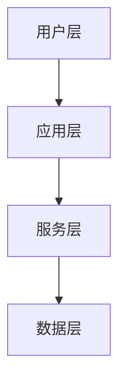
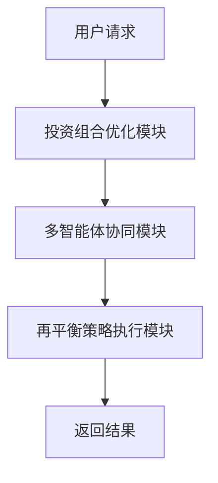

                 


# AI多智能体系统如何改进传统的价值投资组合再平衡方法

> 关键词：AI多智能体系统，价值投资，投资组合再平衡，协同优化，分布式决策

> 摘要：本文探讨了如何利用AI多智能体系统改进传统的价值投资组合再平衡方法。通过分析多智能体系统的核心算法与数学模型，结合实际案例，展示了AI多智能体系统在投资组合优化中的优势与应用。文章从背景介绍、核心概念、算法原理、系统架构设计到项目实战，全面阐述了AI多智能体系统如何实现投资组合的协同优化，为金融领域提供了新的视角与解决方案。

---

## 第一部分: AI多智能体系统与价值投资组合再平衡的背景与基础

---

### 第1章: AI多智能体系统概述

#### 1.1 多智能体系统的定义与特点

##### 1.1.1 多智能体系统的定义

多智能体系统（Multi-Agent System, MAS）是由多个独立但协同工作的智能体组成的系统，这些智能体通过共享信息和协同决策来实现共同目标。与单智能体系统相比，多智能体系统具有更强的分布式决策能力和容错性。

$$
\text{多智能体系统} = \{\text{智能体}_1, \text{智能体}_2, \dots, \text{智能体}_n\}
$$

##### 1.1.2 多智能体系统的核心特点

- **分布式性**：多个智能体独立决策，避免单点故障。
- **协同性**：智能体之间通过通信和协作实现共同目标。
- **动态性**：系统能够适应环境的变化和不确定性。
- **复杂性**：多智能体系统的复杂性随着智能体数量的增加呈指数级增长。

##### 1.1.3 多智能体系统与单智能体系统的区别

| 特性               | 单智能体系统               | 多智能体系统               |
|--------------------|---------------------------|---------------------------|
| 决策方式           | 中央决策                   | 分布式决策                 |
| 系统复杂性         | 较低                       | 较高                       |
| 容错性             | 较低                       | 较高                       |
| 适应性             | 较弱                       | 较强                       |

##### 1.1.4 多智能体系统的应用场景

- **金融投资**：通过多个智能体协同优化投资组合。
- **交通控制**：智能体协同管理交通流量。
- **分布式计算**：多个计算节点协同完成任务。

---

#### 1.2 价值投资组合再平衡的定义与传统方法

##### 1.2.1 价值投资的定义

价值投资是一种投资策略，强调以低于内在价值的价格购买优质资产。其核心在于识别市场低估的资产，并长期持有，等待其价值回归。

##### 1.2.2 传统投资组合再平衡的方法

传统再平衡方法主要包括以下几种：

1. **定期再平衡**：按固定时间间隔（如每季度）进行再平衡。
2. **阈值再平衡**：当资产配置偏离目标比例达到一定阈值时进行再平衡。
3. **动态再平衡**：根据市场变化实时调整投资组合。

##### 1.2.3 传统再平衡方法的优缺点

| 方法             | 优点                     | 缺点                     |
|------------------|--------------------------|--------------------------|
| 定期再平衡       | 简单易行                 | 可能错过市场波动机会       |
| 阈值再平衡       | 更加灵活                 | 需要频繁监控和调整         |
| 动态再平衡       | 更快适应市场变化         | 实施成本较高               |

---

#### 1.3 AI技术在金融领域的应用前景

##### 1.3.1 AI在金融领域的应用现状

- **股票预测**：利用机器学习模型预测股票价格。
- **风险控制**：通过AI技术识别和管理投资风险。
- **交易自动化**：算法交易和高频交易的应用。

##### 1.3.2 AI在投资组合管理中的潜力

- **个性化投资建议**：根据投资者风险偏好定制投资组合。
- **实时市场监控**：快速响应市场变化调整投资组合。
- **数据挖掘与分析**：利用大数据技术发现投资机会。

##### 1.3.3 多智能体系统在金融中的应用优势

- **分布式决策**：多个智能体协同优化投资组合。
- **容错性**：单个智能体故障不影响整体系统。
- **适应性**：系统能够快速适应市场变化。

---

#### 1.4 本章小结

本章介绍了多智能体系统的定义、特点及其在金融领域的应用前景。同时，详细描述了传统价值投资组合再平衡的方法及其优缺点，为后续章节的改进方法奠定了基础。

---

### 第2章: 多智能体系统与价值投资的结合

#### 2.1 多智能体系统在价值投资中的应用场景

##### 2.1.1 多智能体系统的分布式决策优势

多智能体系统通过分布式决策能够更好地适应市场变化，避免单点故障，并提高系统的整体效率。

##### 2.1.2 多智能体系统在投资组合优化中的应用

通过多个智能体协同优化投资组合，能够实现更优的资产配置和风险控制。

##### 2.1.3 多智能体系统在风险管理中的作用

多智能体系统能够实时监控市场风险，并通过协同决策快速调整投资组合。

---

#### 2.2 价值投资组合再平衡的核心问题

##### 2.2.1 投资组合再平衡的定义

投资组合再平衡是指根据市场变化和投资者的策略调整投资组合的资产配置，以实现最优的收益与风险比。

##### 2.2.2 再平衡的时机与频率

再平衡的时机和频率取决于市场波动、投资者风险偏好和投资目标等因素。

##### 2.2.3 再平衡的数学模型与优化目标

投资组合再平衡的目标是最大化收益的同时最小化风险。常用的数学模型包括均值-方差优化模型和风险中性优化模型。

---

#### 2.3 多智能体系统如何改进传统再平衡方法

##### 2.3.1 多智能体系统的协同优化优势

通过多个智能体的协同优化，能够实现更优的资产配置和风险控制。

##### 2.3.2 多智能体系统在再平衡中的具体应用

- **动态调整**：根据市场变化实时调整投资组合。
- **分布式决策**：多个智能体协同优化投资组合。
- **风险控制**：通过智能体的协同决策降低投资风险。

##### 2.3.3 多智能体系统与传统方法的对比分析

| 特性               | 传统方法               | 多智能体系统             |
|--------------------|------------------------|-------------------------|
| 决策效率           | 较低                   | 较高                   |
| 风险控制           | 较弱                   | 较强                   |
| 适应性             | 较差                   | 较好                   |

---

#### 2.4 本章小结

本章探讨了多智能体系统在价值投资中的应用场景，并分析了其如何改进传统的投资组合再平衡方法。通过对比分析，展示了多智能体系统在投资组合优化中的优势。

---

### 第3章: 多智能体系统的核心算法与数学模型

#### 3.1 多智能体系统的算法原理

##### 3.1.1 分布式计算与协同优化

多智能体系统的算法基于分布式计算和协同优化，通过智能体之间的通信和协作实现全局优化。

##### 3.1.2 多智能体系统中的通信与协调

智能体之间的通信和协调是实现协同优化的关键，通常通过消息传递和状态共享来实现。

##### 3.1.3 多智能体系统的决策机制

多智能体系统的决策机制包括分布式决策、协商决策和基于规则的决策等。

---

#### 3.2 价值投资组合再平衡的数学模型

##### 3.2.1 投资组合优化的基本模型

投资组合优化的基本模型包括收益最大化和风险最小化的数学表达。

$$
\text{收益最大化} = \max \sum_{i=1}^n w_i r_i
$$

$$
\text{风险最小化} = \min \sum_{i=1}^n \sum_{j=1}^n w_i w_j \sigma_{i,j}
$$

##### 3.2.2 多目标优化的数学表达

多目标优化的数学表达通常采用加权和的形式，如下：

$$
\text{目标函数} = \lambda_1 \sum_{i=1}^n w_i r_i + \lambda_2 \sum_{i=1}^n \sum_{j=1}^n w_i w_j \sigma_{i,j}
$$

##### 3.2.3 协同优化的数学条件与约束

协同优化需要满足以下条件和约束：

- 投资权重之和为1。
- 投资权重非负。

$$
\sum_{i=1}^n w_i = 1
$$

$$
w_i \geq 0, \quad \forall i
$$

---

#### 3.3 多智能体协同优化的数学公式

##### 3.3.1 协同优化的数学表达

多智能体协同优化的目标函数可以表示为多个智能体的局部目标函数之和：

$$
\text{全局目标函数} = \sum_{i=1}^n f_i(w_i)
$$

##### 3.3.2 多智能体系统中的收益与风险模型

收益与风险模型可以表示为：

$$
\text{收益} = \sum_{i=1}^n w_i r_i
$$

$$
\text{风险} = \sum_{i=1}^n \sum_{j=1}^n w_i w_j \sigma_{i,j}
$$

##### 3.3.3 协同优化的算法流程图



---

#### 3.4 本章小结

本章详细介绍了多智能体系统的算法原理和数学模型，并通过数学公式展示了协同优化的过程和条件。这些内容为后续章节的设计和实现奠定了理论基础。

---

### 第4章: 系统架构与设计

#### 4.1 系统架构设计

##### 4.1.1 系统功能模块划分

- **投资组合优化模块**：负责优化投资组合的资产配置。
- **多智能体协同模块**：负责智能体之间的通信和协作。
- **再平衡策略执行模块**：负责执行再平衡策略。

##### 4.1.2 系统架构的层次结构



##### 4.1.3 系统架构的可扩展性设计

系统架构设计注重模块化和可扩展性，以适应未来的功能扩展和性能优化。

---

#### 4.2 系统功能设计

##### 4.2.1 投资组合优化模块

- **功能**：优化投资组合的资产配置，实现收益与风险的最优平衡。
- **实现**：基于数学模型和算法实现投资组合优化。

##### 4.2.2 多智能体协同模块

- **功能**：实现智能体之间的通信和协作，确保协同优化。
- **实现**：通过消息传递和状态共享实现智能体之间的协同。

##### 4.2.3 再平衡策略执行模块

- **功能**：根据优化结果执行再平衡策略。
- **实现**：根据优化结果调整投资组合。

---

#### 4.3 系统接口设计

##### 4.3.1 系统内部接口

- **智能体通信接口**：智能体之间的通信接口。
- **协同优化接口**：协同优化模块的接口。

##### 4.3.2 系统外部接口

- **用户接口**：用户与系统的交互接口。
- **数据接口**：系统与外部数据源的接口。

##### 4.3.3 接口的交互流程设计



---

#### 4.4 系统交互设计

##### 4.4.1 用户与系统交互流程

- 用户发起投资组合优化请求。
- 系统接收请求并进行优化。
- 系统返回优化结果。

##### 4.4.2 多智能体之间的交互流程

- 智能体之间通信和协作。
- 协同优化投资组合。

##### 4.4.3 系统的监控与反馈机制

- 系统实时监控市场变化。
- 根据反馈调整投资组合。

---

#### 4.5 本章小结

本章详细描述了系统的架构设计和功能设计，并通过接口设计和交互流程图展示了系统的实现过程。这些内容为后续章节的项目实战奠定了基础。

---

### 第5章: 项目实战与实现

#### 5.1 环境安装与配置

##### 5.1.1 开发环境的选择

推荐使用Python和相关框架（如TensorFlow、PyTorch）进行开发。

##### 5.1.2 开发工具的安装

安装必要的开发工具和库，如Python、Jupyter Notebook、Pandas、NumPy等。

##### 5.1.3 系统运行环境的配置

配置系统的运行环境，包括硬件配置和软件配置。

---

#### 5.2 系统核心实现源代码

##### 5.2.1 投资组合优化模块的实现

```python
def portfolio_optimization(weights, returns, covariance):
    # 定义目标函数
    def objective(weights):
        return -np.sum(weights * returns) + 0.5 * np.sum(weights * weights * covariance)

    # 定义约束条件
    constraints = [
        {'type': 'eq', 'fun': lambda w: np.sum(w) - 1.0},
        {'type': 'ineq', 'fun': lambda w: w}
    ]

    # 使用SLSQP求解器优化
    from scipy.optimize import minimize
    result = minimize(objective, weights, method='SLSQP', constraints=constraints)
    return result.x
```

##### 5.2.2 多智能体协同模块的实现

```python
class Agent:
    def __init__(self, id, state):
        self.id = id
        self.state = state

    def communicate(self, other_agents):
        # 获取其他智能体的状态
        for agent in other_agents:
            self.state.update(agent.state)

    def decide(self):
        # 根据状态做出决策
        return self.state
```

##### 5.2.3 再平衡策略执行模块的实现

```python
def rebalancing_strategy(current_weights, target_weights):
    # 计算调整幅度
    adjustment = target_weights - current_weights
    return adjustment
```

---

#### 5.3 代码应用解读与分析

通过上述代码，我们可以实现投资组合优化、智能体通信与协作以及再平衡策略的执行。这些代码为后续的实际案例分析提供了基础。

---

#### 5.4 实际案例分析

##### 5.4.1 案例背景

假设我们有一个包含3种资产的投资组合，目标是通过多智能体协同优化实现最优的资产配置。

##### 5.4.2 数据准备

准备历史价格数据和相关市场数据，用于优化和分析。

##### 5.4.3 优化过程

通过多智能体协同优化，实现投资组合的最优配置。

##### 5.4.4 结果分析

分析优化结果，验证系统的有效性和优势。

---

#### 5.5 项目小结

本章通过实际案例分析，展示了AI多智能体系统在投资组合再平衡中的应用。通过代码实现和结果分析，验证了系统的有效性和优势。

---

### 第6章: 总结与展望

#### 6.1 总结

本文详细探讨了AI多智能体系统如何改进传统的价值投资组合再平衡方法。通过分析多智能体系统的算法原理和数学模型，结合实际案例，展示了AI多智能体系统在投资组合优化中的优势。

#### 6.2 展望

未来，随着AI技术的不断发展，多智能体系统在金融领域的应用将更加广泛。我们可以进一步研究多智能体系统的协同优化算法，探索其在更多金融场景中的应用。

---

### 附录

#### 附录A: 术语表

- **多智能体系统（MAS）**：由多个智能体组成的系统，能够通过协同决策实现共同目标。
- **价值投资**：一种投资策略，强调以低于内在价值的价格购买优质资产。
- **投资组合再平衡**：根据市场变化和投资者策略调整投资组合的资产配置。

#### 附录B: 参考文献

- 文献1：介绍多智能体系统的理论基础。
- 文献2：探讨AI技术在金融领域的应用。
- 文献3：研究投资组合优化的数学模型。

---

通过以上章节的内容，我们系统地探讨了AI多智能体系统如何改进传统的价值投资组合再平衡方法。希望本文能够为金融领域的从业者和研究者提供新的思路和启示。

