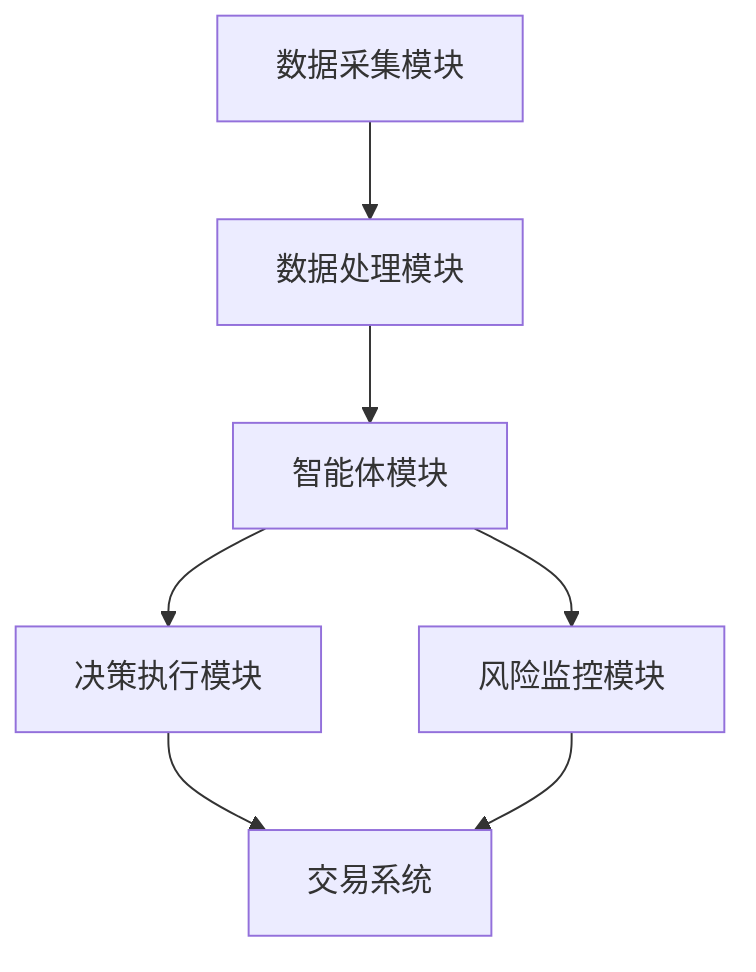

                 


# AI多智能体系统如何改进传统的价值投资风险分散策略

## 关键词：AI多智能体系统，价值投资，风险分散，投资决策，强化学习，博弈论，金融创新

## 摘要：  
本文探讨了如何通过AI多智能体系统改进传统的价值投资风险分散策略。传统价值投资依赖于人工分析和经验判断，存在效率低、风险控制能力有限等问题。通过引入多智能体系统，可以实现对市场环境的实时感知、智能决策和动态优化，从而显著提升投资组合的风险分散能力。本文从多智能体系统的算法原理、系统架构设计、实际应用案例等多个角度，详细分析了AI多智能体系统如何优化传统价值投资策略。

---

## 第一部分: 传统价值投资与风险分散策略

### 第1章: 传统价值投资的定义与核心理念

#### 1.1 价值投资的基本概念
- **价值投资**是一种长期投资策略，强调以低于市场价值的价格买入优质资产。
- 核心理念是关注企业的基本面，寻找被市场低估的投资标的。
- 风险分散是通过投资多样化资产组合来降低风险。

#### 1.2 价值投资的核心理念
- **长期视角**：关注企业的内在价值，而非短期市场波动。
- **安全边际**：买入价格低于内在价值，以降低投资风险。
- **分散投资**：通过投资不同行业、不同资产类别来降低风险。

#### 1.3 风险分散策略
- **资产配置**：将资金分配到不同资产类别（股票、债券、现金等）中。
- **行业分散**：投资于不同行业的企业，避免单一行业风险。
- **地域分散**：投资于不同地区的资产，降低地域性风险。

---

### 第2章: 传统价值投资的局限性

#### 2.1 传统投资策略的不足
- **信息处理能力有限**：人工分析难以处理海量数据。
- **决策效率低下**：依赖经验判断，决策周期长。
- **风险控制不足**：传统分散策略难以应对复杂市场环境。

#### 2.2 风险分散策略的挑战
- **市场波动性**：传统分散策略在极端市场条件下效果有限。
- **资产相关性**：部分资产在市场下跌时呈现高度相关性，无法有效分散风险。
- **黑天鹅事件**：传统策略难以预测和应对低概率但高影响的事件。

#### 2.3 传统投资决策的局限性
- **主观判断**：依赖分析师的个人经验和判断，存在主观偏差。
- **信息滞后**：市场数据更新速度慢，难以捕捉实时机会。
- **缺乏动态调整**：投资组合调整频率低，难以适应快速变化的市场。

---

## 第二部分: 多智能体系统的核心概念与原理

### 第3章: 多智能体系统的定义与特点

#### 3.1 多智能体系统的基本概念
- **多智能体系统（Multi-Agent System, MAS）**：由多个具有自主决策能力的智能体组成的系统，能够通过协作完成复杂任务。
- **智能体（Agent）**：能够感知环境、自主决策并采取行动的实体。

#### 3.2 多智能体系统的核心特点
- **自主性**：每个智能体独立决策，无需中央控制。
- **反应性**：能够实时感知环境并做出反应。
- **协作性**：多个智能体协同工作，共同完成目标。
- **学习能力**：通过经验改进决策策略。

#### 3.3 多智能体系统与传统AI的区别
| 特性 | 多智能体系统 | 传统AI系统 |
|------|--------------|------------|
| 决策方式 | 分布式决策 | 中央决策 |
| 协作性 | 强 | 弱或无 |
| 应用场景 | 复杂任务协作 | 单一任务处理 |

---

### 第4章: 多智能体系统在金融中的应用

#### 4.1 多智能体系统的应用场景
- **高频交易**：通过智能体快速捕捉市场机会。
- **风险控制**：实时监控市场风险，动态调整投资组合。
- **资产配置**：智能体协作优化资产配置策略。

#### 4.2 多智能体系统在投资决策中的优势
- **高效信息处理**：多个智能体协同处理海量数据。
- **动态调整**：实时根据市场变化调整投资策略。
- **风险分散**：通过协作优化资产配置，降低整体风险。

#### 4.3 多智能体系统的风险控制能力
- **实时监控**：智能体实时感知市场风险。
- **动态对冲**：通过协作对冲不同资产的风险。
- **情景分析**：智能体模拟不同市场情景，提前制定应对策略。

---

## 第三部分: 多智能体系统与价值投资的结合

### 第5章: 多智能体系统与价值投资的结合背景

#### 5.1 价值投资的数字化需求
- 传统价值投资依赖人工分析，难以处理海量数据。
- 数字化转型成为提升投资效率的关键。

#### 5.2 多智能体系统在金融领域的应用前景
- **智能化决策**：通过智能体实现投资决策的智能化。
- **协作优化**：多智能体协作优化投资组合。
- **动态调整**：实时根据市场变化调整投资策略。

#### 5.3 价值投资与多智能体系统的契合点
- **数据处理能力**：多智能体系统能够高效处理大量数据。
- **决策效率**：通过协作提高投资决策的效率。
- **风险控制**：智能体实时监控市场风险，优化资产配置。

---

### 第6章: 多智能体系统在价值投资中的具体应用

#### 6.1 多智能体系统在资产配置中的作用
- **资产选择**：智能体通过分析企业基本面，筛选优质资产。
- **配置优化**：通过协作优化资产配置比例，降低风险。

#### 6.2 多智能体系统在风险分散中的应用
- **实时监控**：智能体实时监控市场风险，动态调整投资组合。
- **情景分析**：模拟不同市场情景，制定应对策略。

#### 6.3 多智能体系统在投资决策中的优势
- **高效决策**：通过协作提高决策效率。
- **动态调整**：实时根据市场变化优化投资策略。
- **风险控制**：通过协作降低整体投资风险。

---

### 第7章: 多智能体系统对传统价值投资的改进

#### 7.1 提高投资决策的效率
- **自动化分析**：智能体快速分析市场数据，提高决策效率。
- **协作优化**：多个智能体协作，共同制定最优投资策略。

#### 7.2 增强风险分散的能力
- **实时监控**：智能体实时监控市场风险，动态调整投资组合。
- **情景分析**：通过模拟不同市场情景，制定应对策略。

#### 7.3 优化投资组合的管理
- **动态调整**：智能体根据市场变化实时调整投资组合。
- **风险对冲**：通过协作实现风险对冲，降低整体投资风险。

---

## 第四部分: 多智能体系统的算法原理与实现

### 第8章: 多智能体系统的算法基础

#### 8.1 强化学习的基本原理
- **强化学习**：通过智能体与环境的交互，学习最优策略。
- **奖励机制**：智能体根据行动获得奖励或惩罚，优化决策策略。
- **状态空间**：智能体感知环境状态，做出决策。

#### 8.2 多智能体系统中的博弈论模型
- **博弈论模型**：多个智能体在博弈环境中协作或竞争，实现目标。
- **纳什均衡**：所有智能体都采取最优策略，无法通过单方面改变策略而受益。

#### 8.3 多智能体系统的协调与合作机制
- **协调机制**：智能体之间通过通信协议协作。
- **合作机制**：通过共享信息优化整体决策。

---

### 第9章: 多智能体系统的数学模型

#### 9.1 多智能体系统的状态表示
- **状态空间**：$S = \{s_1, s_2, ..., s_n\}$，表示市场环境的状态。
- **动作空间**：$A = \{a_1, a_2, ..., a_m\}$，表示智能体的可执行动作。

#### 9.2 多智能体系统的奖励函数
$$ R(s, a) = \sum_{i=1}^{n} r_i(s_i, a_i) $$
其中，$r_i$ 是第 $i$ 个智能体的奖励函数。

#### 9.3 多智能体系统的优化目标
$$ \max_{\theta} \sum_{i=1}^{n} R_i(s, a) $$
其中，$\theta$ 是智能体的参数，$R_i$ 是第 $i$ 个智能体的奖励函数。

---

## 第五部分: 系统分析与架构设计方案

### 第10章: 多智能体系统的系统架构设计

#### 10.1 系统功能设计
- **数据采集模块**：采集市场数据（股价、成交量等）。
- **智能体模块**：多个智能体协作进行投资决策。
- **决策执行模块**：根据智能体的决策执行交易指令。
- **风险监控模块**：实时监控投资组合的风险。

#### 10.2 系统架构图


---

## 第六部分: 项目实战

### 第11章: 多智能体投资系统的实现

#### 11.1 环境配置
- **Python环境**：安装Python 3.8及以上版本。
- **库依赖**：安装 `numpy`, `pandas`, `matplotlib`, `tensorflow`.

#### 11.2 核心代码实现

```python
import numpy as np
import tensorflow as tf

class MultiAgentSystem:
    def __init__(self, num_agents):
        self.num_agents = num_agents
        self.agents = [Agent() for _ in range(num_agents)]
    
    def run(self, environment):
        while True:
            states = environment.get_states()
            actions = []
            for i in range(self.num_agents):
                actions.append(self.agents[i].act(states[i]))
            environment.execute_actions(actions)

class Agent:
    def __init__(self):
        self.model = self.build_model()
    
    def build_model(self):
        model = tf.keras.Sequential([
            tf.keras.layers.Dense(64, activation='relu'),
            tf.keras.layers.Dense(1, activation='linear')
        ])
        return model
    
    def act(self, state):
        state = np.array([state])
        prediction = self.model.predict(state)
        return prediction[0][0]

# 示例环境类
class Environment:
    def __init__(self):
        self.states = np.random.randn(100, 10)
    
    def get_states(self):
        return self.states
    
    def execute_actions(self, actions):
        pass

# 创建多智能体系统
mas = MultiAgentSystem(5)
environment = Environment()
mas.run(environment)
```

#### 11.3 案例分析
- **案例背景**：假设我们有一个包含10只股票的组合，使用5个智能体进行投资决策。
- **智能体角色**：每个智能体负责分析2只股票，制定买卖决策。
- **运行结果**：智能体通过协作优化投资组合，降低整体风险。

---

## 第七部分: 总结与展望

### 第12章: 总结与展望

#### 12.1 总结
- AI多智能体系统通过协作优化投资决策，显著提升了传统价值投资的风险分散能力。
- 多智能体系统在金融领域的应用前景广阔，能够帮助投资者应对复杂市场环境。

#### 12.2 未来展望
- **算法优化**：进一步改进强化学习算法，提升智能体的协作能力。
- **应用场景扩展**：将多智能体系统应用于更多金融领域，如外汇交易、量化投资等。
- **风险管理**：通过多智能体系统实现更复杂的市场风险对冲策略。

---

## 结语

通过引入AI多智能体系统，传统价值投资的风险分散策略得到了显著改进。多智能体系统的高效协作和智能决策能力，为投资者提供了更强大、更灵活的投资工具。未来，随着AI技术的不断发展，多智能体系统将在金融领域发挥更大的作用，帮助投资者应对复杂多变的市场环境。

