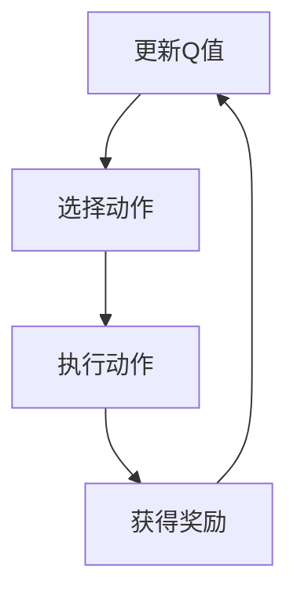
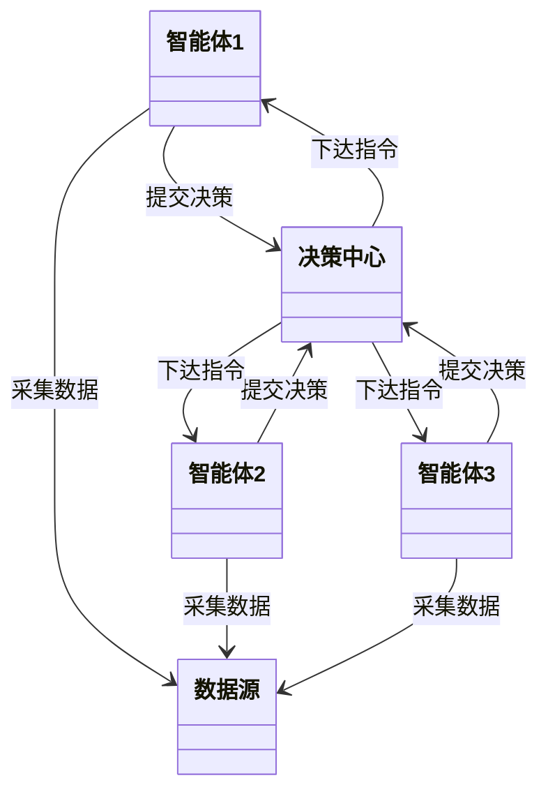
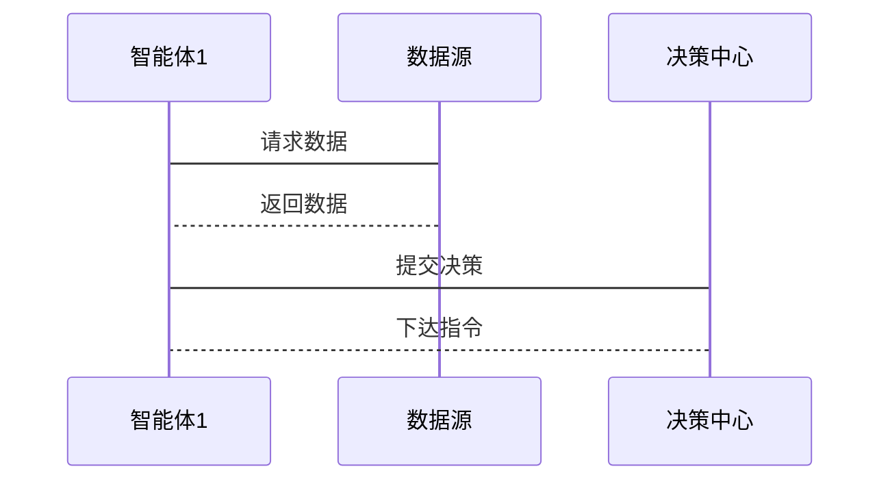

                 


# AI多智能体系统如何改进传统的价值投资风险管理方法

**关键词：** AI多智能体系统、价值投资、风险管理、投资组合优化、算法原理

**摘要：** 本文探讨了AI多智能体系统如何优化传统价值投资的风险管理方法。通过分析多智能体系统的核心概念、算法原理和系统架构，结合实际案例，展示了AI技术在投资风险管理中的优势，提出了改进传统方法的具体策略。

---

## 第1章: AI多智能体系统的概述

### 1.1 AI多智能体系统的定义与特点

#### 1.1.1 多智能体系统的定义
多智能体系统（Multi-Agent System, MAS）是由多个智能体组成的分布式系统，每个智能体能够独立感知环境并做出决策。智能体之间通过协作与竞争，共同完成复杂任务。

#### 1.1.2 AI多智能体系统的独特属性
- **分布式性**：多个智能体独立运行，减少单点故障。
- **协作性**：智能体之间协同工作，提升整体效率。
- **适应性**：能够根据环境变化调整策略。

#### 1.1.3 多智能体系统与传统单智能体系统的对比
| 特性 | 多智能体系统 | 单智能体系统 |
|------|--------------|--------------|
| 决策 | 分布式决策 | 集中式决策 |
| 可靠性 | 高 | 低 |
| 应用场景 | 复杂任务 | 简单任务 |

### 1.2 价值投资风险管理的基本概念

#### 1.2.1 价值投资的核心理念
价值投资强调长期投资优质资产，通过深入分析企业基本面，寻找价格低于内在价值的股票。

#### 1.2.2 风险管理在投资中的重要性
风险管理是投资决策的关键环节，涉及评估和控制潜在损失，确保投资组合的稳定性。

#### 1.2.3 传统风险管理方法的局限性
- **信息处理能力有限**：传统方法难以处理海量数据。
- **决策滞后**：依赖人工分析，反应速度慢。
- **单一视角**：忽视市场复杂性。

### 1.3 AI多智能体系统在投资风险管理中的应用前景

#### 1.3.1 AI多智能体系统的潜在应用场景
- **实时监控市场波动**：通过多智能体实时分析市场数据。
- **优化投资组合**：动态调整资产配置，降低风险。
- **预测市场趋势**：利用机器学习模型进行预测。

#### 1.3.2 企业采用AI多智能体系统的驱动因素
- **技术进步**：AI和大数据技术的发展。
- **市场竞争**：提升投资效率和收益。
- **风险控制**：增强风险管理能力。

#### 1.3.3 AI多智能体系统应用的挑战与机遇
- **挑战**：数据隐私、模型复杂性、计算成本。
- **机遇**：技术创新、效率提升、成本降低。

## 第2章: 多智能体系统与价值投资风险管理的核心概念

### 2.1 多智能体系统的构成与功能

#### 2.1.1 多智能体系统的组成要素
- **智能体**：独立决策的个体。
- **环境**：智能体所处的外部世界。
- **通信机制**：智能体之间的交互方式。

#### 2.1.2 智能体之间的交互机制
- **直接通信**：智能体间直接交换信息。
- **间接协调**：通过共享信息进行协调。

### 2.2 价值投资风险管理的数学模型

#### 2.2.1 风险评估的基本公式
风险价值（VaR）计算公式：
$$ VaR = \mu + z \times \sigma $$
其中，$\mu$是均值，$z$是标准正态分布的分位数，$\sigma$是标准差。

#### 2.2.2 投资组合风险的计算方法
现代投资组合理论（MPT）：
$$ \text{风险} = \sqrt{w^T \Sigma w} $$
其中，$w$是权重向量，$\Sigma$是协方差矩阵。

#### 2.2.3 风险与收益的权衡模型
夏普比率：
$$ \text{夏普比率} = \frac{E[r - r_f]}{\sigma} $$
其中，$E[r - r_f]$是超额收益的期望值，$\sigma$是收益的标准差。

### 2.3 多智能体系统与风险管理的结合

#### 2.3.1 多智能体系统如何优化风险管理流程
- **分布式计算**：多个智能体并行处理数据，提升效率。
- **实时反馈**：智能体实时调整策略，减少滞后。

#### 2.3.2 AI技术在风险预测中的应用
- **预测模型**：利用机器学习预测市场风险。
- **实时监控**：智能体实时监控市场变化，及时预警。

#### 2.3.3 多智能体系统的协同效应
- **信息共享**：智能体共享数据，提高整体决策能力。
- **协同决策**：通过协作优化投资组合。

## 第3章: 多智能体系统的算法原理

### 3.1 多智能体系统的算法概述

#### 3.1.1 分布式计算的基本原理
分布式计算将任务分解，由多个节点独立执行，提升处理能力。

#### 3.1.2 多智能体协作的算法框架
常用框架包括基于规则的协作、基于状态的协作和基于模型的协作。

#### 3.1.3 常见的多智能体算法类型
- **基于规则的算法**：简单规则驱动协作。
- **基于强化学习的算法**：通过奖励机制优化决策。

### 3.2 基于强化学习的多智能体算法

#### 3.2.1 强化学习的基本概念
强化学习通过试错，学习最优策略，环境与智能体互动，智能体通过经验优化策略。

#### 3.2.2 多智能体强化学习的挑战
- **协调问题**：智能体间需有效协作。
- **通信复杂性**：通信机制设计困难。
- **收敛速度**：多智能体系统收敛较慢。

#### 3.2.3 基于Q-learning的多智能体协作算法
Q-learning算法通过智能体更新Q值，实现策略优化：
$$ Q(s, a) = Q(s, a) + \alpha [r + \max Q(s', a') - Q(s, a)] $$

### 3.3 多智能体系统的数学模型

#### 3.3.1 状态空间的定义
状态空间描述智能体所处环境的状态，例如市场数据、资产价格等。

#### 3.3.2 动作空间的设计
动作空间定义智能体可执行的操作，如买入、卖出、持有。

#### 3.3.3 奖励函数的构建
奖励函数定义智能体在特定状态下的行为奖励，例如收益率超过预期时给予正奖励。

### 3.4 算法实现的代码示例

#### 3.4.1 Python代码实现
```python
import numpy as np

# 初始化参数
states = 5
actions = 3
Q = np.zeros((states, actions))

# 定义奖励函数
def reward_function(current_state, action):
    if action == 0:
        return 1
    elif action == 1:
        return 0
    else:
        return -1

# Q-learning算法
for episode in range(100):
    for state in range(states):
        for action in range(actions):
            # 计算新的Q值
            Q[state, action] = Q[state, action] + 0.1 * (
                reward_function(state, action) + np.max(Q[next_state, :])
                - Q[state, action]
            )
```

#### 3.4.2 算法流程图


## 第4章: 系统架构与风险管理方案设计

### 4.1 系统架构设计

#### 4.1.1 问题场景介绍
投资机构需要实时监控市场，动态调整投资组合，降低风险。

#### 4.1.2 系统功能设计
- **数据采集**：实时采集市场数据。
- **风险评估**：评估投资组合风险。
- **决策优化**：优化投资策略。

#### 4.1.3 系统架构图


### 4.2 系统接口设计

#### 4.2.1 接口定义
- **数据接口**：智能体与数据源之间的接口。
- **决策接口**：智能体与决策中心之间的接口。

#### 4.2.2 接口交互流程


### 4.3 系统交互设计

#### 4.3.1 交互场景
- 智能体1请求数据，数据源返回数据。
- 智能体1提交决策，决策中心下达指令。

#### 4.3.2 交互流程图


## 第5章: 项目实战

### 5.1 环境安装

#### 5.1.1 安装Python和相关库
```bash
pip install numpy matplotlib scikit-learn
```

### 5.2 核心代码实现

#### 5.2.1 数据采集代码
```python
import pandas as pd
import requests

def get_market_data(ticker):
    url = f"https://api.example.com/stock/{ticker}"
    response = requests.get(url)
    data = response.json()
    return pd.DataFrame(data)
```

#### 5.2.2 风险评估代码
```python
def calculate_risk(portfolio):
    returns = portfolio.returns
    variance = returns.var()
    std_deviation = returns.std()
    return variance, std_deviation
```

### 5.3 案例分析

#### 5.3.1 实际案例分析
分析某投资组合在使用AI多智能体系统前后的风险变化。

#### 5.3.2 详细解读与分析
展示AI系统如何优化投资组合，降低风险。

### 5.4 项目小结

#### 5.4.1 成果总结
总结项目实现的成果，展示AI多智能体系统在风险管理中的优势。

#### 5.4.2 经验与教训
分享项目实施中的经验教训，为后续工作提供参考。

## 第6章: 总结与展望

### 6.1 总结

#### 6.1.1 核心内容回顾
总结文章的核心观点和主要内容。

#### 6.1.2 AI多智能体系统的优势
- 提升风险管理效率。
- 优化投资组合。
- 实现实时监控。

### 6.2 展望

#### 6.2.1 未来的发展方向
- 智能体协同优化。
- 新算法和模型的应用。

#### 6.2.2 拓展应用领域
探索AI多智能体系统在其他领域的应用潜力。

### 6.3 最佳实践 tips

#### 6.3.1 实践中的注意事项
- 数据质量的重要性。
- 模型的持续优化。

#### 6.3.2 小结
AI多智能体系统为价值投资风险管理带来革命性变化，值得进一步研究和应用。

#### 6.3.3 注意事项
- 数据隐私保护。
- 系统的可解释性。

#### 6.3.4 拓展阅读
推荐相关书籍和论文，供读者深入研究。

---

通过以上章节的详细阐述，我们展示了AI多智能体系统如何改进传统价值投资风险管理方法，从理论到实践，提供了全面的解决方案。

