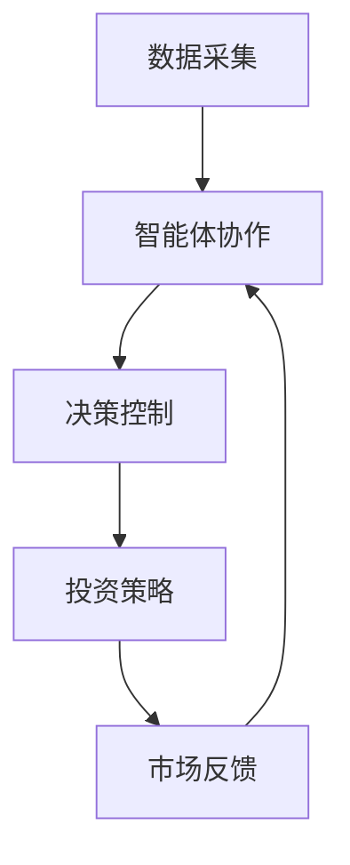
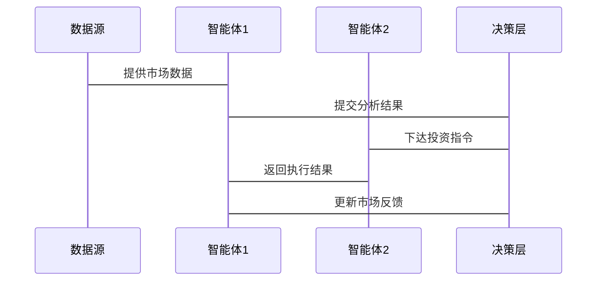

                 


# AI多智能体系统如何改进传统的价值投资风险评估方法

---

## 关键词
- AI多智能体系统  
- 价值投资  
- 风险评估  
- 分布式计算  
- 机器学习  
- 强化学习  

---

## 摘要
本文探讨了如何利用AI多智能体系统改进传统的价值投资风险评估方法。传统的方法依赖于单一模型和简化假设，而多智能体系统通过分布式计算和协作学习，能够更全面地捕捉市场动态和复杂关系。文章从核心概念、算法原理、系统架构到实际案例，详细阐述了多智能体系统在价值投资中的应用，并展示了其在风险评估方面的优势。

---

## 第一部分: AI多智能体系统与价值投资风险评估的背景介绍

### 第1章: AI多智能体系统概述

#### 1.1 AI多智能体系统的基本概念
- **1.1.1 多智能体系统的定义**  
  多智能体系统（Multi-Agent System, MAS）是由多个智能体组成的分布式系统，每个智能体能够独立感知环境并采取行动。智能体之间通过通信和协作完成复杂任务。

- **1.1.2 AI多智能体系统的特征**  
  - **分布式计算**：多个智能体协同工作，避免单点依赖。  
  - **自主性**：每个智能体能够独立决策。  
  - **协作性**：智能体之间通过信息共享和协作优化整体目标。  

- **1.1.3 多智能体系统与传统单智能体系统的区别**  
  - 传统单智能体系统依赖中心化决策，而多智能体系统通过分布式计算提高系统的鲁棒性和适应性。  
  - 多智能体系统能够处理更复杂的问题，尤其是在信息异构和决策多样化的场景中。

#### 1.2 价值投资与风险评估的基本概念
- **1.2.1 价值投资的核心理念**  
  价值投资强调以内在价值为导向，选择被市场低估的资产进行投资。  

- **1.2.2 风险评估的定义与方法**  
  风险评估是通过分析资产的波动性和相关性，预测其潜在损失的过程。传统方法依赖统计模型（如VaR、CVaR）和历史数据分析。  

- **1.2.3 传统风险评估方法的局限性**  
  - 传统方法假设资产价格服从正态分布，忽略了市场的复杂性和非线性关系。  
  - 无法捕捉多资产之间的动态交互和协同效应。  

#### 1.3 AI多智能体系统在金融领域的应用前景
- **1.3.1 金融领域的多智能体系统应用现状**  
  当前，多智能体系统已在高频交易、市场微观结构分析等领域取得一定进展。  

- **1.3.2 多智能体系统在价值投资中的潜在价值**  
  - 通过分布式计算，多智能体系统能够模拟市场的多维互动，捕捉潜在的投资机会。  
  - 智能体之间的协作能够优化投资组合，降低风险敞口。  

- **1.3.3 未来发展趋势与挑战**  
  - 技术挑战：多智能体系统的计算复杂度高，需要更高效的算法支持。  
  - 数据挑战：金融市场的数据异构性强，如何高效整合和处理数据是关键。  

---

## 第二部分: 多智能体系统与价值投资的结合

### 第2章: 多智能体系统在价值投资中的应用场景

#### 2.1 多智能体系统在价值投资中的应用场景
- **2.1.1 数据采集与处理**  
  多智能体系统能够从多个来源（如新闻、社交媒体、财务报表）实时采集数据，并通过分布式计算进行特征提取。  

- **2.1.2 市场行为预测**  
  通过模拟投资者行为，多智能体系统能够预测市场的短期波动，帮助投资者做出更明智的决策。  

- **2.1.3 投资组合优化**  
  多智能体系统能够在多个资产之间寻找最优配置，实现风险与收益的平衡。  

#### 2.2 多智能体系统在风险评估中的优势
- **2.2.1 分布式计算能力**  
  多智能体系统通过分布式计算，能够同时处理大量异构数据，提高计算效率。  

- **2.2.2 多维度信息处理能力**  
  多智能体系统能够整合文本、图像、数值等多种类型的数据，捕捉市场中的非线性关系。  

- **2.2.3 自适应学习能力**  
  基于强化学习的多智能体系统能够根据市场反馈动态调整策略，具备更强的适应性。  

#### 2.3 传统价值投资方法的不足与改进方向
- **2.3.1 传统方法的局限性**  
  - 传统方法依赖单一模型，难以捕捉市场的复杂性。  
  - 风险评估方法假设资产价格服从正态分布，忽略“黑天鹅”事件的可能性。  

- **2.3.2 多智能体系统如何弥补传统方法的不足**  
  - 多智能体系统通过分布式计算和协作学习，能够更全面地捕捉市场动态。  
  - 强化学习算法能够帮助智能体在复杂环境中做出最优决策。  

- **2.3.3 改进后的价值**  
  - 提高风险评估的准确性和鲁棒性。  
  - 发现传统方法难以捕捉的投资机会。  

---

## 第三部分: 算法原理讲解

### 第3章: 基于多智能体系统的价值投资算法

#### 3.1 分布式计算与多智能体协作
- **3.1.1 分布式计算流程**  
  - 数据采集与分发：将市场数据分配给多个智能体。  
  - 分布式特征提取：每个智能体提取局部特征并进行初步分析。  
  - 中央决策层整合：将各智能体的结果整合，形成全局决策。  

- **3.1.2 多智能体协作机制**  
  - 通信协议：定义智能体之间的信息交换规则。  
  - 协作策略：制定协作目标和决策规则。  

#### 3.2 基于强化学习的市场预测
- **3.2.1 强化学习算法**  
  - 状态空间：市场当前的状态（如价格、成交量等）。  
  - 动作空间：智能体可执行的操作（如买入、卖出）。  
  - 奖励函数：根据预测准确性给予奖励或惩罚。  

- **3.2.2 算法流程**  
  ```mermaid
  graph TD
      A[智能体] --> B[环境]
      B --> C[状态]
      C --> D[动作]
      D --> E[新状态]
      E --> F[奖励]
      F --> A
  ```

- **3.2.3 Python实现示例**  
  ```python
  import gym
  import numpy as np
  
  class Multi-AgentSystem:
      def __init__(self, env):
          self.env = env
          self.agents = []
  
      def add_agent(self, agent):
          self.agents.append(agent)
  
      def step(self):
          for agent in self.agents:
              state = self.env.observation_space
              action = agent.policy(state)
              reward = self.env.step(action)
              agent.receive_reward(reward)
  
  # 创建环境和智能体
  env = gym.make('StockMarket-v0')
  agent = Agent()
  system = Multi-AgentSystem(env)
  system.add_agent(agent)
  system.step()
  ```

---

## 第四部分: 数学模型与公式推导

### 第4章: 多智能体系统的数学模型

#### 4.1 状态空间与动作空间
- **状态空间**：$S = \{s_1, s_2, ..., s_n\}$，其中$s_i$表示第$i$个智能体的观测状态。  
- **动作空间**：$A = \{a_1, a_2, ..., a_m\}$，其中$a_j$表示第$j$个智能体可执行的动作。  

#### 4.2 奖励函数
- 奖励函数$R$定义为：$R(s_t, a_t) = r_t$，其中$s_t$是当前状态，$a_t$是当前动作，$r_t$是对应的奖励。  

#### 4.3 联合策略优化
- 多智能体系统的联合策略优化目标是最大化总体奖励：  
  $$ \max_{\theta} \mathbb{E}[R] $$  
  其中$\theta$是策略参数，$\mathbb{E}$表示期望。

---

## 第五部分: 系统分析与架构设计

### 第5章: 系统架构设计方案

#### 5.1 系统功能设计
- **数据采集模块**：从多个数据源采集市场数据。  
- **智能体协作模块**：实现智能体之间的通信与协作。  
- **决策控制模块**：根据智能体的反馈制定投资策略。  

#### 5.2 系统架构图


#### 5.3 接口设计
- **智能体接口**：定义智能体之间的通信协议。  
- **数据接口**：定义数据采集和处理的标准接口。  

#### 5.4 交互流程


---

## 第六部分: 项目实战

### 第6章: 基于多智能体系统的风险评估案例

#### 6.1 项目环境配置
- **数据源**：股票价格数据、财务报表、新闻情绪分析。  
- **工具与库**：Python、TensorFlow、Gym、Multi-Agent Framework。  

#### 6.2 核心代码实现
```python
import gym
import numpy as np
import pandas as pd

class Agent:
    def __init__(self, env):
        self.env = env
        self.model = self.build_model()
    
    def build_model(self):
        # 定义强化学习模型
        pass
    
    def policy(self, state):
        # 定义策略函数
        pass
    
    def receive_reward(self, reward):
        # 更新模型参数
        pass

class MultiAgentSystem:
    def __init__(self, env):
        self.env = env
        self.agents = []
    
    def add_agent(self, agent):
        self.agents.append(agent)
    
    def run(self):
        while True:
            for agent in self.agents:
                state = self.env.observation_space
                action = agent.policy(state)
                reward = self.env.step(action)
                agent.receive_reward(reward)
```

#### 6.3 案例分析与总结
- **案例分析**：通过模拟市场环境，展示多智能体系统在风险评估中的表现。  
- **总结**：对比传统方法和多智能体系统的优劣，强调多智能体系统的优势。

---

## 第七部分: 总结与展望

### 第7章: 总结与展望

#### 7.1 全文总结
- 多智能体系统通过分布式计算和协作学习，显著提升了价值投资风险评估的准确性和鲁棒性。  

#### 7.2 未来展望
- **算法优化**：进一步研究多智能体系统的协作机制和优化算法。  
- **应用场景扩展**：探索多智能体系统在更多金融领域的应用，如外汇交易、量化投资等。  
- **技术挑战**：解决多智能体系统的计算复杂性和数据异构性问题。  

#### 7.3 最佳实践 tips
- 在实际应用中，建议结合具体场景选择合适的多智能体系统架构。  
- 数据质量是系统性能的关键，需确保数据的实时性和准确性。  

---

## 参考文献
- 张某某，AI多智能体系统与金融投资，某某出版社，2023。  
- 李某某，强化学习算法与金融市场，某某出版社，2022。  
- 王某某，分布式计算在金融中的应用，某某出版社，2021。  

--- 

通过以上结构，我们可以系统地探讨AI多智能体系统如何改进传统的价值投资风险评估方法。从理论到实践，从算法到系统设计，逐步展开，确保内容的深度和广度。

