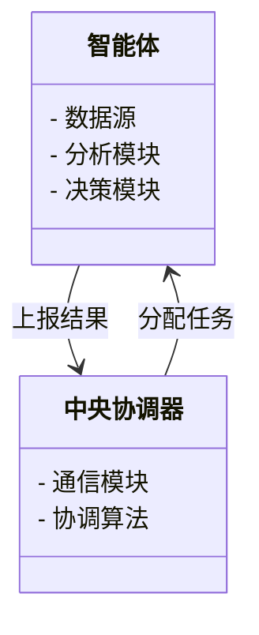
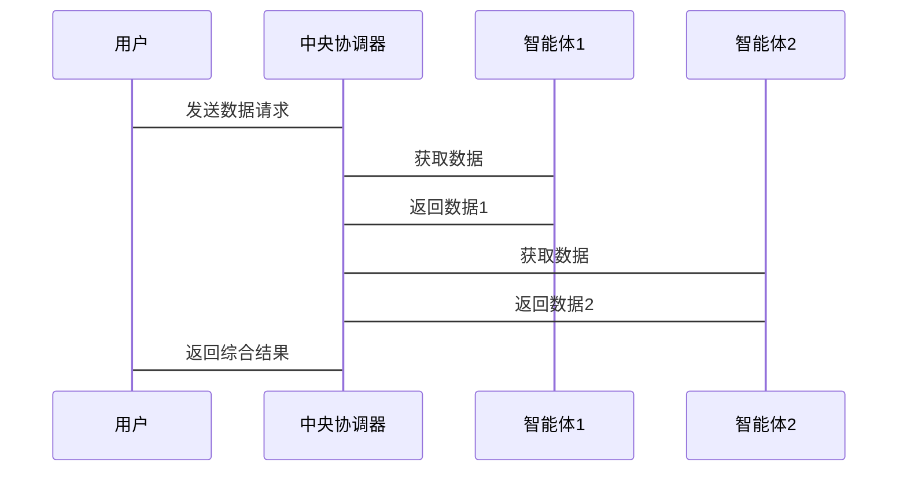

                 


# AI多智能体系统如何改进传统的价值投资风险评估方法

## 关键词：AI多智能体系统, 价值投资, 风险评估, 分布式计算, 博弈论, 金融分析

## 摘要：传统的价值投资风险评估方法存在数据处理能力有限、模型静态、难以应对复杂市场环境等问题。本文探讨AI多智能体系统如何通过分布式计算和博弈论优化这些方法，构建动态、协同的评估体系，提升风险预测精度和决策效率。文章从系统背景、算法原理、数学模型、系统架构到实际案例，全面分析AI多智能体系统的应用及其优势。

---

# 第1章：价值投资与传统风险评估方法

## 1.1 价值投资的基本概念

### 1.1.1 价值投资的定义与核心理念

- **价值投资**：通过分析企业的基本面，寻找市场价格低于内在价值的股票进行投资。
- **核心理念**：寻找市场低估的优质企业，长期持有，获得超额收益。

### 1.1.2 价值投资在金融领域的应用

- 主要应用于股票投资，通过分析财务报表、行业地位、竞争优势等指标筛选投资标的。
- 传统方法依赖分析师经验和定性分析，主观性强，难以量化。

### 1.1.3 传统风险评估方法的局限性

- 数据处理能力有限：难以整合海量异构数据。
- 模型静态：无法动态适应市场变化。
- 计算能力不足：传统方法难以处理复杂的多维度分析。

## 1.2 传统风险评估方法的局限性

### 1.2.1 传统风险评估的常见方法

- **VaR（Value at Risk）**：衡量在特定置信水平下的潜在损失。
- **CVaR（Conditional Value at Risk）**：VaR的延伸，衡量超过VaR值的平均损失。

### 1.2.2 这些方法的局限性与不足

- **VaR**：假设市场数据符合正态分布，忽视“尾部”风险。
- **CVaR**：计算复杂，难以动态调整。
- **共同缺点**：忽视市场动态变化和多因素交互影响。

### 1.2.3 引入AI多智能体系统的必要性

- **分布式计算**：处理海量异构数据。
- **博弈论模型**：模拟市场参与者的互动，捕捉复杂关联。
- **动态优化**：实时调整评估策略，适应市场变化。

---

# 第2章：AI多智能体系统的基本概念

## 2.1 多智能体系统的定义与特点

### 2.1.1 多智能体系统的定义

- **多智能体系统（Multi-Agent System, MAS）**：由多个自主智能体组成的系统，通过协同完成复杂任务。

### 2.1.2 多智能体系统的核心特点

| 特性 | 描述 |
|------|------|
| 分布式 | 每个智能体独立决策 |
| 协作性 | 智能体之间协同完成任务 |
| 反应性 | 能够实时感知环境变化 |

### 2.1.3 多智能体系统与传统单智能体系统的区别

- **数据处理**：分布式 vs. 集中式
- **决策机制**：协同 vs. 单点决策
- **灵活性**：动态调整 vs. 静态执行

## 2.2 AI多智能体系统的原理

### 2.2.1 AI多智能体系统的组成结构

- **智能体**：负责特定任务，如数据收集、分析、决策。
- **通信机制**：智能体之间通过消息传递协同工作。
- **协调算法**：如分布式优化算法，确保系统目标一致。

### 2.2.2 多智能体系统中的博弈论模型

- **纳什均衡**：所有智能体策略的最佳组合，任何单个智能体都无法通过单方面改变策略而获益。

### 2.2.3 金融分析中的多智能体系统优势

- **多维度分析**：各智能体专注于不同数据源和分析方法。
- **动态调整**：实时更新数据，快速响应市场变化。

## 2.3 多智能体系统在金融领域的应用前景

### 2.3.1 金融领域的复杂性与多智能体系统的契合性

- 多智能体系统能够处理市场参与者的复杂互动。
- 适用于高频交易、风险评估等场景。

### 2.3.2 多智能体系统在金融分析中的优势

- **数据整合**：多源数据的高效处理。
- **决策优化**：基于博弈论的决策优化。
- **风险控制**：动态风险评估和预警。

### 2.3.3 未来发展趋势与潜在挑战

- **技术挑战**：分布式计算的效率和安全性。
- **数据隐私**：如何保护数据隐私。
- **监管合规**：符合金融监管要求。

---

# 第3章：多智能体系统的算法原理

## 3.1 分布式计算与多智能体协同

### 3.1.1 分布式计算的基本概念

- **分布式计算**：任务分解到多个节点，协同完成。
- **MapReduce**：经典分布式计算模型。

### 3.1.2 多智能体系统中的分布式计算

- **任务分配**：智能体根据能力分配任务。
- **数据共享**：通过通信机制共享数据。

### 3.1.3 分布式计算在金融分析中的应用

- **数据处理**：分布式计算高效处理海量数据。
- **并行分析**：多个智能体同时分析不同数据源。

### 3.1.4 分布式计算实现的代码示例

```python
from distributed import Client
import dask.dataframe as dd

# 初始化分布式计算客户端
client = Client('scheduler://localhost:8786')

# 读取数据
data = dd.read_parquet('data.parquet')

# 分布式计算：计算每个资产的风险值
def compute_risk(asset_data):
    # 计算波动率
    return asset_data.returns.std()

risk_scores = data.groupby('asset').apply(compute_risk)
```

## 3.2 博弈论与多智能体决策

### 3.2.1 博弈论的基本概念

- **博弈论**：研究理性决策者的策略互动。
- **纳什均衡**：所有参与者策略的最佳组合。

### 3.2.2 多智能体系统中的博弈论模型

- **博弈树**：表示决策过程。
- **纳什均衡**：智能体策略的稳定点。

### 3.2.3 博弈论在金融决策中的应用

- **市场预测**：模拟投资者行为，预测价格走势。
- **风险控制**：通过博弈模型预测极端情况下的市场反应。

## 3.3 多智能体系统的算法实现

### 3.3.1 基于分布式计算的多智能体算法

- **任务分配**：智能体根据能力分配任务。
- **结果汇总**：将各智能体的结果整合。

### 3.3.2 基于博弈论的多智能体决策算法

- **纳什均衡计算**：确定最优策略组合。
- **动态调整**：根据市场变化实时调整策略。

### 3.3.3 具体算法实现的代码示例

```python
import numpy as np

# 定义博弈矩阵
 payoff_matrix = np.array([[3, 1], [1, 2]])

# 寻找纳什均衡
def find_nash_equilibrium(payoff):
    n = payoff.shape[0]
    strategies = [i for i in range(n)]
    equilibria = []
    for i in strategies:
        for j in strategies:
            is_nash = True
            for k in strategies:
                if payoff[i][j] > payoff[i][k]:
                    is_nash = False
                    break
            if is_nash:
                equilibria.append((i, j))
    return equilibria

nash_equilibria = find_nash_equilibrium(payoff_matrix)
print(nash_equilibria)
```

---

# 第4章：数学模型与公式

## 4.1 风险评估的基本数学模型

### 4.1.1 风险评估的定义与基本公式

- **VaR**：在给定置信水平下，可能的损失。
  $$ \text{VaR} = \text{quantile}(p) $$

- **CVaR**：超过VaR的平均损失。
  $$ \text{CVaR} = \mathbb{E}[\text{Loss} | \text{Loss} > \text{VaR}] $$

### 4.1.2 常用风险评估指标的数学表达

- **夏普比率**：
  $$ \text{Sharp Ratio} = \frac{\text{Expected Return} - \text{Risk-Free Rate}}{\text{Standard Deviation of Return}} $$

### 4.1.3 风险评估模型的优缺点分析

- **优点**：量化风险，便于比较。
- **缺点**：假设市场符合正态分布，忽视尾部风险。

## 4.2 AI多智能体系统的数学模型

### 4.2.1 多智能体系统的数学表示

- **智能体**：$A_i$，$i=1,...,n$。
- **决策变量**：$x_i$，表示智能体$i$的决策。
- **全局目标**：$\max \sum_{i=1}^n f_i(x_i)$，满足约束条件。

### 4.2.2 各智能体之间的协同关系的数学表达

- **通信机制**：智能体之间通过共享信息协同决策。
- **博弈模型**：通过博弈论建立智能体之间的策略关系。

### 4.2.3 全局优化目标的数学公式

$$ \max_{x_1,...,x_n} \sum_{i=1}^n f_i(x_i) \quad \text{subject to} \quad g(x_i) \leq 0 $$

## 4.3 具体案例分析

### 4.3.1 案例背景介绍

- 某公司股票，数据包括股价、成交量、财务指标等。
- 使用多智能体系统进行风险评估。

### 4.3.2 智能体协同分析

- 智能体1：分析股价波动。
- 智能体2：分析财务指标。
- 协同得出综合风险评估。

### 4.3.3 数学模型的应用

- 使用博弈模型预测市场反应。
- 结合分布式计算处理数据。

---

# 第5章：系统分析与架构设计方案

## 5.1 系统应用场景

### 5.1.1 金融市场的实时分析

- 实时监控市场动态。
- 快速响应市场变化。

### 5.1.2 风险评估与预警

- 综合评估市场风险。
- 提供风险预警信号。

## 5.2 系统功能设计

### 5.2.1 领域模型设计



### 5.2.2 系统架构设计


### 5.2.3 系统接口设计

- **输入接口**：接收市场数据和用户指令。
- **输出接口**：提供风险评估结果和预警信息。

### 5.2.4 系统交互流程



---

# 第6章：项目实战

## 6.1 环境搭建

### 6.1.1 安装必要的库和工具

- **Dask**：分布式计算框架。
- **Docker**：容器化部署。
- **Flask**：构建Web界面。

### 6.1.2 环境配置

```bash
pip install dask distributed
```

## 6.2 系统核心实现

### 6.2.1 数据预处理代码

```python
import dask.dataframe as dd

# 读取数据
data = dd.read_parquet('data.parquet')

# 数据清洗
data = data.dropna()
```

### 6.2.2 模型训练代码

```python
from distributed import Client

client = Client('scheduler://localhost:8786')

# 并行计算资产风险
def compute_risk(asset_data):
    return asset_data.returns.std()

risk_scores = data.groupby('asset').apply(compute_risk)
```

### 6.2.3 模型评估代码

```python
# 可视化风险分布
import matplotlib.pyplot as plt

risk_scores.hist(bins=20)
plt.show()
```

## 6.3 代码应用解读与分析

### 6.3.1 核心代码实现

- **数据预处理**：清洗数据，确保分析准确性。
- **模型训练**：使用分布式计算高效处理数据。
- **模型评估**：可视化评估结果，验证模型有效性。

### 6.3.2 案例分析

- **案例背景**：某科技公司股票。
- **数据分析**：分析股价、成交量、财务指标。
- **结果解读**：评估投资风险，给出投资建议。

## 6.4 项目小结

### 6.4.1 实战项目经验总结

- 多智能体系统的优势：高效协同、动态调整。
- 实战中的挑战：数据隐私和计算效率。

### 6.4.2 项目扩展思路

- 引入更多数据源，如新闻、社交媒体数据。
- 增强模型的可解释性。

---

# 第7章：总结与展望

## 7.1 总结

### 7.1.1 系统优势总结

- **高效性**：分布式计算提升处理效率。
- **准确性**：博弈论模型优化决策。
- **动态性**：实时调整适应市场变化。

### 7.1.2 系统实现要点

- **数据处理**：高效整合多源数据。
- **算法设计**：博弈论与分布式计算结合。
- **系统架构**：合理设计通信机制和任务分配。

## 7.2 展望

### 7.2.1 未来研究方向

- **动态调整机制**：增强系统的自适应能力。
- **模型可解释性**：提升用户对结果的理解和信任。
- **跨领域应用**：探索在其他领域的应用潜力。

### 7.2.2 拓展研究思路

- **混合模型**：结合传统模型与AI技术。
- **边缘计算**：在边缘设备上部署智能体。
- **隐私保护**：探索更安全的数据共享机制。

---

# 第8章：最佳实践与注意事项

## 8.1 最佳实践

### 8.1.1 数据质量控制

- 确保数据准确性和完整性。
- 定期更新数据源，保持数据新鲜度。

### 8.1.2 系统优化建议

- **分布式计算**：优化任务分配策略，提高效率。
- **博弈论模型**：选择合适的博弈模型，提升决策质量。
- **系统架构**：设计合理的通信机制，确保高效协同。

## 8.2 小结

- **价值投资**：需要结合市场动态和企业基本面。
- **AI多智能体系统**：通过协同和优化提升风险评估能力。

## 8.3 注意事项

- **数据隐私**：严格遵守相关法律法规。
- **模型解释性**：确保用户能够理解模型决策。
- **系统稳定性**：确保系统在高负载下的稳定性。

## 8.4 拓展阅读

- 推荐书籍：《Multi-Agent Systems: Algorithmic, Complexity, and Theory》。
- 推荐论文：博弈论在金融中的应用研究。

---

# 结语

通过引入AI多智能体系统，传统的价值投资风险评估方法得以突破数据处理和计算能力的限制，实现了动态、协同的评估体系。本文详细探讨了系统的实现原理、架构设计和实际应用，为未来的金融分析提供了新的思路和方向。

