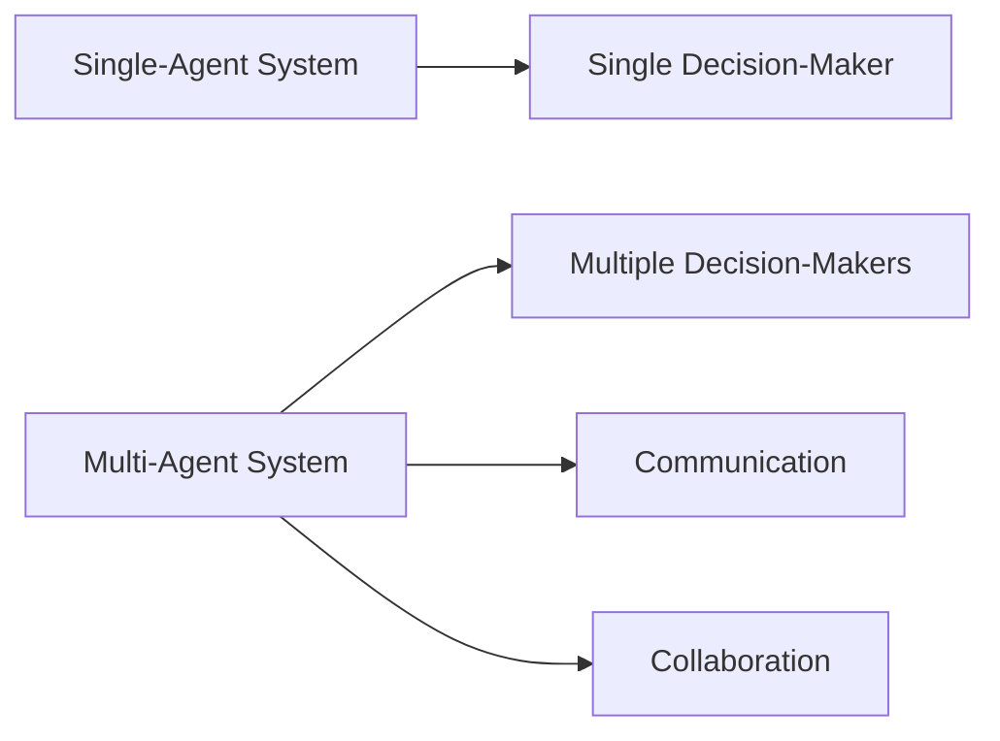
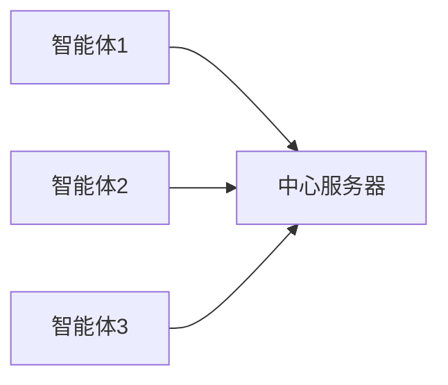

                 

---

# AI多智能体系统如何识别被低估的价值股

## 关键词：AI多智能体系统，价值股识别，金融数据分析，机器学习算法，投资组合优化

## 摘要

AI多智能体系统通过分布式协作和智能体之间的信息共享，能够更高效地识别被低估的价值股。本文从多智能体系统的概念、价值股识别的核心算法、系统架构设计以及项目实战四个方面进行详细分析，结合理论与实践，深入探讨AI多智能体系统在金融投资中的应用。

---

# 第一部分: AI多智能体系统与价值股识别概述

## 第1章: AI多智能体系统的概念与背景

### 1.1 多智能体系统的基本概念

#### 1.1.1 多智能体系统的定义

多智能体系统（Multi-Agent System, MAS）是由多个智能体（Agent）组成的分布式系统，每个智能体都是一个能够感知环境、做出决策并采取行动的独立实体。智能体之间通过通信和协作完成复杂任务。

#### 1.1.2 多智能体系统的特征

| 特征 | 描述 |
|------|------|
| 分布式 | 智能体独立运行，无中央控制节点 |
| 协作性 | 智能体之间通过协作完成共同目标 |
| 反应性 | 智能体能够实时感知环境变化并做出反应 |
| 社会性 | 智能体之间存在社会互动和信息共享 |

#### 1.1.3 多智能体系统与单智能体系统的区别

### 1.2 价值股识别的基本概念

#### 1.2.1 价值股的定义

价值股是指市场价格低于其内在价值的股票，通常表现为低市盈率、低市净率等财务指标。

#### 1.2.2 价值股识别的挑战

- 数据复杂性：金融数据具有高噪声、非线性特征
- 市场不确定性：股票价格受多种不可预测因素影响
- 计算复杂度：需要处理海量数据和复杂算法

#### 1.2.3 价值股识别的常见方法

1. **基本面分析**：通过财务指标（如市盈率、市净率）评估股票价值
2. **技术分析**：通过价格走势、成交量等技术指标预测股票价格
3. **机器学习**：使用算法分析历史数据，预测未来价格走势

### 1.3 AI多智能体系统在金融领域的应用

#### 1.3.1 多智能体系统在金融中的优势

- 分布式计算能力：多智能体系统能够并行处理大量数据
- 协作能力：智能体之间可以共享信息，提高整体决策能力
- 灵活性：能够快速适应市场变化

#### 1.3.2 价值股识别的现状与痛点

- 传统方法：依赖人工经验，效率低且主观性强
- 数据量大：难以处理海量金融数据
- 市场波动：难以预测突发事件对股价的影响

#### 1.3.3 多智能体系统如何解决这些问题

- 通过分布式计算提高数据处理效率
- 通过智能体协作提升决策准确性
- 通过实时数据共享增强市场反应能力

### 1.4 本章小结

本章介绍了多智能体系统的概念和特征，分析了价值股识别的基本概念和挑战，并探讨了多智能体系统在金融领域的应用优势。

---

## 第2章: 多智能体系统的架构与通信

### 2.1 多智能体系统的架构设计

#### 2.1.1 分层架构

#### 2.1.2 分布式架构

#### 2.1.3 协作式架构

### 2.2 多智能体系统的通信机制

#### 2.2.1 通信协议

- HTTP/HTTPS
- MQTT
- WebSocket

#### 2.2.2 信息传递

#### 2.2.3 协调机制

- 基于规则的协调
- 基于市场的协调
- 基于优先级的协调

### 2.3 多智能体系统的协作与决策

#### 2.3.1 协作算法

- 加入-留-修改（Join-Leave-Modify）
- 迭代协商（Iterative Negotiation）
- 分层协商（Hierarchical Negotiation）

#### 2.3.2 分布式决策

- 分布式计算
- 委托-代理机制
- 协作决策

#### 2.3.3 竞争与合作的平衡

- 竞争机制
- 合作机制
- 平衡策略

### 2.4 本章小结

本章详细分析了多智能体系统的架构设计和通信机制，探讨了协作与决策的核心原理。

---

## 第3章: 价值股识别的核心算法

### 3.1 传统价值股识别方法

#### 3.1.1 基于财务指标的分析

- 市盈率（P/E）
- 市净率（P/B）
- 股息率（Dividend Yield）

#### 3.1.2 基于市场趋势的分析

- 趋势线
- 均线
- 技术指标（如RSI、MACD）

#### 3.1.3 基于技术指标的分析

- 移动平均收敛散度（MACD）
- 相对强弱指数（RSI）
- 布林带（Bollinger Bands）

### 3.2 基于AI的多智能体识别算法

#### 3.2.1 强化学习算法

#### 3.2.2 协作滤波算法

#### 3.2.3 聚类分析算法

### 3.3 算法的优缺点对比

| 算法类型 | 优点 | 缺点 |
|--------|------|------|
| 传统方法 | 简单易懂 | 无法处理复杂数据 |
| 基于AI的方法 | 高准确性 | 计算复杂度高 |
| 多智能体算法 | 分布式协作 | 需要高计算能力 |

### 3.4 本章小结

本章对比了传统方法和基于AI的算法，重点介绍了多智能体系统的协作滤波算法。

---

## 第4章: 价值股识别系统的架构设计

### 4.1 系统功能需求分析

#### 4.1.1 数据采集模块

- 数据来源：股票市场数据、财务数据、新闻数据
- 数据类型：时间序列数据、结构化数据、文本数据

#### 4.1.2 数据处理模块

- 数据清洗：去除噪声数据
- 数据转换：标准化、归一化
- 数据存储：数据库存储

#### 4.1.3 智能体协作模块

- 智能体分配：任务分配给多个智能体
- 信息共享：智能体之间共享数据和结果
- 协作决策：基于共享信息做出最终决策

#### 4.1.4 结果输出模块

- 可视化展示：图表展示结果
- 报告生成：生成分析报告
- 预警系统：实时预警

### 4.2 系统架构设计

#### 4.2.1 分层架构设计

#### 4.2.2 模块化设计

#### 4.2.3 高可用性设计

- 负载均衡
- 容错设计
- 灾备系统

### 4.3 系统接口设计

#### 4.3.1 数据接口

- REST API：用于数据采集和传输
- WebSocket：用于实时数据传输

#### 4.3.2 用户接口

- �界

