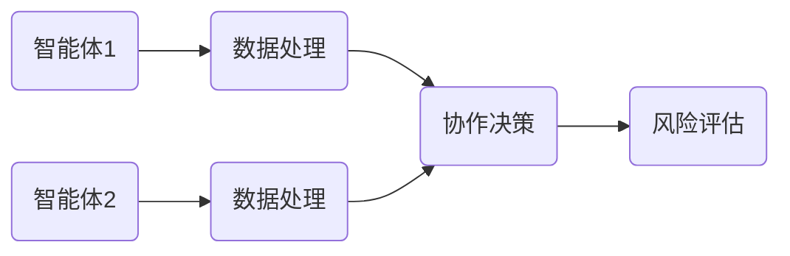
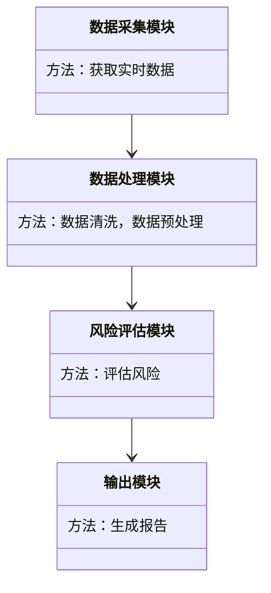
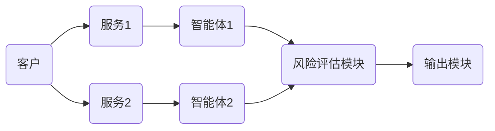
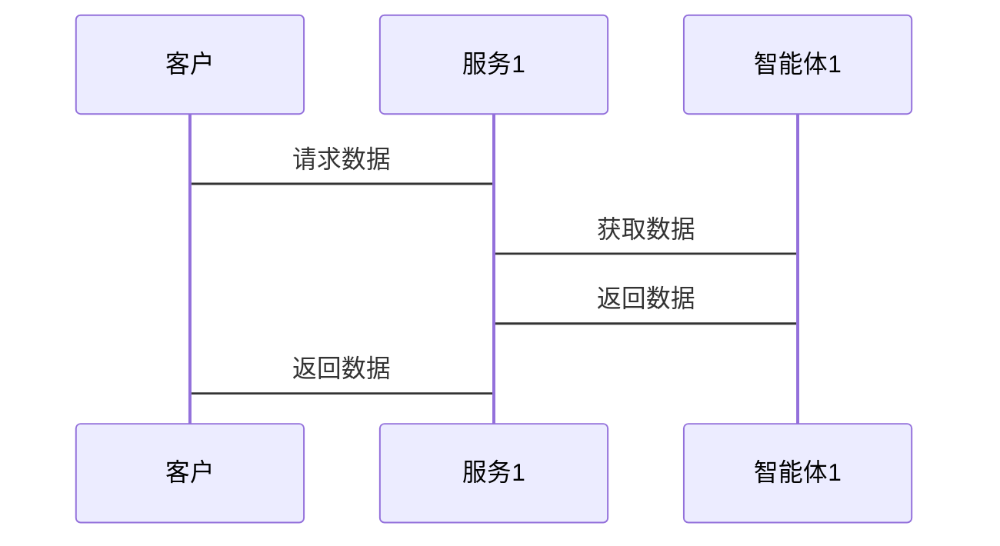

                 


# AI多智能体系统对投资风险的动态评估

## 关键词：AI多智能体系统，投资风险评估，动态评估，风险预测，系统架构设计

## 摘要：本文详细探讨了AI多智能体系统在投资风险动态评估中的应用，从系统背景、核心概念、算法原理、系统架构到项目实战，逐步分析和推理，为投资风险评估提供了新的思路和解决方案。

---

## 第1章 AI多智能体系统与投资风险评估的背景介绍

### 1.1 问题背景

#### 1.1.1 投资风险评估的传统方法与局限性
传统的投资风险评估方法依赖于历史数据分析和统计模型，例如CAPM和VaR模型。然而，这些方法存在以下局限性：
- 数据维度有限，难以捕捉市场波动的全貌。
- 无法实时更新，难以应对市场的快速变化。
- 无法处理多智能体之间的协同关系，难以模拟市场的复杂性。

#### 1.1.2 多智能体系统的核心概念与优势
多智能体系统（Multi-Agent System, MAS）由多个智能体组成，每个智能体能够独立决策并协同工作。其优势包括：
- 分布式计算能力，能够处理大规模数据。
- � 强大的协作能力，能够模拟市场参与者的互动。
- 高度的灵活性，能够适应市场的动态变化。

#### 1.1.3 AI技术在投资领域的应用现状
人工智能技术在投资领域的应用日益广泛，包括：
- 自动化交易系统：利用AI算法进行高频交易。
- 风险预测模型：通过机器学习预测市场波动。
- 数据挖掘：从海量数据中提取有价值的信息。

### 1.2 问题描述

#### 1.2.1 投资风险的动态变化特性
投资风险不是静态的，而是随着时间推移而变化。市场环境、政策变化和经济波动都会影响风险的大小。

#### 1.2.2 多智能体系统在风险评估中的应用场景
多智能体系统可以模拟市场参与者的行为，从而预测市场的动态变化。例如：
- 模拟投资者的买卖行为，预测市场趋势。
- 分析机构投资者的策略，评估其对市场的冲击。
- 识别市场中的潜在风险点，提前制定应对策略。

#### 1.2.3 当前投资风险评估的主要挑战
当前投资风险评估的主要挑战包括：
- 数据的实时性和准确性。
- 模型的复杂性和计算成本。
- 系统的可解释性和透明度。

### 1.3 问题解决思路

#### 1.3.1 多智能体系统的协作机制
多智能体系统通过协同工作，可以实现对市场的全面监控和分析。协作机制包括：
- 任务分配：智能体根据自身能力分配任务。
- 通信与协调：智能体之间通过通信模块共享信息。
- 协作决策：基于共享信息做出集体决策。

#### 1.3.2 AI技术在风险评估中的具体应用
AI技术在投资风险评估中的具体应用包括：
- 使用深度学习模型预测市场趋势。
- 利用自然语言处理技术分析新闻和社交媒体数据。
- 应用强化学习优化投资组合。

#### 1.3.3 系统架构的设计原则
系统架构设计需要遵循以下原则：
- 可扩展性：支持智能体数量和功能的扩展。
- 高可用性：确保系统在故障情况下的可用性。
- 实时性：支持快速数据处理和实时反馈。

### 1.4 系统的边界与外延

#### 1.4.1 系统功能的边界定义
系统功能的边界包括：
- 数据收集：从金融市场获取实时数据。
- 数据处理：对数据进行清洗和预处理。
- 风险评估：基于多智能体系统进行风险预测。
- 输出结果：生成风险评估报告。

#### 1.4.2 系统与外部环境的交互关系
系统与外部环境的交互关系包括：
- 从金融市场获取数据。
- 与投资者进行交互，获取投资策略。
- 输出风险评估结果，指导投资决策。

#### 1.4.3 系统的可扩展性和灵活性
系统的可扩展性体现在：
- 支持新增智能体模块。
- 支持多种数据源的接入。
- 支持不同的风险评估模型。

---

## 第2章 AI多智能体系统的核心概念与联系

### 2.1 多智能体系统的定义与特点

#### 2.1.1 多智能体系统的定义
多智能体系统是由多个智能体组成的系统，每个智能体能够独立决策并协同工作。

#### 2.1.2 多智能体系统的属性特征对比表格
以下表格对比了多智能体系统与单智能体系统的属性特征：

| 特性           | 单智能体系统    | 多智能体系统    |
|----------------|----------------|----------------|
| 系统结构       | 单一中心       | 分布式         |
| 智能体数量     | 1              | 多             |
| 任务分配       | 集中分配       | 分布分配       |
| 通信方式       | 无或有限       | 高度          |

#### 2.1.3 多智能体系统的ER实体关系图（Mermaid）

```mermaid
erd
    title 多智能体系统ER图
    机构投资者(机构投资者ID, 名称, 类型)
    个人投资者(个人投资者ID, 姓名, 资金)
    交易数据(交易ID, 时间, 价格, 数量)
    风险评估(风险ID, 风险值, 时间)
    机构投资者 --> 交易数据: 进行交易
    个人投资者 --> 交易数据: 进行交易
    交易数据 --> 风险评估: 生成风险评估
```

### 2.2 多智能体系统与投资风险评估的关系

#### 2.2.1 多智能体系统在投资决策中的作用
多智能体系统可以模拟市场参与者的决策过程，从而预测市场的动态变化。

#### 2.2.2 风险评估中的多智能体协作机制
多智能体协作机制包括：
- 信息共享：智能体之间共享市场数据。
- 任务分配：根据市场情况分配任务。
- 协作决策：基于共享信息做出集体决策。

#### 2.2.3 系统与数据流的关系
系统的数据流关系如下：


### 2.3 系统核心模块的协作机制

#### 2.3.1 智能体之间的通信与协作
智能体之间的通信与协作可以通过以下步骤实现：
1. 智能体1收集市场数据。
2. 智能体2分析市场趋势。
3. 智能体1和智能体2共享信息。
4. 根据共享信息做出决策。

#### 2.3.2 多智能体系统的任务分配与协调
任务分配与协调机制包括：
- 任务分配：根据智能体的能力分配任务。
- 协调机制：通过通信模块协调智能体的行动。

#### 2.3.3 系统的动态调整与优化
系统的动态调整与优化包括：
- 根据市场变化调整任务分配。
- 根据智能体的性能优化协作机制。

### 2.4 系统的数学模型与公式

#### 2.4.1 多智能体系统的数学模型
多智能体系统的数学模型可以表示为：
$$
\text{系统输出} = f(\text{输入数据}, \text{协作策略})
$$

#### 2.4.2 风险评估的核心公式
风险评估的核心公式可以表示为：
$$
\text{风险值} = \sum_{i=1}^{n} w_i \cdot x_i
$$
其中，$w_i$是权重，$x_i$是风险因素。

#### 2.4.3 系统协作的数学表达
系统协作的数学表达可以表示为：
$$
\text{协作效果} = \sum_{j=1}^{m} a_j \cdot c_j
$$
其中，$a_j$是协作能力，$c_j$是协作贡献。

---

## 第3章 多智能体系统的核心算法原理

### 3.1 多智能体协作算法

#### 3.1.1 算法原理与流程（Mermaid流程图）



#### 3.1.2 算法的Python实现代码
以下是协作算法的Python实现代码：

```python
class Agent:
    def __init__(self, id):
        self.id = id
        self.data = None

    def process_data(self):
        # 数据处理逻辑
        pass

    def collaborate(self, other_agent):
        # 协作逻辑
        pass

# 初始化智能体
agent1 = Agent(1)
agent2 = Agent(2)

# 数据处理
agent1.process_data()
agent2.process_data()

# 协作决策
agent1.collaborate(agent2)

# 生成风险评估
risk_assessment = agent1.get_risk_assessment()
```

#### 3.1.3 算法的数学模型与公式
协作算法的数学模型可以表示为：
$$
\text{协作效果} = \sum_{i=1}^{n} w_i \cdot a_i
$$
其中，$w_i$是权重，$a_i$是智能体的贡献。

### 3.2 风险评估模型

#### 3.2.1 模型的构建与训练
风险评估模型的构建与训练包括：
1. 数据收集与预处理。
2. 模型训练。
3. 模型优化。

#### 3.2.2 模型的评估与优化
模型的评估与优化包括：
- 使用交叉验证评估模型性能。
- 根据评估结果优化模型参数。

#### 3.2.3 模型的实时更新机制
模型的实时更新机制包括：
- 定期重新训练模型。
- 根据市场变化动态调整模型参数。

### 3.3 算法的详细讲解与举例

#### 3.3.1 算法原理的通俗解释
多智能体协作算法通过智能体之间的协作，实现对市场的全面监控和分析。每个智能体负责处理一部分数据，然后通过协作生成最终的风险评估结果。

#### 3.3.2 典型案例的详细分析
例如，智能体1负责收集市场数据，智能体2负责分析市场趋势，两者协作生成最终的风险评估结果。

#### 3.3.3 算法优化的技巧与经验
算法优化的技巧包括：
- 使用分布式计算提高效率。
- 通过并行处理加快数据处理速度。
- 根据具体场景优化协作机制。

---

## 第4章 系统分析与架构设计方案

### 4.1 项目背景与目标

#### 4.1.1 项目背景介绍
本项目旨在利用AI多智能体系统，实现对投资风险的动态评估。

#### 4.1.2 项目目标与范围
项目目标包括：
- 实现多智能体系统的协作机制。
- 构建投资风险评估模型。
- 提供实时的风险评估结果。

### 4.2 系统功能设计

#### 4.2.1 系统功能模块
系统功能模块包括：
- 数据采集模块：从金融市场获取实时数据。
- 数据处理模块：对数据进行清洗和预处理。
- 风险评估模块：基于多智能体系统进行风险预测。
- 输出模块：生成风险评估报告。

#### 4.2.2 系统功能的领域模型图（Mermaid）



### 4.3 系统架构设计

#### 4.3.1 系统架构图（Mermaid）



#### 4.3.2 系统的接口设计
系统的接口设计包括：
- API接口：提供给外部系统调用。
- 数据接口：与金融市场数据源对接。

#### 4.3.3 系统交互的序列图（Mermaid）



---

## 第5章 项目实战

### 5.1 环境安装

#### 5.1.1 安装Python
安装Python 3.8或更高版本。

#### 5.1.2 安装必要的库
安装以下库：
- numpy
- pandas
- scikit-learn
- matplotlib

#### 5.1.3 安装其他工具
安装以下工具：
- Jupyter Notebook
- VS Code

### 5.2 系统核心实现

#### 5.2.1 核心代码实现
以下是核心代码实现：

```python
import numpy as np
import pandas as pd
from sklearn import linear_model

class RiskAssessmentSystem:
    def __init__(self):
        self.agents = []
        self.data = None

    def add_agent(self, agent):
        self.agents.append(agent)

    def process_data(self):
        # 数据处理逻辑
        pass

    def assess_risk(self):
        # 风险评估逻辑
        pass

class Agent:
    def __init__(self, id):
        self.id = id
        self.data = None

    def process_data(self):
        # 数据处理逻辑
        pass

    def collaborate(self, other_agent):
        # 协作逻辑
        pass
```

#### 5.2.2 代码应用解读与分析
以下是对代码的解读与分析：
- `RiskAssessmentSystem`类负责管理多个智能体，并协调它们的协作。
- `Agent`类表示一个智能体，负责处理数据和协作。

### 5.3 实际案例分析

#### 5.3.1 案例介绍
案例：利用多智能体系统评估某股票的投资风险。

#### 5.3.2 数据准备
数据准备包括：
- 收集该股票的历史数据。
- 收集相关的市场数据。

#### 5.3.3 数据分析与建模
数据分析与建模包括：
- 数据清洗和预处理。
- 构建风险评估模型。
- 训练和优化模型。

#### 5.3.4 结果解读与策略制定
结果解读与策略制定包括：
- 根据风险评估结果制定投资策略。
- 根据策略调整投资组合。

### 5.4 项目小结

#### 5.4.1 项目总结
本项目成功实现了基于AI多智能体系统的投资风险评估系统。

#### 5.4.2 经验与教训
在项目实施过程中，我们积累了以下经验：
- 多智能体系统的协作机制需要精心设计。
- 数据的实时性和准确性对系统性能至关重要。

#### 5.4.3 未来改进方向
未来改进方向包括：
- 提高系统的计算效率。
- 提升模型的预测精度。
- 增强系统的可解释性。

---

## 第6章 总结与展望

### 6.1 最佳实践 tips
- 在实施多智能体系统之前，确保数据的实时性和准确性。
- 定期优化协作机制，以适应市场变化。
- 合理分配任务，充分发挥智能体的潜力。

### 6.2 小结
本文详细探讨了AI多智能体系统在投资风险动态评估中的应用，从背景、概念、算法、系统设计到项目实战，逐步分析和推理，为投资风险评估提供了新的思路和解决方案。

### 6.3 注意事项
- 系统的可扩展性和灵活性需要精心设计。
- 系统的实时性和准确性对投资决策至关重要。

### 6.4 拓展阅读
- 《Multi-Agent Systems: Complexity and Cognitive Challenges》
- 《Machine Learning for Asset Managers》

---

通过以上章节的详细分析，我们可以看到AI多智能体系统在投资风险动态评估中的巨大潜力。未来，随着技术的不断发展，AI多智能体系统将在投资领域发挥越来越重要的作用。

