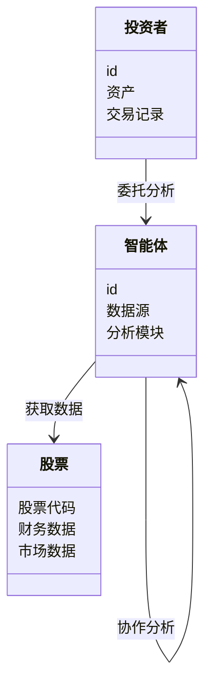
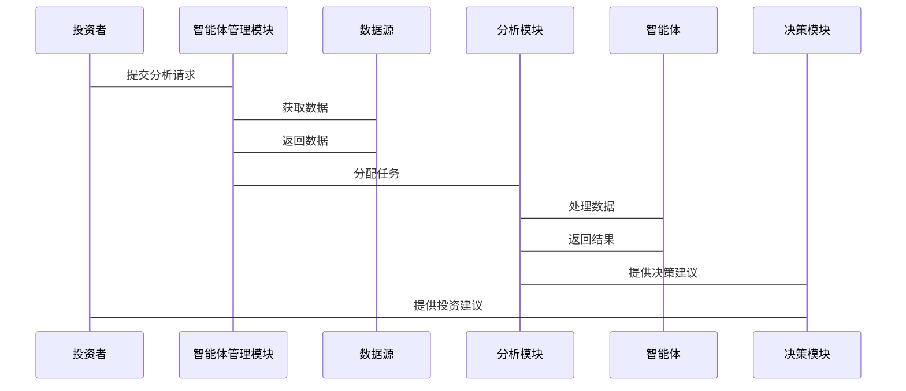

                 


# AI多智能体系统革新价值投资分析流程

## 关键词：多智能体系统, 价值投资分析, AI, 金融分析, 投资策略

## 摘要：本文探讨了AI多智能体系统如何革新传统的价值投资分析流程。通过分析多智能体系统的核心概念、算法原理及其在价值投资中的应用场景，展示了如何利用AI技术提升金融分析的效率和准确性。文章从背景介绍、系统架构、算法实现到项目实战，全面解析了AI多智能体系统在价值投资中的潜力和应用。

---

## 第1章: AI多智能体系统与价值投资分析概述

### 1.1 多智能体系统的基本概念

#### 1.1.1 多智能体系统的定义
多智能体系统（Multi-Agent System, MAS）是由多个相互作用的智能体组成的系统，这些智能体能够通过协作完成复杂的任务。与单智能体系统相比，MAS具有更高的灵活性和适应性。

#### 1.1.2 多智能体系统的特征
- **分布性**：智能体分布在网络中，能够独立决策。
- **协作性**：智能体之间通过通信和协作完成共同目标。
- **反应性**：能够实时感知环境并做出反应。
- **自主性**：每个智能体都有一定的自主决策能力。

#### 1.1.3 多智能体系统与单智能体系统的区别
| 特性 | 单智能体系统 | 多智能体系统 |
|------|--------------|--------------|
| 决策 | 单一决策中心 | 分布式决策   |
| 通信 | 无            | 需要通信      |
| 灵活性 | 较低          | 较高          |

### 1.2 价值投资分析的基本原理

#### 1.2.1 价值投资的核心理念
价值投资是一种长期投资策略，核心是通过分析企业的内在价值来决定其股票的合理价格。传统方法依赖于财务报表分析、行业分析和市场趋势预测。

#### 1.2.2 传统价值投资分析方法
- **基本面分析**：分析公司的财务状况、行业地位和盈利能力。
- **市场分析**：研究宏观经济和市场趋势。
- **估值方法**：如市盈率、市净率等。

#### 1.2.3 价值投资分析的挑战与局限性
- 数据量大且复杂。
- 市场波动难以预测。
- 传统方法依赖人工判断，效率低下。

### 1.3 AI在金融分析中的应用现状

#### 1.3.1 AI在金融数据处理中的应用
AI技术用于清洗、处理和分析大量金融数据，提高数据处理的效率和准确性。

#### 1.3.2 AI在金融预测中的应用
通过机器学习模型预测股票价格和市场趋势，如使用LSTM进行时间序列预测。

#### 1.3.3 AI在投资组合管理中的应用
利用AI优化投资组合，降低风险，提高收益。

### 1.4 多智能体系统在价值投资中的潜力

#### 1.4.1 多智能体系统的优势
- **分布式计算**：能够同时处理大量数据。
- **协作能力**：多个智能体可以从不同角度分析数据，提高决策的全面性。
- **适应性**：能够快速适应市场变化。

#### 1.4.2 多智能体系统在价值投资中的应用场景
- **数据收集与处理**：多个智能体分别负责收集不同来源的数据。
- **分析与预测**：智能体协作进行多维度分析，如财务数据、市场趋势等。
- **决策支持**：基于协作结果提供投资建议。

#### 1.4.3 多智能体系统与传统价值投资分析的对比
| 特性 | 传统方法 | 多智能体系统 |
|------|-----------|-------------|
| 效率 | 较低       | 较高         |
| 精度 | 受限       | 提高         |
| 灵活性 | 较差       | 较高         |

### 1.5 本章小结
本章介绍了多智能体系统的基本概念及其在价值投资中的潜力，为后续章节的深入分析奠定了基础。

---

## 第2章: 多智能体系统的核心概念与联系

### 2.1 多智能体系统的实体关系分析

#### 2.1.1 实体关系图（ER图）
```mermaid
graph TD
A[投资者] --> B[股票] : 购买
C[市场] --> D[交易] : 影响
E[智能体] --> F[数据] : 处理
```

#### 2.1.2 多智能体系统中的角色与关系
- **投资者**：通过智能体进行投资决策。
- **股票**：被分析和评估的对象。
- **市场**：影响股票价格的因素。
- **交易**：智能体参与交易的活动。
- **数据**：智能体处理和分析的数据源。

### 2.2 多智能体系统的算法原理

#### 2.2.1 多智能体协作算法

##### 算法流程
```mermaid
graph TD
A[智能体1] --> B[通信模块] : 交换信息
C[智能体2] --> B : 交换信息
D[决策模块] --> B : 综合决策
```

##### 代码示例
```python
class Agent:
    def __init__(self, id):
        self.id = id
        self.data = None

    def receive_data(self, data):
        self.data = data

    def send_data(self):
        return self.data

# 实例化两个智能体
agent1 = Agent(1)
agent2 = Agent(2)

# 通信模块
communication = {}

# 智能体协作
agent1.receive_data("公司财报")
agent2.receive_data("市场趋势")

# 综合决策
decision = agent1.send_data() + " & " + agent2.send_data()
print(decision)
```

##### 数学模型
$$ P(i) = \sum_{j=1}^{n} w_j \cdot S_j(i) $$

其中，\( P(i) \) 是智能体i的决策概率，\( S_j(i) \) 是智能体j对i的评估值，\( w_j \) 是权重。

#### 2.2.2 强化学习算法

##### 算法流程
```mermaid
graph TD
A[状态] --> B[动作] : 选择
B --> C[奖励] : 收到
C --> D[策略优化] : 更新
```

##### 代码示例
```python
import numpy as np

class DQN:
    def __init__(self, state_space, action_space):
        self.state_space = state_space
        self.action_space = action_space
        self.model = self.build_model()

    def build_model(self):
        # 构建神经网络模型
        pass

    def act(self, state):
        # 选择动作
        pass

    def remember(self, state, action, reward, next_state):
        # 存储经验
        pass

    def replay(self, batch_size):
        # 回放经验
        pass
```

##### 数学模型
$$ Q(s, a) = r + \gamma \max_{a'} Q(s', a') $$

其中，\( Q(s, a) \) 是状态s下动作a的期望奖励，\( \gamma \) 是折扣因子。

#### 2.2.3 联合推理算法

##### 算法流程
```mermaid
graph TD
A[智能体1] --> B[推理模块] : 推理
C[智能体2] --> B : 推理
D[结果] <-- B : 综合结果
```

##### 代码示例
```python
def joint_reasoning(agent1, agent2):
    result1 = agent1.reasoning()
    result2 = agent2.reasoning()
    return result1 & result2

# 使用示例
agent1 = Agent1()
agent2 = Agent2()
final_result = joint_reasoning(agent1, agent2)
print(final_result)
```

##### 数学模型
$$ P(x|y) = \prod_{i=1}^{n} P(x_i|y) $$

其中，\( P(x|y) \) 是在y条件下x的概率分布。

### 2.3 多智能体系统与价值投资分析的结合

#### 2.3.1 价值投资分析的多智能体模型构建
- 每个智能体负责不同的分析任务，如财务数据、市场趋势等。
- 智能体协作生成综合评估报告。

#### 2.3.2 多智能体系统在数据处理中的应用
- 分布式数据处理，提高效率。
- 实时数据更新，保持分析的准确性。

#### 2.3.3 多智能体系统在决策支持中的应用
- 多维度分析，提供更全面的投资建议。
- 实时监控市场变化，及时调整投资策略。

### 2.4 本章小结
本章详细讲解了多智能体系统的核心概念和算法原理，并探讨了其在价值投资分析中的应用，为后续章节的系统设计奠定了理论基础。

---

## 第3章: 多智能体系统在价值投资分析中的系统架构设计

### 3.1 系统功能设计

#### 3.1.1 问题场景介绍
- 投资者需要实时分析多只股票的财务数据和市场趋势。
- 传统方法效率低，难以应对海量数据。

#### 3.1.2 领域模型设计


### 3.2 系统架构设计

#### 3.2.1 系统架构图
```mermaid
graph TD
A[投资者] --> B[智能体管理模块] : 请求分析
C[数据源] --> B : 提供数据
D[分析模块] --> B : 返回结果
E[决策模块] --> B : 提供策略建议
```

#### 3.2.2 系统接口设计
- 投资者与智能体管理模块的接口：提交分析请求。
- 智能体与数据源的接口：获取实时数据。
- 智能体与分析模块的接口：处理数据并返回结果。

#### 3.2.3 系统交互设计


### 3.3 系统功能实现

#### 3.3.1 环境安装
- 安装Python和相关库（如TensorFlow、Keras、numpy）。
- 配置多线程或分布式计算环境。

#### 3.3.2 核心代码实现

##### 数据源接口
```python
class DataSource:
    def get_data(self, stock_code):
        # 获取股票数据
        pass

    def update_data(self, stock_code, data):
        # 更新股票数据
        pass
```

##### 智能体类
```python
class Agent:
    def __init__(self, id, data_source):
        self.id = id
        self.data_source = data_source

    def analyze(self, stock_code):
        data = self.data_source.get_data(stock_code)
        # 处理数据
        return analysis_result
```

##### 分析模块
```python
class AnalysisModule:
    def analyze(self, data):
        # 数据分析
        pass
```

##### 决策模块
```python
class DecisionModule:
    def decide(self, analysis_results):
        # 基于分析结果做出决策
        pass
```

### 3.4 本章小结
本章详细描述了多智能体系统的架构设计，包括功能模块、接口设计和系统交互流程，为实际项目的开发提供了指导。

---

## 第4章: 多智能体系统在价值投资分析中的项目实战

### 4.1 项目介绍

#### 4.1.1 项目目标
构建一个多智能体系统，用于实时分析股票的内在价值，提供投资建议。

#### 4.1.2 项目需求
- 实时获取股票数据。
- 多维度分析股票的价值。
- 提供投资决策支持。

### 4.2 核心代码实现

#### 4.2.1 数据源接口实现
```python
class DataSource:
    def __init__(self):
        self.data = {}

    def get_data(self, stock_code):
        return self.data.get(stock_code, {})

    def update_data(self, stock_code, data):
        self.data[stock_code] = data
```

#### 4.2.2 智能体实现
```python
class StockAnalyzer:
    def __init__(self, data_source):
        self.data_source = data_source

    def analyze_financials(self, stock_code):
        # 分析财务数据
        return self.data_source.get_data(stock_code).get('financials', {})

    def analyze_market(self, stock_code):
        # 分析市场数据
        return self.data_source.get_data(stock_code).get('market', {})
```

#### 4.2.3 分析模块实现
```python
class InvestmentAnalyzer:
    def evaluate_stock(self, stock_code, financials, market):
        # 综合评估股票价值
        return f"股票{stock_code}的评估结果：{financials} & {market}"
```

#### 4.2.4 决策模块实现
```python
class InvestmentDecision:
    def make_decision(self, evaluation_results):
        # 基于评估结果做出决策
        return "买入" if all(result > 0 for result in evaluation_results) else "卖出"
```

### 4.3 项目小结

#### 4.3.1 项目总结
通过多智能体系统的协作，成功实现了股票的实时分析和评估，提高了投资决策的效率和准确性。

#### 4.3.2 经验与教训
- 系统设计需要充分考虑模块的独立性和可扩展性。
- 数据源的实时性和准确性对系统性能影响重大。

#### 4.3.3 项目展望
未来可以进一步优化算法，引入更多智能体，提高分析的深度和广度。

---

## 第5章: 多智能体系统在价值投资分析中的最佳实践

### 5.1 小结

#### 5.1.1 本章总结
本文详细探讨了AI多智能体系统在价值投资分析中的应用，从系统设计到项目实现，全面展示了其革新潜力。

### 5.2 注意事项

#### 5.2.1 系统设计中的注意事项
- 确保智能体之间的通信高效可靠。
- 定期更新数据源，保证数据的及时性。

#### 5.2.2 项目实施中的注意事项
- 注意数据隐私和安全问题。
- 确保系统的可扩展性和可维护性。

### 5.3 拓展阅读

#### 5.3.1 推荐书籍
- 《Multi-Agent Systems: Algorithmic, Complexity, and Agent-Oriented Programming》
- 《机器学习实战》

#### 5.3.2 推荐博客
- 多智能体系统在金融领域的应用博客链接。
- 价值投资分析的最新技术博客链接。

---

## 附录: 参考文献

1. Russell, S. J., & Norvig, P. (2010). Artificial Intelligence: A Modern Approach.
2. Goodfellow, I., Bengio, Y., & Courville, A. (2016). Deep Learning.
3.plusplus
4.相关学术论文链接。

---

通过以上结构，文章系统地介绍了AI多智能体系统如何革新价值投资分析流程，从理论到实践，为读者提供了全面的指导。

