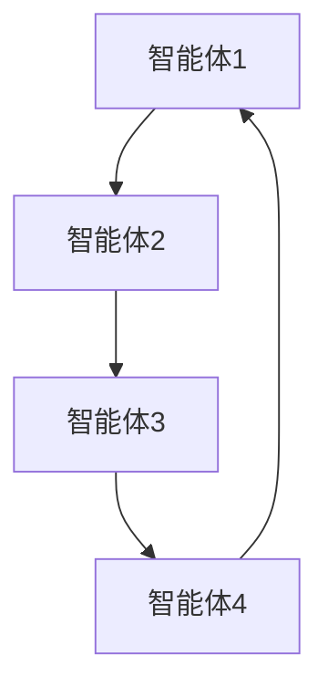

                 


# AI多智能体系统革新价值投资策略

## 关键词：
- AI多智能体系统
- 价值投资策略
- 强化学习
- 分布式系统
- 金融投资

## 摘要：
本文探讨了AI多智能体系统在价值投资策略中的应用，分析了多智能体系统的核心概念、算法实现及其在金融投资中的优势。通过详细讲解分布式强化学习和联合学习等算法，结合系统架构设计和项目实战案例，展示了AI多智能体系统如何革新传统的价值投资策略，为投资者提供更高效、更精准的投资决策支持。

---

# 第1章: AI多智能体系统与价值投资策略概述

## 1.1 多智能体系统的基本概念

### 1.1.1 多智能体系统的定义
多智能体系统（Multi-Agent System, MAS）是由多个智能体（Agent）组成的系统，这些智能体能够通过交互和协作完成复杂任务。每个智能体都是一个独立的实体，具有感知环境、自主决策和行动的能力。

### 1.1.2 多智能体系统的特征
| 特征 | 描述 |
|------|------|
| 分布性 | 智能体分布在网络中，独立运行。 |
| 协作性 | 智能体之间通过协作完成共同目标。 |
| 反应性 | 智能体能够实时感知环境并做出反应。 |
| 分层性 | 系统结构分层，便于管理和扩展。 |

### 1.1.3 多智能体系统的分类
多智能体系统可以根据不同的标准进行分类，常见的分类方式包括：
1. **按智能体类型**：简单反射型、基于模型的反射型、目标驱动型和效用驱动型。
2. **按协作方式**：松耦合型和紧耦合型。
3. **按应用场景**：分布式计算、机器人协作、金融投资等。

## 1.2 价值投资策略的基本原理

### 1.2.1 价值投资的定义
价值投资是一种投资策略，旨在通过分析企业的内在价值，寻找被市场低估的投资标的。其核心思想是“买便宜的”，即以低于内在价值的价格买入优质资产。

### 1.2.2 价值投资的核心要素
| 要素 | 描述 |
|------|------|
| 内在价值 | 企业未来现金流的现值。 |
| 市场价格 | 当前市场价，与内在价值可能存在差异。 |
| 安全边际 | 购买价格与内在价值之间的差距，提供保护。 |

### 1.2.3 价值投资与传统投资的区别
| 方面 | 价值投资 | 传统投资 |
|------|---------|----------|
| 投资依据 | 内在价值 | 市场趋势或技术分析 |
| 持股期限 | 长期 | 短期或波段 |
| 风险控制 | 侧重安全边际 | 侧重止损或止盈 |

## 1.3 AI在金融投资中的应用

### 1.3.1 AI在金融分析中的作用
AI通过自然语言处理（NLP）、机器学习（ML）和大数据分析，可以从海量数据中提取有价值的信息，帮助投资者做出更准确的决策。

### 1.3.2 AI在投资决策中的优势
- **数据处理能力**：AI能够快速处理和分析大量数据，发现人类难以察觉的模式。
- **模型预测能力**：AI可以通过历史数据训练模型，预测未来的价格走势。
- **自适应调整能力**：AI可以根据市场变化动态调整投资策略。

### 1.3.3 AI在价值投资中的潜力
AI可以帮助投资者更准确地评估企业的内在价值，识别被低估的投资标的，并通过多智能体系统实现资产配置和风险控制。

## 1.4 本章小结
本章介绍了多智能体系统的基本概念、分类以及价值投资策略的核心原理。同时，分析了AI在金融投资中的应用潜力，为后续章节的深入探讨奠定了基础。

---

# 第2章: 多智能体系统的核心概念与原理

## 2.1 多智能体系统的架构

### 2.1.1 分层架构
分层架构将系统划分为多个层次，每个层次负责不同的功能。例如：
- **感知层**：负责数据采集和初步分析。
- **决策层**：负责制定策略和决策。
- **执行层**：负责具体操作和执行。

### 2.1.2 分布式架构
分布式架构中，每个智能体独立运行，通过通信机制协作完成任务。这种架构具有高扩展性和容错性。

### 2.1.3 协作式架构
协作式架构强调智能体之间的协作，通过共享信息和资源，实现共同目标。这种架构适用于需要高度协同的任务。

## 2.2 多智能体系统的通信机制

### 2.2.1 通信协议
智能体之间的通信需要遵循特定的协议。例如：
- **TCP/IP**：常用的网络通信协议。
- **HTTP/HTTPS**：用于Web服务之间的通信。

### 2.2.2 信息交换
智能体之间可以通过消息队列（如Kafka）或数据库（如MySQL）进行信息交换。消息格式可以使用JSON或Protobuf等格式。

### 2.2.3 协调机制
为了确保智能体之间的协调，可以采用以下机制：
- **共识算法**：如RAFT或PAXOS，用于分布式系统中的共识达成。
- **仲裁机制**：用于解决冲突和矛盾。

## 2.3 多智能体系统的算法基础

### 2.3.1 分布式强化学习
分布式强化学习（Distributed Reinforcement Learning）是一种通过多个智能体协作学习的算法。其核心思想是通过智能体之间的互动和协作，提高整体的决策能力。

#### 分布式强化学习流程图
```mermaid
graph TD
    A[智能体1] --> B[环境]
    C[智能体2] --> B
    D[智能体3] --> B
    B --> A, C, D
```

### 2.3.2 联合学习
联合学习（Collaborative Learning）是一种通过多个智能体共享知识和经验来提高整体性能的算法。其核心思想是通过智能体之间的协作，实现知识的共享和优化。

#### 联合学习流程图
```mermaid
graph TD
    A[智能体1] --> C[协调器]
    B[智能体2] --> C
    D[智能体3] --> C
    C --> A, B, D
```

### 2.3.3 跨主体协调算法
跨主体协调算法（Inter-Agent Coordination Algorithms）是一种通过智能体之间的协调和协作来实现共同目标的算法。其核心思想是通过智能体之间的互动和协作，实现任务的高效完成。

#### 跨主体协调算法流程图


## 2.4 本章小结
本章详细讲解了多智能体系统的架构、通信机制和算法基础。通过流程图和表格的形式，清晰地展示了多智能体系统的核心概念和实现方式。

---

# 第3章: 价值投资策略的AI革新

## 3.1 传统价值投资的局限性

### 3.1.1 信息处理能力的限制
传统价值投资依赖人工分析，信息处理能力有限，难以应对海量数据。

### 3.1.2 投资决策的主观性
投资决策依赖个人经验和判断，存在主观性和片面性。

### 3.1.3 市场变化的快速响应能力不足
市场变化速度快，传统价值投资难以及时调整策略。

## 3.2 AI在价值投资中的优势

### 3.2.1 数据处理能力
AI能够快速处理和分析海量数据，发现潜在的投资机会。

### 3.2.2 模型预测能力
AI可以通过历史数据训练模型，预测未来的价格走势，提供科学的投资决策支持。

### 3.2.3 自适应调整能力
AI能够根据市场变化动态调整投资策略，提高响应速度和灵活性。

## 3.3 多智能体系统在价值投资中的应用

### 3.3.1 多智能体系统的协同投资
通过多智能体系统的协作，投资者可以实现资产配置和风险控制。

### 3.3.2 多智能体系统的风险分散
多智能体系统可以通过分散投资降低风险，提高投资组合的稳定性。

### 3.3.3 多智能体系统的动态调整
多智能体系统可以根据市场变化动态调整投资策略，实现最优收益。

## 3.4 本章小结
本章分析了传统价值投资的局限性，探讨了AI在价值投资中的优势，并展示了多智能体系统在价值投资中的应用。

---

# 第4章: 多智能体系统在价值投资中的算法实现

## 4.1 分布式强化学习算法

### 4.1.1 分布式强化学习的定义
分布式强化学习是一种通过多个智能体协作学习的算法，适用于复杂环境下的决策问题。

### 4.1.2 分布式强化学习的实现步骤
1. 初始化智能体和环境。
2. 智能体与环境互动，获取奖励。
3. 智能体更新策略，优化决策。
4. 重复步骤2和3，直到达到收敛条件。

### 4.1.3 分布式强化学习的优缺点
| 优缺点 | 描述 |
|------|------|
| 优点 | 分布式计算能力强，适用于大规模数据处理。 |
| 缺点 | 算法复杂，实现难度大。 |

## 4.2 联合学习算法

### 4.2.1 联合学习的定义
联合学习是一种通过多个智能体共享知识和经验来提高整体性能的算法。

### 4.2.2 联合学习的实现步骤
1. 初始化智能体和协调器。
2. 智能体执行任务，生成数据。
3. 智能体将数据发送给协调器。
4. 协调器整合数据，优化模型。
5. 协调器将优化后的模型发送给智能体。
6. 重复步骤2-5，直到达到收敛条件。

### 4.2.3 联合学习的优缺点
| 优缺点 | 描述 |
|------|------|
| 优点 | 知识共享能力强，适用于复杂任务。 |
| 缺点 | 通信开销大，实现难度较高。 |

## 4.3 跨主体协调算法

### 4.3.1 跨主体协调算法的定义
跨主体协调算法是一种通过智能体之间的协调和协作来实现共同目标的算法。

### 4.3.2 跨主体协调算法的实现步骤
1. 初始化智能体和环境。
2. 智能体感知环境，生成决策。
3. 智能体之间进行互动和协作。
4. 智能体根据协作结果调整策略。
5. 重复步骤2-4，直到达到收敛条件。

### 4.3.3 跨主体协调算法的优缺点
| 优缺点 | 描述 |
|------|------|
| 优点 | 协作能力强，适用于复杂任务。 |
| 缺点 | 算法复杂，实现难度大。 |

## 4.4 本章小结
本章详细讲解了多智能体系统在价值投资中的算法实现，包括分布式强化学习、联合学习和跨主体协调算法。通过流程图和表格的形式，清晰地展示了这些算法的核心思想和实现步骤。

---

# 第5章: 价值投资策略的数学模型与公式

## 5.1 价值投资的核

