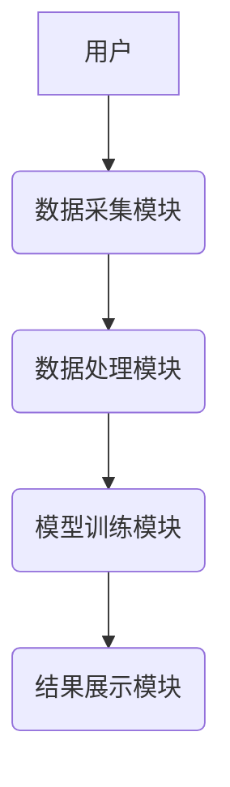
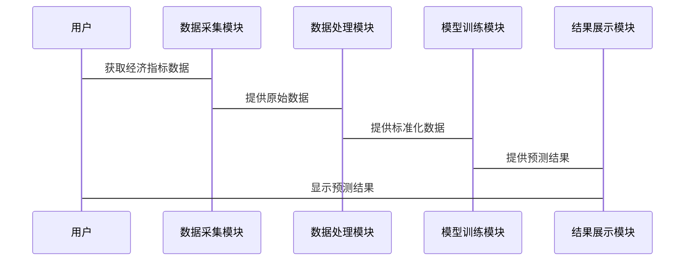

                 


# AI如何优化大卫·德雷曼的宏观经济分析

> 关键词：人工智能、宏观经济分析、大卫·德雷曼、机器学习、时间序列分析、行为金融学、系统架构设计

> 摘要：本文探讨了人工智能（AI）如何优化大卫·德雷曼的宏观经济分析。通过结合行为金融学与AI技术，分析了宏观经济预测中的数据挖掘、机器学习算法和系统架构设计。文章详细介绍了AI在宏观经济分析中的应用，包括时间序列分析、机器学习模型、系统架构设计、项目实战及案例分析，最后总结了AI优化宏观经济分析的最佳实践。

---

# 引言

## 背景介绍

### 核心概念与术语

- **宏观经济分析**：研究整体经济系统的行为，包括GDP、通货膨胀、就业率等经济指标。
- **大卫·德雷曼**：行为金融学领域的专家，其研究关注投资者心理如何影响市场行为。
- **人工智能（AI）**：模拟人类智能的计算机系统，能够从数据中学习并做出预测。
- **机器学习**：AI的子领域，通过算法训练模型，使其能够从数据中识别模式。
- **时间序列分析**：研究按时间顺序排列的数据，常用于预测未来的经济指标。

### 问题背景

传统宏观经济分析依赖于统计模型和专家判断，但面对复杂多变的经济环境，存在数据处理能力不足和预测精度有限的问题。大卫·德雷曼的方法引入了行为因素，但其分析仍需更高效的数据处理和预测方法。

### 问题解决

通过AI技术，特别是机器学习和时间序列分析，可以提升宏观经济分析的效率和准确性。AI能够处理海量数据，发现复杂模式，优化预测模型。

### 边界与外延

本文聚焦于AI在大卫·德雷曼宏观经济分析中的应用，涵盖数据挖掘、预测模型和系统架构设计，但不涉及微观经济分析或其他AI应用领域。

---

# 第一部分：AI与宏观经济分析的背景

## 第1章：宏观经济分析与AI的结合

### 1.1 宏观经济分析的基本概念

#### 1.1.1 宏观经济分析的核心要素

- **经济指标**：GDP、通货膨胀率、失业率等。
- **经济模型**：用于描述经济系统运行的数学模型。

#### 1.1.2 大卫·德雷曼的宏观经济分析方法

- **行为金融学**：研究投资者心理如何影响市场行为。
- **市场情绪分析**：通过投资者情绪预测市场走势。

#### 1.1.3 AI在宏观经济分析中的潜力

- **数据处理能力**：AI能够处理和分析海量数据。
- **预测能力**：AI模型可以预测未来的经济指标。

### 1.2 AI技术的基本原理

#### 1.2.1 人工智能的基本概念

- **定义**：模拟人类智能的计算机系统。
- **主要技术**：机器学习、自然语言处理、计算机视觉。

#### 1.2.2 机器学习的核心算法

- **监督学习**：基于标记数据进行预测。
- **无监督学习**：发现数据中的隐藏结构。

#### 1.2.3 深度学习的原理与应用

- **神经网络**：模拟人脑结构，用于模式识别。

---

## 第2章：大卫·德雷曼的宏观经济分析方法

### 2.1 行为金融学与宏观经济分析

#### 2.1.1 行为金融学的基本理论

- **投资者心理**：恐惧、贪婪等情绪影响市场行为。
- **市场异象**：与传统模型不符的市场现象。

#### 2.1.2 大卫·德雷曼的研究方法

- **实证研究**：通过数据验证假设。
- **行为模型**：结合心理学和经济学的分析框架。

#### 2.1.3 宏观经济分析的传统模型

- **凯恩斯模型**：强调政府支出和货币政策。
- **理性预期假说**：市场参与者基于理性预测未来。

### 2.2 宏观经济分析的挑战

#### 2.2.1 数据复杂性

- **数据量大**：涵盖多个经济指标。
- **数据维度多**：包括价格、利率、就业等。

#### 2.2.2 模型的局限性

- **假设限制**：传统模型假设理性行为。
- **预测精度低**：复杂经济环境下的预测误差。

#### 2.2.3 传统方法的不足

- **计算能力有限**：难以处理复杂数据。
- **人为因素干扰**：难以量化投资者情绪。

---

# 第二部分：AI优化宏观经济分析的核心概念

## 第3章：AI在宏观经济分析中的应用

### 3.1 数据挖掘与宏观经济分析

#### 3.1.1 数据挖掘的基本概念

- **定义**：从数据中提取有价值信息的过程。
- **技术应用**：用于模式识别和预测。

#### 3.1.2 宏观经济数据的特征

- **时间序列性**：数据按时间顺序排列。
- **多维性**：涵盖多个经济指标。

#### 3.1.3 数据挖掘在宏观经济分析中的应用

- **模式识别**：发现经济周期中的规律。
- **异常检测**：识别经济数据中的异常值。

### 3.2 AI驱动的宏观经济预测

#### 3.2.1 宏观经济预测的基本方法

- **统计模型**：回归分析、时间序列分析。
- **机器学习模型**：支持向量机、随机森林。

#### 3.2.2 基于AI的预测模型

- **神经网络模型**：用于复杂模式识别。
- **集成学习**：结合多个模型提升预测精度。

#### 3.2.3 模型的优缺点

- **优点**：预测精度高，适应能力强。
- **缺点**：计算复杂，需要大量数据。

---

## 第4章：AI优化宏观经济分析的算法原理

### 4.1 时间序列分析

#### 4.1.1 时间序列的基本概念

- **定义**：按时间顺序排列的数据。
- **主要特征**：趋势、季节性、随机性。

#### 4.1.2 常见的时间序列模型

- **ARIMA模型**：自回归积分移动平均模型。
- **GARCH模型**：广义自回归条件异方差模型。

#### 4.1.3 基于AI的时间序列预测方法

- **LSTM网络**：长短期记忆网络，适合处理时间序列数据。
- **模型训练**：使用历史数据训练模型，预测未来趋势。

### 4.2 机器学习在宏观经济预测中的应用

#### 4.2.1 机器学习的基本算法

- **支持向量机（SVM）**：用于分类和回归。
- **随机森林**：基于决策树的集成学习方法。

#### 4.2.2 基于机器学习的宏观经济预测模型

- **特征选择**：筛选重要经济指标。
- **模型训练**：使用机器学习算法训练模型。

#### 4.2.3 模型的训练与优化

- **交叉验证**：评估模型性能。
- **超参数调优**：优化模型参数。

---

# 第三部分：AI优化宏观经济分析的系统架构

## 第5章：宏观经济分析系统的架构设计

### 5.1 系统模块划分

#### 5.1.1 数据采集模块

- **功能**：从数据库或API获取经济指标数据。
- **输入**：GDP、通货膨胀率、失业率等。
- **输出**：清洗后的数据。

#### 5.1.2 数据处理模块

- **功能**：清洗、转换和标准化数据。
- **输入**：原始经济数据。
- **输出**：标准化的数据集。

#### 5.1.3 模型训练模块

- **功能**：训练宏观经济预测模型。
- **输入**：标准化的数据集。
- **输出**：训练好的模型。

#### 5.1.4 结果展示模块

- **功能**：可视化预测结果。
- **输入**：模型预测结果。
- **输出**：图表和报告。

### 5.2 系统架构设计

#### 5.2.1 系统功能设计

- **用户界面**：输入经济指标，显示预测结果。
- **数据处理**：清洗和转换数据。
- **模型训练**：训练预测模型。
- **结果展示**：生成可视化报告。

#### 5.2.2 系统架构图



#### 5.2.3 系统接口设计

- **API接口**：提供数据获取和预测结果的接口。
- **数据接口**：与数据库或外部API对接。

#### 5.2.4 系统交互流程



---

## 第6章：项目实战

### 6.1 环境安装

- **Python**：安装Anaconda或Miniconda。
- **机器学习库**：安装scikit-learn、TensorFlow、Keras。
- **数据处理库**：安装Pandas、NumPy、Matplotlib。

### 6.2 系统核心实现源代码

#### 6.2.1 数据采集模块

```python
import pandas as pd
import requests

def fetch_data(api_key):
    url = f'https://api.econdata.com/indicators?api_key={api_key}'
    response = requests.get(url)
    data = response.json()
    return pd.DataFrame(data)
```

#### 6.2.2 数据处理模块

```python
def preprocess_data(data):
    # 删除缺失值
    data = data.dropna()
    # 标准化处理
    from sklearn.preprocessing import StandardScaler
    scaler = StandardScaler()
    data_scaled = scaler.fit_transform(data)
    return data_scaled
```

#### 6.2.3 模型训练模块

```python
from sklearn.ensemble import RandomForestRegressor
from sklearn.metrics import mean_absolute_error

def train_model(data, target):
    model = RandomForestRegressor()
    model.fit(data, target)
    return model

def evaluate_model(model, X_test, y_test):
    y_pred = model.predict(X_test)
    print(f"MAE: {mean_absolute_error(y_test, y_pred)}")
```

#### 6.2.4 结果展示模块

```python
import matplotlib.pyplot as plt

def plot_predictions(y_true, y_pred):
    plt.figure(figsize=(10, 6))
    plt.plot(y_true, label='Actual', color='blue')
    plt.plot(y_pred, label='Predicted', color='red')
    plt.xlabel('Time')
    plt.ylabel('Value')
    plt.legend()
    plt.show()
```

### 6.3 实际案例分析

#### 6.3.1 数据采集与预处理

```python
data = fetch_data('your_api_key')
data_scaled = preprocess_data(data)
```

#### 6.3.2 模型训练与评估

```python
model = train_model(data_scaled, target_column)
evaluate_model(model, X_test, y_test)
```

#### 6.3.3 结果展示

```python
plot_predictions(y_test, y_pred)
```

### 6.4 项目小结

通过实际案例分析，展示了AI如何优化大卫·德雷曼的宏观经济分析。数据采集、处理、模型训练和结果展示的流程证明了AI技术的有效性。

---

## 第7章：总结与展望

### 7.1 总结

本文详细探讨了AI如何优化大卫·德雷曼的宏观经济分析。通过数据挖掘、机器学习和系统架构设计，AI能够提高宏观经济预测的效率和准确性。

### 7.2 展望

未来，随着AI技术的进步，宏观经济分析将更加智能化。深度学习、强化学习等技术将进一步提升预测精度，行为金融学与AI的结合将更加紧密。

---

# 结语

人工智能正在改变宏观经济分析的方式，本文通过系统的分析和实际案例，展示了AI在优化大卫·德雷曼宏观经济分析中的潜力和应用。希望本文能为研究人员和实践者提供有价值的参考和启示。

