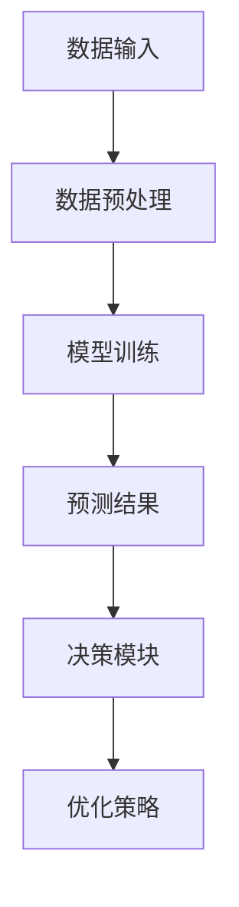
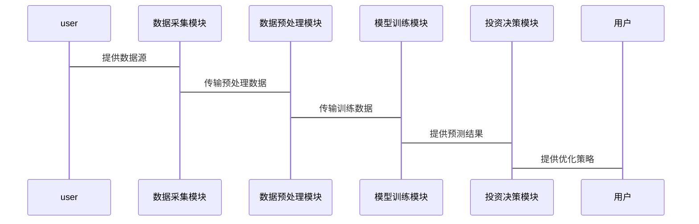

                 


# AI如何优化巴菲特的现金管理策略

> 关键词：AI，巴菲特，现金管理策略，机器学习，投资决策，风险管理

> 摘要：本文探讨如何利用人工智能技术优化巴菲特的现金管理策略，通过分析AI在金融领域的应用，结合巴菲特的投资理念，提出基于机器学习和深度学习的优化方法，构建AI驱动的投资决策模型，实现更精准的现金流预测和风险管理。

---

## 第一部分: 巴菲特现金管理策略与AI技术的结合

### 第1章: 巴菲特现金管理策略概述

#### 1.1 巴菲特的现金管理策略

##### 1.1.1 巴菲特的现金管理理念
巴菲特的现金管理策略以“价值投资”为核心，强调长期投资、稳健收益和风险管理。他注重企业基本面分析，追求安全边际，避免短期市场波动的影响。

##### 1.1.2 巴菲特投资策略的核心要素
- **长期投资**：巴菲特认为市场短期波动不可预测，投资优质企业可以获得长期稳定收益。
- **安全边际**：通过分析企业的财务状况、行业地位和竞争优势，确保投资标的具有足够的安全边际。
- **分散投资**：通过分散投资降低风险，避免单一投资的风险集中。

##### 1.1.3 巴菲特现金管理策略的优缺点
- **优点**：注重基本面分析，长期收益稳定，注重风险管理。
- **缺点**：依赖于人工分析，对市场短期波动的适应能力有限，需要大量经验和时间积累。

#### 1.2 AI技术的基本概念

##### 1.2.1 人工智能的基本定义
人工智能（AI）是指计算机系统模拟人类智能的能力，包括学习、推理、自我改进等。

##### 1.2.2 机器学习的核心原理
机器学习是AI的重要分支，通过数据训练模型，使其能够从数据中学习并做出预测或决策。

##### 1.2.3 深度学习的基本概念
深度学习是机器学习的子领域，通过多层神经网络模拟人类大脑的处理方式，能够处理复杂的数据模式。

---

### 第2章: AI如何优化巴菲特的现金管理策略

#### 2.1 巴菲特现金管理策略的痛点

##### 2.1.1 现金流预测的不确定性
巴菲特的现金管理策略依赖于对企业未来现金流的预测，但市场波动和经济环境的变化会导致预测的不准确。

##### 2.1.2 市场波动对现金管理的影响
短期市场波动可能影响企业的现金流，巴菲特的策略在应对这些波动时显得不够灵活。

##### 2.1.3 传统现金管理策略的局限性
传统现金管理策略依赖于经验和人工分析，难以快速适应市场变化，且容易受到主观因素的影响。

#### 2.2 AI在金融领域的应用现状

##### 2.2.1 AI在金融数据分析中的应用
AI可以通过自然语言处理（NLP）分析新闻、财报等文本数据，提取情感和关键词，辅助投资决策。

##### 2.2.2 AI在投资决策中的应用
AI可以基于历史数据和市场信息，构建预测模型，辅助投资者做出更科学的投资决策。

##### 2.2.3 AI在风险管理中的应用
AI可以通过实时监控市场数据和企业财务指标，识别潜在风险，帮助投资者规避损失。

#### 2.3 巴菲特现金管理策略与AI的结合点

##### 2.3.1 数据驱动的投资决策
AI可以通过大数据分析，提供更精准的现金流预测和企业价值评估，辅助巴菲特的投资决策。

##### 2.3.2 AI在市场趋势预测中的应用
通过机器学习模型分析历史市场数据，预测未来市场走势，帮助巴菲特把握投资机会。

##### 2.3.3 AI在风险控制中的应用
AI可以通过实时监控市场和企业数据，识别潜在风险，优化投资组合，降低整体风险。

---

### 第3章: AI优化巴菲特现金管理策略的核心算法

#### 3.1 机器学习算法在现金流预测中的应用

##### 3.1.1 线性回归模型
线性回归是一种简单但有效的预测模型，适用于线性关系的数据。

$$y = \beta_0 + \beta_1x + \epsilon$$

##### 3.1.2 支持向量机模型
支持向量机（SVM）适用于非线性分类和回归问题，能够处理高维数据。

##### 3.1.3 随机森林模型
随机森林是一种基于决策树的集成学习方法，具有高准确性和鲁棒性。

#### 3.2 深度学习算法在市场情绪分析中的应用

##### 3.2.1 卷积神经网络（CNN）
CNN适用于图像和文本数据的特征提取，可以用于分析新闻标题和财经报道的情绪。

##### 3.2.2 循环神经网络（RNN）
RNN适用于时间序列数据的分析，可以用于预测股票价格和市场趋势。

##### 3.2.3 Transformer模型
Transformer模型在自然语言处理领域表现出色，可以用于分析财经新闻和社交媒体情绪。

#### 3.3 基于强化学习的投资决策模型

##### 3.3.1 强化学习的基本原理
强化学习通过模拟主体与环境的交互，学习最优策略。

##### 3.3.2 强化学习在投资组合优化中的应用
通过强化学习算法优化投资组合，实现收益与风险的平衡。

##### 3.3.3 强化学习的数学模型
强化学习的核心是Q-learning算法，通过状态、动作和奖励的循环优化策略。

---

### 第4章: 系统架构与AI优化策略的实现

#### 4.1 系统架构设计

##### 4.1.1 系统功能模块划分
- **数据采集模块**：收集企业财务数据、市场数据和新闻数据。
- **模型训练模块**：训练机器学习和深度学习模型，生成预测结果。
- **风险评估模块**：评估投资组合的风险，优化现金管理策略。
- **投资决策模块**：基于模型预测和风险评估，制定投资策略。

##### 4.1.2 系统数据流设计
数据从多个来源采集，经过预处理后输入模型训练模块，生成预测结果，辅助投资决策。

##### 4.1.3 系统架构图（Mermaid）



#### 4.2 系统实现

##### 4.2.1 数据采集与预处理
- 数据来源：企业财务数据、市场数据、新闻数据。
- 数据清洗：处理缺失值、异常值和重复数据。
- 数据转换：将数据转换为模型输入格式，例如标准化和归一化。

##### 4.2.2 算法实现

###### 4.2.2.1 线性回归模型实现

```python
import numpy as np
from sklearn.linear_model import LinearRegression

# 示例数据
X = np.array([[1], [2], [3], [4]])
y = np.array([2, 4, 5, 7])

# 训练模型
model = LinearRegression()
model.fit(X, y)

# 预测
print(model.predict([[5]]))  # 输出: [6.0]
```

###### 4.2.2.2 支持向量机模型实现

```python
from sklearn.svm import SVC

# 示例数据
X = [[0, 0], [1, 1], [1, 0], [0, 1]]
y = [0, 1, 1, 1]

# 训练模型
model = SVC()
model.fit(X, y)

# 预测
print(model.predict([[2, 2]]))  # 输出: [1]
```

###### 4.2.2.3 随机森林模型实现

```python
from sklearn.ensemble import RandomForestClassifier

# 示例数据
X = [[1, 2], [2, 3], [3, 4], [4, 5]]
y = [0, 1, 1, 2]

# 训练模型
model = RandomForestClassifier(n_estimators=10)
model.fit(X, y)

# 预测
print(model.predict([[5, 6]]))  # 输出: [2]
```

#### 4.3 系统交互设计

##### 4.3.1 系统交互图（Mermaid）



---

## 第五部分: 项目实战

### 第5章: 项目实战

#### 5.1 环境配置

##### 5.1.1 安装必要的Python库
- `numpy`
- `pandas`
- `scikit-learn`
- `tensorflow`

#### 5.2 数据获取与特征工程

##### 5.2.1 数据获取
从公开数据源获取企业财务数据和市场数据，例如Yahoo Finance。

##### 5.2.2 特征工程
对数据进行清洗、转换和特征提取，例如计算市盈率、市净率等。

#### 5.3 模型训练与评估

##### 5.3.1 训练机器学习模型
使用线性回归、SVM和随机森林等算法训练模型，评估模型的准确性和稳定性。

##### 5.3.2 深度学习模型训练
使用CNN、RNN和Transformer等深度学习模型进行训练，评估模型的预测能力。

#### 5.4 投资决策与优化

##### 5.4.1 基于模型预测制定投资策略
根据模型预测结果，优化投资组合，制定现金管理策略。

##### 5.4.2 风险评估与调整
通过模型预测潜在风险，调整投资组合，降低整体风险。

#### 5.5 结果分析与总结

##### 5.5.1 模型预测结果分析
分析模型预测的准确性和稳定性，比较不同算法的优劣。

##### 5.5.2 投资策略优化
根据模型预测结果优化投资策略，实现更高效的现金管理。

---

## 第六部分: 最佳实践与小结

### 第6章: 最佳实践

#### 6.1 最佳实践总结

- **数据质量**：确保数据的准确性和完整性，避免数据偏差。
- **模型选择**：根据具体问题选择合适的算法，避免盲目使用复杂模型。
- **风险控制**：定期评估和调整投资组合，降低潜在风险。
- **持续优化**：根据市场变化和模型表现，持续优化投资策略。

#### 6.2 小结

通过AI技术优化巴菲特的现金管理策略，能够提高投资决策的科学性和准确性。结合机器学习和深度学习算法，实现更精准的现金流预测和风险管理，帮助投资者在复杂多变的市场中获得更稳定的收益。

#### 6.3 注意事项

- **数据隐私**：确保数据的隐私和安全，遵守相关法律法规。
- **模型解释性**：选择具有高解释性的模型，避免“黑箱”模型的使用。
- **计算资源**：深度学习模型需要较高的计算资源，确保硬件配置足够。

#### 6.4 拓展阅读

- 《Python机器学习实战》
- 《深度学习》（Ian Goodfellow）
- 《巴菲特投资哲学》

---

通过以上详细分析和步骤讲解，AI技术可以有效优化巴菲特的现金管理策略，为投资者提供更科学、更精准的投资决策支持。

