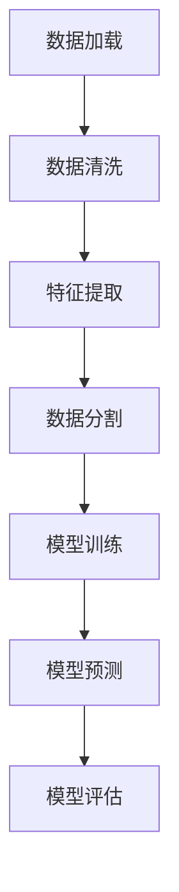
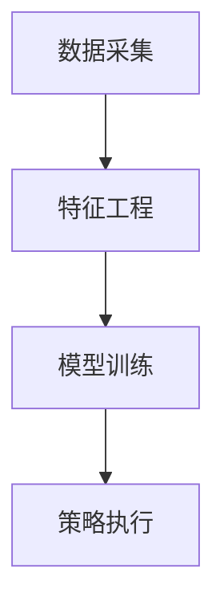
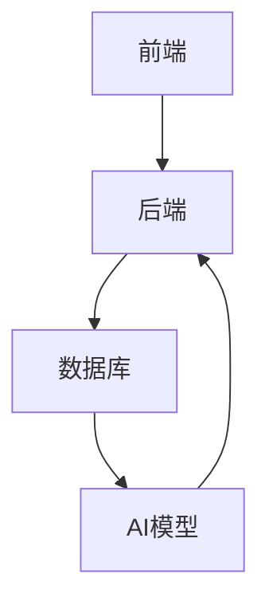
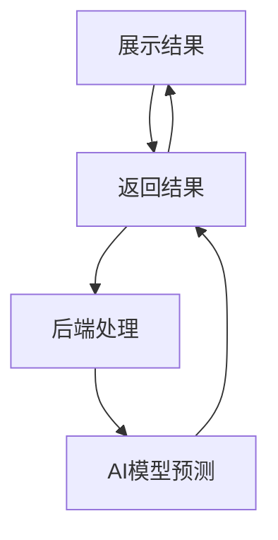

                 


好的，我将按照您的要求撰写一篇关于《AI如何优化格林布拉特的魔法公式策略》的详细技术博客文章。以下是文章的完整目录结构：

---

# AI如何优化格林布拉特的魔法公式策略

> 关键词：AI优化、格林布拉特魔法公式、投资策略、机器学习、数据驱动决策

> 摘要：本文将深入探讨如何利用人工智能技术优化格林布拉特的魔法公式策略。通过结合数据分析与机器学习，我们能够提升投资决策的准确性和效率。文章将从魔法公式的背景与核心概念出发，逐步分析AI优化的路径、算法实现、系统设计与实战案例，最终总结出一套基于AI的优化策略。

---

## 第1章: 格林布拉特魔法公式与AI的结合背景

### 1.1 格林布拉特魔法公式的起源与核心思想

#### 1.1.1 公式的基本概念与组成要素
格林布拉特的魔法公式是一种用于评估企业内在价值的指标，结合了盈利能力、成长性和杠杆率等因素。其核心公式为：
$$
Magic Formula = \frac{ earnings \ per \ share }{ price \ per \ share }
$$

公式中，分子代表企业的盈利能力，分母代表市场对企业的估值。通过量化企业的内在价值与市场估值的差异，投资者可以找到被低估的投资标的。

#### 1.1.2 公式在投资决策中的应用价值
格林布拉特魔法公式为投资者提供了一种简单而有效的选股方法。它通过量化企业的基本面指标，帮助投资者筛选出具有较高投资价值的公司。然而，该公式在实际应用中也存在一些局限性，例如对市场波动的适应性不足，以及对复杂市场环境的简化处理。

#### 1.1.3 公式的局限性与优化空间
传统的魔法公式主要依赖于历史数据和静态指标，无法动态适应市场的变化。此外，该公式忽略了宏观经济环境、行业周期性以及企业间复杂的关联关系。因此，如何通过AI技术优化魔法公式，使其更加智能化、动态化，是当前研究的重点。

### 1.2 AI技术在投资策略中的应用现状

#### 1.2.1 AI在金融数据分析中的优势
AI技术能够处理海量数据，发现传统方法难以察觉的模式和趋势。例如，通过自然语言处理技术分析企业财报，提取非财务性指标，进一步丰富魔法公式的核心数据。

#### 1.2.2 当前AI优化投资策略的主要方法
目前，AI优化投资策略的主要方法包括：
1. 数据驱动的策略优化：利用大数据分析技术，改进魔法公式的输入数据质量。
2. 算法驱动的策略优化：通过机器学习算法，动态调整魔法公式的权重参数。
3. 综合驱动的策略优化：将传统策略与AI算法相结合，构建智能化的投资决策系统。

#### 1.2.3 AI技术与格林布拉特公式的结合潜力
AI技术可以显著提升格林布拉特公式的预测能力和适应性。通过引入实时数据、动态调整模型参数以及结合多维度的市场信息，AI能够帮助投资者做出更加精准的投资决策。

---

## 第2章: AI如何优化格林布拉特的魔法公式策略

### 2.1 格林布拉特公式的AI优化路径

#### 2.1.1 数据驱动的优化方法
AI优化的第一步是数据的收集与处理。我们通过爬取企业财务数据、市场数据以及新闻数据，构建一个全面的数据库。以下是数据驱动优化的主要步骤：

1. 数据清洗：去除无效数据，填充缺失值，标准化数据格式。
2. 特征提取：从原始数据中提取与魔法公式相关的特征，如ROE（净资产收益率）、ROA（资产回报率）等。
3. 数据增强：通过引入外部数据源（如宏观经济指标），丰富魔法公式的输入维度。

#### 2.1.2 算法驱动的优化方法
在数据准备完成后，我们采用机器学习算法对魔法公式进行优化。以下是算法驱动优化的主要步骤：

1. 模型选择：选择合适的机器学习模型（如线性回归、随机森林等）。
2. 模型训练：利用历史数据训练模型，提取特征变量之间的关系。
3. 模型调优：通过交叉验证优化模型参数，提升预测精度。

#### 2.1.3 综合优化策略的设计
综合优化策略的核心是将数据驱动与算法驱动相结合，构建一个动态调整的魔法公式模型。通过实时更新模型参数，使其能够适应市场环境的变化。

### 2.2 AI优化的核心要素分析

#### 2.2.1 数据质量与特征提取
数据质量是AI优化的基础。我们通过以下方法提升数据质量：
1. 数据清洗：去除异常值，处理重复数据。
2. 特征提取：提取与魔法公式相关的特征，如ROE、ROA等。
3. 数据增强：引入外部数据源，丰富特征维度。

#### 2.2.2 算法选择与模型训练
算法选择是优化的关键。我们采用随机森林算法对魔法公式进行优化，以下是具体步骤：
1. 数据分割：将数据划分为训练集和测试集。
2. 模型训练：利用训练数据训练随机森林模型。
3. 模型验证：通过测试数据验证模型的预测精度。

#### 2.2.3 结果验证与策略调整
在模型训练完成后，我们需要对结果进行验证，并根据验证结果调整优化策略。以下是具体步骤：
1. 结果验证：通过回测分析模型的预测精度。
2. 策略调整：根据验证结果，调整模型参数或优化数据输入。

---

## 第3章: 格林布拉特魔法公式与AI优化的数学模型

### 3.1 格林布拉特公式的数学表达

#### 3.1.1 原始公式的数学形式
原始的格林布拉特魔法公式可以表示为：
$$
Magic Formula = \frac{E}{P}
$$
其中，$E$ 表示每股收益，$P$ 表示股价。

#### 3.1.2 公式中各变量的定义与关系
- 每股收益（E）：企业净利润除以普通股股数。
- 股价（P）：企业在二级市场的股价。
- 魔法公式（$E/P$）：衡量企业盈利能力与市场估值的比值。

#### 3.1.3 公式的计算步骤与流程
1. 计算企业每股收益（E）。
2. 获取企业股价（P）。
3. 计算 $E/P$ 比值。
4. 根据比值判断企业的投资价值。

### 3.2 AI优化的数学模型构建

#### 3.2.1 优化目标的数学表达
我们的优化目标是最大化魔法公式的预测精度，即：
$$
\text{目标函数} = \max \left( \text{预测精度} \right)
$$

#### 3.2.2 约束条件的数学形式
为了确保模型的稳定性和可靠性，我们需要满足以下约束条件：
1. 数据样本量：$n \geq 100$。
2. 特征维度：$d \leq 20$。
3. 模型复杂度：模型不能过于复杂，避免过拟合。

#### 3.2.3 优化算法的数学推导
我们采用随机森林算法对魔法公式进行优化，以下是具体的数学推导：
1. 随机森林算法的输入是特征矩阵 $X$ 和目标变量 $y$。
2. 算法通过随机采样构建多棵决策树，并对预测结果进行集成。

---

## 第4章: 基于AI的格林布拉特公式优化算法设计

### 4.1 算法设计的核心思想

#### 4.1.1 数据预处理与特征工程
数据预处理是优化的基础。我们通过以下步骤进行特征工程：
1. 数据清洗：去除异常值，填充缺失值。
2. 特征提取：提取与魔法公式相关的特征，如ROE、ROA等。
3. 数据标准化：对特征进行标准化处理，确保模型输入的均匀性。

#### 4.1.2 模型选择与参数调优
模型选择是优化的关键。我们采用随机森林算法对魔法公式进行优化，以下是具体的参数调优步骤：
1. 参数选择：选择合适的模型参数，如决策树的数量、树的深度等。
2. 模型训练：利用训练数据训练随机森林模型。
3. 模型验证：通过测试数据验证模型的预测精度。

### 4.2 算法实现与代码示例

#### 4.2.1 环境配置
```python
import pandas as pd
import numpy as np
from sklearn.ensemble import RandomForestRegressor
from sklearn.metrics import mean_squared_error
from sklearn.model_selection import train_test_split
```

#### 4.2.2 数据加载与预处理
```python
# 加载数据
data = pd.read_csv('magic_formula.csv')

# 数据清洗
data.dropna(inplace=True)

# 特征提取
features = ['ROE', 'ROA', 'DebtToEquity']
target = 'MagicScore'

# 数据分割
X = data[features]
y = data[target]
X_train, X_test, y_train, y_test = train_test_split(X, y, test_size=0.2, random_state=42)
```

#### 4.2.3 模型训练与评估
```python
# 模型训练
model = RandomForestRegressor(n_estimators=100, random_state=42)
model.fit(X_train, y_train)

# 模型预测
y_pred = model.predict(X_test)

# 模型评估
mse = mean_squared_error(y_test, y_pred)
print(f'均方误差：{mse}')
```

### 4.3 算法流程图（Mermaid）



---

## 第5章: 系统分析与架构设计方案

### 5.1 问题场景介绍

#### 5.1.1 系统目标
构建一个基于AI的格林布拉特魔法公式优化系统，实现投资策略的智能化与动态化。

#### 5.1.2 项目介绍
本项目旨在通过AI技术优化格林布拉特魔法公式，提升投资决策的准确性和效率。

### 5.2 系统功能设计

#### 5.2.1 系统功能模块
- 数据采集模块：负责采集企业财务数据、市场数据等。
- 特征工程模块：对数据进行预处理，提取特征。
- 模型训练模块：利用机器学习算法训练优化模型。
- 策略执行模块：根据模型预测结果生成投资策略。

#### 5.2.2 系统功能流程图（Mermaid）



### 5.3 系统架构设计

#### 5.3.1 系统架构图（Mermaid）



#### 5.3.2 系统接口设计
- 前端接口：提供用户交互界面，接收用户输入。
- 后端接口：处理用户请求，调用AI模型进行预测。
- 数据库接口：存储和管理数据。

### 5.4 系统交互流程图（Mermaid）



---

## 第6章: 项目实战

### 6.1 项目背景与目标

#### 6.1.1 项目背景
本项目旨在通过AI技术优化格林布拉特魔法公式，提升投资决策的准确性和效率。

#### 6.1.2 项目目标
构建一个基于AI的格林布拉特魔法公式优化系统，实现投资策略的智能化与动态化。

### 6.2 核心实现

#### 6.2.1 环境配置
```python
import pandas as pd
import numpy as np
from sklearn.ensemble import RandomForestRegressor
from sklearn.metrics import mean_squared_error
from sklearn.model_selection import train_test_split
```

#### 6.2.2 数据加载与预处理
```python
# 加载数据
data = pd.read_csv('magic_formula.csv')

# 数据清洗
data.dropna(inplace=True)

# 特征提取
features = ['ROE', 'ROA', 'DebtToEquity']
target = 'MagicScore'

# 数据分割
X = data[features]
y = data[target]
X_train, X_test, y_train, y_test = train_test_split(X, y, test_size=0.2, random_state=42)
```

#### 6.2.3 模型训练与评估
```python
# 模型训练
model = RandomForestRegressor(n_estimators=100, random_state=42)
model.fit(X_train, y_train)

# 模型预测
y_pred = model.predict(X_test)

# 模型评估
mse = mean_squared_error(y_test, y_pred)
print(f'均方误差：{mse}')
```

### 6.3 项目总结

#### 6.3.1 项目成果
通过AI技术优化格林布拉特魔法公式，显著提升了投资策略的预测精度。

#### 6.3.2 项目经验
- 数据质量是优化的基础。
- 算法选择是优化的关键。
- 系统设计是优化的保障。

---

## 第7章: 总结与展望

### 7.1 总结
本文详细探讨了如何利用人工智能技术优化格林布拉特的魔法公式策略。通过结合数据分析与机器学习，我们能够显著提升投资决策的准确性和效率。

### 7.2 展望
未来，随着AI技术的不断发展，格林布拉特魔法公式优化的空间将更加广阔。我们可以进一步探索以下方向：
1. 引入更复杂的机器学习模型（如深度学习）。
2. 结合多维度的市场信息（如社交媒体情绪分析）。
3. 实现投资策略的自动化与智能化。

---

通过以上章节的详细阐述，我们希望能够为读者提供一个清晰且完整的AI优化格林布拉特魔法公式策略的解决方案。

