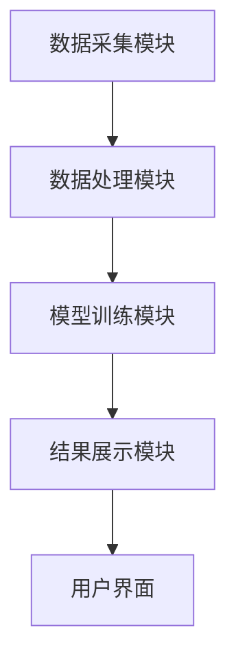

                 

# AI如何优化格雷厄姆的企业价值计算

## 关键词：人工智能, 企业价值计算, 格雷厄姆, 机器学习, 财务分析

## 摘要：本文探讨了如何利用人工智能技术优化格雷厄姆的企业价值计算方法。通过分析数据特征、选择合适的机器学习模型，并结合系统架构设计，提出了一种基于AI的企业价值计算优化方案。本文详细讲解了从数据预处理到模型训练的全过程，并通过实际案例展示了AI在提升计算准确性和效率方面的能力。

---

## 第一部分: 格雷厄姆企业价值计算的背景与基础

### 第1章: 格雷厄姆企业价值计算概述

#### 1.1 企业价值计算的基本概念

- **企业价值（Enterprise Value, EV）**：指企业整体的市场价值，包括股权和债权的总价值。计算公式为：EV = 市盈率 × 收益 + 企业债务 - 现金储备。

- **格雷厄姆的价值投资理论**：格雷厄姆是价值投资之父，主张以低于内在价值的价格买入股票。他提出的企业价值计算方法包括股息贴现模型（DDM）和可比企业分析等。

- **传统企业价值计算方法**：主要包括DCF模型（现金流折现法）和相对估值法（如EV/EBITDA倍数）。这些方法依赖于大量历史财务数据和市场数据，计算过程复杂且耗时。

#### 1.2 人工智能与企业价值计算的结合

- **AI的优势**：AI能够处理大量非结构化数据（如新闻、社交媒体数据）和结构化数据，通过机器学习算法自动识别影响企业价值的关键因素，提高预测准确性。

- **数据驱动的决策**：AI可以从海量数据中提取特征，建立预测模型，帮助企业更精准地评估其价值，从而优化投资决策。

- **实时更新与调整**：AI系统能够实时更新数据，及时反映市场变化，使企业价值评估更加动态和准确。

---

## 第二部分: AI优化企业价值计算的核心方法

### 第2章: 数据特征提取与分析

#### 2.1 数据预处理

- **数据清洗**：处理缺失值、异常值和重复数据，确保数据质量。
- **特征工程**：从财务报表、市场数据、新闻舆情等多源数据中提取特征，如收益增长率、市盈率、行业趋势等。
- **文本数据处理**：对新闻、社交媒体等非结构化数据进行分词、情感分析，提取对公司价值有影响的关键信息。

#### 2.2 数据特征选择

- **特征重要性评估**：使用LASSO回归或随机森林等方法评估各个特征的重要性，剔除冗余特征。
- **降维技术**：应用主成分分析（PCA）等技术降低特征维度，减少计算复杂度。

### 第3章: 机器学习模型的选择与训练

#### 3.1 算法选择

- **线性回归模型**：适用于线性关系，但可能无法捕捉复杂特征。
- **支持向量机（SVM）**：在小样本数据上表现良好，适合处理高维数据。
- **随机森林与梯度提升树**：能够处理非线性关系，适合特征较多的情况。
- **深度学习模型**：如LSTM，适合时间序列数据，能够捕捉长期依赖关系。

#### 3.2 模型训练

- **训练数据准备**：将数据分为训练集和测试集，进行交叉验证。
- **模型调参**：通过网格搜索优化模型参数，如学习率、树的深度等。
- **模型评估**：使用准确率、召回率、F1分数等指标评估模型性能。

### 第4章: 模型优化与部署

#### 4.1 模型优化

- **超参数优化**：使用网格搜索或随机搜索优化模型参数。
- **集成学习**：通过集成多个模型的结果（如投票法、加权平均）提高预测准确性。

#### 4.2 模型部署

- **API接口开发**：将训练好的模型封装成API，方便其他系统调用。
- **实时监控**：监控模型的预测效果，及时发现数据漂移或模型失效。

---

## 第三部分: 系统架构与实现

### 第5章: 系统架构设计

#### 5.1 系统模块划分

- **数据采集模块**：从多种数据源（财务报表、新闻、社交媒体）获取数据。
- **数据处理模块**：清洗、特征工程、降维。
- **模型训练模块**：选择算法，训练模型，优化参数。
- **结果展示模块**：以可视化形式展示预测结果和模型解释。

#### 5.2 系统架构图

#### 5.3 接口设计

- **数据接口**：提供REST API，供其他系统调用数据处理模块。
- **模型接口**：提供预测API，返回企业价值预测结果。
- **用户接口**：Web界面，供用户输入数据，查看结果。

### 第6章: 项目实战与案例分析

#### 6.1 项目实战

- **环境安装**：安装Python、机器学习库（scikit-learn、XGBoost、Keras）、数据处理库（pandas、numpy）。
- **代码实现**：编写数据处理、模型训练、结果展示的代码。

#### 6.2 案例分析

- **数据来源**：使用公开的财务数据和新闻数据，进行企业价值预测。
- **模型效果对比**：比较传统方法与AI优化方法的预测准确率，展示AI的优势。

---

## 第四部分: 总结与展望

### 第7章: 总结与展望

- **总结**：AI通过优化数据处理和模型选择，显著提升了企业价值计算的准确性和效率。
- **展望**：未来可以进一步研究如何结合多模态数据（如图像数据）进行企业价值预测，以及探索更先进的深度学习模型（如Transformer）的应用。

---

## 附录

- **数据集**：公开的财务数据和文本数据来源。
- **代码仓库**：Github上开源的项目代码。

---

通过以上步骤，我们可以看到AI如何一步步优化格雷厄姆的企业价值计算方法，从数据处理到模型选择，再到系统实现，AI技术的应用为企业价值评估带来了显著的提升。这种方法不仅提高了计算的准确性，还大大节省了时间和成本，为投资者提供了更有力的决策支持。

