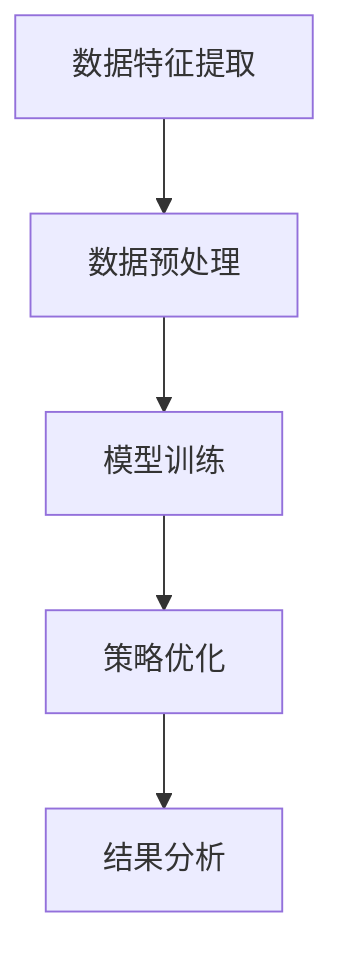
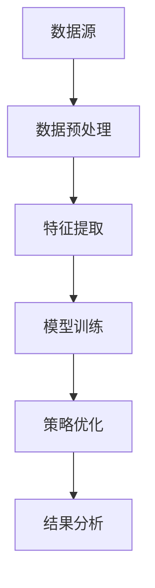
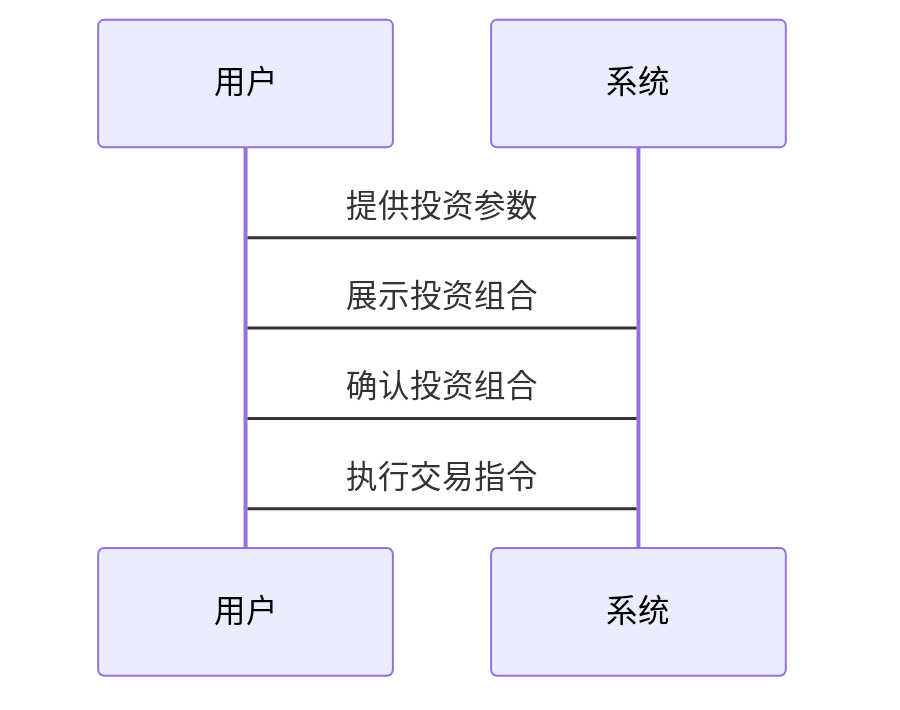

                 


# 《AI如何优化格雷厄姆的净净股策略》

---

## 关键词：
- AI优化
- 净净股策略
- 机器学习
- 股票投资
- 算法优化

---

## 摘要：
本文探讨了如何利用人工智能技术优化格雷厄姆的净净股策略。通过分析净净股策略的传统方法及其局限性，结合机器学习、数据特征提取和策略优化的数学模型，提出了一种基于AI的优化方案。文章详细介绍了AI优化的算法原理、系统架构设计和实际项目案例，展示了如何通过技术手段提升投资策略的效率和收益。最终，本文为读者提供了一种结合传统投资理念与现代技术的创新方法，帮助投资者在复杂多变的市场中做出更明智的决策。

---

# 目录大纲

---

## 第一部分：净净股策略与AI优化概述

### 第1章：净净股策略的背景与核心概念

#### 1.1 净净股策略的基本概念
- 1.1.1 净净股策略的定义
  - 净净股策略是由本杰明·格雷厄姆提出的一种投资策略，主要关注那些市场价格低于其净资产价值的股票。
- 1.1.2 净净股策略的核心要素
  - 市场价格与净资产价值的比较
  - 低市净率股票的筛选标准
  - 投资组合的构建与风险控制
- 1.1.3 净净股策略的投资哲学
  - 价值投资理念
  - 安全边际的重要性
  - 长期投资与复利效应

#### 1.2 AI在金融投资中的应用背景
- 1.2.1 人工智能在金融领域的应用现状
  - 数据分析与预测
  - 自动化交易
  - 风险管理
- 1.2.2 AI在股票投资中的优势与挑战
  - 数据处理能力与模式识别的优势
  - 模型过拟合与数据稀疏性的挑战
- 1.2.3 净净股策略与AI结合的可行性分析
  - 数据驱动的特征提取
  - AI辅助的策略优化
  - 大数据环境下的应用潜力

#### 1.3 净净股策略与AI优化的结合
- 1.3.1 净净股策略的传统局限性
  - 数据局限性：传统策略依赖于简单的市净率指标，忽略了其他重要因素。
  - 时间局限性：传统策略无法实时动态调整，难以应对市场的快速变化。
  - 人为因素影响：主观判断可能导致策略执行偏差。
- 1.3.2 AI如何弥补这些局限性
  - 数据特征的扩展：通过AI技术提取更多的数据特征，丰富筛选标准。
  - 动态优化：利用机器学习模型实时调整策略，适应市场变化。
  - 风险控制：通过AI进行风险预测和量化分析，降低投资风险。
- 1.3.3 AI优化后的策略优势
  - 提高筛选效率
  - 增强策略的适应性
  - 优化投资组合的风险收益比

#### 1.4 本章小结
- 本章介绍了净净股策略的基本概念和AI在金融投资中的应用背景，重点分析了AI如何优化净净股策略的潜力和优势。

---

## 第二部分：净净股策略的核心概念与AI优化机制

### 第2章：净净股策略的核心概念与AI优化机制

#### 2.1 净净股策略的核心概念
- 2.1.1 净值与市净率的计算公式
  - 净值（NAV）：净资产价值，即资产减去负债。
  - 市净率（P/B）：市场价格与净资产价值的比率。
  - 计算公式：
    $$ P/B = \frac{\text{市场价格}}{\text{净资产价值}} $$
- 2.1.2 净净股策略的筛选标准
  - 低市净率（P/B < 1）
  - 高质量的资产
  - 稳定的盈利能力
- 2.1.3 净净股策略的适用场景
  - 经济周期性分析
  - 行业特性分析
  - 市场波动性分析

#### 2.2 AI优化机制的原理
- 2.2.1 数据特征的扩展与增强
  - 传统特征：市净率、净利润率、资产负债率。
  - 新增特征：市盈率、ROE（净资产收益率）、行业景气度。
  - 数据来源：财务报表、市场数据、新闻情感分析。
- 2.2.2 机器学习模型的构建与训练
  - 分类模型：用于识别潜在的低市净率股票。
  - 回归模型：用于预测股票的未来表现。
  - 模型选择：随机森林、支持向量机（SVM）、神经网络。
- 2.2.3 策略优化的数学模型
  - 线性回归模型：用于预测股票价格与市净率的关系。
    $$ y = \beta_0 + \beta_1x_1 + \beta_2x_2 + ... + \beta_nx_n $$
  - 支持向量机（SVM）：用于分类问题，优化投资组合的选择。
    $$ \text{minimize} \quad \frac{1}{2}||\beta||^2 $$
    $$ \text{subject to} \quad y_i - \beta^T x_i \geq 1 \quad \forall i $$

#### 2.3 净净股策略与AI优化的关系
- 2.3.1 数据特征的扩展与增强
  - 通过AI技术提取更多的数据特征，丰富筛选标准。
- 2.3.2 策略优化的动态调整
  - AI模型实时更新，根据市场变化动态调整策略。
- 2.3.3 风险控制与收益优化的平衡
  - AI辅助的风险预测和量化分析，降低投资风险。
  - 优化投资组合的风险收益比。

#### 2.4 本章小结
- 本章详细探讨了净净股策略的核心概念，并分析了AI优化机制的原理，重点介绍了数据特征的扩展、机器学习模型的构建与训练，以及策略优化的数学模型。

---

## 第三部分：AI优化净净股策略的算法原理

### 第3章：AI优化净净股策略的算法原理

#### 3.1 数据特征提取与处理
- 3.1.1 数据特征的选择标准
  - 与投资收益相关的特征：市净率、ROE、净利润率。
  - 市场情绪特征：新闻情感分析、社交媒体 sentiment。
- 3.1.2 数据预处理方法
  - 数据清洗：处理缺失值、异常值。
  - 数据标准化：归一化处理。
  - 数据分割：训练集、验证集、测试集。
- 3.1.3 数据标准化与归一化
  - 标准化：使数据具有相同的尺度。
    $$ z = \frac{x - \mu}{\sigma} $$
  - 归一化：将数据缩放到0-1范围。
    $$ x' = \frac{x - \min(x)}{\max(x) - \min(x)} $$

#### 3.2 机器学习模型的构建与训练
- 3.2.1 线性回归模型的构建
  - 简单线性回归：单变量回归。
    $$ y = \beta_0 + \beta_1x $$
  - 多变量线性回归：多个特征的回归。
    $$ y = \beta_0 + \beta_1x_1 + \beta_2x_2 + ... + \beta_nx_n $$
- 3.2.2 支持向量机（SVM）的应用
  - 分类问题：将股票分为高收益与低收益两类。
  - SVM的优势：处理非线性关系。
- 3.2.3 随机森林与梯度提升树的对比
  - 随机森林：基于决策树的集成模型。
  - 梯度提升树：基于 boosting 的集成模型。
  - 对比分析：计算准确率、精确率、召回率。

#### 3.3 策略优化的数学模型
- 3.3.1 线性回归模型的数学公式
  - 优化目标：最小化均方误差。
    $$ \text{minimize} \quad \frac{1}{2m}\sum_{i=1}^{m}(y_i - \hat{y}_i)^2 $$
  - 正则化项：防止过拟合。
    $$ \text{加上正则化项} \quad \lambda||\beta||^2 $$
- 3.3.2 支持向量机的优化目标
  - 优化目标：最大化分类间隔。
    $$ \text{maximize} \quad \frac{1}{2}||\beta||^2 $$
  - 分类间隔：$$ y_i (\beta^T x_i + b) \geq 1 \quad \forall i $$

#### 3.4 算法流程图


---

## 第四部分：系统架构设计

### 第4章：系统架构设计与实现

#### 4.1 项目介绍
- 项目目标：构建一个基于AI的净净股策略优化系统。
- 项目范围：从数据采集到策略优化的全过程。
- 项目技术选型：
  - 数据库：MySQL、MongoDB。
  - 数据处理：Python、Pandas。
  - 模型训练：Scikit-learn、XGBoost。
  - 可视化：Matplotlib、Plotly。

#### 4.2 系统功能设计
- 4.2.1 数据采集模块
  - 数据来源：历史股价、财务数据、新闻数据。
  - 数据接口：API调用（Yahoo Finance、Alpha Vantage）。
- 4.2.2 数据处理模块
  - 数据清洗：处理缺失值、异常值。
  - 数据特征工程：提取市净率、ROE、新闻情感等特征。
- 4.2.3 模型训练模块
  - 模型选择：随机森林、SVM、神经网络。
  - 超参数优化：网格搜索、随机搜索。
- 4.2.4 策略优化模块
  - 策略生成：基于模型预测结果生成投资组合。
  - 风险控制：VaR（Value at Risk）计算。
- 4.2.5 结果分析模块
  - 性能评估：准确率、精确率、召回率。
  - 回测分析：历史数据验证策略的有效性。

#### 4.3 系统架构设计
- 4.3.1 系统架构图

- 4.3.2 数据流图


#### 4.4 系统交互设计
- 4.4.1 系统交互流程
  1. 用户输入投资参数（如风险承受能力、投资期限）。
  2. 系统根据参数生成投资组合。
  3. 系统展示投资组合的预期收益与风险。
  4. 用户确认后，系统执行交易指令。
- 4.4.2 交互序列图


---

## 第五部分：项目实战

### 第5章：AI优化净净股策略的项目实战

#### 5.1 环境配置
- 5.1.1 系统环境
  - 操作系统：Linux/MacOS/Windows。
  - 开发工具：Jupyter Notebook、PyCharm。
- 5.1.2 Python库安装
  ```python
  pip install numpy pandas scikit-learn xgboost matplotlib
  ```

#### 5.2 数据处理与特征工程
- 5.2.1 数据采集
  - 示例代码：
    ```python
    import pandas as pd
    df = pd.read_csv('stock_data.csv')
    ```
- 5.2.2 数据预处理
  ```python
  # 处理缺失值
  df.dropna(inplace=True)
  
  # 标准化处理
  from sklearn.preprocessing import StandardScaler
  scaler = StandardScaler()
  df_scaled = pd.DataFrame(scaler.fit_transform(df))
  ```

#### 5.3 模型实现
- 5.3.1 线性回归模型
  ```python
  from sklearn.linear_model import LinearRegression
  model = LinearRegression()
  model.fit(X_train, y_train)
  ```
- 5.3.2 随机森林模型
  ```python
  from sklearn.ensemble import RandomForestRegressor
  model = RandomForestRegressor(n_estimators=100, random_state=42)
  model.fit(X_train, y_train)
  ```

#### 5.4 策略优化与回测
- 5.4.1 策略优化
  ```python
  # 假设模型预测了股票的未来收益
  predicted_returns = model.predict(X_test)
  # 生成投资组合
  portfolio = []
  for i in range(len(predicted_returns)):
      if predicted_returns[i] > 0.05:
          portfolio.append('买入')
      else:
          portfolio.append('卖出')
  ```
- 5.4.2 回测分析
  ```python
  # 计算回测收益
  returns = []
  for i in range(len(portfolio)):
      if portfolio[i] == '买入':
          returns.append(df_test['return'][i] * 1.05)
      else:
          returns.append(df_test['return'][i] * 0.95)
  total_return = sum(returns)
  ```

#### 5.5 项目小结
- 本章通过一个具体的项目案例，展示了如何利用AI优化净净股策略。从环境配置到数据处理，再到模型实现和策略优化，详细介绍了整个过程中的关键步骤和技术细节。

---

## 第六部分：总结与展望

### 第6章：总结与展望

#### 6.1 总结
- 6.1.1 核心内容回顾
  - 净净股策略的基本概念。
  - AI优化的原理与算法。
  - 系统架构设计与实现。
  - 项目实战与经验分享。
- 6.1.2 本书的主要贡献
  - 提供了AI优化净净股策略的系统性解决方案。
  - 通过实际案例展示了技术的应用与效果。
  - 为投资者提供了新的工具和方法。

#### 6.2 未来展望
- 6.2.1 研究方向
  - 更复杂的数据特征提取。
  - 更高效的模型训练方法。
  - 更精准的策略优化算法。
- 6.2.2 技术趋势
  - 大模型的应用：利用GPT-4等大语言模型辅助投资决策。
  - 联合学习：通过联邦学习技术保护数据隐私。
  - 实时交易系统：开发低延迟的实时交易系统。

#### 6.3 最佳实践Tips
- 数据是关键：确保数据的完整性和准确性。
- 模型选择：根据具体情况选择合适的模型。
- 风险控制：始终将风险控制放在首位。
- 持续优化：定期更新模型和策略，适应市场变化。

#### 6.4 本章小结
- 本章总结了本书的核心内容，并展望了未来的研究方向和技术趋势，同时给出了实际投资中的最佳实践建议。

---

## 参考文献
- 格雷厄姆，本杰明. 《证券分析》
- 弗兰克尔，大卫. 《投资的周期》
- 哈里·马科维茨. 《投资组合理论》
- 张成, 等. 《机器学习在金融中的应用》
- 李军, 等. 《基于AI的股票预测方法研究》

---

## 致谢
感谢读者的支持与关注，感谢在写作过程中给予帮助的朋友们。

