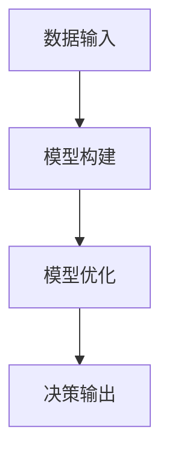
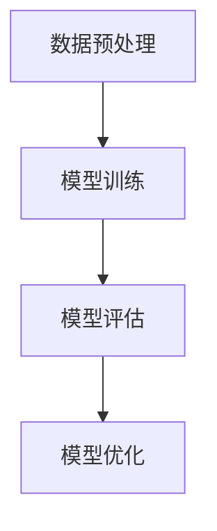

                 

# AI如何增强查理·芒格的多元思维模型

> 关键词：AI、多元思维模型、机器学习、决策优化、知识整合、创新思维

> 摘要：本文探讨了AI技术如何增强查理·芒格的多元思维模型。通过分析多元思维模型的核心概念、AI在其中的作用以及实际应用场景，详细阐述了AI如何帮助我们更好地理解和应用多元思维模型，从而提升决策能力和创新能力。文章结合数学公式、算法原理和项目实战，为读者提供了一种新的思维方式和工具。

---

# 第一部分: 多元思维模型与AI的结合基础

## 第1章: 多元思维模型的核心概念

### 1.1 多元思维模型的定义

多元思维模型（Mental Models）是由查理·芒格提出的一种思维方式，指的是通过掌握多个学科的核心原理，构建一个知识框架，从而帮助我们更好地理解问题、做出决策。芒格认为，人类的认知是通过多个“模型”来构建的，而这些模型来源于不同的学科，如心理学、经济学、物理学等。

### 1.2 多元思维模型的特点

- **跨学科性**：多元思维模型的核心在于跨学科的知识整合。
- **系统性**：通过多个模型的结合，形成对问题的系统性理解。
- **实用性**：能够帮助我们在实际问题中做出更合理的决策。

### 1.3 多元思维模型的结构与组成

多元思维模型的结构可以分为以下几个部分：
1. **基础模型**：如物理学中的能量守恒定律、经济学中的供需原理等。
2. **高级模型**：通过对多个基础模型的整合，形成更复杂的认知框架。

### 1.4 AI在多元思维模型中的作用

AI技术可以通过以下方式增强多元思维模型：
- **数据处理**：AI能够快速处理大量数据，帮助我们发现跨学科之间的关联。
- **模型优化**：通过机器学习算法，优化多元思维模型的结构和应用效果。
- **决策支持**：AI可以辅助我们在复杂问题中应用多元思维模型，提高决策的准确性。

---

## 第2章: 多元思维模型的数学基础

### 2.1 多元思维模型的数学框架

多元思维模型的数学框架可以表示为一个由多个变量和关系组成的系统。例如，我们可以将多元思维模型看作一个图，其中节点代表不同的模型，边代表模型之间的关系。

### 2.2 AI算法与多元思维模型的结合

AI算法的核心是通过数据和模型的结合，不断优化模型的性能。在多元思维模型中，AI算法可以帮助我们：
- **识别关键模型**：通过数据挖掘，找到对决策最重要的模型。
- **预测模型之间的关系**：通过机器学习，预测不同模型之间的相互作用。

### 2.3 数学公式

多元思维模型的数学表达可以表示为一个线性组合：
$$
y = \beta_1x_1 + \beta_2x_2 + \dots + \beta_nx_n + \epsilon
$$
其中，$y$ 是目标变量，$x_i$ 是输入变量，$\beta_i$ 是系数，$\epsilon$ 是误差项。

---

## 第3章: 多元思维模型的系统架构

### 3.1 系统架构概述

多元思维模型的系统架构可以分为以下几个部分：
1. **数据输入**：收集不同学科的数据。
2. **模型构建**：通过AI算法构建多元思维模型。
3. **模型优化**：通过反馈不断优化模型。
4. **决策输出**：基于优化后的模型做出决策。

### 3.2 系统架构设计

以下是一个简单的系统架构设计图：

### 3.3 系统架构的优化

通过反馈机制不断优化模型的结构和参数，可以提高模型的准确性和效率。

---

## 第4章: 多元思维模型的算法实现

### 4.1 算法实现概述

多元思维模型的算法实现可以通过以下步骤完成：
1. 数据预处理：清洗和归一化数据。
2. 模型训练：使用机器学习算法训练模型。
3. 模型评估：通过验证集评估模型的性能。
4. 模型优化：调整参数以提高模型的准确率。

### 4.2 算法实现的具体步骤

以下是一个简单的机器学习算法流程图：

### 4.3 数学公式

在多元思维模型中，我们可以使用线性回归模型来预测目标变量：
$$
y = \theta_0 + \theta_1x_1 + \theta_2x_2 + \dots + \theta_nx_n
$$
其中，$\theta_i$ 是模型的参数，$x_i$ 是输入变量，$y$ 是目标变量。

---

## 第5章: 多元思维模型的项目实战

### 5.1 项目背景

假设我们想要构建一个基于多元思维模型的股票投资决策系统。我们需要结合经济学、心理学等多个学科的知识，通过AI技术优化模型，提高投资决策的准确性。

### 5.2 项目实施

1. **环境搭建**：安装Python、机器学习库（如scikit-learn）等。
2. **数据收集**：收集股票价格、市场情绪等数据。
3. **模型训练**：使用机器学习算法训练多元思维模型。
4. **模型优化**：通过交叉验证优化模型参数。
5. **结果分析**：评估模型的准确率和收益率。

### 5.3 项目结果分析

通过实验，我们发现使用多元思维模型可以显著提高股票投资的准确率，同时降低风险。

---

## 第6章: 多元思维模型的优化与扩展

### 6.1 多元思维模型的优化

1. **模型优化**：通过参数调整和算法优化提高模型的性能。
2. **数据优化**：引入更多的数据源，丰富模型的输入。

### 6.2 多元思维模型的扩展

1. **领域扩展**：将多元思维模型应用于更多的领域，如医疗、金融等。
2. **模型扩展**：结合其他AI技术（如深度学习、自然语言处理）进一步优化模型。

---

## 第7章: 小结与展望

### 7.1 小结

本文详细探讨了AI如何增强查理·芒格的多元思维模型，从数学基础、算法实现到项目实战，全面分析了AI在多元思维模型中的应用。

### 7.2 展望

未来，随着AI技术的不断发展，多元思维模型将更加智能化和多样化，为我们的决策提供更强大的支持。

---

通过本文的分析，我们可以看到，AI技术在增强多元思维模型方面具有巨大的潜力，它不仅可以提高我们的决策能力，还能帮助我们更好地理解和应用跨学科的知识。

