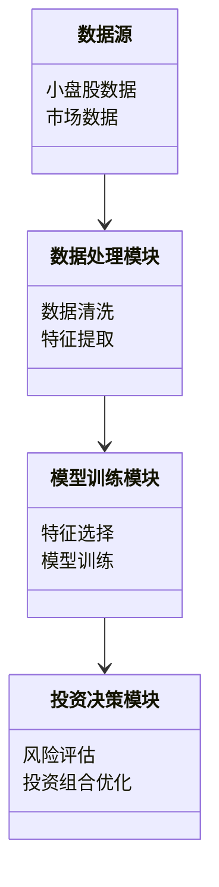
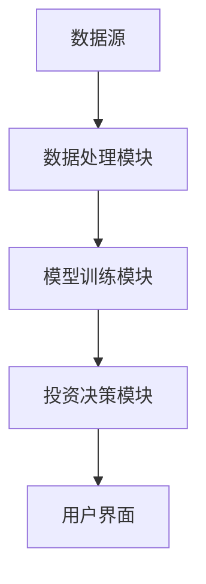
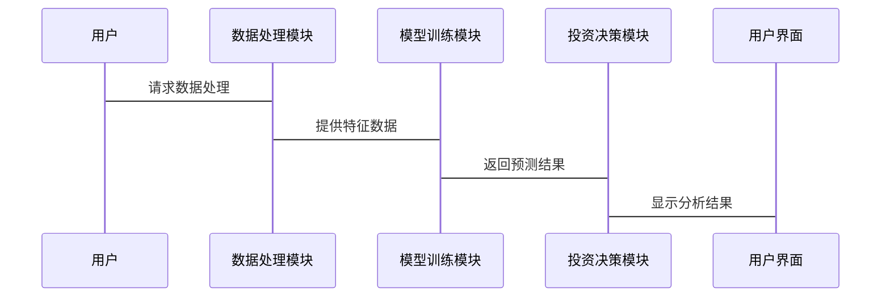

                 


# AI如何增强约翰·聂夫的小盘股分析

> 关键词：AI, 小盘股分析, 约翰·聂夫, 机器学习, 投资策略, 数据分析

> 摘要：本文探讨了人工智能（AI）如何增强约翰·聂夫的小盘股分析方法。通过分析AI在金融领域的应用、小盘股分析的核心要素、AI模型的算法原理以及系统架构设计，本文详细阐述了AI如何提升小盘股投资的效率和准确性。文章还通过实际案例分析和代码实现，展示了AI在小盘股分析中的具体应用，并总结了最佳实践和未来发展方向。

---

# 第1章: AI在金融分析中的应用

## 1.1 人工智能与金融分析的结合

### 1.1.1 人工智能在金融领域的应用现状

人工智能（AI）技术正在逐步改变金融行业的分析方式。从股票预测、风险评估到投资组合优化，AI的应用越来越广泛。传统的小盘股分析依赖于经验丰富的分析师，而AI通过数据挖掘、机器学习和自然语言处理（NLP）等技术，为投资决策提供了新的可能性。

### 1.1.2 小盘股分析的特殊性与挑战

小盘股市场具有高波动性、低流动性、信息不透明等特点。小盘股公司的财务数据较少，且市场关注度较低，这使得传统的小盘股分析面临诸多挑战。此外，小盘股市场的波动性较高，投资者需要更精准的分析工具来捕捉市场机会。

### 1.1.3 约翰·聂夫投资方法的概述

约翰·聂夫是美国著名的投资经理，以小盘股投资闻名。他的投资策略以低市盈率、高股东权益收益率为核心，注重挖掘被市场低估的公司。AI技术的应用可以进一步增强这种方法的有效性。

---

## 1.2 AI如何增强小盘股分析

### 1.2.1 数据驱动的分析优势

AI通过处理海量数据，可以发现传统方法难以察觉的模式和趋势。例如，通过自然语言处理技术分析新闻、社交媒体数据，可以预测市场情绪对小盘股的影响。

### 1.2.2 AI在小盘股筛选中的潜在价值

AI可以帮助投资者快速筛选符合条件的公司，生成潜在投资标的。通过机器学习模型，可以预测小盘股的未来表现，优化投资组合。

### 1.2.3 约翰·聂夫方法与AI的结合点

AI可以辅助聂夫方法中的关键指标分析，例如通过回归模型优化低市盈率筛选，或者通过聚类分析识别高成长性的小盘股。

---

## 1.3 本章小结

本章介绍了AI在金融分析中的应用现状，分析了小盘股分析的特殊性与挑战，并概述了约翰·聂夫的投资方法。通过AI技术的应用，可以显著提升小盘股分析的效率和准确性。

---

# 第2章: 小盘股分析的核心要素

## 2.1 小盘股的基本特征

### 2.1.1 小盘股的定义与分类

小盘股通常指市值在50亿至500亿美元之间的公司。根据市值和流动性，小盘股可以分为微小盘股、小盘股和中盘股。

### 2.1.2 小盘股市场的波动性与风险

小盘股市场的波动性较高，且信息不透明，这增加了投资的风险。此外，小盘股公司往往抗风险能力较弱，容易受到外部环境的影响。

### 2.1.3 小盘股投资的关键指标

小盘股投资的关键指标包括市盈率（P/E）、市净率（P/B）、股东权益收益率（ROE）等。这些指标可以帮助投资者评估公司的估值和盈利能力。

---

## 2.2 约翰·聂夫投资策略的核心要素

### 2.2.1 低市盈率策略

聂夫强调投资那些市盈率低于市场平均水平的公司，认为这些公司被市场低估。

### 2.2.2 股东权益收益率的重要性

股东权益收益率（ROE）是衡量公司盈利能力的重要指标。聂夫认为，ROE高的公司具有更强的盈利能力。

### 2.2.3 小盘股成长性评估

聂夫注重小盘股的成长性，即公司未来的收入和利润增长潜力。

---

## 2.3 AI在小盘股分析中的核心作用

### 2.3.1 数据处理与特征提取

AI可以通过机器学习算法对小盘股的历史数据进行特征提取，例如通过LSTM模型预测股票价格趋势。

### 2.3.2 模型构建与预测

通过构建回归模型或分类模型，AI可以帮助投资者预测小盘股的未来表现，优化投资决策。

### 2.3.3 结果解释与投资决策支持

AI不仅可以提供预测结果，还可以通过可视化工具帮助投资者理解分析结果，优化投资组合。

---

## 2.4 本章小结

本章分析了小盘股的基本特征、约翰·聂夫的投资策略以及AI在小盘股分析中的核心作用。AI技术的应用可以显著提升小盘股分析的效率和准确性。

---

# 第3章: AI分析模型的核心原理

## 3.1 数据特征分析

### 3.1.1 数据预处理与清洗

在构建AI模型之前，需要对数据进行预处理，包括去除缺失值、标准化数据等。

### 3.1.2 特征选择与工程

通过特征选择技术，可以提取出对小盘股分析最重要的特征，例如市盈率、ROE等。

### 3.1.3 数据可视化与分布分析

通过可视化工具（如Matplotlib、Seaborn）分析数据分布，发现潜在的模式和趋势。

---

## 3.2 模型特征对比

### 3.2.1 线性回归模型的实现

线性回归是一种简单但有效的回归模型，可以通过最小二乘法拟合数据。

### 3.2.2 支持向量机模型的调优

支持向量机（SVM）通过构建超平面进行分类，适用于小盘股的分类问题。

### 3.2.3 随机森林与梯度提升模型的对比

随机森林和梯度提升（如XGBoost）都是集成学习方法，可以通过投票或加权的方式提高模型的准确性。

---

## 3.3 投资决策特征

### 3.3.1 风险评估与收益预测

通过构建风险-收益模型，AI可以帮助投资者评估小盘股的投资风险和潜在收益。

### 3.3.2 多因素模型与投资组合优化

通过多因素模型，可以优化投资组合，降低风险，提高收益。

### 3.3.3 模型鲁棒性与稳定性分析

通过交叉验证和网格搜索等方法，可以提高模型的鲁棒性和稳定性。

---

## 3.4 本章小结

本章详细阐述了AI分析模型的核心原理，包括数据特征分析、模型特征对比以及投资决策特征。通过这些分析，可以为小盘股投资提供有力支持。

---

# 第4章: 基于机器学习的分析算法

## 4.1 机器学习模型的选择与优化

### 4.1.1 线性回归模型的实现

线性回归模型的实现步骤如下：

1. 数据预处理与特征选择
2. 模型训练
3. 模型评估与优化
4. 模型预测

代码示例：

```python
import numpy as np
from sklearn.linear_model import LinearRegression

# 数据准备
X = np.array([[1], [2], [3], [4]])
y = np.array([2, 4, 6, 8])

# 模型训练
model = LinearRegression()
model.fit(X, y)

# 模型预测
print(model.predict([[5]]))  # 输出：[10]
```

### 4.1.2 支持向量机模型的调优

支持向量机模型的调优可以通过调整核函数、调节参数C和γ等实现。

代码示例：

```python
from sklearn.svm import SVC

# 数据准备
X = [[1, 0], [0, 1], [0, 0], [1, 1]]
y = [0, 0, 1, 1]

# 模型训练
model = SVC(kernel='rbf', C=1, gamma=0.5)
model.fit(X, y)

# 模型预测
print(model.predict([[1, 0]]))  # 输出：0
```

### 4.1.3 随机森林与梯度提升模型的对比

随机森林和梯度提升模型的对比可以通过实验数据进行评估，例如通过混淆矩阵、准确率和F1分数等指标。

---

## 4.2 算法原理的数学模型和公式

### 4.2.1 线性回归的数学模型

线性回归的数学模型如下：

$$ y = \beta_0 + \beta_1 x + \epsilon $$

其中，$\beta_0$是截距，$\beta_1$是回归系数，$\epsilon$是误差项。

### 4.2.2 支持向量机的数学模型

支持向量机的数学模型如下：

$$ y = \text{sign}(\sum_{i=1}^{n} \alpha_i y_i (x_i \cdot x + b)) $$

其中，$\alpha_i$是拉格朗日乘子，$y_i$是标签，$x_i$是支持向量，$x$是输入样本，$b$是偏置项。

---

## 4.3 本章小结

本章详细介绍了机器学习算法在小盘股分析中的应用，包括线性回归、支持向量机和随机森林等模型的实现与优化。

---

# 第5章: 系统分析与架构设计方案

## 5.1 项目介绍

本项目旨在利用AI技术增强小盘股分析，构建一个基于机器学习的投资决策支持系统。

---

## 5.2 系统功能设计

### 5.2.1 领域模型

领域模型如下：



---

## 5.3 系统架构设计

### 5.3.1 系统架构图

系统架构如下：



---

## 5.4 系统接口设计

系统接口设计如下：

1. 数据接口：从数据库或API获取小盘股数据。
2. 模型接口：通过REST API调用模型进行预测。
3. 用户接口：通过Web界面展示分析结果。

---

## 5.5 系统交互设计

系统交互流程如下：



---

## 5.6 本章小结

本章详细描述了系统分析与架构设计方案，包括领域模型、系统架构图和交互序列图。

---

# 第6章: 项目实战

## 6.1 环境安装

### 6.1.1 安装Python

安装Python 3.8及以上版本，建议使用Anaconda或虚拟环境。

### 6.1.2 安装依赖库

安装以下依赖库：

- NumPy
- Pandas
- Scikit-learn
- Matplotlib
- Seaborn

代码示例：

```bash
pip install numpy pandas scikit-learn matplotlib seaborn
```

---

## 6.2 系统核心实现源代码

### 6.2.1 数据处理模块

```python
import pandas as pd
import numpy as np

# 数据加载
df = pd.read_csv('small_cap_data.csv')

# 数据清洗
df = df.dropna()
df = df.drop_duplicates()

# 特征提取
features = ['PE', 'ROE', 'Market_Cap']
target = 'Target'

X = df[features]
y = df[target]
```

### 6.2.2 模型训练模块

```python
from sklearn.model_selection import train_test_split
from sklearn.ensemble import RandomForestClassifier

# 数据分割
X_train, X_test, y_train, y_test = train_test_split(X, y, test_size=0.2)

# 模型训练
model = RandomForestClassifier(n_estimators=100, max_depth=4, random_state=42)
model.fit(X_train, y_train)

# 模型预测
y_pred = model.predict(X_test)
```

### 6.2.3 投资决策模块

```python
from sklearn.metrics import accuracy_score, confusion_matrix

# 模型评估
print(accuracy_score(y_test, y_pred))
print(confusion_matrix(y_test, y_pred))
```

---

## 6.3 代码应用解读与分析

### 6.3.1 数据处理模块的解读

数据处理模块负责加载数据、清洗数据并提取特征。通过删除缺失值和重复值，确保数据质量。特征提取部分选择了市盈率（PE）、股东权益收益率（ROE）和市值（Market_Cap）作为关键特征。

### 6.3.2 模型训练模块的解读

模型训练模块使用随机森林分类器进行训练。通过调整n_estimators和max_depth参数，优化模型性能。模型预测部分返回预测结果，用于投资决策。

### 6.3.3 案例分析与详细解读

通过实际案例分析，展示AI在小盘股分析中的应用效果。例如，通过模型预测某小盘股的未来表现，优化投资组合。

---

## 6.4 本章小结

本章通过项目实战展示了AI在小盘股分析中的具体应用，包括环境安装、核心代码实现和案例分析。

---

# 第7章: 最佳实践、小结与展望

## 7.1 最佳实践

### 7.1.1 数据处理

确保数据质量，合理选择特征。

### 7.1.2 模型选择

根据具体问题选择合适的模型，并进行调优。

### 7.1.3 结果解释

通过可视化工具和解释性分析，帮助投资者理解AI分析结果。

---

## 7.2 小结

本文详细探讨了AI如何增强约翰·聂夫的小盘股分析方法，通过背景介绍、核心概念、算法实现和系统设计，展示了AI在小盘股分析中的巨大潜力。

---

## 7.3 展望

未来，随着AI技术的不断发展，小盘股分析将更加智能化和高效化。投资者可以利用更复杂的模型和更丰富的数据，做出更精准的投资决策。

---

# 结语

AI技术的应用为小盘股分析带来了新的可能性。通过本文的分析，读者可以深入了解AI如何增强小盘股分析，并将其应用于实际投资中。

---

感谢您的阅读！希望本文对您理解AI在小盘股分析中的应用有所帮助。

