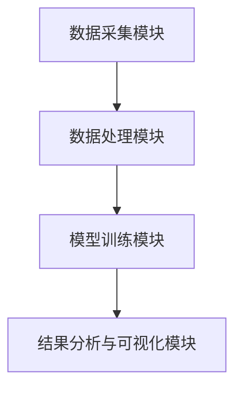

                 


# AI如何实现乔尔·格林布拉特的魔法公式优化

## 关键词：人工智能，投资模型，机器学习，魔法公式，金融分析

## 摘要：本文系统地探讨了如何利用人工智能技术优化乔尔·格林布拉特的魔法公式，通过机器学习和深度学习的方法，提升投资决策的准确性和效率。文章从背景介绍、AI技术基础、优化方法、系统设计、实战案例到应用价值，全面分析了AI在优化魔法公式中的应用，为投资者提供了新的视角和工具。

---

## 目录

# 人工智能如何优化乔尔·格林布拉特的魔法公式

## 第一部分：魔法公式与人工智能的结合

### 第1章：魔法公式的背景与原理

#### 1.1 魔法公式的定义
- **1.1.1 公式的构成**：ROE、ROA、利润率、负债率等指标的组合。
- **1.1.2 投资哲学**：寻找低估的优质企业。
- **1.1.3 应用场景**：筛选投资标的，评估公司价值。

#### 1.2 人工智能在金融分析中的作用
- 数据处理能力、模式识别、动态调整。
- 突破传统公式限制，提高准确性。

### 第2章：魔法公式的局限性

#### 2.1 指标权重固定的问题
- 不同行业权重不同，影响结果准确性。

#### 2.2 静态模型的不足
- 无法实时更新，市场变化反应迟钝。

#### 2.3 数据维度有限
- 未考虑非财务因素，如管理层素质、市场环境。

## 第二部分：AI优化魔法公式的方法论

### 第3章：数据预处理与特征工程

#### 3.1 数据清洗与标准化
- 处理缺失值、异常值，标准化财务指标。

#### 3.2 特征选择与降维
- 使用相关性分析、主成分分析优化特征。

#### 3.3 时间序列数据处理
- 应用滑动窗口、差分等方法处理时间依赖性。

### 第4章：机器学习优化魔法公式

#### 4.1 线性回归优化
- 通过梯度下降优化指标权重，公式变为：
  $$ \text{Score} = \sum (\beta_i \times \text{Feature}_i) $$
  其中，$\beta_i$是通过机器学习优化的权重。

#### 4.2 非线性模型的应用
- 使用随机森林或神经网络捕捉复杂关系，提升准确性。

### 第5章：深度学习优化魔法公式

#### 5.1 RNN处理时间序列
- 使用LSTM捕捉长期依赖，公式嵌入到模型中：
  $$ \text{Score}_t = \text{LSTM}(\text{Feature}_{t-n}到\text{Feature}_t) $$

#### 5.2 图神经网络分析行业关联
- 建模行业间的相互影响，优化全局得分。

## 第三部分：系统架构与实现

### 第6章：系统架构设计

#### 6.1 功能模块划分
- 数据采集、处理、模型训练、结果分析。

#### 6.2 系统架构图


#### 6.3 接口设计
- 数据接口：连接金融数据库。
- 模型接口：与第三方AI服务集成。

### 第7章：系统实现与代码解析

#### 7.1 环境搭建
- Python、TensorFlow、Pandas等工具的安装。

#### 7.2 核心代码实现
```python
def optimize_magic_formula(data, model):
    optimized_weights = model.train(data)
    scores = calculate_score(data, optimized_weights)
    return scores

class MagicFormulaAI:
    def __init__(self, data):
        self.data = data
        self.model = self.get_model()

    def get_model(self):
        return LSTMModel(input_dim=len(data.columns))
```

#### 7.3 代码解读
- 数据处理：清洗、标准化、特征选择。
- 模型训练：定义损失函数，优化权重。
- 结果分析：可视化、回测、风险评估。

## 第四部分：实战与应用

### 第8章：实战案例分析

#### 8.1 数据准备
- 选取某行业的历史财务数据，进行清洗和预处理。

#### 8.2 模型训练
- 使用LSTM训练模型，得到优化后的权重。

#### 8.3 模型评估
- 计算准确率、回撤、夏普比率，验证模型的有效性。

### 第9章：AI优化魔法公式的投资应用

#### 9.1 多因子模型的构建
- 组合多个优化后的指标，提升模型鲁棒性。

#### 9.2 风险控制
- 结合波动率、VaR等指标，优化投资组合。

#### 9.3 动态调整策略
- 实时更新模型，根据市场变化调整投资组合。

## 第五部分：总结与展望

### 第10章：总结与经验分享

#### 10.1 优化成果
- 提升了模型的准确性和适应性，降低投资风险。

#### 10.2 实施中的注意事项
- 数据质量、模型过拟合、市场环境变化的影响。

### 第11章：未来展望

#### 11.1 技术进步
- 更复杂模型的应用，如GPT-3在文本分析中的应用。

#### 11.2 投资策略的多样化
- 结合其他AI技术，如NLP分析管理层报告，构建多维度投资模型。

---

## 结语

通过系统的AI优化，乔尔·格林布拉特的魔法公式在投资决策中的表现得到了显著提升。本文详细探讨了从理论到实践的每一步，为投资者提供了新的视角和工具。未来，随着AI技术的不断发展，魔法公式及其他投资模型的优化将更加精准和高效。

