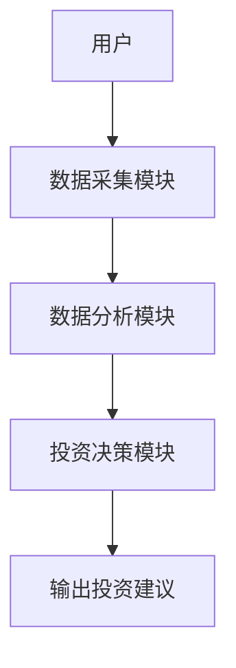

                 


# AI如何实现巴菲特的看人下注策略

> 关键词：人工智能，巴菲特策略，投资决策，行为分析，机器学习

> 摘要：本文将详细探讨如何利用人工智能技术实现巴菲特的看人下注策略。通过分析巴菲特的投资理念，结合现代AI技术，包括自然语言处理、机器学习和数学建模，探讨AI如何模拟和优化巴菲特的决策过程。文章从背景介绍、核心概念、算法原理、系统架构到项目实战，全面解析AI在投资决策中的应用。

---

## 第一部分：背景介绍

### 第1章 巴菲特看人下注策略概述

#### 1.1 巴菲特看人下注策略的核心思想

##### 1.1.1 投资中的“人”因素

巴菲特的看人下注策略强调对管理层的信任和能力评估。他倾向于投资于他信任的管理层，并通过长期持有这些公司的股票来实现收益。这种策略的核心在于对“人”的判断，而不仅仅是关注数字和市场趋势。

##### 1.1.2 巴菲特看人下注的决策逻辑

巴菲特的决策逻辑基于以下几个方面：
1. **管理层的能力和诚信**：他倾向于投资于那些由有能力且诚信的管理层领导的公司。
2. **企业基本面**：虽然关注管理层，但巴菲特并不忽视企业的基本面，如盈利能力、财务健康状况等。
3. **长期投资**：他偏好长期投资，相信优秀的企业能够在长期内为股东创造价值。

##### 1.1.3 巴菲特策略在现代投资中的应用

在现代投资中，巴菲特的策略仍然被广泛采用，尤其是在价值投资领域。然而，随着市场的复杂化和数据量的增加，单纯依赖人工分析已经难以应对所有情况。因此，引入AI技术来辅助分析成为一种趋势。

---

### 第2章 AI在投资决策中的潜力

#### 2.1 AI在金融领域的应用现状

AI在金融领域的应用广泛，包括股票预测、风险管理、交易自动化等。然而，大多数应用集中在量化分析和市场趋势预测，而对“人”的因素分析相对较少。

#### 2.2 巴菲特策略与AI的契合点

AI在分析人类行为和决策模式方面具有巨大潜力。通过自然语言处理（NLP）和机器学习，AI可以分析管理层的言论、行为模式，甚至预测其决策倾向。

#### 2.3 AI如何模拟巴菲特的看人下注能力

AI可以通过以下方式模拟巴菲特的看人下注能力：
1. **文本分析**：通过分析公司管理层的公开演讲、财报电话会议等文本数据，识别其语言风格、情绪倾向，进而推测其决策风格。
2. **行为建模**：利用历史数据，建立管理层行为的模型，预测其未来的决策。
3. **决策模拟**：基于AI模型，模拟巴菲特的决策过程，优化投资策略。

---

## 第二部分：AI实现巴菲特策略的核心概念

### 第3章 人类行为分析与模式识别

#### 3.1 人类决策的模式特征

##### 3.1.1 语言风格与决策倾向

通过分析文本数据，可以发现不同语言风格背后隐藏的决策倾向。例如，乐观的语言可能表明管理层对公司前景有信心，进而可能做出扩张性的决策。

##### 3.1.2 行为模式与决策预测

通过分析管理层的历史行为，可以识别其决策模式，例如倾向于在特定市场条件下做出某些决策。

##### 3.1.3 情绪与决策的关系

情绪是影响决策的重要因素。通过分析文本中的情感倾向，AI可以推测管理层的情绪状态，并预测其决策倾向。

#### 3.2 AI如何识别和预测人类行为

##### 3.2.1 自然语言处理（NLP）的应用

NLP技术可以帮助AI分析文本数据，提取情感倾向、关键词和语言风格等特征。

##### 3.2.2 机器学习模型的构建

通过训练机器学习模型，AI可以识别和预测人类行为模式。例如，使用监督学习模型（如随机森林、神经网络）进行分类或回归任务。

##### 3.2.3 数据特征的选择

选择合适的特征对于模型性能至关重要。例如，在分析管理层的演讲文本时，可以选择TF-IDF特征、情感倾向特征等。

#### 3.3 人类行为数据的特征提取

##### 3.3.1 文本特征提取

使用TF-IDF、词嵌入（如Word2Vec）等技术提取文本特征。

##### 3.3.2 语音特征提取

通过分析语音语调、语速等特征，推测说话者的情绪和态度。

##### 3.3.3 行为模式提取

通过聚类分析、时间序列分析等方法，提取行为模式。

---

### 第4章 投资决策的数学模型

#### 4.1 巴菲特策略的数学模型

##### 4.1.1 投资决策的数学表达式

假设我们有一个投资决策模型，其输入为管理层的特征，输出为投资建议。模型可以表示为：

$$
f(x) = \text{投资建议}
$$

其中，$x$ 是管理层的特征向量。

##### 4.1.2 投资组合优化的数学公式

投资组合优化的目标是最大化收益，同时最小化风险。可以使用均值-方差优化模型：

$$
\min_w \quad w^T \Sigma w \\
\text{s.t.} \quad w^T \mu = r \\
$$

其中，$w$ 是投资权重向量，$\Sigma$ 是协方差矩阵，$\mu$ 是收益均值向量，$r$ 是目标收益。

##### 4.1.3 巴菲特策略的数学验证

通过统计方法验证模型的准确性，例如使用交叉验证、回测分析等。

#### 4.2 AI算法的数学基础

##### 4.2.1 机器学习的核心数学公式

机器学习算法的核心是优化目标函数，例如：

$$
\min_w \quad \frac{1}{2m} \sum_{i=1}^{m} (y_i - w^T x_i)^2
$$

其中，$w$ 是模型参数，$x_i$ 是输入样本，$y_i$ 是标签。

##### 4.2.2 深度学习的数学模型

深度学习模型（如神经网络）的数学模型较为复杂，通常涉及多个层的非线性变换和优化。

##### 4.2.3 投资决策中的概率论应用

通过概率论分析投资风险，例如计算某只股票上涨的概率：

$$
P(\text{上涨}) = \frac{\text{历史上上涨的次数}}{\text{总次数}}
$$

---

## 第三部分：系统架构与设计

### 第5章 系统功能设计

#### 5.1 数据采集模块

##### 5.1.1 文本数据采集

从公开渠道获取公司管理层的演讲、财报电话会议等文本数据。

##### 5.1.2 市场数据采集

获取股票价格、市场指数等数据。

##### 5.1.3 数据预处理

清洗数据，提取有用特征，例如去停用词、分词等。

#### 5.2 数据分析模块

##### 5.2.1 文本分析

使用NLP技术分析文本数据，提取情感倾向、关键词等特征。

##### 5.2.2 数据建模

训练机器学习模型，进行分类或回归任务。

#### 5.3 投资决策模块

##### 5.3.1 模型预测

基于训练好的模型，预测投资建议。

##### 5.3.2 投资组合优化

根据预测结果，优化投资组合。

### 第6章 系统架构设计

#### 6.1 系统架构图



#### 6.2 数据流设计

用户输入查询请求，数据采集模块获取数据，传输到数据分析模块进行处理，最后由投资决策模块生成投资建议。

#### 6.3 模块交互设计

用户通过界面输入查询请求，数据采集模块获取数据，传输到数据分析模块进行处理，最后由投资决策模块生成投资建议，并返回给用户。

---

## 第四部分：项目实战与案例分析

### 第7章 项目实战

#### 7.1 环境安装

安装必要的Python库，如pandas、numpy、scikit-learn、spacy等。

#### 7.2 核心实现

##### 7.2.1 文本分析代码

```python
import spacy
nlp = spacy.load("en_core_web_sm")
text = "This is a sample text."
doc = nlp(text)
for token in doc:
    print(token.text, token.pos_)
```

##### 7.2.2 机器学习模型训练

```python
from sklearn.feature_extraction.text import TfidfVectorizer
from sklearn.svm import SVC
vectorizer = TfidfVectorizer()
X = vectorizer.fit_transform(corpus)
model = SVC()
model.fit(X, labels)
```

##### 7.2.3 投资组合优化

```python
import numpy as np
from scipy.optimize import minimize

def objective_function(w, Sigma, mu, target_return):
    return (w.T @ Sigma @ w) / 2

constraints = {
    'type': 'eq',
    'fun': lambda w: np.sum(w) - 1
}

result = minimize(objective_function, np.zeros(n), args=(Sigma, mu, target_return), constraints=constraints)
```

#### 7.3 案例分析

以某公司为例，训练模型分析其管理层的行为模式，并预测投资建议。

---

## 第五部分：最佳实践

### 第8章 最佳实践

#### 8.1 技术建议

选择合适的NLP和机器学习技术，确保数据质量和模型性能。

#### 8.2 业务建议

结合具体业务场景，优化模型和策略。

#### 8.3 伦理建议

注意数据隐私和伦理问题，确保模型的透明性和合规性。

---

## 总结

通过本文的详细探讨，我们了解了如何利用AI技术实现巴菲特的看人下注策略。从背景介绍到系统设计，再到项目实战，我们逐步解析了AI在投资决策中的应用。未来，随着AI技术的不断发展，这种结合将更加紧密，为投资决策提供更强大的支持。

---

**注意事项**：
- 数据隐私和伦理问题需要高度重视。
- 模型的准确性和稳定性需要不断优化。
- 结合具体业务场景，灵活调整模型和策略。

**拓展阅读**：
- 《Python机器学习》
- 《自然语言处理入门》
- 《投资学基础》

