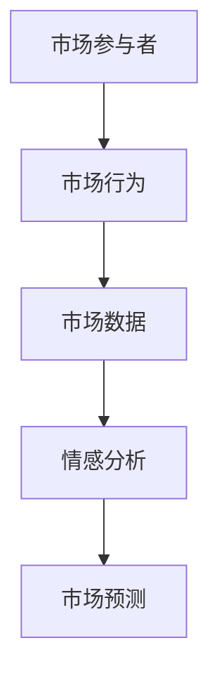
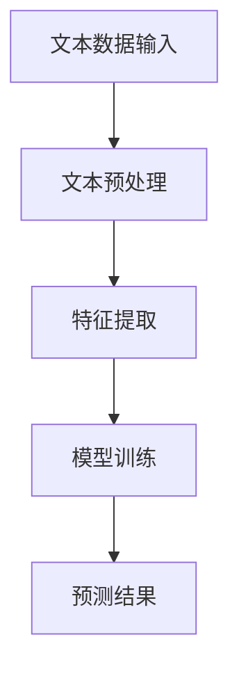

                 


# AI如何实现格雷厄姆的Mr. Market理论

## 关键词：AI、Mr. Market、市场情绪分析、情感分析、投资策略

## 摘要：本文探讨了如何利用人工智能技术，特别是自然语言处理和机器学习，来实现格雷厄姆的Mr. Market理论。通过分析市场情绪，AI能够帮助投资者做出更明智的投资决策。文章详细介绍了AI在市场情绪分析中的应用，包括情感分析算法、市场预测模型，以及实际的系统设计与项目实现。

---

# 第1章: 格雷厄姆的Mr. Market理论概述

## 1.1 Mr. Market的定义与核心思想

### 1.1.1 Mr. Market的起源与背景
Mr. Market是本杰明·格雷厄姆在其投资哲学中提出的一个比喻，代表市场的波动性和情绪化。他认为，市场并非总是理性的，而是经常被投资者的情绪左右，从而导致价格波动。

### 1.1.2 Mr. Market的核心理念与特征
- **情绪化**：市场情绪会在贪婪和恐惧之间波动。
- **非理性**：投资者的行为常常受到情绪影响，而非基本面因素。
- **可预测性**：通过分析市场情绪，投资者可以找到逆市场操作的机会。

### 1.1.3 Mr. Market与投资策略的关系
格雷厄姆的Mr. Market理论强调逆市场操作，即在市场恐慌时买入，在市场狂热时卖出。这一理论为价值投资奠定了基础。

---

## 1.2 AI技术的基本概念与应用

### 1.2.1 人工智能的基本定义
人工智能（AI）是指计算机系统模拟人类智能的能力，包括学习、推理、问题解决等。

### 1.2.2 机器学习与深度学习的核心原理
- **机器学习**：通过数据训练模型，使其能够从经验中学习。
- **深度学习**：基于人工神经网络的机器学习方法，能够处理复杂的非结构化数据。

### 1.2.3 自然语言处理（NLP）在AI中的作用
NLP用于分析文本数据，提取情感、主题和意图，是实现市场情绪分析的关键技术。

---

## 1.3 Mr. Market理论与AI的结合点

### 1.3.1 市场情绪分析与Mr. Market的关系
市场情绪分析是将市场数据转化为可量化的指标，帮助投资者理解市场心理。

### 1.3.2 AI在投资决策中的潜在应用
- **情感分析**：分析新闻、社交媒体等文本数据，提取市场情绪。
- **预测模型**：基于市场情绪和历史数据，预测未来市场走势。

### 1.3.3 Mr. Market理论的现代挑战与机遇
AI技术的进步为实现Mr. Market理论提供了新的工具，但也带来了数据质量和模型准确性的挑战。

---

# 第2章: AI实现Mr. Market理论的核心概念与联系

## 2.1 核心概念原理

### 2.1.1 市场情绪分析的数学模型
市场情绪分析涉及将文本数据转化为情感得分。常用的情感分析模型包括基于词袋模型的SVM和基于深度学习的LSTM。

### 2.1.2 Mr. Market理论的AI实现框架
AI实现Mr. Market理论的框架包括数据采集、情感分析、预测模型和结果展示。

### 2.1.3 情感分析与市场预测的关联
情感分析结果作为市场预测的输入，帮助模型理解市场情绪，从而做出更准确的预测。

---

## 2.2 核心概念属性特征对比表格

| 特性 | Mr. Market理论 | AI实现方式 |
|------|----------------|------------|
| 数据来源 | 市场情绪与投资者心理 | 文本数据、市场数据 |
| 分析方法 | 定性分析 | 定量分析 |
| 输出结果 | 情绪指标 | 情感得分、预测模型 |

---

## 2.3 ER实体关系图架构



---

# 第3章: AI实现Mr. Market理论的算法原理

## 3.1 情感分析算法

### 3.1.1 文本预处理流程
1. 分词：将文本分割成词语或短语。
2. 去停用词：去除无意义的词汇（如“的”、“了”）。
3. 词干提取：将词汇还原到基本形式。

### 3.1.2 基于TF-IDF的特征提取
TF-IDF用于衡量词语的重要性，公式为：
$$ TF-IDF(t, d) = TF(t, d) \times \log\left(\frac{N}{DF(t)}\right) $$
其中，$TF$是词频，$DF$是文档频率，$N$是文档总数。

### 3.1.3 支持向量机（SVM）分类器实现
SVM用于分类，通过构建超平面将数据分为正负两类。Python实现如下：

```python
from sklearn.svm import SVC
model = SVC(kernel='linear')
model.fit(X_train, y_train)
```

---

## 3.2 市场情绪预测算法

### 3.2.1 时间序列预测模型
时间序列模型如ARIMA用于预测未来趋势，公式为：
$$ ARIMA(p, d, q) $$
其中，$p$为自回归阶数，$d$为差分阶数，$q$为移动平均阶数。

### 3.2.2 基于LSTM的长短期记忆网络
LSTM用于处理时间序列数据，公式为：
$$ f_t = \sigma(W_f \cdot [h_{t-1}, x_t]) $$
其中，$f_t$为忘记门，$h_{t-1}$为前一状态，$x_t$为当前输入。

---

## 3.3 算法流程图



---

# 第4章: 系统架构与项目实战

## 4.1 系统架构设计

### 4.1.1 数据采集模块
从新闻网站和社交媒体获取文本数据。

### 4.1.2 情感分析模块
使用NLP技术分析文本，生成情感得分。

### 4.1.3 预测模型模块
结合情感得分和历史数据，预测市场走势。

### 4.1.4 结果展示模块
以可视化形式展示预测结果和情感分析结果。

---

## 4.2 项目实战

### 4.2.1 环境安装
安装必要的Python库：
```bash
pip install numpy pandas scikit-learn nltk
```

### 4.2.2 核心代码实现

```python
import pandas as pd
from sklearn.svm import SVC
from sklearn.metrics import accuracy_score

# 加载数据
data = pd.read_csv('market_data.csv')

# 文本预处理
def preprocess(text):
    # 分词、去停用词等处理
    return text

# 特征提取
X = data['text'].apply(preprocess)
y = data['sentiment']

# 训练模型
model = SVC()
model.fit(X, y)

# 预测
y_pred = model.predict(X)
print(f'Accuracy: {accuracy_score(y, y_pred)}')
```

---

## 4.3 实际案例分析

### 4.3.1 数据分析
分析社交媒体上的 tweets，提取情感得分，结合股价数据，预测未来走势。

### 4.3.2 结果解读
情感得分高的时期，股价可能上涨，反之则可能下跌。

---

## 4.4 项目小结

### 4.4.1 成功与不足
成功实现了市场情绪分析，但模型准确率有待提高。

### 4.4.2 优化方向
引入更多数据源，优化模型结构，结合其他投资策略。

---

# 第5章: 总结与展望

## 5.1 总结
本文详细介绍了AI实现Mr. Market理论的背景、核心概念和算法原理，并通过实际案例展示了系统的实现过程。

## 5.2 展望
未来可以进一步优化模型，结合更多数据源，探索更复杂的预测方法。

---

## 5.3 最佳实践 Tips

1. 数据质量至关重要，确保数据来源可靠。
2. 模型选择要根据实际需求，不断实验和优化。
3. 结合多种投资策略，提高预测的准确性。

---

## 5.4 小结
AI为实现Mr. Market理论提供了新的可能性，但也需要我们不断探索和改进。

---

## 5.5 注意事项
- 数据隐私问题需要注意。
- 模型解释性要强，便于投资者理解。
- 避免过度依赖AI，结合人工分析。

---

## 5.6 拓展阅读
建议阅读《Python机器学习实战》和《深度学习》等书籍，深入了解相关技术。

---

以上就是《AI如何实现格雷厄姆的Mr. Market理论》的完整目录大纲和文章内容。希望这篇文章能够帮助读者理解AI在投资决策中的应用，以及如何通过技术手段实现市场情绪分析。

