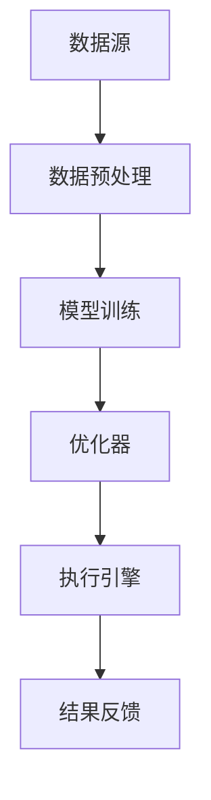

                 


```markdown
# AI如何实现格雷厄姆的分散投资原则

> 关键词：人工智能, 分散投资, 格雷厄姆, 投资组合优化, 风险管理, Python算法, 系统架构

> 摘要：本文详细探讨了如何利用人工智能技术实现格雷厄姆的分散投资原则，通过理论分析、算法实现、系统设计和实战案例，展示了AI在投资组合优化和风险管理中的应用。

## 第一部分: 格雷厄姆分散投资原则的理论基础

### 第1章: 格雷厄姆投资理论概述

#### 1.1 价值投资的基本原则
- 价值投资的定义
- 格雷厄姆的价值投资理念
- 分散投资的重要性

#### 1.2 分散投资的核心概念
- 投资组合的定义
- 分散投资的原理
- 风险与收益的平衡

#### 1.3 格雷厄姆的投资策略
- 选择被低估的股票
- 分散投资以降低风险
- 长期持有策略

## 第二部分: AI在投资组合优化中的应用

### 第2章: AI驱动的投资组合优化算法

#### 2.1 现代投资组合理论（MPT）的介绍
- MPT的核心思想
- 均值-方差优化的原理
- 如何构建最优投资组合

#### 2.2 AI优化算法的实现
- 基于遗传算法的投资组合优化
- 网格搜索与随机优化方法
- 迁移学习在投资组合优化中的应用

#### 2.3 基于Python的优化算法实现
```python
import numpy as np
from scipy.optimize import minimize

def portfolio_optimization(returns):
    n = len(returns.columns)
    returns_matrix = returns.values.T
    cov_matrix = np.cov(returns_matrix)
    ones = np.ones(n)
    
    def objective(weights):
        return -weights.T @ returns.mean() + 0.5 * weights.T @ cov_matrix @ weights
    
    constraints = [{'type': 'eq', 'fun': lambda w: sum(w) - 1},
                   {'type': 'ineq', 'fun': lambda w: w >= 0}]
    
    result = minimize(objective, np.ones(n)/n, constraints)
    return result.x
```

### 第3章: 风险管理与AI技术

#### 3.1 风险管理的核心概念
- 风险的定义与分类
- 分散投资如何降低风险
- VaR与CVaR的风险度量方法

#### 3.2 AI在风险管理中的应用
- 通过机器学习模型预测市场风险
- 利用自然语言处理分析财务报表
- 基于时间序列分析预测市场波动

#### 3.3 风险管理的Python实现
```python
from sklearn.ensemble import RandomForestRegressor
import pandas as pd

def risk_management_model(data):
    # 数据预处理
    # 建立模型
    model = RandomForestRegressor()
    model.fit(data.drop('risk', axis=1), data['risk'])
    # 预测风险
    predictions = model.predict(new_data)
    return predictions
```

## 第三部分: AI驱动的投资系统架构设计

### 第4章: 投资系统设计

#### 4.1 系统功能模块设计
- 数据收集模块
- 数据分析模块
- 投资组合优化模块
- 风险管理模块
- 投资执行模块

#### 4.2 系统架构设计
```mermaid
graph TD
    I[投资者] --> D[数据源]
    D --> D1[市场数据]
    D --> D2[财务数据]
    D1, D2 --> A[数据预处理]
    A --> M[模型训练]
    M --> O[优化器]
    O --> S[投资策略生成]
    S --> E[执行引擎]
    E --> R[结果反馈]
```

#### 4.3 数据流设计


### 第5章: 系统实现与实战案例

#### 5.1 系统环境搭建
- 安装必要的Python库（如numpy, pandas, scipy等）

#### 5.2 核心算法实现
```python
import numpy as np

def portfolio_optimizer(returns):
    n = len(returns.columns)
    returns_matrix = returns.values.T
    cov_matrix = np.cov(returns_matrix)
    ones = np.ones(n)
    inv_cov = np.linalg.inv(cov_matrix)
    weights = inv_cov @ ones / (ones.T @ inv_cov @ ones)
    return weights
```

#### 5.3 投资组合优化的回测与分析
- 确定回测的时间范围
- 计算回测期间的收益与风险
- 比较不同投资组合的表现

#### 5.4 系统实现的步骤
1. 数据收集与预处理
2. 模型训练与优化
3. 投资组合生成
4. 投资组合回测
5. 风险评估与调整

## 第四部分: 最佳实践与注意事项

### 第6章: 最佳实践

#### 6.1 投资组合优化的注意事项
- 数据的质量与完整性
- 模型的鲁棒性与可解释性
- 算法的收敛性与效率

#### 6.2 风险管理的要点
- 定期监控与调整
- 灵活应对市场变化
- 保持策略的纪律性

#### 6.3 系统设计的注意事项
- 系统的可扩展性
- 数据的安全性
- 系统的稳定性

### 第7章: 总结与展望

#### 7.1 全文总结
- AI在分散投资中的作用
- 格雷厄姆理论与现代技术的结合
- 实战案例的总结与反思

#### 7.2 未来展望
- 更高级的AI算法应用
- 多模态数据的整合
- 自适应投资策略的发展

---

通过以上结构，文章从理论到实践，系统地探讨了AI如何实现格雷厄姆的分散投资原则，帮助读者全面理解并掌握这一结合传统投资理论与现代技术的方法。

