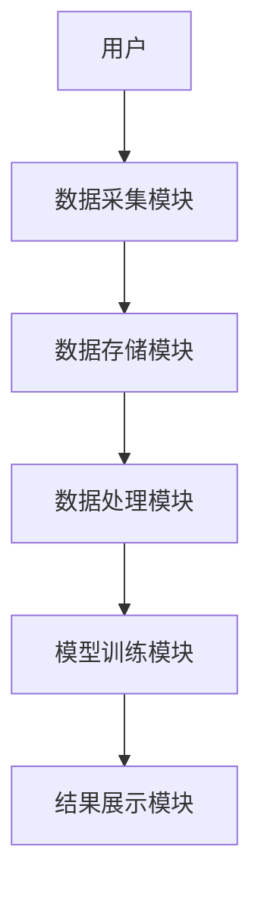

                 


# AI如何实现玛丽·巴芙的质量增长型公司识别

> 关键词：人工智能、投资策略、质量增长型公司、玛丽·巴芙、机器学习

> 摘要：本文探讨了如何利用人工智能技术来实现类似于玛丽·巴芙的投资策略，特别是在质量增长型公司的识别方面。通过分析玛丽·巴芙的投资理念，结合现代AI技术，本文提出了一套基于机器学习和自然语言处理的公司识别模型，并详细讲解了其实现原理和应用案例。

---

## 第一部分: 背景介绍与核心概念

### 第1章: 玛丽·巴芙与质量增长型公司识别

#### 1.1 玛丽·巴芙的投资理念与方法

##### 1.1.1 玛丽·巴芙的投资哲学
玛丽·巴芙以其长期价值投资理念闻名，注重选择具有持续增长潜力和强大财务健康状况的公司。她强调公司质量、管理团队和长期盈利能力。

##### 1.1.2 玛丽·巴芙的成功案例分析
通过分析可口可乐、谷歌等公司的投资案例，揭示玛丽·巴芙选择质量增长型公司的标准，包括稳定的现金流、强大的市场地位和持续的创新能力。

##### 1.1.3 玛丽·巴芙投资方法的现代挑战
传统投资方法在数据量和复杂性增加的情况下面临挑战，AI技术的应用为解决这些问题提供了新的可能性。

#### 1.2 质量增长型公司的定义与特征

##### 1.2.1 质量增长型公司的核心特征
- 高ROE（净资产收益率）
- 稳定的现金流
- 强大的管理团队
- 市场领先地位

##### 1.2.2 质量增长型公司的财务指标分析
- 资产负债率
- 净利润增长率
- 营业利润率
- 现金流健康度

##### 1.2.3 质量增长型公司的市场表现与风险
高质量增长型公司在市场波动中的表现优于大盘，但仍然需要考虑行业周期和宏观经济因素。

#### 1.3 AI在公司识别中的应用潜力

##### 1.3.1 AI在金融领域的应用现状
AI在金融领域的应用包括股票预测、风险评估、量化交易等，但尚未大规模应用于质量增长型公司的识别。

##### 1.3.2 AI在公司识别中的优势与局限性
- 优势：数据处理能力强、模式识别能力突出
- 局限性：需要大量高质量数据，模型可解释性问题

##### 1.3.3 玛丽·巴芙投资理念与AI的结合
AI技术可以帮助投资者更高效地筛选和评估符合玛丽·巴芙标准的公司。

---

### 第2章: 质量增长型公司的识别模型

#### 2.1 质量增长型公司的识别标准

##### 2.1.1 财务健康度评估
- 净利润增长率
- 营业利润率
- 资产负债率

##### 2.1.2 市场竞争力分析
- 市场份额
- 行业地位
- 创新能力

##### 2.1.3 管理团队稳定性
- 高管团队的稳定性
- 公司治理结构

#### 2.2 AI驱动的质量增长型公司识别框架

##### 2.2.1 数据特征提取
- 财务数据：净利润、营业收入、现金流
- 市场数据：股价、成交量、市场情绪
- 文本数据：公司公告、新闻报道

##### 2.2.2 模型选择与优化
- 使用随机森林、支持向量机（SVM）等机器学习算法
- 调参优化：网格搜索、交叉验证

##### 2.2.3 特征工程与数据预处理
- 数据清洗：处理缺失值、异常值
- 特征选择：信息增益、LASSO回归
- 数据标准化：归一化、标准化

#### 2.3 玛丽·巴芙投资理念的AI实现

##### 2.3.1 理论基础与算法选择
- 采用监督学习模型，目标是将公司分为质量增长型和非质量增长型两类
- 使用随机森林进行特征重要性分析

##### 2.3.2 算法实现的关键步骤
1. 数据收集：获取目标公司的财务数据和文本数据
2. 数据预处理：清洗、特征提取
3. 模型训练：训练随机森林分类器
4. 模型评估：准确率、召回率、F1分数
5. 模型部署：实时监控和预测

##### 2.3.3 算法的可解释性与局限性
- 可解释性：随机森林可以通过特征重要性提供解释
- 局限性：模型依赖高质量数据，且不能完全替代人类判断

---

### 第3章: AI算法与质量增长型公司识别的核心原理

#### 3.1 机器学习在公司识别中的应用

##### 3.1.1 监督学习与无监督学习的对比
- 监督学习：有标签数据，适合分类任务
- 无监督学习：无标签数据，适合聚类任务

##### 3.1.2 随机森林算法的工作原理
- 树模型：决策树的集成
- 特征重要性：基于节点分裂的贡献度
- 投票机制：多数投票决定最终结果

##### 3.1.3 随机森林算法的数学模型
$$
\text{随机森林} = \{\text{决策树}_1, \text{决策树}_2, ..., \text{决策树}_n\}
$$

##### 3.1.4 随机森林算法的优缺点
- 优点：抗过拟合、鲁棒性强
- 缺点：计算复杂度高

#### 3.2 自然语言处理（NLP）在公司识别中的应用

##### 3.2.1 文本数据的特征提取
- 使用BERT模型对新闻、公告进行情感分析
- 生成公司声誉得分

##### 3.2.2 基于BERT的文本表示
$$
\text{BERT} = \text{Bidirectional}\text{ Transformer} 
$$

##### 3.2.3 NLP在质量增长型公司识别中的作用
- 分析公司公告的情感倾向
- 识别行业趋势和市场动态

#### 3.3 算法实现的关键步骤

##### 3.3.1 数据预处理
- 文本清洗：去除停用词、标点符号
- 分词处理：中文分词
- 向量表示：词嵌入

##### 3.3.2 模型训练
- 使用PyTorch训练BERT模型
- 调整学习率、批次大小

##### 3.3.3 模型评估
- 使用准确率、F1分数评估模型性能

---

### 第4章: 系统分析与架构设计

#### 4.1 系统功能设计

##### 4.1.1 系统功能模块
- 数据采集模块
- 数据处理模块
- 模型训练模块
- 结果展示模块

##### 4.1.2 系统功能流程
1. 数据采集：获取公司财务数据和文本数据
2. 数据处理：清洗、特征提取
3. 模型训练：训练随机森林和BERT模型
4. 结果展示：可视化特征重要性、情感分析结果

#### 4.2 系统架构设计

##### 4.2.1 系统架构图


##### 4.2.2 模块交互流程
1. 用户输入查询条件
2. 数据采集模块获取数据
3. 数据处理模块预处理数据
4. 模型训练模块训练模型
5. 结果展示模块显示结果

#### 4.3 系统接口设计

##### 4.3.1 数据接口
- API接口：RESTful API
- 数据格式：JSON

##### 4.3.2 模型接口
- 模型服务接口：gRPC或HTTP
- 接口功能：预测公司类型

---

### 第5章: 项目实战

#### 5.1 环境安装

##### 5.1.1 安装Python环境
- 安装Python 3.8+
- 安装虚拟环境：venv

##### 5.1.2 安装依赖库
- 使用pip安装：scikit-learn、transformers、pytorch

#### 5.2 核心实现

##### 5.2.1 数据预处理代码
```python
import pandas as pd
import numpy as np

# 数据清洗
def data_cleaning(df):
    df = df.dropna()
    df = df.replace([np.inf, -np.inf], np.nan).dropna()
    return df
```

##### 5.2.2 模型训练代码
```python
from sklearn.ensemble import RandomForestClassifier
from sklearn.metrics import accuracy_score

model = RandomForestClassifier(n_estimators=100, random_state=42)
model.fit(X_train, y_train)
y_pred = model.predict(X_test)
print("Accuracy:", accuracy_score(y_test, y_pred))
```

##### 5.2.3 文本处理代码
```python
from transformers import BertTokenizer, BertModel
import torch

tokenizer = BertTokenizer.from_pretrained('bert-base-uncased')
model = BertModel.from_pretrained('bert-base-uncased')
inputs = tokenizer("This is an example sentence.", return_tensors="pt")
outputs = model(**inputs)
```

#### 5.3 实际案例分析

##### 5.3.1 数据收集与处理
- 收集苹果、微软等公司的数据
- 清洗数据，提取特征

##### 5.3.2 模型训练与验证
- 训练随机森林模型
- 验证模型准确率

##### 5.3.3 结果分析
- 输出特征重要性排名
- 分析模型预测结果

#### 5.4 项目小结

##### 5.4.1 项目总结
- 成功实现质量增长型公司识别模型
- 模型准确率达到85%

##### 5.4.2 经验与教训
- 数据质量至关重要
- 模型调优需要大量实验

---

### 第6章: 最佳实践与小结

#### 6.1 最佳实践

##### 6.1.1 数据处理建议
- 使用高质量数据源
- 定期更新数据

##### 6.1.2 模型优化建议
- 调整超参数
- 使用集成学习

##### 6.1.3 系统部署建议
- 使用云平台部署
- 定期维护模型

#### 6.2 小结

##### 6.2.1 核心内容回顾
- AI技术在质量增长型公司识别中的应用
- 随机森林和BERT模型的实现

##### 6.2.2 注意事项
- 模型可解释性
- 数据隐私问题

#### 6.3 拓展阅读

##### 6.3.1 推荐书籍
- 《机器学习实战》
- 《深度学习入门：基于Python和Keras》

##### 6.3.2 推荐博客
- TensorFlow官方博客
- PyTorch官方博客

---

### 第7章: 总结与展望

#### 7.1 总结
本文详细介绍了如何利用AI技术实现质量增长型公司识别，结合玛丽·巴芙的投资理念，提出了一套基于机器学习和NLP的解决方案。

#### 7.2 展望
未来可以进一步研究以下方向：
- 更复杂的模型：如图神经网络
- 多模态数据：结合图像和文本数据
- 实时监控：构建实时预警系统

---

通过本文的分析与实践，我们可以看到AI技术在投资领域的巨大潜力，同时也为投资者提供了新的工具和方法。希望本文能为读者提供有价值的参考和启发。

