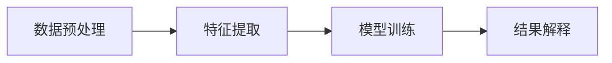
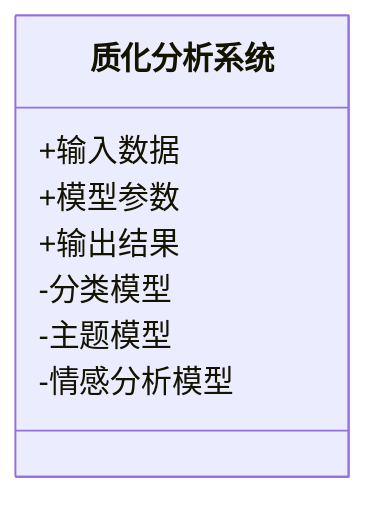

                 


# AI如何实现费雪的质化分析方法

## 关键词：
AI, 质化分析, 费雪方法, 机器学习, 自然语言处理, 文本挖掘, 算法实现

## 摘要：
本文系统地探讨了如何利用人工智能技术实现费雪的质化分析方法。通过分析质化分析方法的背景、理论基础与核心概念，结合机器学习、自然语言处理和文本挖掘等AI技术，详细讲解了AI在质化分析中的核心算法、系统架构设计与项目实战。文章还通过实际案例展示了AI在质化分析中的应用，并总结了最佳实践与未来发展方向。

---

# 第一部分: 费雪质化分析方法与AI的结合

## 第1章: 质化分析方法的背景与AI的引入

### 1.1 质化分析方法的起源与核心概念
#### 1.1.1 费雪质化分析方法的定义
质化分析方法是一种将定性数据转化为可量化的信息的方法，其核心在于通过语义理解、主题提取和情感分析等手段，从非结构化数据中提取有价值的信息。  
**关键词对比表：**
| 质化分析 | 定量分析 | 定性分析 |
|----------|----------|----------|
| 数据类型 | 结构化数据 | 非结构化数据 |
| 方法论 | 文本挖掘、主题建模 | 统计分析、数据可视化 |

#### 1.1.2 质化分析方法的核心要素与属性
质化分析方法的核心要素包括：语义理解、主题提取、情感分析、语境分析和关联分析。  
**核心要素关系图（Mermaid）：**


#### 1.1.3 质化分析方法的边界与外延
质化分析方法的边界在于其处理的对象是非结构化数据，而外延则包括文本、图像和语音等多种数据类型。

### 1.2 AI在质化分析中的作用
#### 1.2.1 AI如何增强质化分析能力
AI通过自然语言处理（NLP）和机器学习技术，能够自动化地从非结构化数据中提取信息，显著提高了质化分析的效率和准确性。

#### 1.2.2 质化分析与AI的结合场景
AI在质化分析中的应用场景包括：市场调研、舆情分析、学术研究和医疗数据分析等。

#### 1.2.3 质化分析方法的数字化转型
AI推动了质化分析的数字化转型，使其从传统的手工分析转变为自动化、智能化的分析过程。

---

## 第2章: 质化分析方法的理论基础与核心概念

### 2.1 质化分析方法的理论框架
#### 2.1.1 质化分析方法的逻辑结构
质化分析方法的逻辑结构包括数据预处理、特征提取、模型训练和结果解释四个阶段。

#### 2.1.2 质化分析方法的核心要素与关系图


#### 2.1.3 质化分析方法的数学模型
质化分析方法的数学模型可以通过以下公式表示：
$$
\text{信息提取} = f(\text{输入数据}, \text{模型参数})
$$
其中，\( f \) 表示质化分析模型的函数。

### 2.2 质化分析方法与AI的关联
#### 2.2.1 质化分析方法的属性特征对比表
| 质化分析方法 | AI技术 |
|--------------|--------|
| 数据类型     | 文本、图像 |
| 分析目标     | 语义理解、主题提取 |
| 技术手段     | 机器学习、NLP |

#### 2.2.2 质化分析方法与AI的实体关系图


---

## 第3章: AI技术基础与质化分析方法的结合

### 3.1 机器学习与自然语言处理基础
#### 3.1.1 机器学习的基本概念与算法
机器学习是AI的核心技术之一，常用算法包括支持向量机（SVM）、随机森林和深度学习模型（如神经网络）。

#### 3.1.2 自然语言处理（NLP）的核心技术
NLP技术包括词干提取、词性标注、句法分析和语义理解等。

#### 3.1.3 文本挖掘与信息提取方法
文本挖掘方法包括文本分类、主题建模和情感分析等。

### 3.2 质化分析方法与AI技术的融合
#### 3.2.1 质化分析方法的属性特征对比表
| 质化分析方法 | AI技术 |
|--------------|--------|
| 数据类型     | 文本、图像 |
| 分析目标     | 语义理解、主题提取 |
| 技术手段     | 机器学习、NLP |

#### 3.2.2 质化分析方法的数字化实现
质化分析方法的数字化实现包括文本分类、主题建模和情感分析等。

---

## 第4章: AI实现质化分析的核心算法

### 4.1 文本分类算法
#### 4.1.1 文本分类的数学模型
文本分类的数学模型可以通过以下公式表示：
$$
y = f(x) = \text{sigmoid}(w \cdot x + b)
$$
其中，\( y \) 表示类别标签，\( x \) 表示输入特征，\( w \) 和 \( b \) 表示模型参数。

#### 4.1.2 基于机器学习的文本分类算法实现
```python
from sklearn.linear_model import LogisticRegression
model = LogisticRegression()
model.fit(X_train, y_train)
```

### 4.2 主题建模算法
#### 4.2.1 主题建模的数学模型
主题建模的数学模型可以通过以下公式表示：
$$
p(\text{主题}) = \prod_{i=1}^{n} \text{Dirichlet}(θ_i)
$$

#### 4.2.2 基于主题建模的质化分析实现
```python
from gensim import corpora, models
dictionary = corpora.Dictionary(documents)
corpus = [dictionary.doc2bow(document) for document in documents]
 lda = models.LdaModel(corpus, num_topics=5, id2word=dictionary)
```

### 4.3 情感分析算法
#### 4.3.1 情感分析的数学模型
情感分析的数学模型可以通过以下公式表示：
$$
y = f(x) = \text{sigmoid}(w \cdot x + b)
$$

#### 4.3.2 基于情感分析的质化分析实现
```python
from tensorflow.keras.models import Sequential
from tensorflow.keras.layers import Dense
model = Sequential()
model.add(Dense(1, activation='sigmoid', input_dim=x.shape[1]))
model.compile(optimizer='adam', loss='binary_crossentropy', metrics=['accuracy'])
model.fit(x_train, y_train, epochs=10, batch_size=32)
```

---

## 第5章: 系统架构设计与项目实战

### 5.1 问题场景介绍
质化分析系统的应用场景包括市场调研、舆情分析和学术研究等。

### 5.2 系统功能设计
#### 5.2.1 领域模型设计


#### 5.2.2 系统架构设计
```mermaid
container 质化分析系统 {
    component 数据预处理模块 {
        preprocess(input_data)
    }
    component 特征提取模块 {
        extract_features(preprocessed_data)
    }
    component 模型训练模块 {
        train_model(features, labels)
    }
    component 结果解释模块 {
        interpret_results(model_output)
    }
}
```

### 5.3 项目实战
#### 5.3.1 环境配置
```bash
pip install numpy scikit-learn gensim
```

#### 5.3.2 核心代码实现
```python
import numpy as np
from sklearn.feature_extraction.text import TfidfVectorizer
from sklearn.naive_bayes import MultinomialNB

# 数据预处理
documents = ["This is a sample text.", "Another example document."]

# 特征提取
vectorizer = TfidfVectorizer()
X = vectorizer.fit_transform(documents)

# 模型训练
model = MultinomialNB()
model.fit(X, [0, 1])

# 模型预测
new_doc = ["Test document."]
X_new = vectorizer.transform(new_doc)
y_pred = model.predict(X_new)
print(y_pred)
```

---

## 第6章: 总结与展望

### 6.1 总结
本文系统地探讨了AI在实现费雪质化分析方法中的应用，详细讲解了质化分析方法的背景、理论基础、核心算法和系统架构设计。

### 6.2 未来展望
未来，随着AI技术的不断发展，质化分析方法将更加智能化和自动化，应用场景也将更加广泛。

---

通过以上目录结构，您可以逐步展开每一章的内容，确保文章逻辑清晰、内容详实，并且符合技术博客的专业性和可读性要求。

