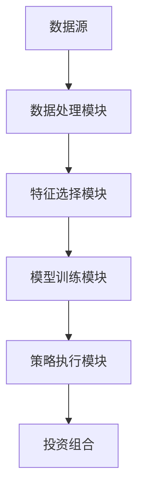
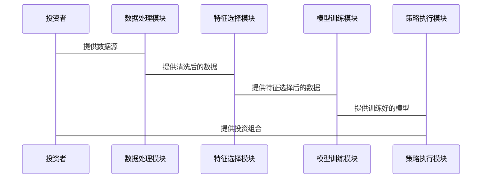

                 


# AI如何实现费雪的长期持股策略

## 关键词：人工智能，投资策略，费雪，长期持股，机器学习

## 摘要：本文探讨如何利用人工智能技术实现费雪的长期持股策略，通过分析费雪策略的核心要素，结合机器学习算法，构建AI驱动的投资系统，优化投资决策，提升长期收益。

---

## 第1章: 费雪投资理念与长期持股策略

### 1.1 费雪投资理念概述

#### 1.1.1 费雪的投资哲学
菲德烈希·约翰·费雪（Philip A. Fisher）是20世纪著名的价值投资理论家，提倡长期持股策略，强调投资优质企业而非市场时机。他认为，投资者应关注企业的基本面，尤其是其盈利能力和竞争优势。

#### 1.1.2 费雪的长期持股策略
费雪的策略基于以下几点：
1. **高质量的企业**：选择具有强大竞争优势、高ROE（股东权益收益率）和良好管理的企业。
2. **长期持有**：避免频繁交易，降低交易成本，享受复利效应。
3. **持续关注**：定期评估企业基本面，确保企业维持竞争优势。

#### 1.1.3 费雪策略的现代意义
在现代金融市场中，费雪策略仍然适用，但需要结合动态数据和市场变化，利用AI技术优化决策过程。

---

### 1.2 费雪策略的核心要素

#### 1.2.1 企业基本面分析
基本面分析包括对企业财务报表（收入、利润、负债等）的分析，评估企业的盈利能力和成长性。

#### 1.2.2 股东权益收益率（ROE）
ROE是衡量企业盈利能力的重要指标，ROE越高，企业利用股东资金创造利润的能力越强。

#### 1.2.3 企业竞争优势与护城河
企业竞争优势包括成本优势、技术壁垒、品牌影响力等，护城河帮助企业抵御竞争，保持长期盈利能力。

---

## 第2章: AI在投资策略中的应用

### 2.1 AI在金融投资中的潜力

#### 2.1.1 AI在金融数据分析中的优势
AI能够处理海量数据，发现人类难以察觉的模式和趋势，提高数据分析效率和准确性。

#### 2.1.2 AI在投资决策中的作用
AI可以辅助投资者进行市场预测、风险评估和投资组合优化，提升决策的科学性和效率。

#### 2.1.3 AI驱动的投资自动化趋势
通过算法交易和自动化投资工具，AI能够实时执行交易，减少人为干扰，提高投资效率。

---

### 2.2 AI与长期投资策略的结合

#### 2.2.1 AI如何优化长期投资策略
AI可以通过历史数据分析，识别优质企业的特征，优化选股标准，提升投资组合的收益。

#### 2.2.2 AI在风险控制中的应用
AI能够实时监控市场风险，预测潜在风险点，帮助投资者规避市场波动带来的损失。

#### 2.2.3 AI在市场预测中的潜力
通过自然语言处理和时间序列分析，AI可以预测市场趋势，辅助投资决策。

---

### 2.3 费雪策略与AI结合的可行性分析

#### 2.3.1 费雪策略的可量化特征
费雪策略中的ROE、竞争优势等指标可以量化，适合AI模型进行分析和预测。

#### 2.3.2 AI在费雪策略中的具体应用场景
- 数据清洗与特征提取：处理企业财务数据，提取关键特征。
- 模型训练：基于历史数据，训练机器学习模型，预测企业的长期盈利能力。
- 策略优化：根据AI模型的预测结果，优化选股标准和投资组合。

#### 2.3.3 费雪策略与AI结合的潜在价值
通过AI技术，费雪策略能够更高效地识别优质企业，降低投资风险，提升长期收益。

---

## 第3章: AI实现费雪策略的核心算法

### 3.1 机器学习在投资策略中的应用

#### 3.1.1 机器学习算法简介
常用的机器学习算法包括线性回归、支持向量机（SVM）、随机森林、神经网络等。

#### 3.1.2 机器学习在投资中的常见算法
- 线性回归：用于预测股票价格。
- 支持向量机（SVM）：用于分类问题，如判断企业是否具有竞争优势。
- 随机森林：用于特征重要性分析和分类。
- 神经网络：用于复杂非线性关系的建模。

#### 3.1.3 机器学习在费雪策略中的应用
通过机器学习模型，分析企业的财务数据和市场数据，预测企业的长期盈利能力，辅助选股决策。

---

### 3.2 费雪策略的AI实现模型

#### 3.2.1 模型构建的基本思路
1. 数据收集：收集企业的财务数据、市场数据等。
2. 数据预处理：清洗数据，提取特征。
3. 模型训练：基于历史数据，训练机器学习模型。
4. 模型评估：评估模型的准确性和稳定性。
5. 策略执行：根据模型预测结果，执行投资策略。

#### 3.2.2 基于机器学习的费雪策略模型
- **输入**：企业的财务数据、市场数据。
- **输出**：企业的长期盈利能力预测。

#### 3.2.3 模型的优化与调整
通过交叉验证、超参数调优等方法，优化模型性能，提升预测准确性。

---

### 3.3 算法实现与优化

#### 3.3.1 算法实现的步骤
1. 数据预处理：清洗数据，处理缺失值，标准化特征。
2. 特征选择：选择对长期盈利能力影响较大的特征。
3. 模型训练：训练机器学习模型。
4. 模型评估：评估模型的准确性和稳定性。
5. 策略优化：根据模型预测结果，优化选股标准和投资组合。

#### 3.3.2 算法优化的关键点
- **特征选择**：选择对企业长期盈利能力影响较大的特征。
- **模型选择**：选择适合数据特点的模型。
- **超参数调优**：通过网格搜索等方法优化模型性能。

---

## 第4章: 系统分析与架构设计方案

### 4.1 问题场景介绍
构建一个基于AI的费雪策略投资系统，帮助投资者实现长期持股策略，提升投资收益。

### 4.2 项目介绍
本项目旨在利用AI技术优化费雪的长期持股策略，构建一个智能化的投资系统，实现自动化选股、风险控制和投资决策。

### 4.3 系统功能设计

#### 4.3.1 数据收集模块
- **功能**：从数据库或API获取企业的财务数据、市场数据等。
- **输入**：企业财务数据、市场数据。
- **输出**：清洗后的数据集。

#### 4.3.2 特征选择模块
- **功能**：提取对企业长期盈利能力影响较大的特征。
- **输入**：清洗后的数据集。
- **输出**：特征选择后的数据集。

#### 4.3.3 模型训练模块
- **功能**：训练机器学习模型，预测企业的长期盈利能力。
- **输入**：特征选择后的数据集。
- **输出**：训练好的模型。

#### 4.3.4 策略执行模块
- **功能**：根据模型预测结果，执行投资策略。
- **输入**：模型预测结果。
- **输出**：投资组合。

---

### 4.4 系统架构设计

#### 4.4.1 系统架构图


#### 4.4.2 系统交互序列图


---

## 第5章: 项目实战

### 5.1 环境安装
安装Python、Pandas、Scikit-learn等工具，配置开发环境。

### 5.2 核心实现源代码

#### 5.2.1 数据预处理
```python
import pandas as pd
from sklearn.preprocessing import StandardScaler

# 读取数据
data = pd.read_csv('financial_data.csv')

# 删除缺失值
data.dropna(inplace=True)

# 标准化特征
scaler = StandardScaler()
scaled_features = scaler.fit_transform(data.drop('target', axis=1))
```

#### 5.2.2 特征选择
```python
from sklearn.ensemble import RandomForestClassifier
from sklearn.feature_selection import SelectFromModel

# 训练随机森林模型
model = RandomForestClassifier()
model.fit(scaled_features, data['target'])

# 选择特征
selector = SelectFromModel(model)
selected_features = selector.transform(scaled_features)
```

#### 5.2.3 模型训练
```python
from sklearn.model_selection import train_test_split
from sklearn.metrics import accuracy_score

# 划分训练集和测试集
X_train, X_test, y_train, y_test = train_test_split(selected_features, data['target'], test_size=0.2)

# 训练逻辑回归模型
from sklearn.linear_model import LogisticRegression
model = LogisticRegression()
model.fit(X_train, y_train)

# 评估模型
y_pred = model.predict(X_test)
print("Accuracy:", accuracy_score(y_test, y_pred))
```

---

## 第6章: 最佳实践、小结与拓展阅读

### 6.1 最佳实践
- **数据质量**：确保数据准确、完整。
- **模型选择**：根据数据特点选择合适的模型。
- **风险控制**：定期评估投资组合，降低风险。

### 6.2 小结
通过AI技术，费雪的长期持股策略能够更高效地识别优质企业，优化投资组合，提升长期收益。

### 6.3 注意事项
- **数据隐私**：注意数据隐私和合规性。
- **模型解释性**：确保模型的可解释性，避免黑箱操作。

### 6.4 拓展阅读
- 《机器学习实战》
- 《Python机器学习》
- 《费雪投资哲学》

---

## 结语
通过结合AI技术，费雪的长期持股策略能够更高效地实现投资目标。未来，随着AI技术的不断发展，投资策略将更加智能化和个性化，为投资者创造更大的价值。

