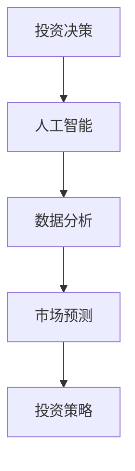
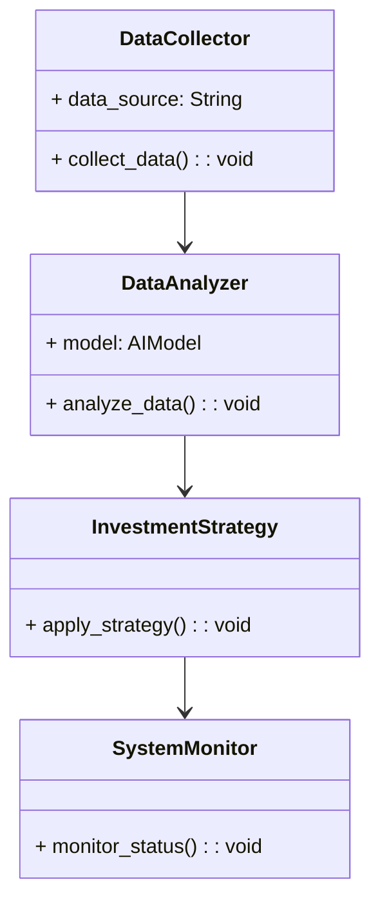
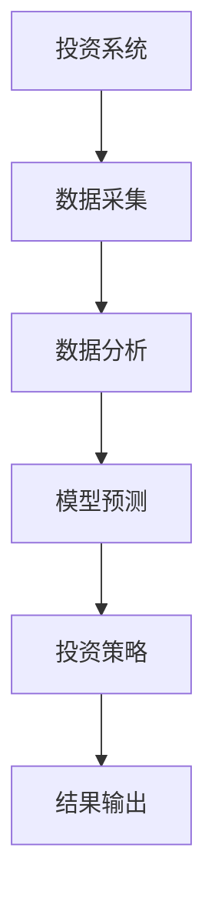
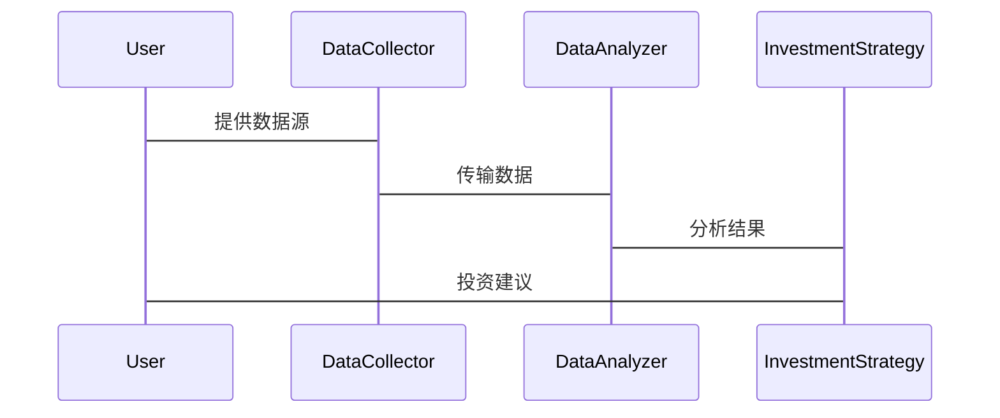

                 


# AI如何实现马克斯的逆向投资理念

> 关键词：AI、逆向投资、投资策略、算法、数据分析、马克斯投资理论

> 摘要：本文详细探讨了如何利用人工智能技术实现逆向投资的理念。通过分析马克斯的逆向投资策略，结合AI的数据分析和预测能力，提出了一种基于AI的逆向投资算法，并通过实际案例展示了其在投资决策中的应用。

---

## 第一部分: AI与逆向投资理念的结合

### 第1章: AI与逆向投资理念概述

#### 1.1 AI与逆向投资的背景介绍
- **1.1.1 逆向投资的核心概念**
  - 逆向投资是一种投资策略，强调在市场恐慌时买入，在市场贪婪时卖出。
  - 马克斯是逆向投资的代表人物，其理念强调反向思考和逆市场情绪投资。

- **1.1.2 AI在投资领域的应用背景**
  - 随着数据量的爆炸式增长和计算能力的提升，AI在金融领域的应用越来越广泛。
  - AI能够通过大数据分析和预测模型，帮助投资者做出更科学的投资决策。

- **1.1.3 AI与逆向投资的结合意义**
  - AI能够量化市场情绪，识别市场异常，为逆向投资提供数据支持。
  - 结合AI技术，逆向投资策略可以更加精准和高效。

#### 1.2 马克斯的逆向投资理念
- **1.2.1 马克斯投资哲学的核心思想**
  - 市场情绪是投资决策的关键因素。
  - 在市场恐慌时，优质资产会被低估，提供买入机会。
  - 在市场狂热时，优质资产会被高估，提供卖出机会。

- **1.2.2 逆向投资的策略与原则**
  - 长期投资，避免短期波动的干扰。
  - 逆市场情绪操作，买入恐慌，卖出贪婪。
  - 价值投资，关注企业的内在价值。

- **1.2.3 逆向投资在现代投资中的挑战**
  - 市场参与者增多，逆向投资的机会减少。
  - 市场波动加剧，逆向投资的风险增大。
  - 投资者情绪难以预测，逆向投资策略的稳定性受到挑战。

#### 1.3 AI在逆向投资中的潜力
- **1.3.1 数据驱动的逆向投资分析**
  - 利用大数据分析市场情绪，识别市场异常。
  - 通过数据挖掘发现市场低估或高估的资产。

- **1.3.2 AI如何增强逆向投资决策**
  - 利用机器学习模型预测市场趋势，辅助投资决策。
  - 通过自然语言处理技术分析新闻和社交媒体，捕捉市场情绪变化。

- **1.3.3 逆向投资与AI的未来发展趋势**
  - 结合AI技术，逆向投资策略将更加智能化和精准化。
  - AI将帮助投资者更好地识别市场机会，降低投资风险。

### 第2章: 逆向投资的核心概念与AI的联系

#### 2.1 逆向投资的核心概念
- **2.1.1 逆向投资的定义与特征**
  - 定义：逆向投资是一种反向市场情绪的投资策略。
  - 特征：长期性、逆市场性、价值导向性。

- **2.1.2 逆向投资的关键要素**
  - 市场情绪分析
  - 资产定价偏差
  - 风险管理

- **2.1.3 逆向投资的边界与外延**
  - 边界：市场情绪的极端性
  - 外延：与其他投资策略的结合

#### 2.2 AI与逆向投资的核心联系
- **2.2.1 数据分析与逆向投资决策**
  - 数据分析是AI驱动逆向投资的核心工具。
  - 通过大数据分析，识别市场情绪的变化趋势。

- **2.2.2 AI算法在逆向投资中的应用**
  - 时间序列分析预测市场趋势。
  - 机器学习模型识别市场异常。

- **2.2.3 逆向投资与AI的协同效应**
  - AI帮助投资者更好地识别逆向投资机会。
  - 逆向投资策略为AI提供数据反馈，优化模型性能。

#### 2.3 核心概念原理
- **2.3.1 逆向投资的决策模型**
  - 基于市场情绪的决策模型。
  - 基于资产定价偏差的决策模型。

- **2.3.2 AI算法的数学模型**
  - 时间序列分析模型（ARIMA、LSTM）。
  - 机器学习模型（随机森林、XGBoost）。

- **2.3.3 逆向投资与AI的ER实体关系图**


### 第3章: AI驱动的逆向投资算法原理

#### 3.1 逆向投资的AI算法概述
- **3.1.1 常见的AI算法在投资中的应用**
  - 时间序列分析。
  - 机器学习模型。

- **3.1.2 时间序列分析在逆向投资中的作用**
  - 预测市场趋势。
  - 识别市场周期性变化。

- **3.1.3 机器学习模型在逆向投资中的应用**
  - 分类模型预测市场情绪。
  - 回归模型预测资产价格。

#### 3.2 时间序列分析算法
- **3.2.1 ARIMA模型**
  - ARIMA模型是一种常用的时间序列预测模型。
  - 模型公式：
    $$ ARIMA(p, d, q) $$
    其中，p为自回归阶数，d为差分阶数，q为移动平均阶数。

- **3.2.2 LSTM网络**
  - LSTM（长短期记忆网络）是一种特殊的RNN，适合处理时间序列数据。
  - 模型结构：
    $$ LSTM(t) = \sigma(g_t) $$
    其中，$$ g_t = \beta * LSTM(t-1) + \gamma * input(t) $$

#### 3.3 机器学习模型
- **3.3.1 随机森林模型**
  - 随机森林是一种基于决策树的集成学习方法。
  - 模型公式：
    $$ y = \sum_{i=1}^{n} \text{Tree}_i(x) $$

- **3.3.2 XGBoost模型**
  - XGBoost是一种高效的梯度提升算法。
  - 模型公式：
    $$ y = \sum_{i=1}^{n} \text{ Booster}_i(x) $$

#### 3.4 算法实现与案例分析
- **3.4.1 算法实现**
  - 使用Python代码实现ARIMA和LSTM模型。
  - 示例代码：
    ```python
    from statsmodels.tsa.arima.model import ARIMA
    import numpy as np
    import pandas as pd
    ```

- **3.4.2 案例分析**
  - 以某股票为例，使用ARIMA模型预测其价格走势。
  - 分析模型预测结果与实际价格的差异，评估模型性能。

## 第四部分: 系统架构设计与实现

### 第4章: 逆向投资AI系统的架构设计

#### 4.1 系统功能设计
- **4.1.1 系统功能模块**
  - 数据采集模块。
  - 数据分析模块。
  - 投资策略模块。
  - 系统监控模块。

- **4.1.2 功能模块的类图**


#### 4.2 系统架构设计
- **4.2.1 系统架构图**


- **4.2.2 系统接口设计**
  - 数据采集接口：接收市场数据。
  - 模型预测接口：输出市场预测结果。
  - 投资策略接口：执行投资决策。

#### 4.3 系统交互流程
- **4.3.1 系统交互序列图**


## 第五部分: 项目实战

### 第5章: 逆向投资AI系统的实战案例

#### 5.1 项目环境配置
- **5.1.1 环境安装**
  - 安装Python、Jupyter Notebook、相关库（如Pandas、Scikit-learn、TensorFlow）。

#### 5.2 系统核心实现
- **5.2.1 数据采集与预处理**
  - 使用API获取市场数据。
  - 数据清洗和特征提取。

- **5.2.2 投资策略实现**
  - 基于AI模型的投资策略。
  - 策略回测与优化。

#### 5.3 代码实现与解读
- **5.3.1 数据分析代码**
  ```python
  import pandas as pd
  data = pd.read_csv('market_data.csv')
  ```

- **5.3.2 模型训练代码**
  ```python
  from sklearn.ensemble import RandomForestClassifier
  model = RandomForestClassifier()
  model.fit(X_train, y_train)
  ```

- **5.3.3 投资策略代码**
  ```python
  def invest_strategy(predictions):
      if predictions > 0.5:
          return '买入'
      else:
          return '卖出'
  ```

#### 5.4 案例分析与经验总结
- **5.4.1 案例分析**
  - 分析某次投资决策的执行结果。
  - 评估AI模型在实际投资中的表现。

- **5.4.2 经验总结**
  - AI模型的优势：数据处理能力强、预测精度高。
  - 模型的局限性：市场情绪难以完全量化、模型的可解释性有限。

## 第六部分: 最佳实践与总结

### 第6章: 逆向投资AI系统的最佳实践

#### 6.1 小结
- AI在逆向投资中的应用前景广阔。
- 通过数据分析和模型预测，AI能够辅助投资者做出更科学的投资决策。

#### 6.2 注意事项
- 数据质量对模型性能影响重大。
- 模型需要定期更新和优化。
- 投资者需具备一定的市场知识，才能更好地利用AI工具。

#### 6.3 未来展望
- 结合更多的数据源，提升模型预测精度。
- 探索更先进的AI算法，如深度学习和强化学习。
- 开发更智能化的投资决策支持系统。

---

# 结语

通过本文的详细探讨，我们可以看到AI在逆向投资中的巨大潜力。结合AI技术，投资者能够更精准地识别市场机会，优化投资策略，实现超额收益。然而，AI投资工具的开发和应用仍需不断探索和优化，以应对复杂多变的市场环境。

---

**致谢**  
感谢读者的耐心阅读，希望本文能为AI与逆向投资的结合提供一些新的思路和启示。

