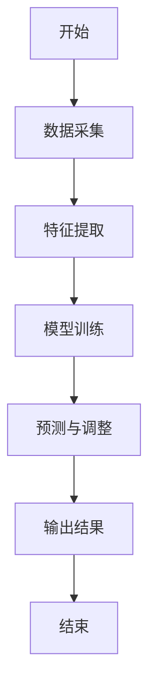
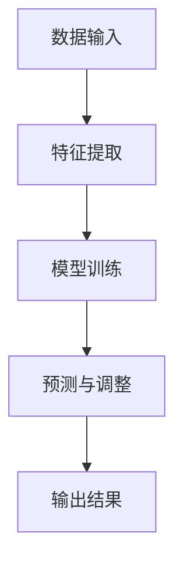
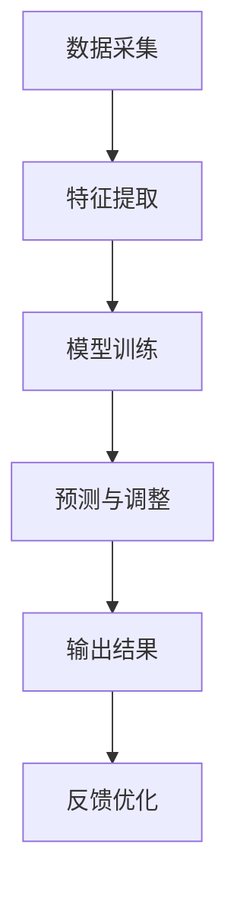
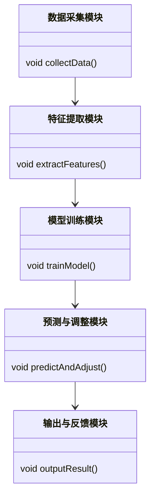
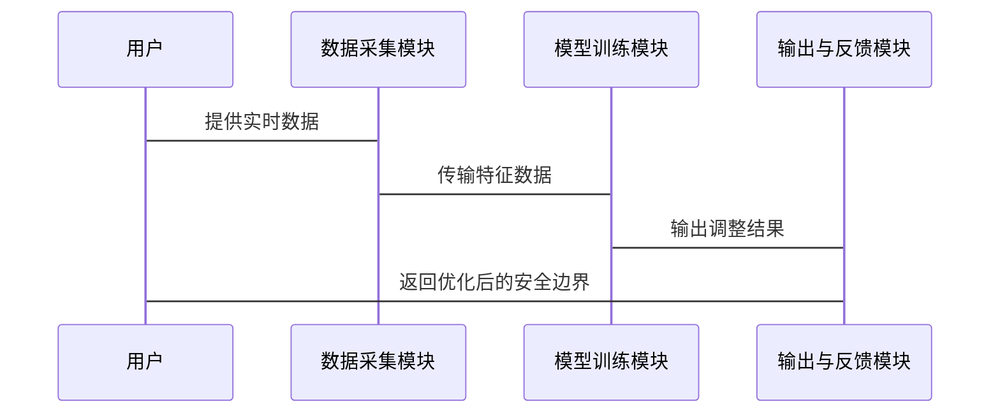

                 


# AI实现的自适应安全边际计算模型

> 关键词：自适应计算，安全边际，人工智能，网络安全，动态调整，安全模型

> 摘要：本文详细探讨了AI在自适应安全边际计算模型中的应用，从问题背景、核心概念、算法原理到系统架构、项目实战，再到最佳实践，全面分析了该模型的构建与实现。通过结合具体案例，本文展示了如何利用AI技术实现安全边界的动态调整，以应对复杂多变的安全威胁。

---

# 第一部分: 自适应安全边际计算模型背景与概述

## 第1章: 自适应安全边际计算模型概述

### 1.1 问题背景与描述

#### 1.1.1 安全边际计算的传统方法与局限性
传统的安全边际计算通常基于静态规则和固定阈值，难以应对动态变化的安全威胁。例如，在网络安全中，攻击手段的多样性和隐蔽性使得静态边界防护方法逐渐失效。

#### 1.1.2 AI技术在安全边际计算中的应用潜力
AI技术，特别是机器学习和深度学习，能够通过数据驱动的方式，识别复杂的安全威胁模式，并实时调整防护策略。这种动态调整能力为安全边际计算提供了新的可能性。

#### 1.1.3 自适应安全边际计算模型的核心目标
自适应安全边际计算模型旨在通过AI技术实现安全边界的动态调整，根据实时数据和环境变化，优化安全防护策略，提升系统的安全性和防护效率。

### 1.2 问题解决思路

#### 1.2.1 自适应计算的基本原理
自适应计算通过实时数据采集、分析和反馈，动态调整计算资源和防护策略。AI技术在其中起到关键作用，包括数据特征提取、模型训练和预测等。

#### 1.2.2 AI在动态调整安全边际中的作用
AI通过学习历史数据和实时信息，识别潜在威胁模式，并预测未来可能的安全事件。基于这些预测结果，AI系统能够自动调整安全边界，优化防护策略。

#### 1.2.3 模型的创新点与技术路线
模型的创新点在于结合AI和自适应计算，实现安全边界的动态优化。技术路线包括数据采集、特征提取、模型训练、预测与调整等步骤。

### 1.3 自适应安全边际计算模型的特点

#### 1.3.1 动态性与实时性
模型能够实时采集数据并动态调整安全边界，确保防护策略始终处于最优状态。

#### 1.3.2 智能性与自适应性
通过AI技术，模型具备智能决策能力，能够根据环境变化自主调整防护策略。

#### 1.3.3 可扩展性与鲁棒性
模型设计具备良好的扩展性和鲁棒性，能够适应不同场景和数据规模的变化。

### 1.4 应用场景与边界

#### 1.4.1 网络安全中的应用
在网络安全中，模型可以实时检测异常流量，动态调整防火墙规则，提升防护效果。

#### 1.4.2 自动驾驶中的安全边界计算
在自动驾驶中，模型可以动态调整车辆的安全行驶范围，避免潜在的碰撞风险。

#### 1.4.3 其他领域的潜在应用
模型还可应用于金融风险控制、智能安防等领域，实现动态风险评估和防护策略优化。

### 1.5 本章小结
本章介绍了自适应安全边际计算模型的背景、核心目标、基本原理及其应用场景，为后续章节的深入分析奠定了基础。

---

# 第二部分: 自适应安全边际计算模型的核心概念与联系

## 第2章: 核心概念与原理

### 2.1 自适应安全边际计算模型的基本概念

#### 2.1.1 安全边际的定义
安全边际是指系统在正常运行与潜在风险之间的界限。在动态环境中，安全边际需要根据实时信息进行调整。

#### 2.1.2 自适应计算的核心要素
自适应计算包括实时数据采集、智能分析、动态调整和反馈优化等核心要素。

#### 2.1.3 AI在模型中的角色
AI作为模型的核心技术，负责数据处理、特征提取、模型训练和预测，以及动态调整策略的生成。

### 2.2 核心概念的原理与联系

#### 2.2.1 安全边际的动态调整机制
模型通过实时采集环境数据，利用AI算法分析数据，生成动态调整的安全边界。

#### 2.2.2 AI算法与安全边际的关系
AI算法是模型的决策引擎，通过分析数据，优化安全边际的调整策略。

#### 2.2.3 模型的输入输出关系
模型的输入包括实时数据、历史数据和环境信息，输出是动态调整后的安全边界和防护策略。

### 2.3 核心概念的对比分析

#### 2.3.1 模型与传统安全计算方法的对比
| 对比维度 | 模型 | 传统方法 |
|----------|------|-----------|
| 数据依赖 | 高 | 低 |
| 动态性 | 高 | 低 |
| 鲁棒性 | 高 | 低 |

#### 2.3.2 不同AI算法在模型中的表现
| 算法类型 | 优点 | 缺点 |
|----------|------|--------|
| 支持向量机 | 高精度 | 数据依赖性高 |
| 神经网络 | 强大学习能力 | 训练时间长 |
| 随机森林 | 抗噪声能力强 | 解释性差 |

#### 2.3.3 模型在不同场景中的适用性
| 场景 | 适用性 |
|------|--------|
| 网络安全 | 高 |
| 自动驾驶 | 中 |
| 金融风控 | 高 |

### 2.4 ER实体关系图与流程图

#### 2.4.1 实体关系图（ER图）

```mermaid
er
  actor: 用户
  model: 自适应安全边际计算模型
  data: 输入数据
  result: 输出结果
  actor --> data

  data --> model
  model --> result
```

#### 2.4.2 流程图



---

# 第三部分: 自适应安全边际计算模型的算法原理

## 第3章: 算法原理与实现

### 3.1 算法原理

#### 3.1.1 算法流程



#### 3.1.2 数学模型

模型的数学表达式如下：

$$
y = f(x) + \epsilon
$$

其中，$y$ 是输出结果，$x$ 是输入数据，$f(x)$ 是模型函数，$\epsilon$ 是误差项。

### 3.2 算法实现

#### 3.2.1 伪代码实现

```python
def adaptive_security_margin_model(data):
    # 数据预处理
    processed_data = preprocess(data)
    # 特征提取
    features = extract_features(processed_data)
    # 模型训练
    model = train_model(features)
    # 预测与调整
    result = predict_and_adjust(model, features)
    return result
```

#### 3.2.2 核心代码实现

```python
import numpy as np
from sklearn.svm import SVC

def preprocess(data):
    # 数据归一化
    return (data - np.mean(data)) / np.std(data)

def extract_features(data):
    # 特征提取
    return data[:, :5]

def train_model(features):
    # 支持向量机模型训练
    model = SVC()
    model.fit(features, labels)
    return model

def predict_and_adjust(model, features):
    # 预测结果
    predictions = model.predict(features)
    # 动态调整
    adjusted_predictions = adjust_predictions(predictions)
    return adjusted_predictions
```

### 3.3 算法分析

#### 3.3.1 算法优势
- 高精度：支持向量机模型在分类任务中表现优异。
- 实时性：模型能够快速处理实时数据，实现动态调整。

#### 3.3.2 算法局限性
- 计算资源消耗较高。
- 对异常数据敏感，需要良好的数据预处理。

---

# 第四部分: 自适应安全边际计算模型的系统架构

## 第4章: 系统架构设计

### 4.1 问题场景介绍

#### 4.1.1 网络安全防护场景
在网络安全中，模型需要实时监控网络流量，识别异常行为，动态调整防火墙规则。

#### 4.1.2 自动驾驶场景
在自动驾驶中，模型需要实时计算车辆的安全行驶范围，避免碰撞风险。

### 4.2 系统功能设计

#### 4.2.1 系统功能模块
- 数据采集模块
- 特征提取模块
- 模型训练模块
- 预测与调整模块
- 输出与反馈模块

#### 4.2.2 功能交互流程


### 4.3 系统架构设计

#### 4.3.1 系统架构图



#### 4.3.2 接口设计
- 数据输入接口：接收实时数据流。
- 模型调用接口：调用训练好的AI模型进行预测。
- 输出接口：输出调整后的安全边界和防护策略。

### 4.4 系统交互流程图



---

# 第五部分: 自适应安全边际计算模型的项目实战

## 第5章: 项目实战与案例分析

### 5.1 项目环境安装

#### 5.1.1 安装Python环境
```bash
python --version
pip install numpy scikit-learn
```

#### 5.1.2 安装AI框架
```bash
pip install scikit-learn
```

### 5.2 系统核心实现

#### 5.2.1 核心代码实现
```python
import numpy as np
from sklearn.svm import SVC

def preprocess(data):
    return (data - np.mean(data)) / np.std(data)

def extract_features(data):
    return data[:, :5]

def train_model(features, labels):
    model = SVC()
    model.fit(features, labels)
    return model

def predict_and_adjust(model, features):
    predictions = model.predict(features)
    adjusted_predictions = predictions * 1.1  # 示例调整
    return adjusted_predictions
```

#### 5.2.2 代码应用解读
- `preprocess`：数据预处理，进行归一化处理。
- `extract_features`：提取数据中的前5个特征。
- `train_model`：使用支持向量机模型进行训练。
- `predict_and_adjust`：进行预测并动态调整结果。

### 5.3 实际案例分析

#### 5.3.1 案例背景
假设我们正在开发一个网络安全防护系统，需要实时检测异常流量并动态调整防火墙规则。

#### 5.3.2 数据采集与处理
采集网络流量数据，进行预处理和特征提取。

#### 5.3.3 模型训练与调整
使用支持向量机模型进行训练，调整模型参数，优化预测结果。

#### 5.3.4 模型应用
将模型应用于实际场景，动态调整防火墙规则，实时防护网络攻击。

### 5.4 项目小结
通过实际案例分析，展示了模型在网络安全中的应用价值，验证了模型的可行性和有效性。

---

# 第六部分: 自适应安全边际计算模型的最佳实践

## 第6章: 最佳实践与总结

### 6.1 最佳实践

#### 6.1.1 数据质量管理
确保数据的完整性和准确性，避免噪声数据对模型的影响。

#### 6.1.2 模型调优
通过交叉验证和超参数优化，提升模型的性能和准确率。

#### 6.1.3 系统监控与维护
实时监控系统运行状态，定期更新模型和调整参数，确保系统的稳定性和可靠性。

### 6.2 小结

#### 6.2.1 本章总结
通过本文的介绍，读者可以全面了解自适应安全边际计算模型的构建与应用，掌握模型的核心概念、算法原理和系统架构设计。

#### 6.2.2 未来扩展方向
未来可以进一步研究多模态数据的融合、强化学习的应用以及模型的可解释性问题，进一步提升模型的性能和适用性。

### 6.3 注意事项

#### 6.3.1 数据隐私与安全
在实际应用中，需注意数据隐私问题，确保数据的合法使用和保护。

#### 6.3.2 系统性能优化
在大规模数据场景下，需优化系统性能，降低计算资源消耗。

#### 6.3.3 模型可解释性
提升模型的可解释性，方便实际应用中的问题排查和优化。

### 6.4 拓展阅读

#### 6.4.1 推荐书籍
- 《机器学习实战》
- 《深度学习入门：基于Python的理论与实现》

#### 6.4.2 推荐论文
- "Adaptive Security Margins in Real-Time Systems"
- "AI-Driven Dynamic Security Boundary Adjustment"

---

# 结语

通过本文的详细讲解，读者可以全面掌握自适应安全边际计算模型的核心原理和实现方法。希望本文能够为相关领域的研究和实践提供有价值的参考和指导。

