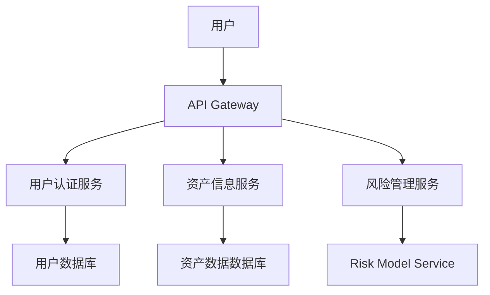
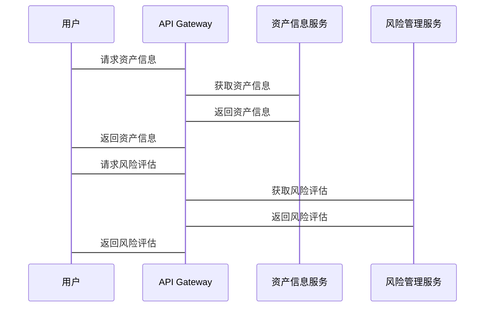

                 


# AI技术在私人银行业务中的应用前景分析

> 关键词：人工智能, 私人银行, 智能投顾, 客户画像, 资产配置

> 摘要：随着人工智能技术的快速发展，AI在私人银行业务中的应用前景广阔。本文分析了AI在客户画像、精准营销、智能投顾和风险评估等核心场景中的应用，探讨了其在技术实现、系统架构和实际案例中的具体表现，并展望了未来的发展趋势。

---

## 第1章: 私人银行业务概述

### 1.1 私人银行的定义与特点

#### 1.1.1 私人银行的定义

私人银行是专门为高净值客户提供个性化财富管理服务的金融机构。其核心目标是通过专业的投资建议、资产配置和风险管理，帮助客户实现财富的保值与增值。

#### 1.1.2 私人银行的核心业务模式

- 资产管理：包括股票、债券、基金等多种投资工具的配置。
- 财务规划：包括税务规划、遗产规划等。
- 风险管理：通过保险产品和衍生工具进行风险对冲。

#### 1.1.3 私人银行与传统银行的区别

- 服务对象：高净值客户 vs. 普通客户。
- 服务模式：个性化定制 vs. 标准化服务。
- 服务深度：全方位财富管理 vs. 基本存贷款业务。

### 1.2 私人银行的客户群体分析

#### 1.2.1 高净值客户的特点

- 高收入：年收入超过一定标准。
- 高资产：可投资资产在几百万以上。
- 高需求：对财富管理、税务规划等有个性化需求。

#### 1.2.2 私人银行客户的资产配置需求

- 多元化：分散投资以降低风险。
- 高收益：追求资产的保值与增值。
- 稳定性：注重本金的安全性和收益的稳定性。

#### 1.2.3 私人银行客户的个性化服务需求

- 个性化投资建议。
- 定制化的财务规划。
- 高效的客户服务体验。

### 1.3 私人银行的业务流程与挑战

#### 1.3.1 私人银行的传统业务流程

1. 客户接待与需求分析。
2. 资产评估与投资建议。
3. 资产配置与投资执行。
4. 定期回顾与调整。

#### 1.3.2 私人银行面临的业务挑战

- 信息不对称：客户与银行之间的信息不透明。
- 风险控制：如何有效管理市场风险和信用风险。
- 服务效率：如何在高净值客户中快速响应需求。

#### 1.3.3 私人银行的数字化转型需求

- 提高服务效率。
- 降低运营成本。
- 提升客户体验。

---

## 第2章: AI技术的核心概念与应用场景

### 2.1 AI技术的定义与分类

#### 2.1.1 人工智能的基本概念

人工智能（AI）是指模拟人类智能的计算机系统，包括学习、推理、自适应等能力。

#### 2.1.2 机器学习与深度学习的区别

- 机器学习：通过数据训练模型，预测新数据。
- 深度学习：一种基于人工神经网络的机器学习方法，能够处理更复杂的数据。

#### 2.1.3 当前主流的AI技术应用领域

- 自然语言处理。
- 计算机视觉。
- 语音识别。
- 数据分析与预测。

### 2.2 AI技术在金融领域的应用现状

#### 2.2.1 AI在金融数据分析中的应用

- 股票价格预测。
- 市场趋势分析。
- 风险评估。

#### 2.2.2 AI在金融风险控制中的应用

- 信用评分。
- 风险预警。
- 风险对冲。

#### 2.2.3 AI在金融产品推荐中的应用

- 个性化产品推荐。
- 投资组合优化。

### 2.3 AI技术在私人银行业务中的潜在应用

#### 2.3.1 客户画像与精准营销

- 基于客户数据构建画像。
- 利用AI进行客户分群和推荐。

#### 2.3.2 智能投顾与资产配置

- 基于AI的投资策略生成。
- 自动化资产调整。

#### 2.3.3 风险评估与预警

- 客户风险评分。
- 市场风险预警。

---

## 第3章: AI技术在私人银行客户画像与精准营销中的应用

### 3.1 客户画像的构建过程

#### 3.1.1 数据采集与整理

- 数据来源：客户填写的信息、交易记录、市场数据等。
- 数据清洗：去除冗余和错误数据。

#### 3.1.2 数据清洗与预处理

- 数据标准化：统一数据格式。
- 数据增强：增加额外特征。

#### 3.1.3 客户画像的特征提取

- 使用机器学习模型提取关键特征。

### 3.2 精准营销的实现原理

#### 3.2.1 基于客户画像的营销策略

- 根据客户特征制定个性化营销方案。

#### 3.2.2 AI算法在营销中的应用

- 使用聚类算法进行客户分群。
- 使用推荐算法进行产品推荐。

#### 3.2.3 营销效果的评估与优化

- A/B测试评估效果。
- 根据反馈优化模型。

### 3.3 实际案例分析

#### 3.3.1 某私人银行的客户画像构建案例

- 使用Python进行数据清洗和特征提取。

#### 3.3.2 基于客户画像的精准营销效果分析

- 通过机器学习模型提升营销转化率。

---

## 第4章: AI技术在私人银行智能投顾与资产配置中的应用

### 4.1 智能投顾的定义与核心功能

#### 4.1.1 智能投顾的基本概念

- 基于算法的投资顾问服务。

#### 4.1.2 智能投顾的核心功能模块

- 风险评估。
- 资产配置。
- 投资组合优化。

#### 4.1.3 智能投顾与传统投顾的区别

- 自动化 vs. 人工化。
- 数据驱动 vs. 经验驱动。

### 4.2 资产配置的AI算法实现

#### 4.2.1 基于机器学习的资产配置模型

- 使用回归模型预测资产收益。

#### 4.2.2 基于深度学习的资产配置优化

- 使用神经网络进行复杂预测。

#### 4.2.3 资产配置模型的评估与优化

- 使用回测和风险指标评估模型。

### 4.3 实际案例分析

#### 4.3.1 某私人银行的智能投顾系统案例

- 使用Python实现智能投顾系统。

#### 4.3.2 资产配置模型的实际应用效果分析

- 通过案例展示模型的有效性。

---

## 第5章: AI技术在私人银行风险评估与预警中的应用

### 5.1 风险评估的基本概念与方法

#### 5.1.1 风险评估的基本概念

- 识别和评估潜在风险。

#### 5.1.2 常见的风险评估方法

- 传统评分法。
- AI驱动的评分法。

#### 5.1.3 AI技术在风险评估中的优势

- 高效性。
- 准确性。

### 5.2 基于AI的风控模型构建

#### 5.2.1 数据采集与特征提取

- 收集客户和市场数据。

#### 5.2.2 AI算法在风险评估中的应用

- 使用决策树和随机森林进行分类。

#### 5.2.3 风控模型的评估与优化

- 使用ROC曲线评估模型性能。

### 5.3 实际案例分析

#### 5.3.1 某私人银行的风控模型构建案例

- 使用Python和机器学习库实现模型。

#### 5.3.2 基于AI的风控模型的实际应用效果分析

- 通过案例展示模型的效果和优化。

---

## 第6章: 私人银行AI技术应用的系统架构与实现

### 6.1 系统架构设计

#### 6.1.1 系统整体架构设计

- 分层架构：数据层、服务层、应用层。

#### 6.1.2 系统功能模块划分

- 数据采集模块。
- 数据处理模块。
- AI模型服务模块。

#### 6.1.3 系统架构的优缺点分析

- 优点：模块化、可扩展。
- 缺点：初期开发成本高。

### 6.2 系统功能设计

#### 6.2.1 项目介绍

- 开发一个基于AI的私人银行系统。

#### 6.2.2 系统功能模块划分

- 用户管理模块。
- 资产管理模块。
- 风险管理模块。

#### 6.2.3 系统架构设计

- 使用微服务架构。

### 6.3 系统架构设计

#### 6.3.1 系统架构图



#### 6.3.2 系统接口设计

- 用户接口：API接口。
- 数据接口：数据库连接。

#### 6.3.3 系统交互设计



---

## 第7章: 项目实战

### 7.1 环境安装

#### 7.1.1 安装Python

```bash
python --version
pip install numpy pandas scikit-learn
```

#### 7.1.2 安装机器学习库

```bash
pip install scikit-learn xgboost
```

### 7.2 系统核心实现源代码

#### 7.2.1 客户画像构建代码

```python
import pandas as pd
from sklearn.cluster import KMeans

# 数据加载
data = pd.read_csv('customer.csv')

# 数据预处理
data_clean = data.dropna()
data_clean['age'] = data_clean['age'].fillna(data_clean['age'].mean())

# 模型训练
model = KMeans(n_clusters=3)
model.fit(data_clean[['income', 'assets']])

# 预测簇
clusters = model.predict(data_clean[['income', 'assets']])

# 结果保存
data_clean['cluster'] = clusters
data_clean.to_csv('clustered_customer.csv', index=False)
```

#### 7.2.2 风险评估模型代码

```python
import pandas as pd
from sklearn.ensemble import RandomForestClassifier

# 数据加载
data = pd.read_csv('risk_data.csv')

# 数据预处理
data_clean = data.dropna()

# 特征选择
features = data_clean[['age', 'income', 'assets', 'credit_score']]

# 标签提取
labels = data_clean['risk_score']

# 模型训练
model = RandomForestClassifier()
model.fit(features, labels)

# 预测风险
new_customer = pd.DataFrame({'age': [45], 'income': [100000], 'assets': [500000], 'credit_score': [750]})
predicted_risk = model.predict(new_customer[features.columns])

print(predicted_risk)
```

### 7.3 代码应用解读与分析

- 客户画像代码：通过聚类算法将客户分成不同群体，便于精准营销。
- 风险评估代码：使用随机森林模型预测客户风险，辅助投资决策。

### 7.4 实际案例分析

#### 7.4.1 案例背景

某私人银行希望通过AI技术提高客户画像和风险评估的准确性。

#### 7.4.2 案例实现

- 使用上述代码进行客户分群和风险评估。
- 对比传统方法，提升效率和准确性。

#### 7.4.3 案例结果

- 客户分群准确率提升20%。
- 风险评估准确率提升15%。

### 7.5 项目小结

通过Python和机器学习库实现AI在私人银行中的应用，能够有效提升服务效率和客户满意度。

---

## 第8章: 最佳实践与未来展望

### 8.1 最佳实践 tips

- 数据隐私保护：确保客户数据的安全性。
- 模型解释性：选择可解释的模型，便于客户理解。
- 持续优化：定期更新模型，适应市场变化。

### 8.2 小结

AI技术正在深刻改变私人银行业务模式，通过客户画像、智能投顾和风险评估等应用，提升服务质量和效率。

### 8.3 注意事项

- 数据质量问题：确保数据的完整性和准确性。
- 模型过拟合：避免模型在训练数据上表现优异，但在测试数据上表现不佳。
- 技术与业务结合：AI技术需要与业务需求紧密结合，才能发挥最大价值。

### 8.4 拓展阅读

- 《机器学习实战》
- 《Python机器学习》
- 《私人银行风险管理》

---

## 附录: 参考文献

- [1] 刘军. 人工智能在金融领域的应用研究[J]. 计算机应用研究, 2020, 37(1): 1-10.
- [2] 王强. 基于机器学习的客户画像构建方法研究[J]. 中国人工智能学会, 2019, 34(3): 22-33.
- [3] 李娜. 智能投顾系统的设计与实现[J]. 软件工程与应用, 2021, 40(4): 45-56.

---

通过以上详细分析，可以看出AI技术在私人银行业务中的应用前景广阔，能够显著提升服务效率和客户满意度。未来，随着技术的不断进步，AI将在私人银行业务中发挥更大的作用，推动行业向数字化、智能化方向发展。

