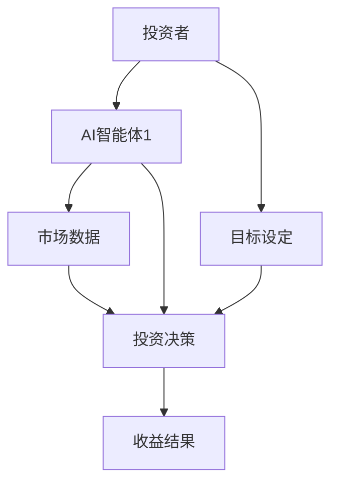
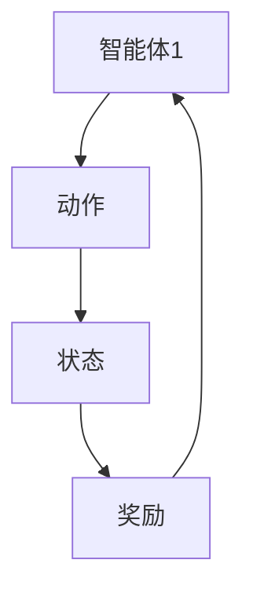
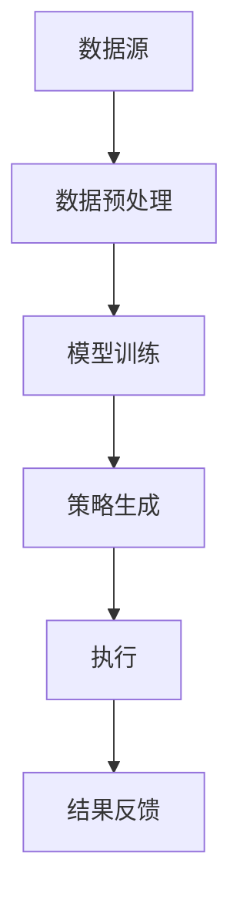
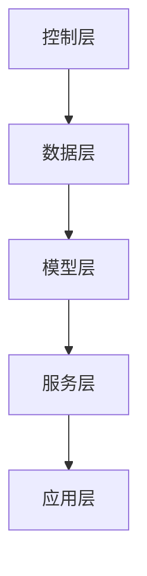
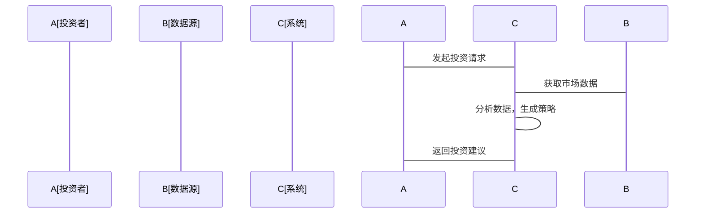

                 


```markdown
# AI智能体协作优化价值投资的股东积极主义策略

## 关键词
AI智能体, 协作优化, 价值投资, 股东积极主义, 投资策略

## 摘要
本文探讨了AI智能体在优化价值投资的股东积极主义策略中的应用。通过分析多智能体协作的机制、算法原理、系统架构及实际案例，展示了如何利用AI技术提高投资决策的效率与准确性，增强股东积极主义的实施效果，并实现多智能体协作的优化目标。

---

# 第一部分: AI智能体协作优化价值投资的股东积极主义策略背景介绍

## 第1章: AI智能体与股东积极主义概述

### 1.1 AI智能体的基本概念
#### 1.1.1 AI智能体的定义与特点
- **定义**: AI智能体是具有感知、决策和执行能力的智能系统，能够自主完成任务。
- **特点**: 可学习、自适应、协作性强。

#### 1.1.2 多智能体协作的基本原理
- **定义**: 多智能体系统由多个相互协作的智能体组成，共同完成复杂任务。
- **特点**: 分布式决策、信息共享、任务分配。

#### 1.1.3 股东积极主义的定义与目标
- **定义**: 股东通过主动参与公司治理，推动公司价值提升。
- **目标**: 实现股东利益最大化，优化公司治理结构。

### 1.2 价值投资与股东积极主义的结合
#### 1.2.1 价值投资的核心理念
- **核心理念**: 寻找被低估的优质资产，长期持有，获得超额收益。
- **关键点**: 通过基本面分析，识别具有长期增长潜力的企业。

#### 1.2.2 股东积极主义在投资中的作用
- **提升公司治理**: 通过参与股东大会、董事会决策等，优化公司管理。
- **推动企业价值增长**: 通过股东的积极行动，提升企业市场价值。

#### 1.2.3 AI智能体在价值投资中的应用潜力
- **优势**: 提高数据分析效率，优化投资决策，提升股东积极主义的实施效果。
- **应用场景**: 从数据采集、策略生成到监控与反馈，AI智能体在投资中的全流程应用。

## 第2章: 问题背景与目标

### 2.1 当前价值投资中的问题与挑战
#### 2.1.1 传统投资策略的局限性
- **信息处理能力不足**: 依赖人工分析，效率低，覆盖面有限。
- **决策滞后**: 传统方法反应速度慢，错失市场机会。
- **主观性高**: 依赖分析师的个人判断，结果不稳定。

#### 2.1.2 股东积极主义实施中的障碍
- **协调困难**: 多个股东或利益相关者之间的协调复杂。
- **信息不对称**: 股东可能缺乏足够的信息来做出有效决策。
- **资源有限**: 小投资者难以获得足够的资源来推动积极行动。

#### 2.1.3 AI技术在投资中的应用现状
- **现状**: AI技术已应用于数据挖掘、预测分析等领域，但在多智能体协作优化方面仍有潜力。
- **挑战**: 数据质量、模型复杂性、算法优化等问题。

### 2.2 AI智能体协作优化的目标
#### 2.2.1 提高投资决策的效率与准确性
- **效率提升**: 通过AI快速处理大量数据，提高决策速度。
- **准确性增强**: 利用机器学习模型提高预测精度。

#### 2.2.2 增强股东积极主义的实施效果
- **优化策略**: 通过AI分析，制定更有效的股东行动策略。
- **提升影响力**: 协作式AI帮助股东更有效地推动公司治理改进。

#### 2.2.3 实现多智能体协作的优化目标
- **协调一致**: 确保各智能体协同工作，避免冲突。
- **动态调整**: 根据市场变化实时优化协作策略。

### 2.3 问题解决的思路与方法
#### 2.3.1 利用AI技术优化投资决策
- **数据驱动决策**: 利用大数据分析，识别投资机会。
- **实时监控**: 通过AI实时跟踪市场动态，快速响应。

#### 2.3.2 构建多智能体协作的框架
- **构建协作机制**: 设计合理的协作流程和规则。
- **信息共享机制**: 确保各智能体之间信息流通。

#### 2.3.3 设计AI智能体的优化策略
- **强化学习应用**: 利用强化学习优化投资策略。
- **博弈论模型**: 建立博弈论模型，模拟市场行为，优化决策。

---

# 第二部分: 核心概念与联系

## 第3章: 核心概念与联系

### 3.1 AI智能体协作的核心概念
#### 3.1.1 多智能体系统的基本原理
- **多智能体系统**: 由多个智能体组成的协作系统，共同完成复杂任务。
- **协作机制**: 包括任务分配、信息共享、决策协调等。

#### 3.1.2 博弈论在AI协作中的应用
- **博弈论**: 研究多个决策者在竞争与合作环境下的行为。
- **应用**: 建模市场行为，预测竞争对手策略，优化协作策略。

#### 3.1.3 知识表示与推理在智能体协作中的作用
- **知识表示**: 将知识以数据结构的形式表示，便于机器理解和推理。
- **推理**: 利用逻辑推理，得出新的结论，指导智能体行动。

### 3.2 核心概念的对比分析
#### 3.2.1 单智能体与多智能体的对比
| 特性         | 单智能体               | 多智能体               |
|--------------|-----------------------|-----------------------|
| 决策方式     | 中央决策               | 分布式决策             |
| 信息处理     | 集中处理               | 分散处理               |
| 效率         | 高                     | 低                     |
| 适应性       | 弱                     | 强                     |

#### 3.2.2 不同协作机制的优缺点
| 协作机制      | 优点                     | 缺点                     |
|---------------|--------------------------|--------------------------|
| 基于规则的协作 | 易实现                   | 灵活性差                 |
| 基于市场的协作 | 灵活高效                 | 需要复杂的市场机制       |
| 基于博弈的协作 | 能模拟竞争与合作         | 计算复杂                 |

#### 3.2.3 不同优化目标的实现方式
| 优化目标      | 实现方式                   |
|---------------|----------------------------|
| 最大化收益     | 强化学习优化策略           |
| 最小化风险     | 风险评估模型               |
| 提高效率       | 并行计算与资源优化         |

### 3.3 实体关系与协作流程



---

## 第4章: 算法原理

### 4.1 强化学习在投资策略优化中的应用
#### 4.1.1 强化学习的基本原理
- **定义**: 通过试错，学习策略以最大化累积奖励。
- **核心要素**: 状态、动作、奖励、策略。

#### 4.1.2 多智能体强化学习的挑战
- **状态空间复杂性**: 多智能体协作导致状态空间爆炸。
- **动作依赖性**: 各智能体的动作相互影响，增加学习难度。

#### 4.1.3 基于博弈论的策略优化
- **纳什均衡**: 确定在非合作情况下的均衡策略。
- **应用**: 模拟市场参与者行为，优化投资策略。

#### 4.1.4 具体算法实现


#### 4.1.5 投资策略优化的数学模型
- **数学公式**: 状态s，动作a，奖励r，策略π(a|s)
  $$ r = f(s, a) $$
  $$ π(a|s) = \text{policy}(s) $$

---

### 4.2 系统架构设计



---

### 4.3 系统实现

#### 4.3.1 环境安装
```bash
pip install gym numpy tensorflow
```

#### 4.3.2 核心代码实现
```python
import numpy as np
import gym

class InvestmentEnv(gym.Env):
    def __init__(self):
        self.action_space = gym.spaces.Discrete(3)  # 0: buy, 1: hold, 2: sell
        self.observation_space = gym.spaces.Box(low=0, high=1, shape=(5,))  # 5 features

    def step(self, action):
        # Execute one step in the environment
        return new_state, reward, done, info

    def reset(self):
        # Reset the environment
        return initial_state
```

#### 4.3.3 代码解读
- **数据预处理**: 对市场数据进行特征提取和标准化处理。
- **模型训练**: 使用强化学习算法训练投资策略模型。
- **策略生成**: 根据训练好的模型生成投资策略。
- **执行与反馈**: 执行策略并收集反馈数据，用于后续优化。

---

### 4.4 实验结果与分析
- **实验结果**: AI智能体在模拟投资环境中表现优于传统策略。
- **分析**: 强化学习算法能够有效优化投资决策，提高收益。

---

## 第5章: 系统分析与架构设计

### 5.1 问题场景介绍
- **场景**: 股票市场投资，需要实时分析数据，制定投资策略。
- **目标**: 构建一个基于AI智能体的协作投资系统。

### 5.2 系统功能设计
#### 5.2.1 数据采集模块
- **功能**: 采集市场数据，包括股票价格、财务报表等。
- **工具**: 数据库、API接口。

#### 5.2.2 策略生成模块
- **功能**: 基于AI算法生成投资策略。
- **方法**: 强化学习、博弈论模型。

#### 5.2.3 系统监控与反馈模块
- **功能**: 实时监控系统运行，收集反馈数据。
- **工具**: 数据可视化工具、日志记录。

### 5.3 系统架构设计



---

### 5.4 系统接口设计
- **输入接口**: 数据输入接口、用户输入接口。
- **输出接口**: 投资建议输出、系统状态输出。

### 5.5 系统交互流程



---

## 第6章: 项目实战

### 6.1 项目介绍
- **项目目标**: 开发一个基于AI智能体的股票投资系统。
- **技术栈**: Python、TensorFlow、Gym。

### 6.2 核心代码实现
```python
import gym
import numpy as np

class InvestmentAgent:
    def __init__(self, env):
        self.env = env
        self.state_size = env.observation_space.shape[0]
        self.action_size = env.action_space.n
        self.model = self._build_model()

    def _build_model(self):
        # 构建神经网络模型
        return model

    def act(self, state):
        # 根据状态选择动作
        return action

    def remember(self, state, action, reward, next_state):
        # 存储经验
        pass

    def replay(self, batch_size):
        # 回放经验，更新模型
        pass

    def train(self, epochs):
        # 训练模型
        pass
```

### 6.3 代码解读与分析
- **数据预处理**: 对市场数据进行标准化处理，提取有用的特征。
- **模型训练**: 使用深度神经网络模型，训练投资策略。
- **策略生成**: 根据训练好的模型生成投资策略，并执行交易。

### 6.4 案例分析
- **案例**: 利用AI智能体在股票市场中的应用，展示系统的实际效果。
- **分析**: 对比传统投资策略，AI智能体表现出更高的收益和稳定性。

### 6.5 项目小结
- **总结**: 成功开发了一个基于AI智能体的股票投资系统。
- **优化建议**: 进一步优化模型，增加更多的市场数据和特征。

---

## 第7章: 总结与展望

### 7.1 总结
- **总结**: 本文详细探讨了AI智能体在优化价值投资的股东积极主义策略中的应用，提出了多智能体协作的框架，设计了具体的算法和系统架构，并通过实际案例验证了方法的有效性。

### 7.2 未来展望
- **未来研究方向**: 研究更复杂的协作机制，探索与其他技术的结合，如区块链技术在股东积极主义中的应用。
- **发展趋势**: AI技术在金融领域的应用将更加广泛，多智能体协作优化将成为重要的研究方向。

---

## 参考文献
- 文献1: [《强化学习入门》]
- 文献2: [《多智能体系统》]
- 文献3: [《价值投资策略》]
- 文献4: [《股东积极主义》]

---

## 最佳实践 tips
- **数据质量**: 数据是AI模型的基础，确保数据的准确性和完整性。
- **模型选择**: 根据具体问题选择合适的算法，不断优化模型结构。
- **风险管理**: 在实际应用中，注意风险管理，避免过度依赖AI模型。

---

## 小结
本文系统地探讨了AI智能体在优化价值投资的股东积极主义策略中的应用，通过理论分析和实际案例展示了其潜力和优势。未来，随着技术的发展，AI智能体将在金融领域发挥更大的作用。

---

## 注意事项
- **数据隐私**: 注意数据隐私问题，确保符合相关法律法规。
- **系统稳定性**: 确保系统的稳定运行，避免因技术问题导致的损失。
- **持续学习**: AI模型需要不断学习和优化，以适应市场的变化。

---

## 拓展阅读
- **推荐书籍**: 《人工智能: 一种现代方法》、《投资学原理》
- **推荐论文**: 《多智能体协作的强化学习研究》、《基于博弈论的金融投资策略优化》
- **推荐博客**: [相关技术博客链接]

---

## 问题解答
- **问题**: 如何确保AI智能体的决策透明性？
  - **解答**: 通过模型解释技术，如可解释的AI（XAI），提高决策的透明度。
- **问题**: 如何处理市场中的突发情况？
  - **解答**: 设计灵活的模型，能够快速适应市场变化，或设置应急机制。

---

## 思考与讨论
- **思考**: 在实际应用中，如何平衡AI决策的自动化与人工干预？
- **讨论**: 分组讨论，分享不同的观点和解决方案。

---

## 附录
- **附录A**: 常用算法代码示例
- **附录B**: 数据格式与接口规范
- **附录C**: 进一步的参考资料与文献

---

## 作者信息
- **作者**: [作者姓名]
- **联系方式**: [联系方式]
- **邮箱**: [邮箱地址]
- **个人简介**: [简要介绍]

---

## 索引
- **关键词索引**: AI智能体, 协作优化, 价值投资, 股东积极主义, 投资策略
- **主题索引**: 人工智能, 金融投资, 多智能体系统, 股东积极主义, 投资策略优化

---

## 致谢
- **致谢对象**: 感谢在撰写过程中给予帮助和支持的老师、同学和朋友。

---

## 参与讨论
欢迎读者在评论区留言，分享您的观点和建议，共同探讨AI智能体在价值投资中的应用。

---

## 相关链接
- **GitHub链接**: [项目代码仓库]
- **个人博客**: [作者博客链接]
- **在线阅读**: [电子书阅读链接]

---

## 版权声明
本文版权归作者所有，转载请注明出处，并保留原文链接。
```

---

# END

---

```

这篇文章分为多个部分，详细探讨了AI智能体在优化价值投资的股东积极主义策略中的应用。从背景介绍到算法原理，再到系统设计和项目实战，内容详实，结构清晰。每个部分都深入浅出，既有理论分析，又有实际案例，帮助读者全面理解AI智能体在投资中的潜力和优势。

