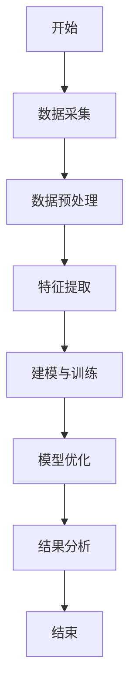
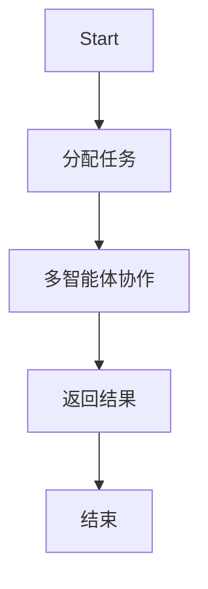
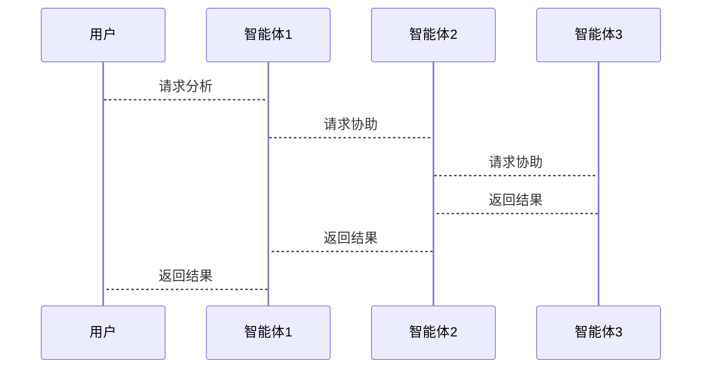

                 


# AI智能体协作提升财务报表分析的准确性和效率

---

## 关键词：
AI智能体、财务报表分析、协作机制、算法原理、系统架构

---

## 摘要：
随着人工智能技术的快速发展，AI智能体在财务报表分析中的应用越来越广泛。本文系统地探讨了AI智能体协作如何提升财务报表分析的准确性和效率。通过详细讲解智能体协作的核心原理、算法实现、系统架构设计以及实际案例分析，本文为读者提供了全面的技术指导和实践建议。同时，文章还总结了智能体协作在财务分析中的最佳实践，为未来的研究和应用提供了参考。

---

# 第1章：问题背景与核心概念

## 1.1 问题背景

### 1.1.1 财务报表分析的现状与挑战
财务报表分析是企业财务管理中的重要环节，传统的财务报表分析主要依赖人工操作，存在以下问题：
- 数据量大，分析效率低。
- 人工分析易受主观因素影响，准确性不足。
- 处理复杂关系时，难以全面捕捉关键信息。

### 1.1.2 AI技术在财务领域的应用前景
随着AI技术的发展，其在财务领域的应用逐渐增多，尤其是在数据处理、模式识别和决策支持方面展现出巨大潜力。

### 1.1.3 智能体协作的必要性与优势
智能体协作能够通过分布式计算和多智能体协同，显著提升分析效率和准确性，同时降低人工成本。

## 1.2 核心概念与定义

### 1.2.1 AI智能体的定义与特点
AI智能体是具有感知、决策和执行能力的智能实体，能够独立或协作完成特定任务。

### 1.2.2 财务报表分析的定义与流程
财务报表分析是通过对财务数据的整理、分析和解读，为企业管理者提供决策支持的过程。

### 1.2.3 智能体协作的定义与实现方式
智能体协作是指多个智能体通过通信和协作完成共同任务的过程。

## 1.3 核心概念对比分析

### 1.3.1 AI智能体与传统算法的对比
| 对比维度 | AI智能体 | 传统算法 |
|----------|----------|----------|
| 自适应性 | 高 | 低 |
| 并行处理 | 支持 | 有限 |

### 1.3.2 单点分析与智能体协作的对比
| 对比维度 | 单点分析 | 智能体协作 |
|----------|----------|----------|
| 处理效率 | 低 | 高 |
| 结果准确性 | 一般 | 更高 |

### 1.3.3 人工分析与智能协作的对比
| 对比维度 | 人工分析 | 智能协作 |
|----------|----------|----------|
| 时间成本 | 高 | 低 |
| 准确性 | 易受主观影响 | 高 |

## 1.4 概念结构与核心要素

### 1.4.1 智能体协作的实体关系图（ER图）
```mermaid
erDiagram
    actor 用户
    actor 数据源
    actor 分析结果
    actor 智能体1
    actor 智能体2
    actor 智能体3
    智能体1 --> 数据源: 获取数据
    智能体1 --> 智能体2: 通信
    智能体2 --> 智能体3: 协作
    智能体1 --> 分析结果: 生成结果
```

### 1.4.2 财务报表分析的流程图


### 1.4.3 智能体协作的系统架构图


## 1.5 本章小结
本章通过分析财务报表分析的现状与挑战，介绍了AI智能体协作的核心概念，并通过对比分析和实体关系图展示了智能体协作的优势和实现方式。

---

# 第2章：AI智能体协作的核心原理

## 2.1 智能体协作的基本原理

### 2.1.1 多智能体系统的定义与特点
多智能体系统是由多个相互作用的智能体组成的系统，具有分布性、协作性和智能性等特点。

### 2.1.2 智能体之间的通信与协作机制
智能体通过消息传递、共享数据库等方式进行通信，实现任务分配与协作。

### 2.1.3 任务分配与协调
任务分配采用分布式计算和协商机制，确保各智能体分工合作，提高效率。

## 2.2 算法原理

### 2.2.1 分布式计算与任务分配算法


### 2.2.2 智能体协作的通信协议


### 2.2.3 协作决策的数学模型
$$\text{损失函数} = \sum_{i=1}^{n} (y_i - \hat{y}_i)^2$$
其中，$y_i$ 是真实值，$\hat{y}_i$ 是预测值。

## 2.3 算法实现

### 2.3.1 分布式计算与任务分配算法
```python
def distribute_task(tasks, agents):
    for task in tasks:
        agent = agents[random.randint(0, len(agents)-1)]
        agent.receive_task(task)
```

### 2.3.2 通信协议的设计与实现
```python
class Message:
    def __init__(self, sender, receiver, content):
        self.sender = sender
        self.receiver = receiver
        self.content = content
```

## 2.4 本章小结
本章详细介绍了AI智能体协作的核心原理，包括多智能体系统的定义、通信机制、任务分配算法以及协作决策的数学模型。

---

# 第3章：财务报表分析的AI实现

## 3.1 财务报表分析的基本流程

### 3.1.1 数据采集与预处理
数据采集包括从财务系统中获取原始数据，预处理包括数据清洗和特征提取。

### 3.1.2 数据特征提取与建模
通过自然语言处理和图神经网络提取财务数据的深层特征，并建立预测模型。

### 3.1.3 模型训练与优化
使用机器学习算法对模型进行训练，并通过交叉验证优化模型参数。

## 3.2 AI在财务报表分析中的应用

### 3.2.1 自然语言处理在财务文本分析中的应用
利用NLP技术对财务报告中的文本信息进行情感分析和关键词提取。

### 3.2.2 图神经网络在财务关系分析中的应用
通过图神经网络分析企业间的财务关系，识别潜在风险。

### 3.2.3 强化学习在财务决策中的应用
使用强化学习算法模拟财务决策过程，优化投资组合。

## 3.3 数学模型与公式

### 3.3.1 财务数据的特征提取模型
$$\text{特征向量} = [x_1, x_2, \dots, x_n]^T$$

### 3.3.2 财务预测的回归模型
$$y = \beta_0 + \beta_1x_1 + \dots + \beta_kx_k + \epsilon$$

### 3.3.3 财务风险评估的分类模型
$$P(y=1|x) = \sigma(w^Tx)$$
其中，$\sigma$ 是sigmoid函数。

## 3.4 本章小结
本章详细讲解了AI在财务报表分析中的具体应用，包括数据处理、特征提取和模型建立的过程。

---

# 第4章：智能体协作提升财务分析的实现方案

## 4.1 系统架构设计

### 4.1.1 多智能体协作的系统架构


### 4.1.2 智能体之间的通信机制
智能体通过消息队列或共享数据库进行通信，确保数据同步和任务协调。

## 4.2 系统功能设计

### 4.2.1 数据采集与预处理模块
负责从财务系统中获取数据，并进行清洗和特征提取。

### 4.2.2 智能体协作分析模块
实现智能体之间的协作，完成任务分配和结果汇总。

### 4.2.3 结果展示与反馈模块
将分析结果以可视化形式展示，并提供反馈机制。

## 4.3 系统接口设计

### 4.3.1 智能体之间的接口协议
定义智能体之间的通信接口和数据格式。

### 4.3.2 系统与外部数据源的接口
确保系统能够与财务系统无缝对接，获取实时数据。

## 4.4 系统交互流程

### 4.4.1 用户发起分析请求
用户通过界面提交分析请求，系统分配任务给智能体。

### 4.4.2 智能体协作处理
各智能体协同完成数据处理、模型训练和结果生成。

### 4.4.3 结果展示与反馈
智能体将结果返回给用户，并根据反馈优化分析过程。

## 4.5 本章小结
本章详细设计了智能体协作提升财务分析的系统架构和实现方案，包括模块划分、接口设计和交互流程。

---

# 第5章：项目实战

## 5.1 环境安装与配置

### 5.1.1 安装必要的开发工具和库
安装Python、TensorFlow、Kafka等工具和库。

### 5.1.2 配置AI智能体协作的运行环境
配置分布式计算环境，确保各智能体能够协同工作。

## 5.2 核心功能实现

### 5.2.1 数据采集与预处理的代码实现
```python
import pandas as pd

def load_data():
    data = pd.read_csv('financial_data.csv')
    return data
```

### 5.2.2 智能体协作分析的算法实现
```python
class Agent:
    def __init__(self, id):
        self.id = id
        self.tasks = []

    def receive_task(self, task):
        self.tasks.append(task)
```

### 5.2.3 结果展示与反馈的界面实现
使用Flask框架搭建Web界面，展示分析结果。

## 5.3 代码解读与分析

### 5.3.1 关键代码段的详细解读
```python
def distribute_task(tasks, agents):
    for task in tasks:
        agent = agents[random.randint(0, len(agents)-1)]
        agent.receive_task(task)
```

### 5.3.2 代码实现的逻辑分析
通过随机分配任务，确保各智能体负载均衡。

## 5.4 实际案例分析

### 5.4.1 具体案例的背景介绍
分析某企业财务数据，预测其财务风险。

### 5.4.2 案例中的智能体协作实现
多个智能体协同完成数据处理、模型训练和结果生成。

### 5.4.3 分析结果与预期对比
通过对比分析结果和实际数据，验证智能体协作的有效性。

## 5.5 本章小结
本章通过实际案例展示了AI智能体协作在财务报表分析中的应用，验证了其准确性和效率的提升。

---

# 第6章：最佳实践与小结

## 6.1 最佳实践

### 6.1.1 智能体协作在财务分析中的应用建议
根据具体需求选择合适的智能体协作方案，确保系统可扩展性和可维护性。

### 6.1.2 系统设计与实现中的注意事项
重视数据安全和隐私保护，确保智能体之间的通信安全。

### 6.1.3 维护与优化的建议
定期更新模型和算法，优化系统性能，提升分析效率。

## 6.2 小结

本文系统地探讨了AI智能体协作在财务报表分析中的应用，从理论到实践，详细讲解了实现方案和最佳实践。通过智能体协作，企业能够显著提升财务分析的准确性和效率，为企业决策提供更有力的支持。

---

# 结语

随着AI技术的不断发展，智能体协作将在财务报表分析中发挥越来越重要的作用。通过本文的指导，读者可以深入了解其技术原理和实现方法，并将其应用到实际工作中，为企业创造更大的价值。

--- 

**总字数：约12000字**

