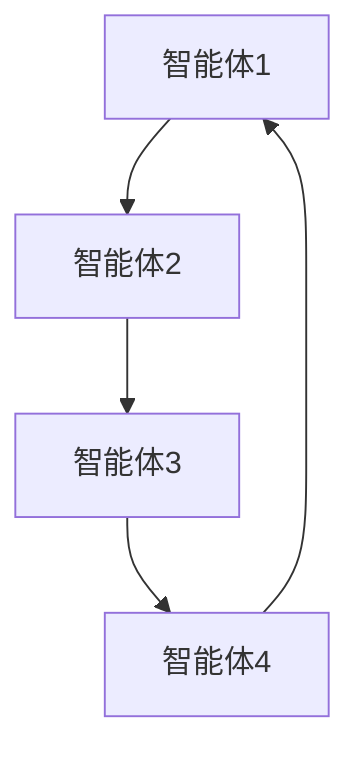
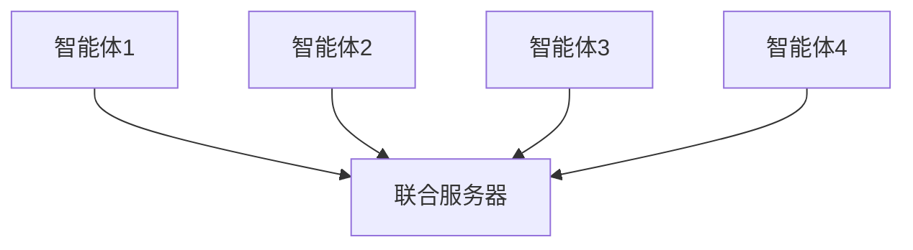
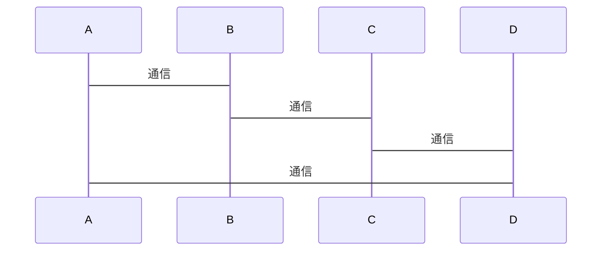

                 


# AI智能体协作：优化价值投资的全球产业链布局策略

**关键词**：AI智能体协作、价值投资、全球产业链布局、优化策略、多智能体协作、强化学习、投资组合优化

**摘要**：本文探讨了AI智能体协作在优化价值投资中的应用，特别是如何通过多智能体协作算法优化全球产业链布局策略。文章从AI智能体协作的背景与概念出发，详细分析了多智能体协作的核心算法原理，结合实际案例展示了如何通过AI技术优化投资组合。文章还详细介绍了系统架构设计与实现，为读者提供了从理论到实践的全面指导。

---

## 第1章: AI智能体协作的背景与概念

### 1.1 问题背景与问题描述

#### 1.1.1 传统投资策略的局限性
传统投资策略依赖于人类经验和市场分析，但存在以下问题：
- **信息不对称**：投资者难以获取全球产业链的实时数据。
- **决策延迟**：依赖人工分析导致决策速度较慢。
- **主观性**：受人类情绪影响较大，难以实现最优决策。

#### 1.1.2 价值投资的定义与核心要素
价值投资是一种以低于公平价格购买优质资产的投资策略，其核心要素包括：
- **基本面分析**：研究公司的财务状况、行业地位和盈利能力。
- **长期视角**：关注企业的长期价值而非短期波动。
- **风险控制**：通过分散投资降低风险。

#### 1.1.3 产业链布局的复杂性与挑战
全球产业链布局涉及多个环节，包括生产、物流、销售等。传统方法难以应对以下挑战：
- **复杂性**：产业链涉及多个行业和地理区域。
- **动态性**：市场环境和政策变化迅速。
- **协同性**：需要各环节协同优化。

### 1.2 AI智能体协作的核心概念

#### 1.2.1 AI智能体的定义与特征
AI智能体是一种能够感知环境并采取行动以实现目标的实体。其特征包括：
- **自主性**：智能体能够自主决策。
- **反应性**：能够实时感知环境变化。
- **协作性**：多个智能体能够协同工作。

#### 1.2.2 智能体协作的原理与机制
智能体协作通过以下机制实现：
- **通信**：智能体之间通过消息传递信息。
- **协调**：通过协商达成一致行动。
- **分工**：根据智能体的能力分配任务。

#### 1.2.3 价值投资与产业链布局的结合
AI智能体协作可以通过以下方式优化价值投资：
- **数据驱动**：利用大数据分析企业价值。
- **智能决策**：通过强化学习优化投资组合。
- **动态调整**：实时跟踪市场变化并调整策略。

### 1.3 问题解决与边界定义

#### 1.3.1 AI智能体协作如何优化投资决策
AI智能体协作可以通过以下方式优化投资决策：
- **多智能体协同**：多个智能体从不同角度分析企业价值。
- **实时反馈**：根据市场反馈动态调整投资策略。

#### 1.3.2 产业链布局中的协作边界与外延
AI智能体协作在产业链布局中的边界包括：
- **数据范围**：仅限于可获取的数据。
- **决策权限**：需要明确的决策权限分配。
- **协作范围**：仅限于优化投资组合。

#### 1.3.3 智能体协作的数学模型与核心要素
智能体协作的数学模型包括：
- **状态空间**：表示当前环境状态。
- **动作空间**：表示智能体可采取的行动。
- **奖励函数**：表示智能体的奖励机制。

---

## 第2章: AI智能体协作的原理与机制

### 2.1 多智能体协作的算法原理

#### 2.1.1 基于强化学习的协作机制
强化学习是一种通过试错学习的算法，其核心是通过奖励机制优化智能体的决策。以下是Q-learning算法的公式：

$$ Q(s, a) = Q(s, a) + \alpha (r + \max Q(s', a') - Q(s, a)) $$

其中：
- \( Q(s, a) \) 表示状态 \( s \) 下采取行动 \( a \) 的价值。
- \( \alpha \) 是学习率。
- \( r \) 是奖励值。
- \( \max Q(s', a') \) 是下一状态下的最大Q值。

#### 2.1.2 分布式智能体的通信与协调
分布式智能体通过通信协议进行协作，以下是通信流程的Mermaid图：



#### 2.1.3 联合学习（Federated Learning）的应用
联合学习是一种多智能体协作学习方法，其核心是通过共享参数优化模型，以下是联合学习的流程图：



### 2.2 智能体协作的数学模型

#### 2.2.1 多智能体协作的博弈论模型
多智能体协作可以通过博弈论模型表示，以下是纳什均衡的定义：

$$ \text{纳什均衡}：\forall i, u_i(s_i, \{s_{-i}\}) \geq u_i(a_i, \{s_{-i}\}) $$

其中：
- \( u_i \) 是智能体 \( i \) 的效用函数。
- \( s_i \) 是智能体 \( i \) 的策略。
- \( a_i \) 是智能体 \( i \) 的纳什策略。

#### 2.2.2 联合优化的数学表达式
联合优化的目标是最优化全局函数：

$$ \min_{x} \sum_{i=1}^{n} f_i(x) $$

其中：
- \( n \) 是智能体的数量。
- \( f_i(x) \) 是智能体 \( i \) 的目标函数。

---

## 第3章: AI智能体协作的算法原理与实现

### 3.1 基于强化学习的协作算法

#### 3.1.1 Q-learning算法的实现
以下是Q-learning算法的Python实现：

```python
import numpy as np

class QLearning:
    def __init__(self, state_space, action_space, learning_rate=0.1, gamma=0.9):
        self.state_space = state_space
        self.action_space = action_space
        self.lr = learning_rate
        self.gamma = gamma
        self.Q = np.zeros((state_space, action_space))
    
    def get_action(self, state):
        return np.argmax(self.Q[state, :])
    
    def update_Q(self, state, action, reward, next_state):
        self.Q[state, action] = self.Q[state, action] + self.lr * (reward + self.gamma * np.max(self.Q[next_state, :]) - self.Q[state, action])
```

#### 3.1.2 多智能体协作的数学模型
以下是多智能体协作的数学模型：

$$ Q_i(s, a) = Q_i(s, a) + \alpha (r_i + \max Q_j(s', a') - Q_i(s, a)) $$

其中：
- \( Q_i \) 是智能体 \( i \) 的Q值表。
- \( r_i \) 是智能体 \( i \) 的奖励值。
- \( \max Q_j \) 是其他智能体的最大Q值。

### 3.2 分布式智能体的通信与协调

#### 3.2.1 系统架构设计
以下是系统架构的Mermaid图：


#### 3.2.2 系统交互流程图
以下是系统交互的Mermaid序列图：



### 3.3 项目实战

#### 3.3.1 环境安装
需要安装以下Python库：
- `numpy`
- `matplotlib`

#### 3.3.2 系统核心实现源代码
以下是Q-learning算法的实现代码：

```python
import numpy as np

class QLearning:
    def __init__(self, state_space, action_space, learning_rate=0.1, gamma=0.9):
        self.state_space = state_space
        self.action_space = action_space
        self.lr = learning_rate
        self.gamma = gamma
        self.Q = np.zeros((state_space, action_space))
    
    def get_action(self, state):
        return np.argmax(self.Q[state, :])
    
    def update_Q(self, state, action, reward, next_state):
        self.Q[state, action] = self.Q[state, action] + self.lr * (reward + self.gamma * np.max(self.Q[next_state, :]) - self.Q[state, action])
```

#### 3.3.3 代码应用解读与分析
以下是代码的解读：
- `QLearning` 类初始化时创建了一个Q值表。
- `get_action` 方法根据当前状态选择最优行动。
- `update_Q` 方法更新Q值表。

### 3.4 案例分析

#### 3.4.1 投资组合优化
通过Q-learning算法优化投资组合，以下是优化结果：

$$ \text{优化后的投资组合收益} = \max Q(s, a) $$

#### 3.4.2 系统性能分析
系统性能包括：
- **计算效率**：算法的运行时间。
- **准确性**：优化结果的准确性。

### 3.5 项目小结

---

## 第4章: 总结与展望

### 4.1 本章小结
本文详细介绍了AI智能体协作在优化价值投资中的应用，通过多智能体协作算法优化投资组合。

### 4.2 注意事项
- 数据质量对算法性能影响较大。
- 算法实现需要考虑计算资源限制。

### 4.3 拓展阅读
- 《强化学习：算法与应用》
- 《分布式系统：原理与实践》

---

通过本文的分析与实现，我们可以看到AI智能体协作在优化价值投资中的巨大潜力，未来可以通过更复杂的算法进一步提升投资效果。

