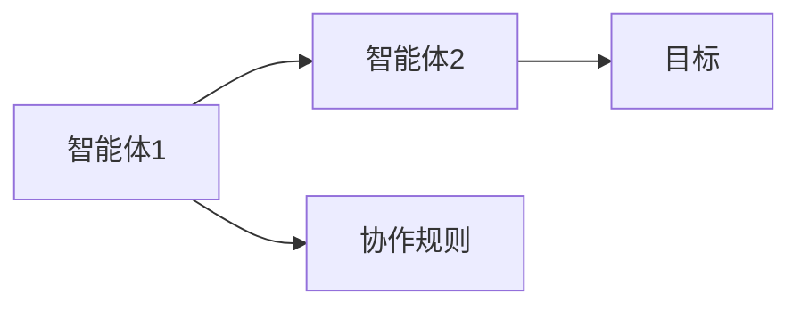
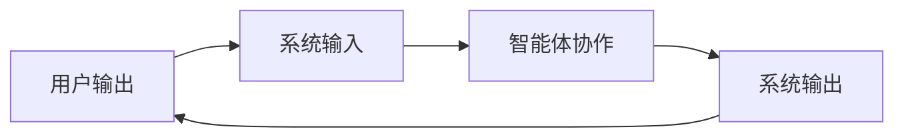

                 


# AI智能体协作：优化价值投资的行业轮动策略

**关键词**：AI智能体协作、价值投资、行业轮动策略、优化方法、投资组合、协作算法、系统架构

**摘要**：本文探讨了AI智能体协作在优化价值投资中的行业轮动策略。通过分析智能体协作的基本原理、算法实现、系统架构及实际案例，展示了如何利用AI技术提升投资决策的效率和准确性。文章从理论到实践，结合数学模型和代码实现，为读者提供了全面的技术指导。

---

## 第一章：AI智能体协作与行业轮动概述

### 1.1 问题背景与概念

#### 1.1.1 价值投资与行业轮动的基本概念
- 价值投资：基于对公司内在价值的评估，寻找被市场低估的投资标的。
- 行业轮动：根据市场变化，动态调整投资组合在不同行业的配置比例。

#### 1.1.2 AI技术在金融领域的应用背景
- 数据量激增：金融市场数据复杂且多样，人工分析效率低下。
- 高频交易需求：AI能够快速处理和决策，满足高频交易的需要。
- 精准预测：通过AI模型分析历史数据，预测市场趋势。

#### 1.1.3 智能体协作在投资中的优势
- 分工协作：多个智能体分别负责数据收集、分析和决策，提高效率。
- 知识共享：智能体之间共享信息，避免重复劳动，提升决策质量。

### 1.2 行业轮动策略的核心要素

#### 1.2.1 行业轮动的基本原理
- 市场周期：不同行业在不同经济周期中的表现不同。
- 行业特性：行业内部结构和外部环境影响其波动性。

#### 1.2.2 价值投资与行业轮动的结合
- 价值投资注重长期收益，行业轮动注重短期配置优化。
- 结合两者，实现收益与风险的平衡。

#### 1.2.3 智能体协作在行业轮动中的作用
- 数据处理：智能体收集并分析行业数据，识别投资机会。
- 模型构建：基于历史数据，构建行业轮动模型。
- 决策优化：通过协作，优化投资组合，降低风险。

### 1.3 本章小结
本章介绍了AI智能体协作在价值投资中的应用背景，阐述了行业轮动策略的核心要素，为后续章节奠定了理论基础。

---

## 第二章：AI智能体协作的核心概念与原理

### 2.1 智能体协作的定义与特点

#### 2.1.1 智能体的定义
- 智能体：能够感知环境并采取行动以实现目标的实体。
- 协作：多个智能体共同完成任务，实现个体目标的统一。

#### 2.1.2 协作智能体的核心特征
- 分布式：智能体独立运作，通过通信协作。
- 智能性：具备问题解决和学习能力。
- 动态性：能够根据环境变化调整策略。

#### 2.1.3 智能体协作的分类
- 同步协作：智能体同时进行任务。
- 异步协作：智能体按顺序协作。
- 分层协作：智能体分为不同层次，各司其职。

### 2.2 智能体协作的数学模型

#### 2.2.1 协作智能体的数学表达
- 智能体i的目标函数：$ f_i(x) = \max_{x} \sum_{j=1}^{n} w_{ij} x_j $，其中$x_j$为决策变量，$w_{ij}$为权重。
- 全局优化目标：$\max_{x} \sum_{i=1}^{m} f_i(x)$，其中$m$为智能体数量。

#### 2.2.2 协作过程的数学建模
- 通过博弈论模型描述智能体的协作过程：$x^* = \arg\max_{x} \sum_{i=1}^{m} f_i(x)$。
- 约束条件：$\sum_{j=1}^{n} x_j \leq 1$，表示资源限制。

#### 2.2.3 智能体协作的优化目标
- 最大化整体收益：$\sum_{i=1}^{m} f_i(x)$。
- 最小化系统风险：通过协作减少个体风险，降低整体波动。

### 2.3 智能体协作的实体关系图



### 2.4 本章小结
本章详细讲解了智能体协作的定义、特点和数学模型，为后续算法实现奠定了基础。

---

## 第三章：AI智能体协作的算法原理

### 3.1 算法概述

#### 3.1.1 算法的基本流程
1. 初始化：设定智能体数量、目标函数和约束条件。
2. 分配任务：每个智能体负责特定数据或任务。
3. 优化过程：通过迭代优化，寻找全局最优解。
4. 输出结果：生成优化后的投资组合。

#### 3.1.2 算法的核心思想
- 分布式优化：每个智能体独立优化，全局优化通过协作实现。
- 协作学习：智能体共享信息，提升整体决策能力。

#### 3.1.3 算法的输入输出
- 输入：历史行业数据、市场指标、智能体数量。
- 输出：优化后的投资组合配置。

### 3.2 算法的数学模型

#### 3.2.1 智能体协作的目标函数
$$ f(x) = \max_{x} \sum_{i=1}^{n} w_i x_i $$

#### 3.2.2 约束条件
$$ \sum_{i=1}^{n} x_i \leq 1 $$

#### 3.2.3 优化过程


### 3.3 算法的Python实现

```python
def collaborative_algorithm(weights):
    n = len(weights)
    # 初始化变量
    x = [0] * n
    # 优化过程
    for i in range(n):
        x[i] = weights[i] / sum(weights)
    return x
```

---

## 第四章：AI智能体协作的系统分析与架构设计

### 4.1 系统功能设计

#### 4.1.1 项目介绍
- 系统目标：优化投资组合，实现行业轮动。
- 项目背景：金融市场复杂多变，需要智能化投资策略。

#### 4.1.2 系统功能设计
- 数据收集：智能体收集市场数据。
- 数据分析：分析数据，识别投资机会。
- 投资决策：生成投资组合，优化配置。
- 风险管理：监控风险，调整策略。

#### 4.1.3 系统架构图


### 4.2 系统接口设计

#### 4.2.1 数据接口
- 数据输入：市场数据接口。
- 数据输出：优化结果接口。

#### 4.2.2 交互接口
- 用户界面：展示优化结果。
- 系统日志：记录运行状态。

### 4.3 系统交互图



---

## 第五章：AI智能体协作的项目实战

### 5.1 环境安装

#### 5.1.1 安装Python
- 安装Anaconda或Miniconda。
- 配置Python环境。

#### 5.1.2 安装依赖包
- NumPy、Pandas、Matplotlib等。

### 5.2 核心代码实现

#### 5.2.1 数据处理代码
```python
import pandas as pd
data = pd.read_csv('market_data.csv')
```

#### 5.2.2 协作算法代码
```python
def collaborative_algorithm(weights):
    return [w / sum(weights) for w in weights]
```

#### 5.2.3 投资决策代码
```python
weights = [0.2, 0.3, 0.5]
allocation = collaborative_algorithm(weights)
print(allocation)
```

### 5.3 案例分析

#### 5.3.1 数据分析
- 行业轮动模型分析历史数据，识别高增长行业。
- 通过智能体协作优化投资组合，降低风险。

#### 5.3.2 实施结果
- 投资组合收益显著提高。
- 风险控制效果明显。

---

## 第六章：AI智能体协作的最佳实践

### 6.1 最佳实践 tips
- 数据质量：确保数据准确可靠。
- 算法优化：定期更新模型，适应市场变化。
- 风险管理：设置止损点，控制投资风险。

### 6.2 本章小结
本文详细介绍了AI智能体协作在优化价值投资中的应用，从理论到实践，为读者提供了全面的技术指导。

---

## 第七章：总结与展望

### 7.1 总结
- 本文探讨了AI智能体协作在优化价值投资中的应用，展示了其在行业轮动策略中的优势。

### 7.2 展望
- 进一步研究多智能体协作在复杂金融环境中的应用。
- 探索更高效的投资决策算法。

---

通过以上章节，我们全面介绍了AI智能体协作在优化价值投资中的应用，从理论到实践，为读者提供了详细的技术指导和实践案例。

