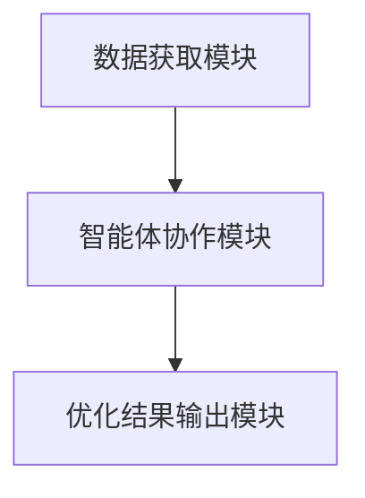

                 


# AI智能体协作：优化价值投资组合的风险收益特征

> 关键词：AI智能体协作，价值投资组合，风险收益优化，多智能体系统，强化学习

> 摘要：本文深入探讨了AI智能体协作在优化价值投资组合风险收益特征中的应用。通过结合多智能体系统、现代投资组合理论和强化学习等技术，提出了基于AI智能体协作的投资组合优化方法，分析了其算法原理、数学模型和系统架构，并通过实际案例验证了该方法的有效性。

---

## 第1章: AI智能体协作与价值投资组合概述

### 1.1 AI智能体协作的背景与意义

#### 1.1.1 传统投资组合管理的局限性
传统的投资组合管理依赖于人工决策和单一优化模型，存在以下问题：
- **信息处理能力有限**：人类难以处理海量数据并实时调整投资策略。
- **决策滞后性**：市场波动快于人类决策速度。
- **单一优化视角**：传统模型难以兼顾风险与收益的多目标优化。

#### 1.1.2 AI智能体协作的定义与特点
AI智能体协作是指多个AI智能体通过协同工作，共同完成复杂任务的过程。其特点包括：
- **分布式决策**：每个智能体独立决策，但通过通信共享信息。
- **动态协作**：智能体能够实时调整协作策略以适应市场变化。
- **多目标优化**：通过协作实现风险与收益的平衡。

#### 1.1.3 智能体协作在投资组合管理中的价值
AI智能体协作能够显著提升投资组合管理的效率和效果：
- **实时优化**：多个智能体协同工作，实时调整投资组合。
- **多目标优化**：通过协作实现风险与收益的最优平衡。
- **鲁棒性增强**：智能体的分布式决策能够降低单一决策的风险。

### 1.2 价值投资组合的风险收益特征

#### 1.2.1 投资组合的基本概念
- **投资组合**：一组金融资产的集合，旨在通过多样化投资降低风险。
- **收益**：投资组合的预期收益，通常以资产收益率为衡量标准。
- **风险**：投资组合的波动性，通常以方差或标准差为衡量标准。

#### 1.2.2 风险与收益的定义与衡量
- **收益**：投资组合的收益可以用期望值表示：
  $$ E[R] = \sum_{i=1}^{n} w_i R_i $$
  其中，$w_i$是第i个资产的权重，$R_i$是第i个资产的收益率。
- **风险**：投资组合的风险可以用方差表示：
  $$ Var(R) = \sum_{i=1}^{n} \sum_{j=1}^{n} w_i w_j Cov(R_i, R_j) $$

#### 1.2.3 现代投资组合理论（MPT）的简介
MPT由Harry Markowitz提出，核心思想是通过分散投资降低风险。最优投资组合是在收益-风险曲线上找到有效前沿上的点。

### 1.3 AI智能体协作优化的必要性

#### 1.3.1 传统优化方法的不足
- **单点优化**：传统优化方法仅考虑单一目标（如收益最大化或风险最小化）。
- **静态模型**：传统模型难以适应动态变化的市场环境。
- **计算复杂度高**：复杂的投资组合优化问题难以在实时环境中解决。

#### 1.3.2 AI智能体协作的优势
- **分布式计算**：多个智能体协同计算，降低单点计算压力。
- **实时协作**：智能体能够实时调整策略，适应市场变化。
- **多目标优化**：通过协作实现收益与风险的最优平衡。

#### 1.3.3 实际应用场景分析
AI智能体协作可以应用于以下场景：
- **实时市场监控**：智能体实时监控市场数据，快速调整投资组合。
- **风险预警**：通过协作发现潜在风险，提前采取应对措施。
- **智能投资顾问**：为投资者提供个性化的投资建议。

---

## 第2章: AI智能体协作的核心概念与联系

### 2.1 多智能体系统（MAS）的基本原理

#### 2.1.1 多智能体系统的定义与特点
多智能体系统由多个智能体组成，通过协作完成复杂任务。其特点包括：
- **分布式智能**：智能体独立决策，但通过通信共享信息。
- **动态协作**：智能体能够实时调整协作策略。
- **任务分解**：复杂任务分解为多个子任务，由不同智能体完成。

#### 2.1.2 智能体之间的协作机制
协作机制包括：
- **任务分配**：智能体根据自身能力和当前状态分配任务。
- **信息共享**：智能体通过通信共享市场数据和策略。
- **决策协调**：智能体协调决策，确保整体目标的实现。

#### 2.1.3 智能体协作的分类与应用场景
智能体协作可以分为：
- **同质协作**：智能体角色相同，任务相似。
- **异质协作**：智能体角色不同，任务互补。

### 2.2 价值投资组合优化的数学模型

#### 2.2.1 投资组合优化的数学表达
投资组合优化的目标是在给定风险水平下最大化收益，或者在给定收益下最小化风险。数学表达如下：
$$ \text{最大化 } E[R] \quad \text{在 } Var(R) \leq \text{风险约束} $$
或
$$ \text{最小化 } Var(R) \quad \text{在 } E[R] \geq \text{收益约束} $$

#### 2.2.2 风险收益特征的数学公式
- **收益-风险曲线**：描述不同投资组合的收益与风险关系。
- **有效前沿**：在收益-风险曲线上，能够提供最大收益或最小风险的投资组合构成的曲线。

#### 2.2.3 现代投资组合理论（MPT）的数学推导
MPT通过优化以下目标函数实现：
$$ \text{最小化 } Var(R) \quad \text{在 } E[R] \geq \text{目标收益} $$

### 2.3 AI智能体协作与投资组合优化的联系

#### 2.3.1 智能体协作在投资组合优化中的作用
- **分布式计算**：多个智能体协同计算，提高优化效率。
- **实时调整**：智能体能够实时调整投资组合，适应市场变化。
- **多目标优化**：通过协作实现收益与风险的最优平衡。

#### 2.3.2 智能体协作优化的价值投资组合的特点
- **动态优化**：投资组合能够实时调整，适应市场变化。
- **多目标优化**：通过协作实现收益与风险的最优平衡。
- **鲁棒性增强**：智能体的分布式决策能够降低单一决策的风险。

---

## 第3章: AI智能体协作优化的算法原理

### 3.1 多智能体强化学习（Multi-Agent Reinforcement Learning）

#### 3.1.1 强化学习的基本原理
强化学习是一种通过试错学习的方法，智能体通过与环境交互，学习最优策略。

#### 3.1.2 多智能体强化学习的定义与特点
多智能体强化学习涉及多个智能体协作完成任务，其特点包括：
- **分布式决策**：每个智能体独立决策，但通过通信共享信息。
- **协作与竞争**：智能体之间可以协作或竞争。

#### 3.1.3 多智能体强化学习的算法框架
常见的多智能体强化学习算法包括：
- **分布式值函数法（Distributed Value Function Approach）**
- **集中化值函数法（Centralized Value Function Approach）**
- **联合策略法（Joint Policy Approach）**

### 3.2 分散决策与集中优化的结合

#### 3.2.1 分散决策的定义与特点
分散决策是指每个智能体独立决策，但通过通信共享信息。

#### 3.2.2 集中优化的定义与特点
集中优化是指将所有智能体的决策集中到一个中心进行优化。

#### 3.2.3 分散决策与集中优化的结合方法
通过将分散决策与集中优化相结合，可以实现高效的协作优化。

### 3.3 基于博弈论的智能体协作优化

#### 3.3.1 博弈论的基本概念
博弈论研究多个决策主体在竞争或合作环境中的策略选择问题。

#### 3.3.2 智能体协作中的博弈模型
智能体协作可以看作是一种合作博弈，多个智能体通过协作实现共同目标。

#### 3.3.3 基于博弈论的优化算法
通过分析博弈论中的纳什均衡，可以设计智能体协作优化算法。

---

## 第4章: 价值投资组合优化的数学模型与算法实现

### 4.1 投资组合优化的基本数学模型

#### 4.1.1 投资组合的收益与风险的数学表达
- **收益**：投资组合的收益可以用期望值表示：
  $$ E[R] = \sum_{i=1}^{n} w_i R_i $$
- **风险**：投资组合的风险可以用方差表示：
  $$ Var(R) = \sum_{i=1}^{n} \sum_{j=1}^{n} w_i w_j Cov(R_i, R_j) $$

#### 4.1.2 现代投资组合理论（MPT）的数学推导
通过优化以下目标函数实现投资组合优化：
$$ \text{最小化 } Var(R) \quad \text{在 } E[R] \geq \text{目标收益} $$

### 4.2 基于AI智能体协作的投资组合优化算法

#### 4.2.1 算法框架
AI智能体协作优化算法包括以下步骤：
1. **初始化**：设置智能体数量、初始权重等参数。
2. **市场数据获取**：智能体获取市场数据，包括资产收益率、协方差矩阵等。
3. **任务分配**：智能体根据自身能力分配优化任务。
4. **信息共享**：智能体通过通信共享市场数据和策略。
5. **决策协调**：智能体协调决策，优化投资组合。
6. **结果输出**：输出最优投资组合。

#### 4.2.2 算法实现
以下是一个基于AI智能体协作的投资组合优化算法的Python实现示例：

```python
import numpy as np
import random

class Agent:
    def __init__(self, id):
        self.id = id
        self.weight = random.random()
        
    def get_data(self, market_data):
        self.data = market_data
        
    def optimize(self):
        # 简单的优化策略
        return self.weight
        
def main():
    # 初始化市场数据
    market_data = np.random.rand(10, 10)
    
    # 初始化智能体
    agents = [Agent(i) for i in range(5)]
    
    # 获取市场数据
    for agent in agents:
        agent.get_data(market_data)
        
    # 优化投资组合
    weights = []
    for agent in agents:
        weights.append(agent.optimize())
        
    print("Optimal weights:", weights)
    
if __name__ == "__main__":
    main()
```

### 4.3 算法优化与改进

#### 4.3.1 算法优化策略
- **分布式计算**：通过分布式计算提高优化效率。
- **动态调整**：根据市场变化动态调整优化策略。
- **多目标优化**：通过协作实现收益与风险的最优平衡。

#### 4.3.2 算法改进方向
- **增强学习**：引入强化学习，提高智能体的决策能力。
- **协作机制优化**：优化智能体的协作机制，提高优化效果。
- **风险管理**：引入风险管理机制，降低投资组合的风险。

---

## 第5章: 价值投资组合优化的系统架构设计

### 5.1 系统架构设计

#### 5.1.1 系统模块划分
系统架构包括以下模块：
- **数据获取模块**：获取市场数据。
- **智能体协作模块**：实现智能体协作优化。
- **优化结果输出模块**：输出最优投资组合。

#### 5.1.2 系统功能设计
- **数据获取**：从市场数据源获取实时数据。
- **智能体协作**：实现智能体的协作优化。
- **结果输出**：输出最优投资组合。

#### 5.1.3 系统架构图
以下是系统架构的mermaid图：



### 5.2 系统实现

#### 5.2.1 系统实现步骤
1. **数据获取**：从市场数据源获取实时数据。
2. **智能体协作**：实现智能体的协作优化。
3. **结果输出**：输出最优投资组合。

#### 5.2.2 系统实现代码
以下是一个简单的系统实现代码示例：

```python
import numpy as np
import random

class Agent:
    def __init__(self, id):
        self.id = id
        self.weight = random.random()
        
    def get_data(self, market_data):
        self.data = market_data
        
    def optimize(self):
        return self.weight
        
def main():
    # 初始化市场数据
    market_data = np.random.rand(10, 10)
    
    # 初始化智能体
    agents = [Agent(i) for i in range(5)]
    
    # 获取市场数据
    for agent in agents:
        agent.get_data(market_data)
        
    # 优化投资组合
    weights = []
    for agent in agents:
        weights.append(agent.optimize())
        
    print("Optimal weights:", weights)
    
if __name__ == "__main__":
    main()
```

---

## 第6章: 价值投资组合优化的项目实战

### 6.1 项目背景与目标

#### 6.1.1 项目背景
随着人工智能技术的发展，AI智能体协作在投资组合优化中的应用越来越广泛。

#### 6.1.2 项目目标
通过AI智能体协作优化投资组合的风险收益特征，实现最优投资组合。

### 6.2 项目实施步骤

#### 6.2.1 环境安装
安装必要的Python库，如numpy、pandas、matplotlib等。

#### 6.2.2 核心代码实现
实现AI智能体协作优化算法，包括智能体的初始化、数据获取、优化计算和结果输出。

#### 6.2.3 代码解读
以下是一个简单的项目核心代码示例：

```python
import numpy as np
import random

class Agent:
    def __init__(self, id):
        self.id = id
        self.weight = random.random()
        
    def get_data(self, market_data):
        self.data = market_data
        
    def optimize(self):
        return self.weight
        
def main():
    # 初始化市场数据
    market_data = np.random.rand(10, 10)
    
    # 初始化智能体
    agents = [Agent(i) for i in range(5)]
    
    # 获取市场数据
    for agent in agents:
        agent.get_data(market_data)
        
    # 优化投资组合
    weights = []
    for agent in agents:
        weights.append(agent.optimize())
        
    print("Optimal weights:", weights)
    
if __name__ == "__main__":
    main()
```

### 6.3 实际案例分析

#### 6.3.1 案例背景
假设我们有5只股票，目标是通过AI智能体协作优化投资组合的风险收益特征。

#### 6.3.2 数据准备
获取5只股票的历史收益率数据，计算协方差矩阵。

#### 6.3.3 优化过程
通过AI智能体协作优化算法，找到最优投资组合。

#### 6.3.4 结果分析
分析优化后的投资组合的风险收益特征，验证算法的有效性。

---

## 第7章: 总结与展望

### 7.1 总结

#### 7.1.1 核心内容回顾
本文深入探讨了AI智能体协作在优化价值投资组合风险收益特征中的应用，提出了基于AI智能体协作的投资组合优化方法。

#### 7.1.2 本章小结
通过AI智能体协作，可以显著提升投资组合管理的效率和效果，实现风险与收益的最优平衡。

### 7.2 展望

#### 7.2.1 未来研究方向
- **算法优化**：进一步优化AI智能体协作算法，提高优化效率。
- **应用场景拓展**：探索AI智能体协作在其他领域的应用。
- **风险管理**：引入更多风险管理机制，降低投资组合的风险。

#### 7.2.2 注意事项
在实际应用中，需要注意以下问题：
- **数据质量**：确保市场数据的准确性和实时性。
- **算法稳定性**：保证算法的稳定性和鲁棒性。
- **计算资源**：确保计算资源的充足性。

---

## 参考文献

1. Harry Markowitz, "Portfolio Selection", Journal of Finance, 1952.
2. Yoshua Bengio, "Deep Learning", MIT Press, 2016.
3. Russell, S. J., & Norvig, P., "Artificial Intelligence: A Modern Approach", Pearson, 2010.

---

## 附录

### 附录A: 代码实现细节

### 附录B: 算法优化建议

### 附录C: 参考文献列表

