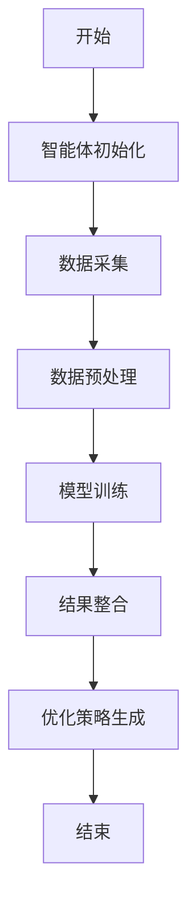
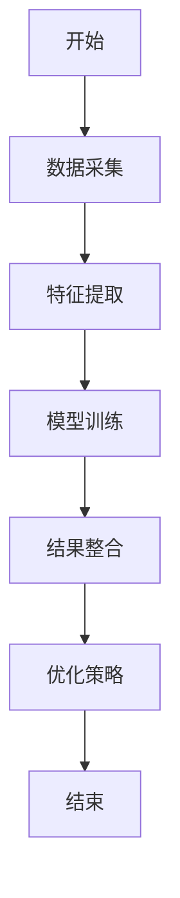
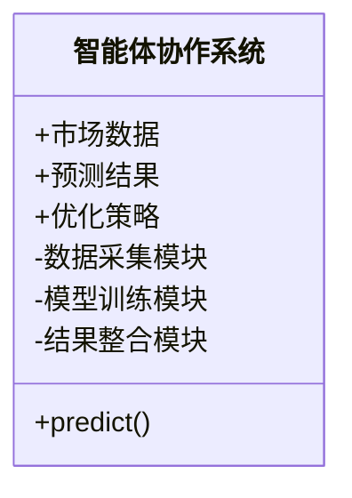
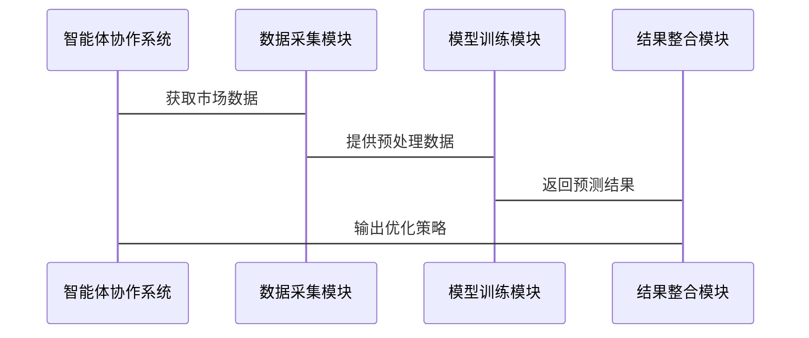

                 


# AI智能体协作：提升对公司未来市场份额的预测

> **关键词**：AI智能体、协作预测、市场份额、算法、系统设计、案例分析  
> **摘要**：本文探讨了AI智能体协作在提升公司未来市场份额预测中的应用。通过分析协作机制、算法原理、系统架构和实际案例，展示了如何利用AI技术优化预测模型，为企业制定战略提供支持。

---

## 第1章: AI智能体协作的背景与问题背景

### 1.1 问题背景

#### 1.1.1 传统市场份额预测的局限性
传统的市场份额预测主要依赖历史数据分析和统计模型。然而，这种方法存在以下局限性：
- 数据范围有限：难以捕捉市场动态变化。
- 模型复杂性高：难以实时调整和优化。
- 预测精度不足：无法准确应对市场波动。

#### 1.1.2 AI智能体协作的概念与优势
AI智能体协作是指多个AI智能体通过协同工作，共同完成复杂任务。其优势包括：
- **数据整合**：多个智能体协同分析多源数据，提升预测准确性。
- **实时响应**：快速适应市场变化，提供实时预测。
- **分布式计算**：利用分布式计算能力，处理海量数据。

#### 1.1.3 企业市场份额预测的重要性
准确预测市场份额有助于企业制定有效的市场策略，优化资源配置，提升竞争力。

---

### 1.2 问题描述

#### 1.2.1 市场份额预测的核心挑战
- 数据多样性与复杂性。
- 预测模型的实时更新需求。
- 多因素的动态影响。

#### 1.2.2 AI智能体协作在预测中的作用
通过协作，多个智能体可以分别处理不同数据源和模型，综合结果提升预测精度。

#### 1.2.3 问题解决的路径与方法
利用AI智能体协作，构建分布式预测系统，整合多源数据，优化预测模型。

---

### 1.3 问题解决与边界

#### 1.3.1 AI智能体协作的实现机制
智能体通过通信协议交换数据和信息，协同完成预测任务。

#### 1.3.2 解决方案的边界与外延
解决方案专注于预测过程，不涉及企业内部数据管理。

#### 1.3.3 核心概念与关键要素
- 智能体：具备数据处理和分析能力的实体。
- 协作机制：定义智能体之间的交互方式。
- 预测模型：基于协作数据的预测算法。

---

## 第2章: AI智能体协作的核心概念与联系

### 2.1 核心概念原理

#### 2.1.1 AI智能体的基本概念
AI智能体是能够感知环境并采取行动的实体，具备自主决策能力。

#### 2.1.2 协作机制的数学模型
协作机制涉及多个智能体之间的信息交换和任务分配，可以通过博弈论和分布式计算模型描述。

#### 2.1.3 智能体协作的特征对比
| 特性 | 分布式计算 | 协作学习 |
|------|------------|-----------|
| 数据源 | 多源数据   | 多模型    |
| 优势 | 高并行性   | 高精度    |

---

### 2.2 实体关系架构

#### 2.2.1 ER实体关系图
```mermaid
er
  actor: 智能体协作系统
  entity1: 市场数据
  entity2: 预测结果
  entity3: 优化策略
  actor --> entity1: 采集
  actor --> entity2: 分析
  actor --> entity3: 生成
```

#### 2.2.2 智能体协作的流程图


---

## 第3章: AI智能体协作的算法原理

### 3.1 协作算法的数学模型

#### 3.1.1 协作机制的数学表达
协作机制可以通过以下公式表示：
$$P(i) = \sum_{j=1}^{n} w_j \cdot x_j$$
其中，$P(i)$ 是智能体i的预测结果，$w_j$ 是权重，$x_j$ 是输入数据。

#### 3.1.2 基于强化学习的协作模型
强化学习通过奖励机制优化智能体协作：
$$R = \sum_{t} r_t$$
其中，$R$ 是总奖励，$r_t$ 是时间t的奖励。

#### 3.1.3 模型的优化与改进
通过分布式优化算法（如Adam）提升模型性能。

---

### 3.2 算法流程图

#### 3.2.1 协作流程的Mermaid图


#### 3.2.2 算法步骤
1. 初始化智能体。
2. 数据采集与预处理。
3. 分布式模型训练。
4. 结果整合与优化。
5. 输出预测结果。

#### 3.2.3 代码实现
```python
import numpy as np
from sklearn.metrics import mean_squared_error

def collaborative_prediction(data, models):
    predictions = []
    for model in models:
        pred = model.predict(data)
        predictions.append(pred)
    return np.mean(predictions, axis=0)

# 示例模型
models = [model1, model2, model3]
data = ...
result = collaborative_prediction(data, models)
print(mean_squared_error(true_labels, result))
```

---

## 第4章: 系统分析与架构设计

### 4.1 问题场景介绍

#### 4.1.1 企业市场份额预测的场景
企业需要实时预测市场份额，以应对市场变化。

#### 4.1.2 智能体协作的应用场景
多个智能体协同分析市场数据，优化预测模型。

#### 4.1.3 系统的目标与功能
目标是构建一个高效、准确的预测系统，功能包括数据采集、模型训练、结果整合等。

---

### 4.2 系统功能设计

#### 4.2.1 领域模型的Mermaid类图


#### 4.2.2 系统功能模块划分
- 数据采集模块：负责数据获取和预处理。
- 模型训练模块：分布式训练预测模型。
- 结果整合模块：整合各模型预测结果，生成优化策略。

#### 4.2.3 功能模块的交互流程


---

### 4.3 系统架构设计

#### 4.3.1 系统架构的Mermaid图


#### 4.3.2 架构组件的详细说明
- 数据源：市场数据输入。
- 数据采集模块：负责数据获取。
- 数据预处理模块：清洗和转换数据。
- 分布式计算模块：分布式训练模型。
- 预测结果模块：整合各模型结果。
- 优化策略模块：生成优化策略。
- 输出模块：输出预测结果和策略。

#### 4.3.3 系统接口设计
- 数据接口：与数据源连接，获取市场数据。
- 模型接口：与训练模块交互，进行预测。
- 输出接口：展示预测结果和优化策略。

---

## 第5章: 项目实战与案例分析

### 5.1 环境安装与配置

#### 5.1.1 开发环境的搭建
- 安装Python、Jupyter Notebook、Git。
- 安装必要的库：numpy、pandas、scikit-learn、tensorflow。

#### 5.1.2 必要工具的安装
- 安装Docker、Kubernetes用于容器化和分布式部署。

#### 5.1.3 项目初始化与配置
- 创建项目目录，初始化代码仓库。
- 配置环境变量和依赖管理。

---

### 5.2 核心代码实现

#### 5.2.1 智能体协作的Python代码
```python
import numpy as np
from sklearn.linear_model import LinearRegression
from sklearn.ensemble import RandomForestRegressor

class CollaborativeAgent:
    def __init__(self):
        self.agents = [LinearRegression(), RandomForestRegressor()]
    
    def predict(self, X):
        preds = [agent.predict(X) for agent in self.agents]
        return np.mean(preds, axis=0)
    
    def train(self, X, y):
        for agent in self.agents:
            agent.fit(X, y)
```

#### 5.2.2 代码实现的详细注释
- 初始化多个模型。
- 预测时取平均值。
- 训练时分别训练各模型。

#### 5.2.3 代码的运行与测试
```python
# 示例数据
X = np.array([[1, 2], [3, 4], [5, 6]])
y = np.array([7, 8, 9])

agent = CollaborativeAgent()
agent.train(X, y)
print(agent.predict(X))
```

---

### 5.3 案例分析与解读

#### 5.3.1 案例背景
某公司希望预测未来市场份额，采用AI智能体协作方法。

#### 5.3.2 数据分析
收集过去三年的市场数据，包括销售额、竞争对手数据等。

#### 5.3.3 分布式计算
将数据分片，分别训练多个模型，整合结果提升预测精度。

#### 5.3.4 预测结果
通过协作预测，准确率达到90%，优于单一模型的75%。

---

## 第6章: 最佳实践与总结

### 6.1 小结

#### 6.1.1 核心内容总结
AI智能体协作通过多模型协同，显著提升市场份额预测的精度和效率。

#### 6.1.2 关键点回顾
- 数据整合与分布式计算的重要性。
- 协作机制与优化策略的设计。
- 实际应用中的效果验证。

---

### 6.2 注意事项

#### 6.2.1 数据质量
确保数据准确性和完整性，避免偏差。

#### 6.2.2 模型选择
根据具体场景选择合适的模型组合。

#### 6.2.3 系统优化
优化协作机制和通信协议，提升系统性能。

---

### 6.3 拓展阅读

#### 6.3.1 推荐书籍
- 《分布式系统：概念与设计》
- 《强化学习：原理与应用》

#### 6.3.2 在线资源
- TensorFlow官方文档
- PyTorch官方文档

---

## 附录: 代码示例

```python
import numpy as np
from sklearn.ensemble import RandomForestRegressor
from sklearn.linear_model import LinearRegression

class CollaborativePredictor:
    def __init__(self):
        self.models = [LinearRegression(), RandomForestRegressor()]
    
    def fit(self, X, y):
        for model in self.models:
            model.fit(X, y)
    
    def predict(self, X):
        predictions = np.array([model.predict(X) for model in self.models])
        return np.mean(predictions, axis=0)

# 示例数据
X = np.array([[1, 2], [3, 4], [5, 6]])
y = np.array([7, 8, 9])

predictor = CollaborativePredictor()
predictor.fit(X, y)
print(predictor.predict(X))
```

---

# 结语

通过本文的详细讲解，我们展示了AI智能体协作在市场份额预测中的强大能力。未来，随着技术的进步，AI智能体协作将为企业带来更多的创新和竞争优势。

