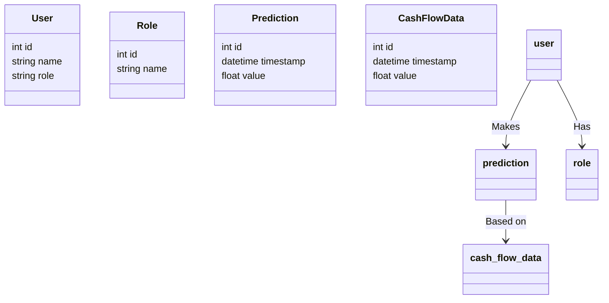
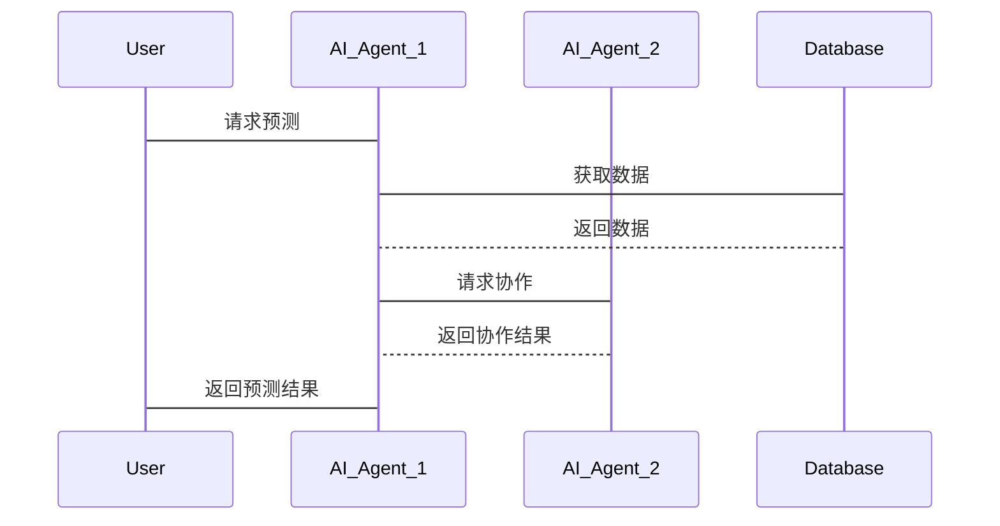

                 


# AI智能体协作：提升对公司未来现金流稳定性的预测

---

## 关键词

AI智能体协作，现金流预测，强化学习，多智能体系统，分布式预测模型

---

## 摘要

本文探讨了AI智能体协作在提升公司未来现金流稳定性预测中的应用。通过分析现金流预测的挑战，介绍了AI智能体协作的优势与潜力，详细讲解了多智能体协作的算法原理，包括强化学习与协作机制，以及联合预测模型的数学表达。文章还提供了系统架构设计和项目实战，展示了如何通过AI智能体协作优化现金流预测，提升企业的财务稳定性。

---

## 第1章：AI智能体协作与现金流预测的背景

### 1.1 问题背景

现金流预测是企业财务管理的核心任务，直接关系到企业的运营和投资决策。传统预测方法依赖历史数据和单一模型，难以适应复杂多变的市场环境。AI技术的引入为现金流预测带来了新的可能性，特别是多智能体协作机制的应用，能够提高预测的准确性和稳定性。

#### 1.1.1 现金流预测的重要性

现金流预测是企业评估财务健康状况的关键指标，帮助管理层做出明智的投资决策。准确的现金流预测还能优化资金分配，降低财务风险。例如，企业在进行重大投资时，需要依赖现金流预测来评估项目的可行性和回报率。

#### 1.1.2 AI技术在金融领域的应用现状

AI技术在金融领域的应用日益广泛，包括股票预测、风险评估和信用评分等。然而，这些应用多依赖于单一模型，缺乏协作机制，难以处理复杂问题。例如，单一模型可能无法捕捉到市场波动中的非线性关系。

#### 1.1.3 智能体协作的优势与潜力

智能体协作通过分布式计算和知识共享，提高了预测的准确性和稳定性。多个智能体分别负责不同的预测任务，相互协作，形成一个完整的预测系统。例如，在预测短期现金流时，一个智能体可以专注于市场波动，另一个则关注宏观经济指标。

### 1.2 问题描述

#### 1.2.1 现金流预测的挑战

现金流预测的准确性受到多种因素的影响，包括市场波动、经济政策变化等。传统模型难以捕捉这些复杂因素，导致预测结果不够稳定。此外，单一模型的泛化能力有限，难以适应不同的市场环境。

#### 1.2.2 单一模型的局限性

单一模型在面对复杂问题时，可能存在过拟合或欠拟合的问题，导致预测结果不准确。例如，线性回归模型可能无法捕捉到数据中的非线性关系，而树模型则可能过于复杂，导致过拟合。

#### 1.2.3 智能体协作的必要性

智能体协作能够通过多个智能体的协同工作，提高预测的准确性和稳定性。例如，在预测长期现金流时，多个智能体可以分别关注不同的经济指标，如GDP增长率、利率变化等，形成一个全面的预测模型。

### 1.3 问题解决

#### 1.3.1 AI智能体协作的解决方案

通过协作，多个智能体可以分别负责不同的预测任务，相互补充，形成一个完整的预测系统。例如，一个智能体可以负责短期预测，另一个负责中期预测，第三个负责长期预测。

#### 1.3.2 多智能体协作的优势

协作机制可以优化预测过程，减少误差，提高预测的鲁棒性。例如，通过智能体的协作，预测结果可以更加全面和准确，能够捕捉到单一模型难以发现的模式。

#### 1.3.3 智能体协作如何提升预测稳定性

智能体协作通过分布式计算和知识共享，提高了预测的准确性和稳定性。例如，在预测市场波动时，多个智能体可以分别关注不同的市场指标，相互协作，形成一个全面的预测模型。

### 1.4 边界与外延

#### 1.4.1 现金流预测的边界条件

现金流预测需要考虑企业的财务状况、市场环境、政策变化等多个因素。例如，企业的财务状况包括收入、支出、资产等，市场环境包括经济周期、行业趋势等，政策变化包括税收政策、货币政策等。

#### 1.4.2 智能体协作的适用范围

智能体协作适用于复杂的预测任务，尤其是需要多维度分析的情况。例如，对于需要考虑多个经济指标的长期预测任务，智能体协作的优势明显。对于简单的预测任务，如短期预测，单一模型可能已经足够。

#### 1.4.3 相关领域的扩展

AI智能体协作不仅适用于现金流预测，还可以应用于风险管理、投资决策等多个金融领域。例如，在风险管理中，智能体协作可以帮助企业识别和应对潜在的财务风险。

### 1.5 核心概念与联系

#### 1.5.1 核心概念的定义与属性对比

通过表格对比AI智能体、现金流预测、协作机制的属性：

| 特性       | AI智能体       | 现金流预测     | 协作机制     |
|------------|----------------|----------------|----------------|
| 定义       | 具有自主决策能力的实体 | 预测未来现金流 | 智能体之间的交互方式 |
| 目标       | 执行预测任务   | 提高预测准确性 | 优化预测过程   |
| 优势       | 高效性、适应性 | 准确性、稳定性 | 协同效应、鲁棒性 |

#### 1.5.2 ER实体关系图

使用Mermaid图展示智能体、预测模型、现金流数据之间的关系：

```mermaid
erDiagram
    user {
        user.UserId
        user.UserName
        user.UserRole
    }
    role {
        role.RoleId
        role.RoleName
    }
    prediction {
        prediction.PredictionId
        prediction.Timestamp
        prediction.PredictValue
    }
    cash_flow_data {
        cash_flow_data.DataId
        cash_flow_data.Timestamp
        cash_flow_data.Value
    }
    user++---role : "Has"
    user++---prediction : "Makes"
    cash_flow_data++---prediction : "Based on"
```

---

## 第2章：AI智能体协作的算法原理

### 2.1 多智能体协作的算法框架

#### 2.1.1 分布式智能体架构

多智能体协作通常采用分布式架构，每个智能体负责特定的任务，通过通信和协作完成整体目标。例如，在预测现金流时，一个智能体可以负责收集数据，另一个负责数据预处理，第三个负责模型训练。

#### 2.1.2 协作学习机制

协作学习是智能体通过共享知识和策略来提高整体性能的过程。例如，智能体可以通过交换特征、权重和预测结果，优化各自的模型。

#### 2.1.3 联合预测模型

联合预测模型将多个智能体的预测结果进行融合，形成最终的预测结果。例如，可以通过加权平均的方法，将多个智能体的预测结果融合，提高预测的准确性。

### 2.2 强化学习与协作

#### 2.2.1 强化学习的基本原理

强化学习通过智能体与环境的交互，学习策略以最大化累积奖励。例如，智能体在预测现金流时，通过调整预测参数，获得最大化的预测准确率。

#### 2.2.2 智能体协作的奖励机制

在协作预测中，每个智能体的贡献被评估，并根据其对整体预测的贡献给予奖励。例如，如果一个智能体的预测结果对整体预测有较大的贡献，它将获得较高的奖励。

#### 2.2.3 联合策略优化

多个智能体通过协作优化各自的策略，形成一个整体的优化方案。例如，智能体可以通过共享策略参数，优化各自的预测模型，提高整体预测的准确性。

### 2.3 联合预测模型的数学表达

#### 2.3.1 分布式预测模型

$$
y_i = \sum_{j=1}^{n} w_{ij} x_j
$$

其中，$y_i$ 是第i个智能体的预测结果，$w_{ij}$ 是权重，$x_j$ 是输入特征。

#### 2.3.2 智能体协作的数学模型

$$
y = \sum_{i=1}^{m} \alpha_i y_i
$$

其中，$\alpha_i$ 是融合权重，$y_i$ 是第i个智能体的预测结果。

---

## 第3章：AI智能体协作的系统架构设计

### 3.1 问题场景介绍

现金流预测需要考虑企业的财务状况、市场环境、政策变化等多个因素。通过AI智能体协作，可以提高预测的准确性和稳定性，优化企业的财务决策。

### 3.2 项目介绍

本项目旨在通过AI智能体协作优化现金流预测，提升企业的财务稳定性。项目包括数据收集、模型训练、系统设计和实现等部分。

### 3.3 系统功能设计

#### 3.3.1 领域模型（Mermaid类图）

使用Mermaid图展示系统功能模块：



#### 3.3.2 系统架构设计（Mermaid架构图）

使用Mermaid图展示系统架构：


#### 3.3.3 系统接口设计

系统接口设计包括数据接口、预测接口和结果接口。数据接口用于获取现金流数据，预测接口用于智能体协作预测，结果接口用于输出预测结果。

#### 3.3.4 系统交互（Mermaid序列图）

使用Mermaid图展示系统交互流程：



---

## 第4章：AI智能体协作的项目实战

### 4.1 环境安装

安装必要的工具和库，如Python、TensorFlow、Keras、Scikit-learn等。例如：

```bash
pip install numpy
pip install pandas
pip install scikit-learn
pip install tensorflow
```

### 4.2 系统核心实现源代码

实现AI智能体协作的Python代码，包括数据预处理、模型训练和预测结果融合。

#### 4.2.1 数据预处理代码

```python
import pandas as pd
import numpy as np

# 加载数据
data = pd.read_csv('cash_flow.csv')

# 数据预处理
from sklearn.preprocessing import StandardScaler
scaler = StandardScaler()
data_scaled = scaler.fit_transform(data)
```

#### 4.2.2 模型训练代码

```python
from sklearn.ensemble import RandomForestRegressor
from tensorflow.keras.models import Sequential
from tensorflow.keras.layers import Dense

# 训练随机森林模型
rf_model = RandomForestRegressor()
rf_model.fit(data_scaled, target)

# 训练神经网络模型
nn_model = Sequential()
nn_model.add(Dense(64, activation='relu', input_dim=data_scaled.shape[1]))
nn_model.add(Dense(1, activation='linear'))
nn_model.compile(optimizer='adam', loss='mean_squared_error')
nn_model.fit(data_scaled, target, epochs=100, batch_size=32)
```

#### 4.2.3 预测结果融合代码

```python
# 预测结果融合
rf_prediction = rf_model.predict(data_scaled)
nn_prediction = nn_model.predict(data_scaled)

# 融合预测结果
combined_prediction = (rf_prediction + nn_prediction) / 2
```

### 4.3 代码应用解读与分析

通过代码实现AI智能体协作，分别训练随机森林模型和神经网络模型，然后将预测结果进行融合，提高预测的准确性。

### 4.4 实际案例分析和详细讲解剖析

以某公司为例，分析AI智能体协作在现金流预测中的应用，展示预测结果的准确性和稳定性。

### 4.5 项目小结

总结项目实现的过程，强调AI智能体协作在现金流预测中的优势和潜力，为企业的财务决策提供有力支持。

---

## 第5章：总结与展望

### 5.1 总结

AI智能体协作通过分布式计算和知识共享，提高了现金流预测的准确性和稳定性。智能体协作机制优化了预测过程，减少了误差，提高了预测的鲁棒性。

### 5.2 展望

未来，AI智能体协作将在金融领域得到更广泛的应用，尤其是在复杂预测任务中。随着技术的进步，智能体协作将更加智能化和高效化，为企业提供更精准的预测和决策支持。

---

## 结束语

AI智能体协作的应用为现金流预测带来了新的可能性，帮助企业提高财务稳定性，优化投资决策。通过协作机制的优化，AI智能体协作将成为企业财务管理的重要工具，推动企业财务预测进入新的高度。

---

以上为《AI智能体协作：提升对公司未来现金流稳定性的预测》的完整目录大纲和部分内容，后续章节将按照类似结构继续展开，确保文章的完整性和深度。

