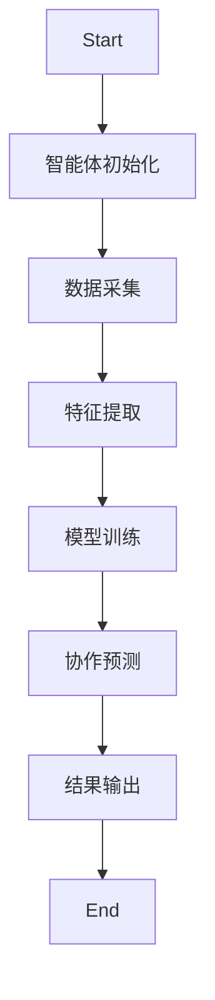
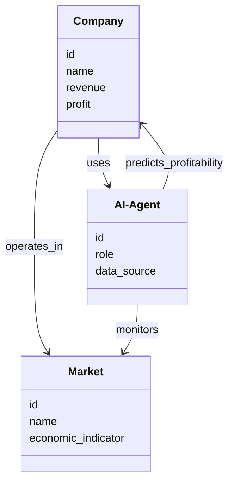
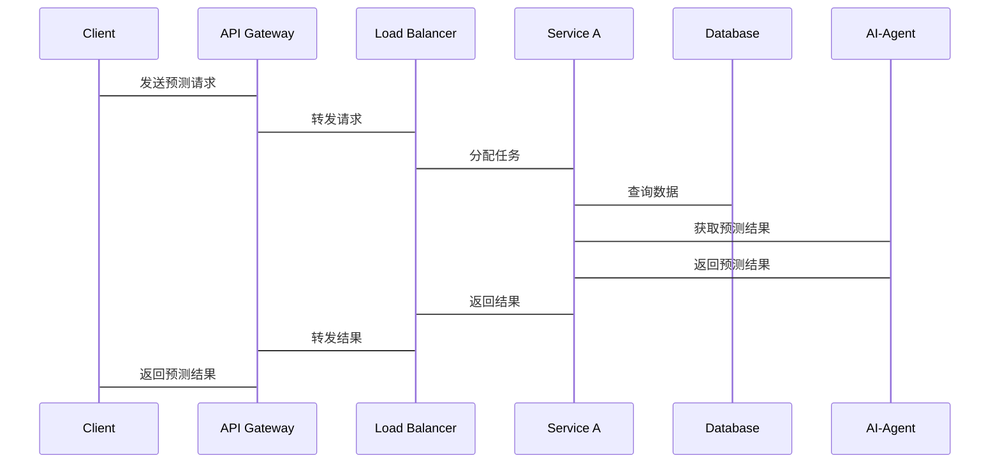

                 


# AI智能体协作：提升对公司未来盈利能力的预测

---

## 关键词
- AI智能体协作
- 公司盈利能力预测
- 多智能体系统
- 协作机制
- 人工智能算法

---

## 摘要
随着人工智能技术的快速发展，AI智能体协作在商业预测中的应用日益广泛。本文深入探讨了AI智能体协作如何提升公司未来盈利能力的预测能力，涵盖了从概念解析到算法实现再到系统设计的全链条。通过分析智能体协作的核心原理、数学模型和系统架构，本文为读者提供了一套完整的解决方案，助力企业在复杂多变的市场环境中做出更精准的决策。

---

# 第一部分：背景介绍

## 第1章：AI智能体协作概述

### 1.1 AI智能体协作的核心概念
#### 1.1.1 AI智能体的定义与特点
AI智能体（Artificial Intelligence Agent）是指能够感知环境、自主决策并执行任务的智能实体。其特点包括：
- **自主性**：无需外部干预，自主完成任务。
- **反应性**：能够实时感知环境并做出反应。
- **协作性**：能够与其他智能体或人类进行有效协作。
- **学习能力**：通过数据和经验不断优化自身行为。

#### 1.1.2 智能体协作的基本原理
智能体协作是指多个智能体通过共享信息、分工合作，共同完成复杂任务的过程。其核心在于：
- **信息共享**：智能体之间通过通信协议交换数据和信息。
- **任务分配**：根据智能体的能力和当前状态，动态分配任务。
- **协同决策**：多个智能体共同参与决策过程，确保目标的实现。

#### 1.1.3 智能体协作与公司盈利能力预测的关系
公司盈利能力预测是一项复杂的任务，涉及大量内外部数据的分析和处理。AI智能体协作通过分布式计算和协同学习，能够显著提升预测的准确性和效率。

### 1.2 公司盈利能力预测的背景与挑战
#### 1.2.1 公司盈利能力预测的重要性
盈利能力是企业经营状况的核心指标，直接影响投资者信心、融资能力和战略决策。

#### 1.2.2 传统预测方法的局限性
传统预测方法依赖于历史数据和单一模型，难以应对数据稀疏性、非线性关系和外部环境的不确定性。

#### 1.2.3 AI智能体协作的优势与应用前景
AI智能体协作通过多智能体协同学习和分布式计算，能够更好地捕捉市场动态和复杂关系，显著提升预测精度。

---

# 第二部分：核心概念与联系

## 第2章：AI智能体协作的核心原理

### 2.1 智能体协作的机制与模型
#### 2.1.1 分布式协作机制
分布式协作机制通过将任务分解为多个子任务，由不同的智能体分别执行，最终通过协同完成整体目标。

#### 2.1.2 协作协议与通信模型
协作协议定义了智能体之间的通信规则和交互方式，通信模型则描述了信息的传递路径和方式。

#### 2.1.3 多智能体协作的挑战与解决方案
多智能体协作面临的主要挑战包括：
- **信息孤岛**：不同智能体之间信息不共享。
- **协作冲突**：任务分配和资源分配中的冲突。
- **动态环境适应**：环境变化时的快速响应需求。

### 2.2 智能体协作的实体关系图

```mermaid
erDiagram
    company {
        id
        name
        revenue
        profit
    }
    market {
        id
        name
        economic_indicator
    }
    ai_agent {
        id
        role
        data_source
    }
    company --> market : operates_in
    company --> ai_agent : uses
    ai_agent --> market : monitors
    ai_agent --> company : predicts_profitability
```

---

# 第三部分：算法原理讲解

## 第3章：AI智能体协作算法的数学模型

### 3.1 协作预测算法的流程图



### 3.2 协作预测模型的数学公式

#### 3.2.1 协作预测的数学模型
$$
\text{预测值} = \sum_{i=1}^{n} w_i \cdot x_i
$$

其中：
- \( w_i \) 表示第 \( i \) 个智能体的权重。
- \( x_i \) 表示第 \( i \) 个智能体的预测结果。

#### 3.2.2 权重分配的优化算法
$$
w_i^{(t+1)} = w_i^{(t)} + \alpha \cdot (y_i - y_i^{(t)})
$$

其中：
- \( \alpha \) 表示学习率。
- \( y_i \) 表示目标值。
- \( y_i^{(t)} \) 表示第 \( t \) 次迭代的预测值。

---

# 第四部分：系统分析与架构设计

## 第4章：系统架构设计方案

### 4.1 问题场景介绍
公司盈利能力预测系统需要整合财务数据、市场数据和行业趋势，通过AI智能体协作进行预测。

### 4.2 系统功能设计

#### 4.2.1 领域模型类图



### 4.3 系统架构设计

#### 4.3.1 系统架构图


### 4.4 系统交互设计

#### 4.4.1 系统交互图



---

# 第五部分：项目实战

## 第5章：项目实战与代码实现

### 5.1 环境安装
- **Python 3.8+**
- **TensorFlow 2.0+**
- **其他依赖库**：numpy、pandas、scikit-learn

### 5.2 核心代码实现

#### 5.2.1 数据预处理代码

```python
import pandas as pd
import numpy as np

# 数据加载
data = pd.read_csv('company_data.csv')

# 数据清洗
data.dropna(inplace=True)
data = pd.get_dummies(data)
```

#### 5.2.2 模型训练代码

```python
from tensorflow.keras.models import Model
from tensorflow.keras.layers import Input, Dense

# 输入层
input_layer = Input(shape=(input_dim,))
# 隐藏层
hidden_layer = Dense(64, activation='relu')(input_layer)
# 输出层
output_layer = Dense(1, activation='linear')(hidden_layer)

# 模型编译
model = Model(inputs=input_layer, outputs=output_layer)
model.compile(optimizer='adam', loss='mean_squared_error')
```

#### 5.2.3 协作预测代码

```python
import json
import requests

# 发送请求
response = requests.post('http://localhost:5000/predict', json={'data': data})
# 获取结果
result = json.loads(response.text)
print(result)
```

---

# 第六部分：最佳实践与总结

## 第6章：总结与展望

### 6.1 小结
AI智能体协作通过分布式计算和协同学习，显著提升了公司盈利能力预测的准确性和效率。

### 6.2 注意事项
- 数据质量和完整性直接影响预测结果。
- 系统设计需要考虑可扩展性和可维护性。
- 需要定期更新模型以适应市场变化。

### 6.3 拓展阅读
- 《Multi-Agent Systems》
- 《Deep Learning for Time Series Forecasting》

---

# 结语

通过本文的系统讲解和实战演示，读者可以全面理解AI智能体协作在公司盈利能力预测中的应用。未来，随着AI技术的不断发展，AI智能体协作将在商业预测领域发挥越来越重要的作用。

