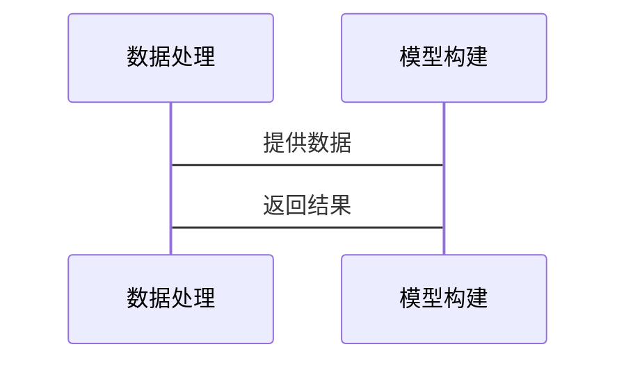

                 


# AI智能体协作：提升对公司财务健康状况的评估

## 关键词：AI智能体、财务健康评估、协作学习、分布式计算、系统架构

## 摘要：本文探讨了AI智能体协作在公司财务健康评估中的应用。通过介绍AI智能体协作的核心概念、算法原理、系统架构和项目实战，展示了如何利用多智能体协作技术提升财务评估的准确性和效率。文章还提供了最佳实践和未来研究方向的建议。

---

## 第一部分: AI智能体协作基础

### 第1章: AI智能体协作概述

#### 1.1 AI智能体协作的核心概念

##### 1.1.1 什么是AI智能体
AI智能体（Artificial Intelligence Agent）是指能够感知环境、自主决策并采取行动以实现目标的实体。在财务健康评估中，智能体可以负责数据收集、分析和预测等任务。

##### 1.1.2 AI智能体协作的定义与特点
AI智能体协作是指多个智能体通过通信和协调，共同完成复杂任务的过程。其特点包括分布式计算、任务分解和结果整合。

##### 1.1.3 协作智能体的分类与应用场景
协作智能体可分为基于规则的和基于学习的两类。在财务评估中，它们可以应用于数据清洗、预测模型构建和风险评估。

#### 1.2 AI智能体协作的背景与意义
传统财务评估依赖人工分析，效率低且易出错。AI智能体协作通过自动化和智能化，显著提升了评估的准确性和效率。

---

### 第2章: 财务健康评估的核心概念

#### 2.1 财务数据的分析与处理

##### 2.1.1 财务数据的来源与类型
财务数据来源包括财务报表、市场数据和内部记录。数据类型有结构化和非结构化之分。

##### 2.1.2 数据预处理与特征提取
数据预处理包括清洗和转换，特征提取则关注关键指标如收入、利润和现金流。

#### 2.2 财务健康评估的指标体系
主要指标包括流动性、偿债能力、运营效率和盈利能力。指标权重通过数据分析确定。

#### 2.3 财务健康评估模型的构建
模型构建需明确目标、选择方法并进行验证。常用方法有回归分析和机器学习。

---

## 第二部分: AI智能体协作的算法原理

### 第3章: 协作学习算法

#### 3.1 协作过滤算法
基于用户或项目的相似性推荐相关数据，应用于数据特征提取。

#### 3.2 协作强化学习算法
通过智能体间的协作和竞争，优化预测模型。数学模型如下：
$$Q(s,a) = r + \gamma \max_a Q(s',a)$$

#### 3.3 分布式计算与多智能体协作
使用分布式系统架构，通过通信机制实现数据同步和协作。

---

### 第4章: 系统架构与设计

#### 4.1 系统功能设计
功能模块包括数据处理、模型构建、协作控制和结果展示。模块间通过接口交互。

#### 4.2 系统架构设计
采用微服务架构，使用消息队列实现智能体间通信。系统架构图如下：


#### 4.3 接口设计与交互
接口采用RESTful API，定义数据格式和交互协议。交互流程如序列图所示：


---

## 第三部分: 项目实战

### 第5章: 项目实施与案例分析

#### 5.1 环境安装与配置
安装Python、TensorFlow和Django，搭建开发环境。

#### 5.2 核心代码实现
实现数据处理、模型训练和协作控制的代码，如：
```python
def process_data(data):
    # 数据清洗和特征提取
    return processed_data
```

#### 5.3 案例分析与结果解读
通过具体案例展示系统输出，分析财务健康状况并提出改进建议。

#### 5.4 项目总结与优化
总结项目成果，提出优化方向，如增加实时监控功能。

---

## 第四部分: 最佳实践与未来展望

### 第6章: 最佳实践

#### 6.1 数据隐私与安全
确保数据处理符合隐私保护法规，采用加密技术。

#### 6.2 系统维护与升级
定期更新模型，监控系统性能，确保稳定运行。

### 第7章: 小结与注意事项

#### 7.1 小结
AI智能体协作显著提升了财务健康评估的效率和准确性。

#### 7.2 注意事项
重视数据质量和模型泛化能力，确保系统鲁棒性。

### 第8章: 拓展阅读

#### 8.1 相关书籍与论文
推荐阅读《分布式人工智能》和《协作学习算法研究》。

#### 8.2 未来研究方向
探索多智能体协作在财务预测中的应用，研究动态权重分配机制。

---

通过以上内容，文章详细阐述了AI智能体协作在财务健康评估中的应用，结合理论与实践，为读者提供了全面的指导和深入的见解。

