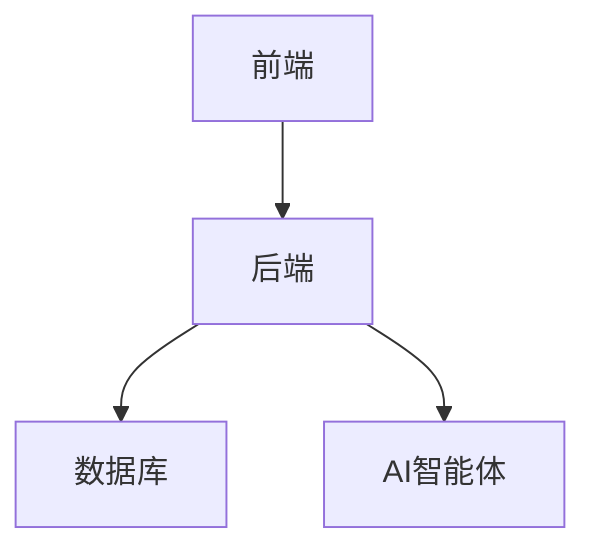

                 


```markdown
# AI智能体协作：提升对管理层诚信和能力的评估

> 关键词：AI智能体，协作机制，管理层评估，诚信评估，能力评估，数据分析，系统架构

> 摘要：本文探讨了AI智能体协作在提升管理层诚信和能力评估中的应用。通过分析传统评估的挑战，提出基于AI智能体协作的解决方案，详细阐述了核心概念、算法原理、系统架构设计和实际案例，为优化管理层评估提供了新的视角。

---

## 第一部分：AI智能体协作的背景与核心概念

### 第1章：问题背景

#### 1.1 管理层评估的传统挑战
传统管理层评估依赖主观判断，存在评估标准不统一、数据分散、难以量化等问题，导致评估结果缺乏客观性和一致性。此外，数据孤岛现象使得跨部门协作困难，评估效率低下。

#### 1.2 AI技术的应用潜力
AI技术，特别是自然语言处理和机器学习，能够从大量异构数据中提取有价值的信息，帮助构建客观的评估体系。通过AI分析，可以识别管理者的潜在问题，提供数据支持的决策依据。

#### 1.3 智能体协作的必要性
单个智能体难以覆盖所有评估维度，协作机制能够整合多个智能体的优势，提升评估的全面性和准确性。通过协同工作，AI智能体可以互补信息，提供更精准的评估结果。

### 第2章：核心概念与问题描述

#### 2.1 核心概念
- **AI智能体**：具备特定功能的软件实体，能够执行数据处理、分析和决策任务。
- **协作机制**：智能体之间通过通信和协调，共同完成复杂任务的方式。
- **管理层评估**：对管理者的诚信和能力进行系统性评估的过程。

#### 2.2 问题描述
- **数据孤岛**：各部门数据分散，难以整合，影响评估的全面性。
- **评估标准不一**：不同部门采用不同的评估标准，导致结果不具可比性。
- **效率低下**：传统评估方法耗时长，难以快速响应变化。

#### 2.3 评估的边界与外延
评估不仅包括直接的管理行为，还涉及间接影响，如团队绩效、员工满意度等。通过AI智能体协作，可以扩展评估的维度，提供更全面的分析。

### 第3章：核心要素与结构

#### 3.1 核心要素
- **智能体的独立性**：每个智能体专注于特定任务，如数据收集、分析。
- **协作性**：智能体之间通过通信模块协同工作，共享数据和结果。
- **数据源多样性**：包括绩效数据、员工反馈、项目完成情况等。

#### 3.2 结构与关系
- **实体关系图（ER图）**：展示智能体、数据源和评估结果之间的关系。
- **属性对比表**：比较不同智能体在协作中的角色和功能。

---

## 第二部分：AI智能体协作的核心原理与算法

### 第4章：协作原理与机制

#### 4.1 分布式计算与协作
- **分布式计算**：任务分解到多个智能体，各自处理后汇总结果。
- **多智能体协作算法**：采用一致性算法（如Raft）确保协作一致性。

#### 4.2 协作评分模型
- **数学模型**：综合多个维度的评分，计算总分。例如，$$总分 = \sum_{i=1}^{n} w_i \cdot s_i$$，其中$w_i$是权重，$s_i$是各维度评分。

#### 4.3 算法流程图
- 使用Mermaid绘制协作流程图，展示任务分配、数据收集、计算和结果汇总的步骤。

### 第5章：算法实现与代码解析

#### 5.1 算法实现
- **Python代码示例**：实现协作评分模型，包括数据预处理、模型训练和预测。
  ```python
  def collaborative_scoring(data, weights):
      return sum(w * d for w, d in zip(weights, data))
  ```

#### 5.2 数据预处理与特征提取
- 使用自然语言处理技术提取文本数据中的关键词和情感倾向，生成数值特征。

#### 5.3 模型训练与优化
- 应用机器学习模型，如随机森林或神经网络，优化协作评分模型的准确性和鲁棒性。

---

## 第三部分：系统分析与架构设计

### 第6章：系统功能设计

#### 6.1 领域模型类图
- Mermaid类图展示系统模块，如数据采集、评估计算、结果展示。

### 第7章：系统架构设计

#### 7.1 架构图
- 使用Mermaid绘制系统架构图，展示前端、后端、数据库和AI智能体的交互。

#### 7.2 系统接口设计
- 定义RESTful API接口，如`POST /api/assessment`，用于接收评估数据和返回结果。

#### 7.3 交互序列图
- 使用Mermaid绘制序列图，展示用户请求评估、系统处理和返回结果的过程。

---

## 第四部分：项目实战

### 第8章：环境安装与核心代码实现

#### 8.1 环境安装
- 安装必要的库，如Python的`pandas`、`scikit-learn`和`flask`。

#### 8.2 核心代码实现
- 实现协作评分模型的API接口，展示如何接收数据、计算评分并返回结果。

#### 8.3 代码解读
- 解释关键代码的功能，如数据预处理、模型训练和API路由。

### 第9章：案例分析与解读

#### 9.1 案例分析
- 通过具体案例展示AI智能体协作如何提升管理层评估的准确性和效率。

#### 9.2 实际应用
- 讨论在实际企业中的应用，如某公司采用AI智能体协作优化其管理层评估流程。

---

## 第五部分：最佳实践与总结

### 第10章：最佳实践

#### 10.1 实施建议
- 强调数据质量的重要性，建议采用多源数据和交叉验证。

#### 10.2 注意事项
- 提醒潜在的隐私问题和数据安全风险，建议采用加密技术和访问控制。

### 第11章：小结与展望

#### 11.1 小结
- 总结AI智能体协作在提升管理层评估中的优势和应用价值。

#### 11.2 未来展望
- 探讨未来可能的发展方向，如动态评估模型和自适应协作机制。

---

## 参考文献

- [1] 某公司AI智能体协作技术文档
- [2] 相关学术论文
- [3] 开源项目资料

---

## 附录

### 附录A：协作评分模型的数学公式
$$
\text{总分} = \sum_{i=1}^{n} w_i \cdot s_i
$$

### 附录B：系统架构图


---

通过以上结构，文章系统地介绍了AI智能体协作在提升管理层诚信和能力评估中的应用，从理论到实践，为读者提供了全面的视角和实用的知识。
```

