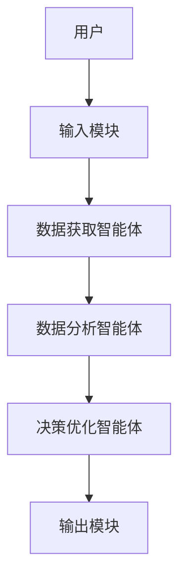

                 

# AI智能体协作：提升巴菲特的企业分析方法

> 关键词：AI智能体、巴菲特分析方法、协作机制、知识图谱、自然语言处理、投资决策优化

> 摘要：本文探讨了如何利用AI智能体协作来提升巴菲特的企业分析方法。通过详细分析AI智能体协作的核心机制、算法原理、系统架构以及项目实战，展示了如何将巴菲特的投资理念与现代AI技术相结合，从而实现更高效、更精准的企业分析与投资决策。

---

# 第一部分: AI智能体协作的背景与基础

## 第1章: AI智能体协作概述

### 1.1 AI智能体的基本概念

#### 1.1.1 AI智能体的定义与特点

AI智能体（Artificial Intelligence Agent）是指能够感知环境、自主决策并执行任务的智能系统。其特点包括：

- **自主性**：能够在没有外部干预的情况下独立运行。
- **反应性**：能够根据环境的变化实时调整行为。
- **目标导向性**：通过设定目标来驱动决策和行动。
- **协作性**：能够与其他智能体或人类进行协作。

#### 1.1.2 AI智能体的分类与应用场景

AI智能体可以根据功能和应用场景分为以下几类：

- **反应式智能体**：基于当前感知做出即时反应，适用于实时任务（如自动驾驶）。
- **认知式智能体**：具备复杂的推理和规划能力，适用于复杂场景（如医疗诊断）。
- **协作式智能体**：专门用于多智能体协作的任务（如分布式问题求解）。

#### 1.1.3 AI智能体协作的必要性

随着企业分析的复杂性增加，单个智能体的能力往往不足以完成复杂的任务。通过协作，多个智能体可以分工合作，共同完成更复杂的分析任务，从而提升整体效率和准确性。

### 1.2 巴菲特的企业分析方法

#### 1.2.1 巴菲特投资理念的核心思想

巴菲特的投资理念以“价值投资”为核心，强调通过对企业基本面的深入分析来寻找被低估的投资标的。其核心思想包括：

- **关注企业的财务健康**：重点关注企业的盈利能力、资产负债情况和现金流。
- **长期投资**：注重企业的长期增长潜力，而非短期市场波动。
- **安全边际**：在投资时留有安全边际，以降低风险。

#### 1.2.2 巴菲特分析方法的步骤与框架

巴菲特的分析方法通常包括以下几个步骤：

1. **行业分析**：选择具有长期增长潜力的行业。
2. **企业基本面分析**：分析企业的财务报表，评估其盈利能力和财务健康。
3. **管理层评估**：考察企业管理层的能力和诚信。
4. **估值分析**：通过市盈率、市净率等指标评估企业的合理估值。
5. **投资决策**：基于以上分析做出最终的投资决策。

#### 1.2.3 巴菲特方法与现代企业分析的结合

现代企业分析方法通常结合了大数据和AI技术，但巴菲特的分析方法仍然具有重要的参考价值。通过将巴菲特的方法与AI技术相结合，可以实现更高效、更精准的企业分析。

---

## 第2章: AI智能体协作的核心机制

### 2.1 AI智能体协作的原理

#### 2.1.1 协作的基本流程与阶段

AI智能体协作通常包括以下几个阶段：

1. **任务分解**：将整体任务分解为多个子任务，分配给不同的智能体。
2. **信息共享**：智能体之间共享必要的信息和数据，以便协作完成任务。
3. **决策优化**：通过协作优化决策，提升整体任务的效率和准确性。
4. **结果整合**：将各个智能体的结果整合，形成最终的输出。

#### 2.1.2 协作中的任务分解与角色分配

任务分解是协作的关键步骤。通过将任务分解为具体的子任务，并为每个子任务分配合适的智能体角色，可以确保协作的高效性。例如：

- **数据获取智能体**：负责获取企业的财务数据。
- **数据分析智能体**：负责对数据进行清洗和分析。
- **决策优化智能体**：基于分析结果优化投资决策。

#### 2.1.3 协作中的信息共享与知识整合

信息共享是协作的基础。智能体之间需要共享必要的信息和知识，以便更好地完成任务。例如，数据获取智能体需要将数据共享给数据分析智能体，数据分析智能体需要将分析结果共享给决策优化智能体。

---

### 2.2 AI智能体协作的关键技术

#### 2.2.1 自然语言处理在协作中的应用

自然语言处理（NLP）技术在协作中的应用主要体现在：

- **文本分析**：对企业的财务报告和新闻进行文本分析，提取关键信息。
- **信息抽取**：从文本中抽取关键信息，如财务数据、市场动态等。
- **意图识别**：识别用户的需求和意图，优化协作流程。

#### 2.2.2 知识图谱构建与应用

知识图谱是一种用于表示知识的图结构，可以将企业的相关信息（如财务数据、市场动态、竞争对手信息）组织成图结构，便于智能体之间的协作和推理。

#### 2.2.3 协作中的决策优化算法

决策优化算法是协作的核心技术之一。常见的算法包括：

- **强化学习**：通过奖励机制优化决策。
- **遗传算法**：通过模拟自然选择优化决策。
- **贝叶斯网络**：通过概率推理优化决策。

---

## 第3章: 基于巴菲特方法的AI智能体设计

### 3.1 巴菲特方法的AI化改造

#### 3.1.1 财务数据分析的AI实现

通过AI技术，可以实现对财务数据的自动化分析，如：

- **财务报表分析**：自动分析企业的利润表、资产负债表和现金流量表。
- **趋势预测**：基于历史数据预测企业的未来财务表现。

#### 3.1.2 企业基本面分析的AI优化

AI技术可以优化企业基本面分析的流程，如：

- **行业分析**：自动分析行业的增长潜力和竞争格局。
- **企业估值**：基于财务指标和市场数据，自动评估企业的合理估值。

#### 3.1.3 投资策略的AI生成与优化

通过AI技术，可以生成和优化投资策略，如：

- **多因素模型**：基于多个因素（如市盈率、市净率、ROE等）生成投资策略。
- **动态调整**：根据市场变化动态调整投资策略。

---

## 第4章: 系统架构与实现方案

### 4.1 系统架构设计

#### 4.1.1 系统整体架构图

#### 4.1.2 数据获取与处理模块设计

数据获取模块负责从企业财务报表、新闻等来源获取数据，并将其转换为结构化的数据格式。

#### 4.1.3 算法实现

通过强化学习算法优化投资决策，例如：

$$
\text{奖励} = \text{投资回报} - \text{风险成本}
$$

---

## 第5章: 项目实战

### 5.1 项目介绍

本项目旨在开发一个基于AI智能体协作的企业分析系统，用于优化巴菲特的投资分析方法。

---

## 第6章: 最佳实践与未来展望

### 6.1 小结

通过将AI智能体协作与巴菲特的企业分析方法相结合，可以显著提升企业的分析效率和准确性。

### 6.2 注意事项

- 数据的质量和完整性是协作的基础。
- 算法的可解释性是投资决策的关键。

### 6.3 拓展阅读

建议读者进一步学习强化学习和知识图谱的相关知识。

---

以上是《AI智能体协作：提升巴菲特的企业分析方法》的目录大纲。通过系统化的分析和设计，可以将AI智能体协作与巴菲特的投资方法相结合，实现更高效、更精准的企业分析与投资决策。

