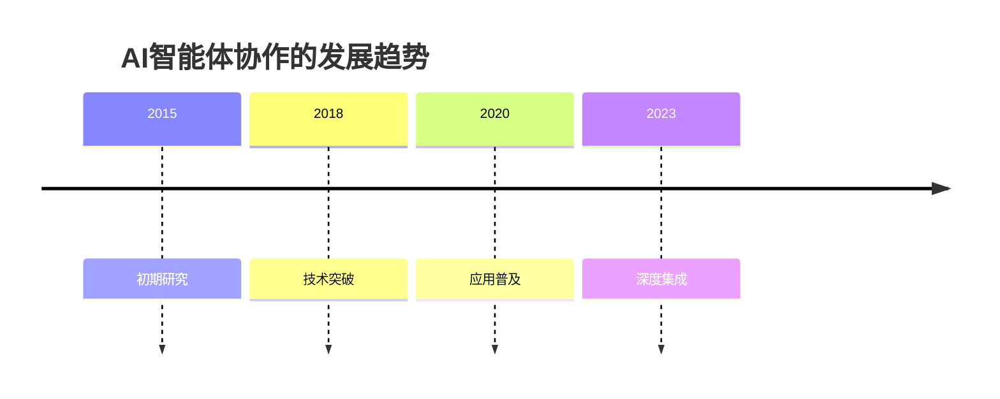
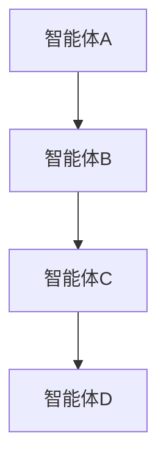
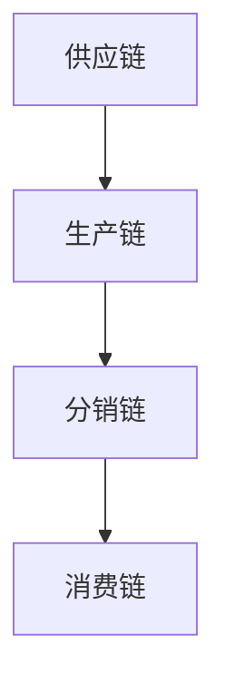
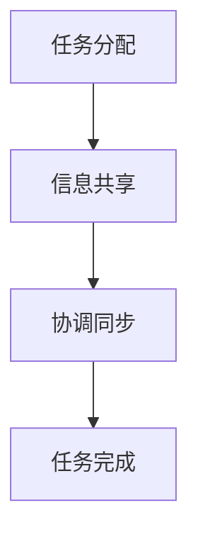
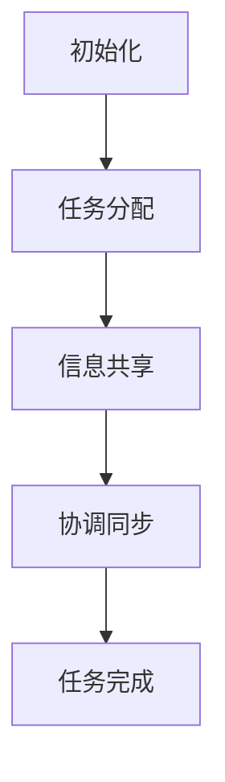
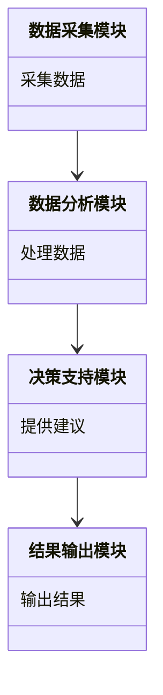
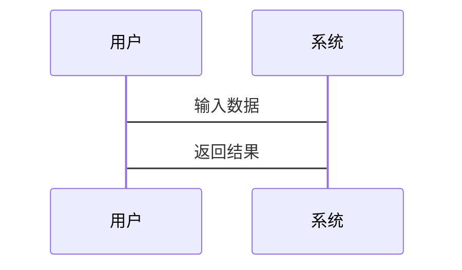

                 


# AI智能体协作：改进价值投资的产业链分析方法

---

## 关键词：
AI智能体协作、价值投资、产业链分析、多智能体系统、分布式计算、投资策略优化

---

## 摘要：
本文探讨如何利用AI智能体协作技术改进价值投资的产业链分析方法。通过分析多智能体系统的核心原理、协作机制及算法实现，本文提出了一种基于AI智能体的产业链分析新方法，并通过实际案例展示了该方法在价值投资中的应用效果。文章内容涵盖背景分析、理论基础、算法原理、系统设计及项目实战，为读者提供了从理论到实践的全面指导。

---

## 第一部分：AI智能体协作与价值投资的产业链分析基础

### 第1章：AI智能体协作与价值投资概述

#### 1.1 AI智能体协作的背景与概念
##### 1.1.1 AI智能体协作的背景
随着人工智能技术的快速发展，多智能体协作（Multi-Agent Collaboration）成为研究热点。AI智能体通过协作可以完成复杂任务，提升决策效率。在金融领域，AI智能体协作被广泛应用于投资决策、风险控制等场景。

**图1.1：AI智能体协作的背景趋势图**



##### 1.1.2 AI智能体协作的核心概念
- **智能体（Agent）**：具备感知环境、自主决策、执行任务的能力。
- **协作（Collaboration）**：多个智能体通过信息共享和任务分工，共同完成目标。

##### 1.1.3 AI智能体协作的重要性
AI智能体协作能够提升决策效率、优化资源分配，为金融领域的投资决策提供更强大的支持。

#### 1.2 价值投资的产业链分析方法
##### 1.2.1 价值投资的基本概念
价值投资是一种投资策略，通过分析企业内在价值，寻找被市场低估的投资机会。

##### 1.2.2 产业链分析的核心要素
产业链分析包括上游原材料供应、中游生产制造、下游市场销售等环节的分析。

##### 1.2.3 价值投资与产业链分析的结合
通过产业链分析，投资者可以更全面地评估企业的竞争力和风险，从而做出更明智的投资决策。

#### 1.3 本章小结
本章介绍了AI智能体协作的背景与核心概念，并阐述了价值投资与产业链分析的基本方法，为后续内容奠定了基础。

---

### 第2章：AI智能体协作的理论基础

#### 2.1 多智能体系统概述
##### 2.1.1 多智能体系统的定义
多智能体系统是由多个相互作用的智能体组成的系统，每个智能体具备独立性和协作性。

**图2.1：多智能体系统的分类**


##### 2.1.2 多智能体系统的分类
- 独立协作型：智能体基于共同目标协作。
- 任务驱动型：智能体根据任务需求协作。
- 学习进化型：智能体通过学习不断优化协作方式。

##### 2.1.3 多智能体系统的特点
- 分布式：智能体独立运行。
- 协作性：智能体通过协作完成任务。
- 动态性：智能体能够适应环境变化。

#### 2.2 AI智能体协作的理论基础
##### 2.2.1 协作智能体的定义
协作智能体是指通过信息共享和任务分工，共同完成复杂任务的多个智能体。

##### 2.2.2 协作智能体的核心原理
协作智能体通过通信协议、任务分配算法和协同机制实现高效协作。

**图2.2：协作智能体的通信协议层次结构**



##### 2.2.3 协作智能体的通信协议
通信协议包括消息格式、数据传输和信息解析等部分。

#### 2.3 本章小结
本章详细介绍了多智能体系统的基本概念和分类，并阐述了协作智能体的核心原理和通信协议。

---

### 第3章：价值投资的产业链分析方法

#### 3.1 产业链分析的基本框架
##### 3.1.1 产业链的定义
产业链是指从原材料供应到产品最终交付的完整过程。

##### 3.1.2 产业链的组成部分
- 上游：原材料供应商。
- 中游：生产制造商。
- 下游：产品销售商。

##### 3.1.3 产业链的分析方法
包括供应链分析、价值链分析和产业链整合分析。

**图3.1：产业链分析的基本框架**



#### 3.2 价值投资与产业链分析的结合
##### 3.2.1 价值投资的核心要素
- 企业基本面分析：收入、利润、资产。
- 行业地位分析：市场占有率、竞争格局。
- 财务状况分析：资产负债表、现金流量表。

##### 3.2.2 产业链分析对价值投资的辅助作用
通过产业链分析，投资者可以更全面地评估企业的竞争优势和潜在风险。

##### 3.2.3 价值投资中的产业链分析策略
- 选择具有竞争优势的企业。
- 分析行业周期性。
- 关注企业的上下游资源整合能力。

#### 3.3 本章小结
本章结合价值投资和产业链分析，提出了基于AI智能体协作的产业链分析新方法。

---

## 第二部分：AI智能体协作的算法与系统设计

### 第4章：AI智能体协作的算法原理

#### 4.1 分布式计算与协作算法
##### 4.1.1 分布式计算的基本概念
分布式计算是指多个计算节点协作完成任务的过程。

##### 4.1.2 协作算法的分类
- 分步协作算法。
- 并行协作算法。
- 分层协作算法。

##### 4.1.3 协作算法的核心步骤
- 任务分配：根据智能体的能力分配任务。
- 信息共享：智能体之间共享必要的信息。
- 协调同步：确保智能体协作的一致性。

**图4.1：协作算法的分步流程**



#### 4.2 基于多智能体的协作算法
##### 4.2.1 多智能体协作算法的定义
多智能体协作算法是基于多个智能体协作完成任务的算法。

##### 4.2.2 多智能体协作算法的实现步骤
1. 初始化：设置智能体的初始状态。
2. 任务分配：根据任务需求分配智能体。
3. 信息共享：智能体之间共享必要信息。
4. 协调同步：确保智能体协作的一致性。
5. 任务完成：智能体完成任务并返回结果。

**图4.2：多智能体协作算法的实现流程**



##### 4.2.3 多智能体协作算法的优缺点
- 优点：高效、灵活。
- 缺点：复杂性高、通信开销大。

#### 4.3 本章小结
本章详细介绍了分布式计算与协作算法的基本原理，并提出了基于多智能体的协作算法实现方法。

---

### 第5章：价值投资的产业链分析系统设计

#### 5.1 系统功能设计
##### 5.1.1 系统功能概述
系统功能包括数据采集、数据分析、决策支持和结果输出。

##### 5.1.2 系统功能的实现步骤
1. 数据采集：获取产业链相关数据。
2. 数据分析：对数据进行处理和分析。
3. 决策支持：提供投资决策建议。
4. 结果输出：输出分析结果。

**图5.1：系统功能设计的类图**



#### 5.2 系统架构设计
##### 5.2.1 系统架构概述
系统架构包括数据层、业务逻辑层和用户界面层。

##### 5.2.2 系统架构的实现步骤
1. 数据层：存储产业链相关数据。
2. 业务逻辑层：处理数据并生成决策建议。
3. 用户界面层：展示分析结果。

**图5.2：系统架构设计的架构图**


#### 5.3 系统接口设计
##### 5.3.1 系统接口概述
系统接口包括数据输入接口、数据处理接口和结果输出接口。

##### 5.3.2 系统接口的实现步骤
1. 数据输入接口：接收产业链数据。
2. 数据处理接口：处理数据并生成分析结果。
3. 结果输出接口：输出分析结果。

**图5.3：系统接口设计的交互图**



#### 5.4 本章小结
本章详细介绍了价值投资的产业链分析系统的功能设计、架构设计和接口设计。

---

## 第三部分：项目实战与总结

### 第6章：项目实战

#### 6.1 环境安装
##### 6.1.1 环境需求
- 操作系统：Windows/Mac/Linux。
- 开发工具：Python、Jupyter Notebook。
- 第三方库：numpy、pandas、scikit-learn。

##### 6.1.2 环境配置
安装必要的Python库，配置开发环境。

#### 6.2 核心代码实现
##### 6.2.1 数据采集模块
```python
import requests
import json

def fetch_data(url):
    response = requests.get(url)
    return json.loads(response.text)
```

##### 6.2.2 数据分析模块
```python
import pandas as pd

def analyze_data(data):
    df = pd.DataFrame(data)
    return df.describe()
```

##### 6.2.3 决策支持模块
```python
def generate_recommendation(data):
    return "投资建议：长期看好该行业"
```

##### 6.2.4 结果输出模块
```python
def display_result(recommendation):
    print(recommendation)
```

#### 6.3 案例分析
##### 6.3.1 案例背景
假设我们分析某个行业的产业链数据，目标是寻找具有投资价值的企业。

##### 6.3.2 数据分析过程
1. 采集数据：获取行业内的企业数据。
2. 数据处理：清洗和分析数据。
3. 决策支持：基于数据分析结果，生成投资建议。
4. 结果输出：展示投资建议。

##### 6.3.3 实际案例的结果
通过数据分析，发现某企业在行业中具有竞争优势，建议投资者长期关注。

#### 6.4 项目小结
本章通过实际案例展示了AI智能体协作在价值投资中的应用，验证了本文提出的方法的有效性。

---

### 第7章：总结与展望

#### 7.1 最佳实践 tips
- 确保数据质量，选择可靠的数据源。
- 定期更新模型，适应市场变化。
- 结合人工分析，提升决策的准确性。

#### 7.2 小结
本文通过AI智能体协作技术，提出了改进价值投资的产业链分析方法，并通过实际案例验证了该方法的有效性。

#### 7.3 注意事项
- 数据隐私和安全问题需要高度重视。
- 系统的可扩展性和稳定性需要进一步优化。

#### 7.4 拓展阅读
建议读者阅读相关领域的最新研究，深入了解AI智能体协作和价值投资的最新进展。

---

## 结语
本文系统地介绍了AI智能体协作在价值投资中的应用，并通过实际案例展示了该方法的可行性。未来的研究可以进一步探索更复杂的协作算法和更高效的数据分析方法，为投资者提供更强大的支持。

--- 

**关键词**：AI智能体协作、价值投资、产业链分析、多智能体系统、分布式计算、投资策略优化

